<table class="sphinxhide" width="100%">
 <tr width="100%">
    <td align="center"><h1>Vitis™ HLS Tutorials</h1>
    <a href="https://www.xilinx.com/products/design-tools/vitis/vitis-hls.html">See Vitis™ HLS landing page on xilinx.com</a>
    </td>
 </tr>
</table>

# Polynomial Vectorization using Number Theoretic Transforms:<br>A Real World Case Study Using Vitis HLS Code Analyzer

***Version: Vitis HLS 2024.1***

## Introduction

Cryptography algorithms are fundamental computing algorithms which are crucial in securing network transmissions and stored data. The emergence of quantum computing has necessitated the development of new algorithms which cannot be broken by quantum computers, called Post-Quantum Cryptography, or PQC. One such algorithm which the [National Institute of Standards and Technology (NIST)](https://www.nist.gov/) has announced will be standardized for public-key encryption is called [CRYSTALS-Kyber](https://pq-crystals.org/kyber/). 

Traditional public key cryptography algorithms, such as RSA, rely on the asymmetric complexity of factoring large prime numbers. Take Equation 1 for example:

Equation 1:
```math
N = p1 \cdot p2 
```

It used to be that if one knew $N$ and wanted to calculate $p1$ and $p2$, the computation was too complex to solve if size of $p1$ and $p2$ were significantly large prime numbers. However, determining the prime factorization turns out to be quite a simple algorithm for quantum computers. As such, Kyber instead relies on the asymmetric complexity of factoring polynomial vectors, like those shown in Equation 2:

Equation 2:
```math

\begin{bmatrix}
    p_{11} \times x_{11}^{2} & p_{12} \times x_{12}^{2} & \ldots & p_{1n} \times x_{1n}^{2} \\
    p_{21} \times x_{21}^{2} & p_{22} \times x_{22}^{2} & \ldots & p_{2n} \times x_{2n}^{2} \\
    \vdots & \vdots & \ddots & \vdots \\
    p_{m1} \times x_{m1}^{2} & p_{m2} \times x_{m2}^{2} & \ldots & p_{mn} \times x_{mn}^{2} \\
\end{bmatrix}
=
\begin{bmatrix}
    0 \\
    0 \\
    \vdots \\
    0
\end{bmatrix}

```
Where:
- $p_{nm}$ are sufficiently large prime numbers.

It is easy to see why prime factorization of polynomial vectors is orders of magnitude more computationally complex than prime factorization of a set of numbers. As such, algorithms based on this new paradigm can be made safe from attack from quantum computers; To date, there is no known way for an adversary with a quantum computer to decrypt messages encoded with Kyber.

One downside, however, is that the increase in the complexity of decrypting these equations also precipitates an increase in the complexity on the encryption side. This makes these next generation PQC algorithms prime candidates for acceleration on an AMD FPGA or SoC. The Digital Signal Processing (DSP) slices in particular excel at vector processing, and these algorithms utilize large amounts of multiply and accumulate operations which FPGAs can process in a highly efficient and parallel nature.

At the core of this algorithm lie Number Theoretic Transforms (NTTs). NNTs are a variant of the the Fast Fourier Transform (FFT) which transform polynomials modulo a prime number. It is therefore a crucial part of polynomial vectorization and algorithms such as Kyber which rely on this technique. 

In this tutorial, we will show how to accelerate the NTT using AMD Versal™ Adaptive SoCs and Vitis™ HLS. Because C++ code that implements these common and open source algorithms is widely available on the internet, we can use HLS C Synthesis to rapidly transform that code into RTL for the programmable logic (PL) on an AMD FPGA.

However, tailoring this C code into highly optimized HLS C code requires expertise and time. When optimizing for any hardware architecture, code changes are required for optimal results. This is true from the largest distributed systems to the smallest embedded devices. Optimizing C code to target the PL of an AMD FPGA with Vitis HLS is no exception. The HLS programming model and design principles must be understood and applied with intent to the C code.

The HLS Code Analyzer can help to optimize HLS C by generating a visualization of the C code and providing guidance on it. It simulates and analyzes code, then uses that information to generate a visualization of the code with measured and estimated performance metrics. Modifications to the visualization can be made to estimate the performance impact of restructuring the code without manual code modifications. 

## Setting up the Example Project

Before beginning, [download](https://www.xilinx.com/support/download.html) the Vitis Unified Installer, [install](https://docs.xilinx.com/r/en-US/ug1400-vitis-embedded/Installation) the Vitis Software Platform, and [acquire](https://www.xilinx.com/support/licensing_solution_center.html) the Vitis HLS license.

In this tutorial, we'll be using a snippet of code from the [Kyber GitHub project](https://github.com/pq-crystals/kyber/tree/main). The code in the Vitis Tutorials has been trimmed down to just the Polyvec and NTT functions and made synthesizable for HLS. To start, open the workspace `<Relative_Path>/Vitis-Tutorials/Vitis_HLS/Design_Tutorials/01_Polynomial_Vectorization/Workspace` . If you've already sourced the settings script to setup Vitis, the following command will bring up this workspace:
```code
vitis -w <Relative_Path>/Vitis-Tutorials/Vitis_HLS/Design_Tutorials/01_Polynomial_Vectorization/Workspace
```

1. Open the workspace `Workspace` in the `01_Polynomial_Vectorization` directory.

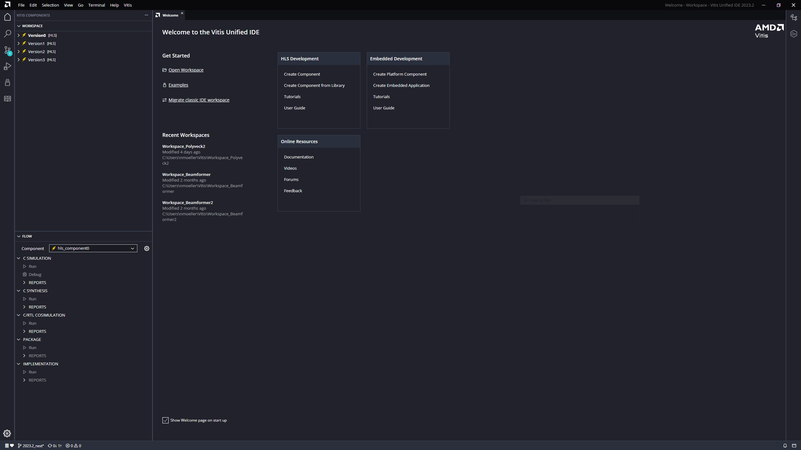

There are four components in the workspace that appears. Each implements the same polynomial vectorization functionality and uses the same testbench code. 

## Version0

The component `Version0` is a golden standard which has not been refactored. 
This is our baseline version.
Let's use it to learn more about the code structure and see what Code Analyzer can show us for this design.

Let's begin by simulating the `Version0` code. 

1. Select Run under C Simulation in the Flow pane.

After this, a standard off the shelf C compiler will run, confirming that the C test bench compiles and runs. Monitor the output to ensure this completes without encountering any errors. Look for the line `C-simulation finished successfully`. You will also see a green check mark icon appear next to the Run command, confirming the C Simulation was successful. If a red X icon is shown, check the output for the source of the error.

The next thing we want to do is enable the HLS Code Analyzer. The Code Analyzer is enabled from the HLS Component Settings window, so navigate to that window. Then, scroll down until you find the `code_analyzer` option. 

2. In the Vitis Components pane, expand `Version0`, then expand Settings and select `hls_config.cfg`

3. On the right hand side of the Settings window that appears, select C Simulation. Then, check the box next to Enable Code Analyzer.

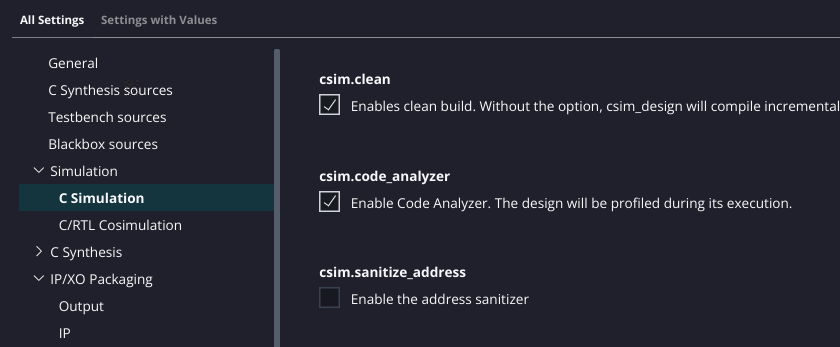

Now that the Code Analyzer is enabled, it will run when C simulation is run. When it completes, the Code Analyzer view will be enabled for selection under the C simulation reports.

4. Select Run under C Simulation in the Flow pane again.

5. When it completes, expand the Reports dropdown in the Flow pane and click Code Analyzer.

The Code Analyzer graph will appear and show the top level hardware functions for synthesis, but here the top function `polyvec_ntt` only contains one extracted process called `polyvec_ntt_loop`.

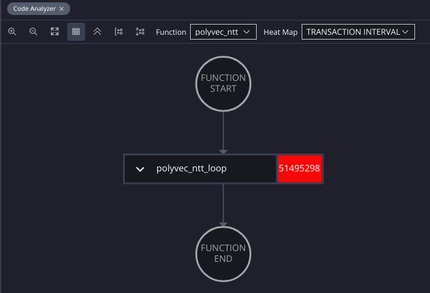

The view for this top level function is not very interesting as there is only one extracted process; the transaction interval of this process is shown on the right hand-side of the process.
> The estimated transaction interval of the top level function is 51.5 millions clock cycles.

You can expand the dropdown arrow on the left side of the process to reveal the contents of the process: it contains one loop labelled `polyvec_ntt_loop` (which became the process name) that calls a function named `poly_ntt`.

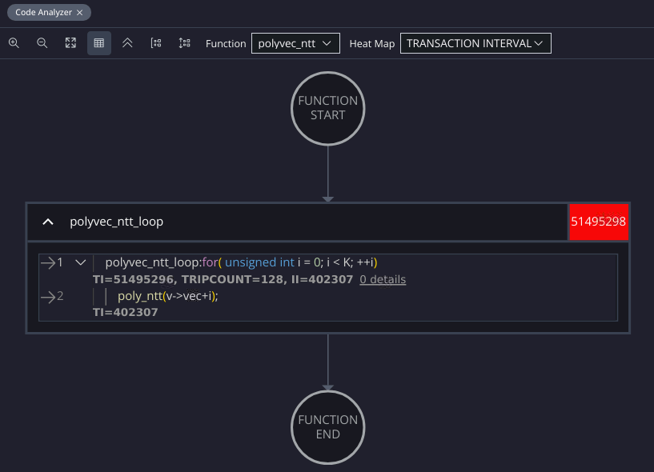

Let's keep drilling into the subfunction `poly_ntt`:
- Use the arrows on the left of the expanded process window, or
- Use the function dropdown at the top of the Code Analyzer window, and select the function `poly_ntt`.

Using either methods, we will again see little information, as `poly_ntt` is only calling `ntt`.

_Note: we don't show the screenshot for the `poly_ntt` function._

The function `ntt` is where the bulk of the Number Theoretic Transform code is contained. Let's see what is inside.

6. Open the function `ntt` and wait for HLS to analyze this code.

Upon selecting `ntt`, the HLS tool will process and display a detailed graph representing the function's internal operations and their interdependencies:

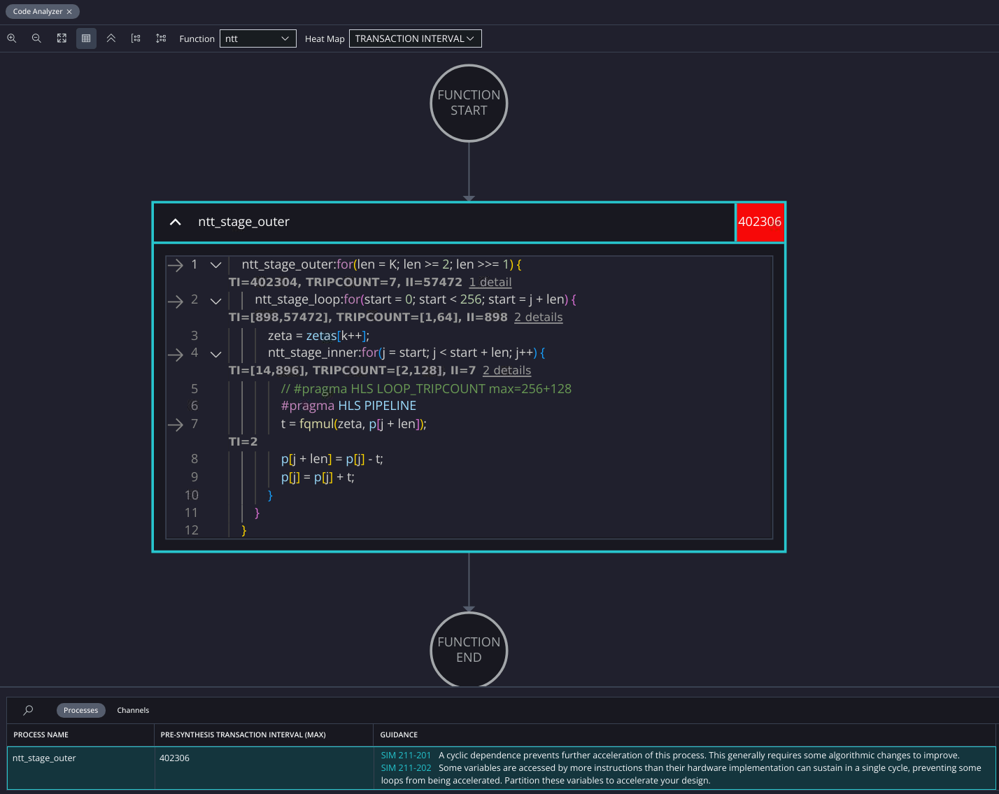

The graph illustrates the single processes that comprise the `ntt` function and we can see the 3 nested loops and the dependencies therein in the channel table.

In our function `ntt`, the loop body of the nested loops implement the different sequential stages of the algorithm.
> The estimated transaction interval of the `ntt` function is 402 thousands clock cycles. Let's record this metric in a table:

| Version | polyvec_ntt TI | ntt TI |
|:-------:|:--------------:|:-------:|
| Version0: baseline code | 51.5M | 402k |

Furthermore, at the bottom of the screen, by selecting "Channels" you can view an additional aspect of the analysis: 

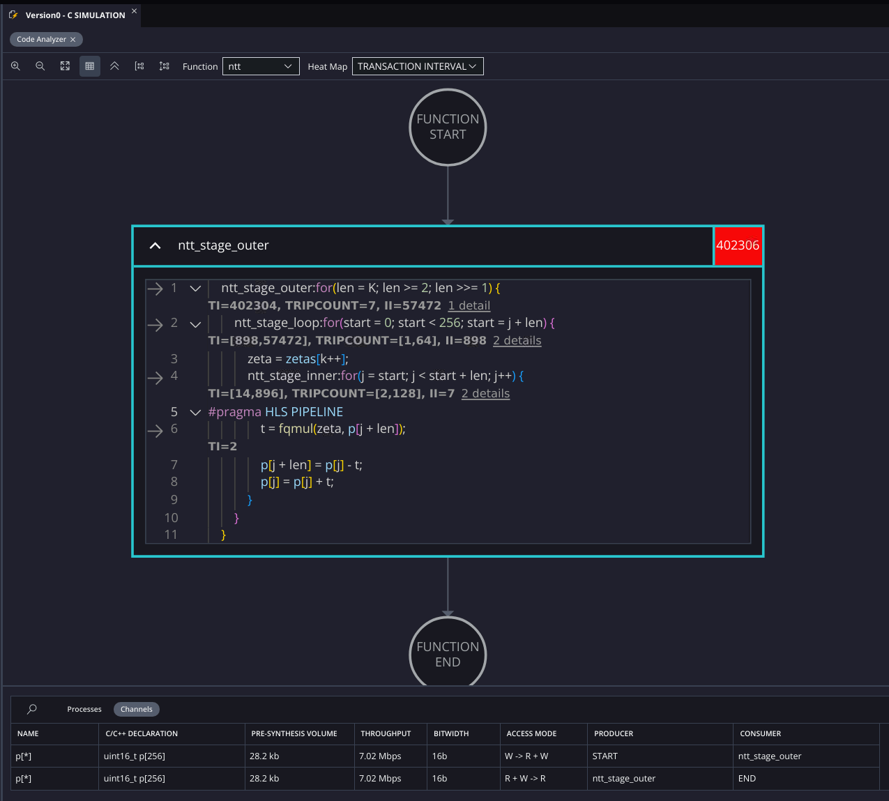

The "Channels" pane lists every data transaction that was analyzed. A variable might show up in the list twice if multiple transactions occurred on that variable. The chart also provides data on each transaction, like the bitwidth, throughput, and total volume of data being passed.

It is clear that the folded triple-nested-loop contains the bulk of the computations and that in order to extract parallelism we need to unroll the outer loop.

As a first attempt to extract parallelism, we have created `Version1` based on the same code and testbench as `Version0`; now let's switch to this new component.

## Version1

`Version1` is based on `Version0` and the only code changes made so far are that we've manually unrolled the loop named `ntt_stage_outer` in the function `ntt`, the previous code is looking like this:
```
    ntt_stage_outer:for(len = K; len >= 2; len >>= 1) {
        for(start=0;...
            for(j=start;...
                // loop body 
```
and after unrolling `ntt_stage_outer` with induction variable `len`, the code is changed into:
```
    // Stage 0
    len = K; // K is defined to be 128, so len is 128
    for(start=0;...
        for(j=start;...
            // loop body 

    // Stage 1
    len >>= 1; // len is now 64
    for(start=0;...
        for(j=start;...
            // loop body 

    [..repeat..]

    // Stage 6
    len >>= 1; //  len is now 2
    for(start=0;...
        for(j=start;...
            // loop body 

    // manual unrolling stops here:
    // the original loop condition is len >= 2 so the next iteration will not happen.
```

Let's begin by simulating the code provided in `Version1`. 

1. Run C Simulation in the Flow pane with Code Analyzer.

Similar to before, run C Simulation but let's start directly with Code Analyzer enabled, that's the way the new versions are setup (you can disable Code Analyzer in the settings in the Component Settings window).

2. Select Run under C Simulation in the Flow pane again.

Let's start C simulation and wait until it is run. When it completes, the Code Analyzer view will be enabled for selection under the C simulation reports.


3. When it completes, expand the Reports dropdown in the Flow pane and click Code Analyzer.

The Code Analyzer graph report will appear and show the top level hardware function for synthesis, `polyvec_ntt`. Similarly to the previous version, this function does not bring more insights to us. Let's note the TI value of 804k cycles in a table for later reference and discussion. Let's expand the process body and drill down the function hierarchy: we enter `poly_ntt` which calls `ntt` and we note its estimated TI value of 6281 clock.
| Version | polyvec_ntt TI | ntt TI |
|:-------:|:--------------:|:-------:|
| Version0: baseline code | 51.5M | 402k |
| Version1: manual unroll | 804k | 6281 |

We can be pleased with this is a huge improvement over the previous version by explicitly exposing the parallelism.

4. Use the Function dropdown to select `ntt` and wait for HLS to analyze this code.

Upon selecting `ntt`, the HLS tool will process and display a detailed graph representing the function's internal operations and their interdependencies.

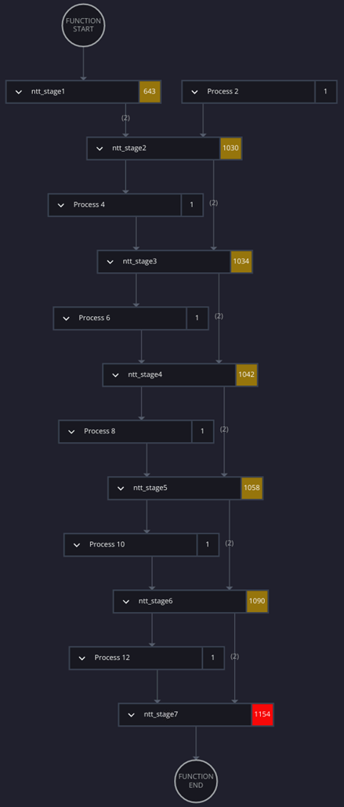

The graph illustrates the processes that comprise the function and the dependencies therein. Each node in the graph represents a computational process. In our function `ntt`, most of the nodes in this graph represent the sequential stages of the algorithm. The edges denote data dependencies between the processes, where the data in one array is accessed by multiple processes.

At the bottom of the screen, there's an additional panel where additional details on the processes and channels can be found:

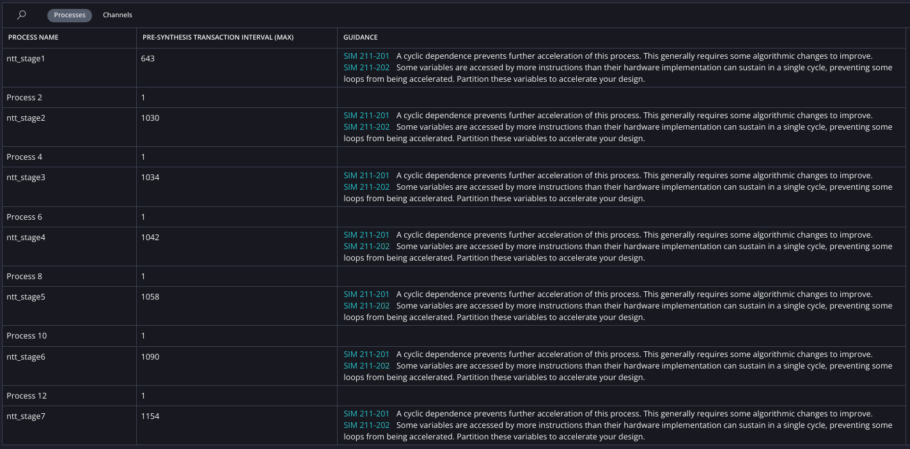

This "Processes" pane provides a list of all processes in the function. In addition, the transaction interval (TI) is provided as an estimate of performance, and code guidance can provide a suggestion for how one might refactor the code to improve performance, if applicable.
The TI of each stages are in the range 643-1154 and are listed both in the graph and in the table.

Furthermore, by selecting "Channels," you can view an additional aspect of the analysis:

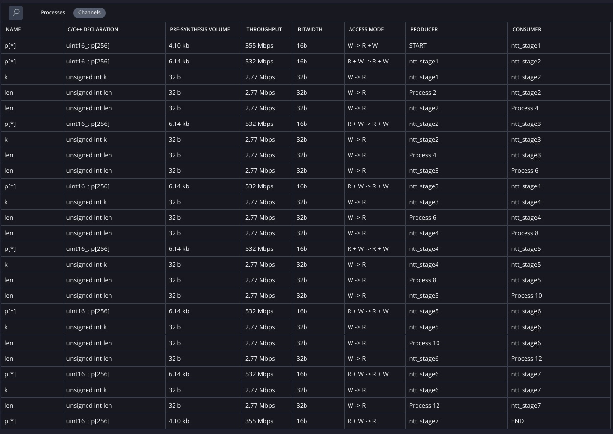

The "Channels" pane lists every data transaction that was analyzed. A variable might show up in the list twice if multiple transactions occurred on that variable. The chart also provides data on each transaction, like the bitwidth, throughput, and total volume of data being passed.

One thing is clear from these three views provided by the code analyzer; there is a multitude of dependencies which span several processes. We can dive in on the channel view to get more information.

We can observe that array `p` is used several times. Let's make use the search function to show only uses of `p[*]`: 

5. Select the search box and type `p[*]` to show only this array in the table. We've highlighted the first few lines of the table with their matching edges from the graph shown, they are also annotated in red on the screenshot.

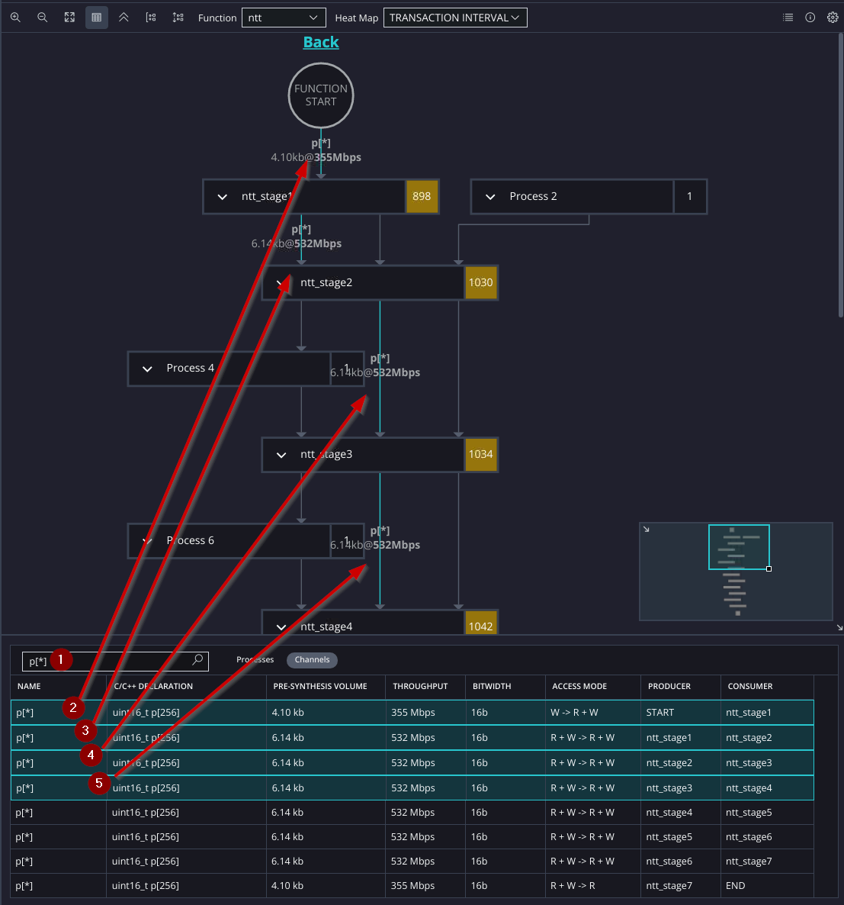

Back up in the main graph, we can expand any of the processes labelled `ntt_stageN` to investigate the source of the problem. In each of the stages of this algorithm, the data accesses that same variable `p`. This is fine on a sequential processor like a CPU but will restrict performance on a parallel architecture. 

In the next section, we'll address this dependency on `p` and show one simple way to eliminate this contention and pave the way for acceleration.

## Version2

There are two steps we need to take to improve the situation of several processes needing for access to the variable `p`. You can certainly make these changes manually, but you might find it easier to open a version of the code that has already been factored.

1. Select `Version2` in the Component dropdown of the Flow pane.

The first change will be to the signature of the function `ntt`. We want to separate the input and output. This will allow inputs and outputs to proceed in parallel, without contention. These code changes can be seen in the following diff output:

```
polyvec.h
-void ntt(uint16_t p[N]);
+void ntt(uint16_t p_in[N], uint16_t p_out[N]);
```

```
polyvec.cpp
-void ntt(uint16_t p[N]) {
+void ntt(uint16_t p_in[N], uint16_t p_out[N]) {
```

The other change is similar in that we basically want to separate the input and output of each loop statement within the `ntt` function. To do that, we'll simply declare several arrays internally:

```
    uint16_t p_stage1[N];
    uint16_t p_stage2[N];
    uint16_t p_stage3[N];
    uint16_t p_stage4[N];
    uint16_t p_stage5[N];
    uint16_t p_stage6[N];
```

And then each stage must then be modified to use those new arrays. For example Stage 3 reads inputs from `p_stage2[]` and generate outputs into `p_stage3[]`:

```
    // Stage 3
    len >>= 1;// = 32;
    ntt_stage3: for(start = 0; start < N; start = j + len) {
        int16_t zeta = zetas[k++];
        ntt_stage3i: for(j = start; j < start + len; j++) {
#pragma HLS PIPELINE
            int16_t t = fqmul(zeta, p_stage2[j + len]);
            p_stage3[j + len] = p_stage2[j] - t;
            p_stage3[j] = p_stage2[j] + t;
        }
    }
```

Now, we should have resolved the memory access conflicts. We can check and confirm this by re-running the Code Analyzer.

2. Run C Simulation on this component and open the HLS Code Analyzer, then open the graph for the function `ntt`: 

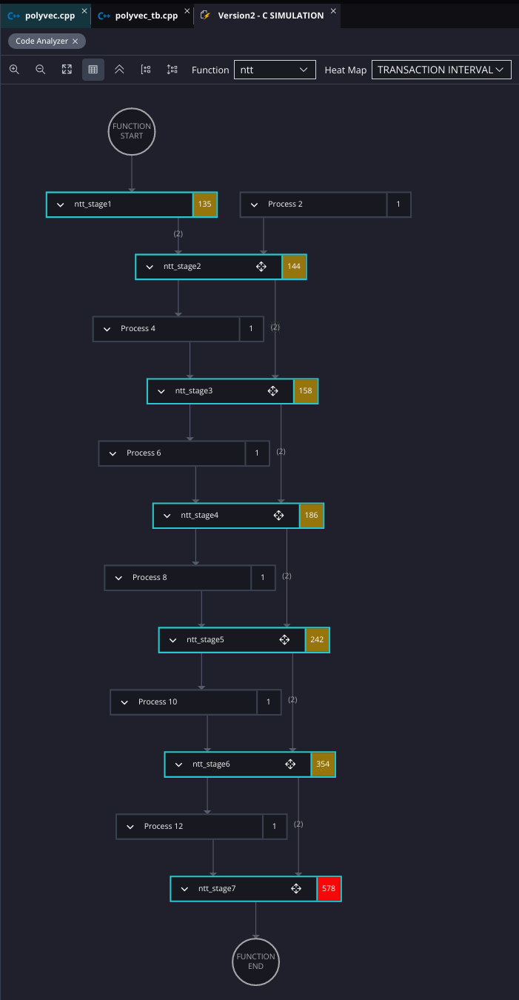

With the dependencies removed, a clear structure emerges. What we now see is a sequence of processes with purely feed forward data transfer occurring in the region. 
The TI of each stages have decreased again and are now in the range 135-578.

| Version | polyvec_ntt TI | ntt TI |
|:-------:|:--------------:|:-------:|
| Version0: baseline code | 51.5M | 402k |
| Version1: manual unroll | 804k | 6281 |
| Version2: remove p[] dependencies | 230k | 1540|

In addition, we can see that each data transfer is independent of any other, and has a write to read access mode (in the table below we searched to display only names with "p_"):

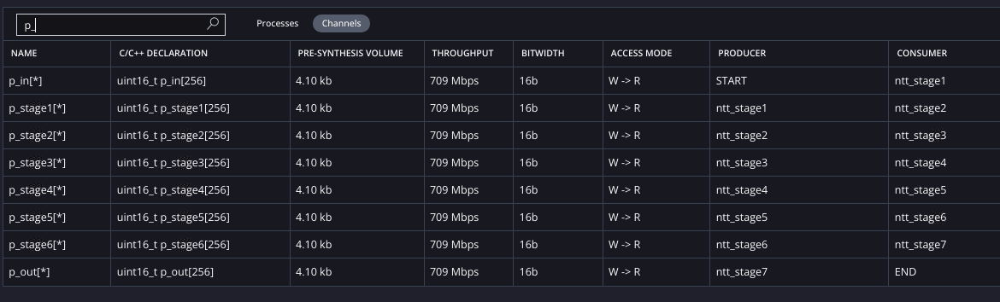

All of this is to say that this function is an excellent candidate for optimization using the dataflow pragma. We'll do that now, in the next section: add dataflow pragma to enable the task level parallelism. 

## Version3

Dataflow is an optimization in HLS that creates various processing stages from a sequence of functions, where the output of one stage is stored in a buffer to become the input of the next stage. In this way, we implement a Task Level Parallelism (TLP), where several computational tasks operate simultaneously.

Returning to the context of NTT, what we want to do is create a dataflow region where each of the stages is a task. Thus, each of the processes shown in the graph above, which are currently each 2 nested loops, need to be encapsulated in their own function: we created a function template; the different function instances in the software will infer different modules in the hardware and we use the template parameter for the stage number. 

``` C++
//using a template parameter to instanciate multiple different functions -> different hardware modules
template <int stage>
void ntt_stage(uint16_t p_in[N], uint16_t p_out[N]){
    unsigned int start=0, j=0;
    unsigned int len = K >> stage; 
    unsigned int k = 1 << stage; 

    ntt_stage_loop1: for(start = 0; start < N; start = j + len) {
        int16_t zeta = zetas[k]; k++;
        ntt_stage_loop2: for(j = start; j < start + len; j++) {
            #pragma HLS PIPELINE
            int16_t t = fqmul(zeta, p_in[j + len]);
            p_out[j + len] = p_in[j] - t;
            p_out[j] = p_in[j] + t;
        }
    }
}

void ntt(uint16_t p_in[N], uint16_t p_out[N]) { 
    uint16_t p_stage1[N];
    uint16_t p_stage2[N];
    uint16_t p_stage3[N];
    uint16_t p_stage4[N];
    uint16_t p_stage5[N];
    uint16_t p_stage6[N];
#pragma HLS DATAFLOW
    ntt_stage<0>(p_in,     p_stage1);
    ntt_stage<1>(p_stage1, p_stage2);
    ntt_stage<2>(p_stage2, p_stage3);
    ntt_stage<3>(p_stage3, p_stage4);
    ntt_stage<4>(p_stage4, p_stage5);
    ntt_stage<5>(p_stage5, p_stage6);
    ntt_stage<6>(p_stage6, p_out  );
}
```

Two further changes were made to the code compared to `Version2` :
- Use dataflow in the `polyvec_ntt()` function: as we expect the `ntt()` function to have a smaller initiation interval (II) than its full latency, now that `ntt()` runs in dataflow mode, then we can restart the `ntt()` function earlier and because it is called from within a loop, then this loop inside the `polyvec_ntt()` function needs to also run in dataflow. If it is not running in dataflow mode then the loop will wait the full latency of the `ntt()` function to start the next loop iteration which is not efficient given the code changes performed.
- Separate the input and output arrays: this saves the copy time that we had in the previous version and further removes dependencies.

``` C++
void polyvec_ntt(polyvec *vin, polyvec *vout) {
    polyvec_ntt_loop:for( unsigned int i = 0; i < K; ++i) {
        #pragma HLS DATAFLOW
        poly_ntt(vin->vec+i, vout->vec+i);
    }
}

```

As before, these code modifications have already been completed, so you can switch to the next component to switch to the final `version 3` of the code and run analysis one final time.

1. Select `Version3` in the Component dropdown of the Flow pane, run C Simulation on this component, open the HLS Code Analyzer, and select function `ntt` to show the following analysis results:

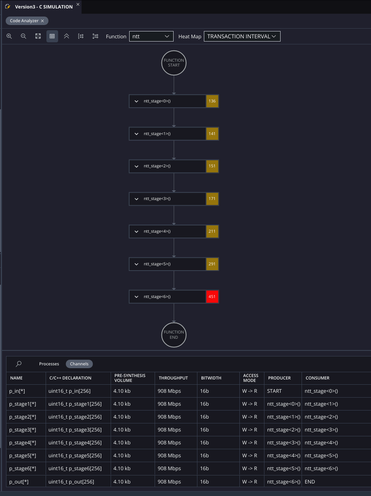

In this final version of the code, the analyzer view shows just the 7 functions which implement the 7 stages and the channels that transfer data between them. This confirms the applicability of the code to the dataflow optimization. 

The TI of each stages are similar to the previous version because the code didn't change and are now in the range 136-451.

| Version | polyvec_ntt TI | ntt TI |
|:-------:|:--------------:|:-------:|
| Version0: baseline code | 51.5M | 402k |
| Version1: manual unroll | 804k | 6281 |
| Version2: remove p[] dependencies | 230k | 1540|
| Version3: function template + dataflow + independent IO | 199k | 1552 |


To confirm that we can check the successful application of the dataflow optimization, the Dataflow Viewer but this requires that C-Synthesis is run.

2. In the Flow panel, under C Synthesis, press Run

3. Once that completes, expand reports and select Dataflow Viewer.

You need to expand the box of the process `nnt2_U0` so get to this representation:

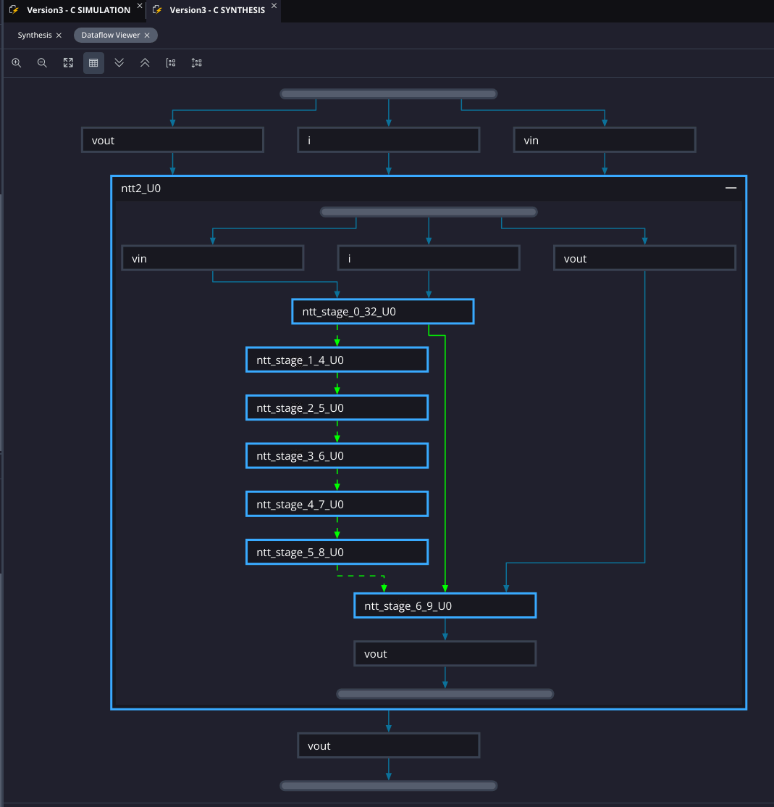

Whereas the Code Analyzer analyzes C code to estimate synthesis results to provide early guidance, this Dataflow Viewer is now using the results of the synthesis to confirm those expectations. As shown in the view above, we can now confirm visually that the dataflow optimization is being applied to this code. It has automatically created 7 tasks and inferred Parallel In Parallel Out (PIPO) buffers to store the results in between each task. Now that we have confirmed the presence of Task Level Parallelism in the code, we will check the performance improvement afford by this optimization in the final section.

## Performance and Utilization

To understand the efficacy of the optimizations we've made so far we will compare the performance and utilization results for the different versions of the code. For each version of the code, we will synthesize the component for implementation on a Versal Premium Series xcvp1202 -1 speed grade AMD Adaptive SoC device. Then we will create a table and compare the results after each stage of optimization.

### Version 3 Performance
We've already run the C Synthesis for `Version3`, so let's first investigate and understand the results of the Synthesis Report.

1. Under C Synthesis, expand reports and select Synthesis.

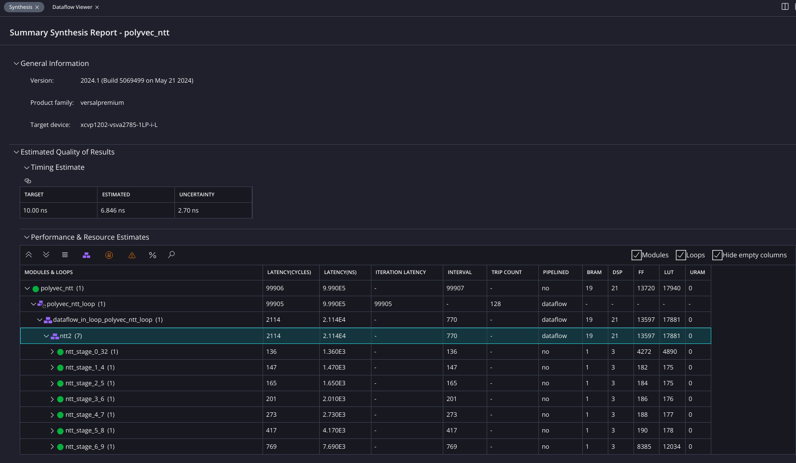

This view shows the synthesis results. The first section shows the Timing Estimate, and the conservative clock period of 100 MHz was easily achieved. The second section shows the Performance and Resource Estimates. In this section, we can see the performance and utilization of each function, sub-function, and/or loop in the code. Two key performance metrics are latency and interval. Latency measures the time from the beginning to the end of the process. Interval is measures the minimum amount of time between successive calls to the module, making it a better measurement for throughput. In addition, we can see a number of utilization metrics are provided, such as BRAM, DSP, FF, and LUT.

During this tutorial, we optimized the function `ntt`, and the performance and utilization for that function is provided in the 4th row. We can focus on the cycle performance:
- The II is 770 and is matching the longest II of its subfunctions/ processes which is `ntt_stage6()`,
- Its Latency is 2114 which is the sum of all the latencies of its subfunctions/ processes.

For polyvec_ntt_loop, the loop tripcount is 128 as expected and we call the `ntt()` function, we can see that the latency is 99905 which is coming from the computation 127*770+2114+1 -- and the details are as follow: because the tripcount is 128, then we need 127 restarts of the iteration at II=770 and the last iteration we need to wait the full latency of 2114 cycles to get all the outputs.


### Comparison of all versions

By using Code Analyzer, we were able to rapidly analyze and improve the design without running C Synthesis, so let's now compare the estimation results from Code Analyzer against the estimations from C Synthesis:

| Version                                                      | CA: polyvec_ntt TI | CA: ntt TI | C-Synth</br>polyvec_ntt</br>latency=interval |
|:-------------------------------------------------------------|:------------------:|:----------:|:---------------:|
| Version0: baseline code                                      |        51.5M       |    402k    |  not computed   |
| Version1: manual unroll                                      |       804k         |    6281    |      688k       |
| Version2: remove p[] dependencies                            |       230k         |    1540    |      295k       |
| Version3: function template</br> + dataflow + independent IO |       199k         |    1552    |      100k       |

The estimations from Code Analyzer were guiding us to do the correct code changes and despite the estimations not matching exactly those from C Synthesis, they are showing the same trend and order of magnitude which is what allowed us making rapid changes. 

For the change between `Version2` and `Version3`, we can also notice the advantage of optimizing this function with the DATAFLOW pragma and task-level parallelism as it becomes obvious when viewed this way. Without dataflow, both the latency and the interval of `ntt` are equal to the sum of the functions it calls. With dataflow, the initiation interval of `ntt` becomes equal to the maximum interval of one of NTT's sub stages. So whilst the latencies are the same in both versions, the initiation interval is much better: C Synthesis shows the latency to be 2114 cycles and the II to be 770 which is about a third, because each of these stages is running concurrently on a different iteration of data. when compounded all together the `Version3` is running about 3 times faster than `Version2`;
This is the advantage of the dataflow pragma and task-level parallelism.

The Resources Estimations table below from C-Synthesis using a Versal Premium (xcvp1202-vsva2785-1LP-i-L) further shows that the design resources didn't bloat between the initial and final version. The biggest changes are the DSP resources to perform the computations in parallel and the BRAM to implement the needed intermediate ping-pong buffers.

| Version                                        |    latency   |  BRAM   |    DSP   |      FF     |     LUT      |
|:-----------------------------------------------|:------------:|:-------:|:--------:|:-----------:|:------------:|
| Version0: baseline code                        | not computed |  1 (~0%)|   3 (~0%)|  20844 (1%) |   23036 (2%) |
| Version1: manual unroll                        |     688k     |  1 (~0%)|  21 (~0%)| 115896 (6%) |  134623 (14%)|
| Version2: remove p[] dependencies              |     295k     |  9 (~0%)|  21 (~0%)|   9449 (~0%)|   11701 (1%) |
| Version3: function template + </br>dataflow + independent IO |     100k     | 19 (~0%)|  21 (~0%)|  13720 (~0%)|   17940 (1%) |

## Conclusion 

In this tutorial, we demonstrated how to optimize C code for Vitis HLS using Code Analyzer.  We presented a case study based on the CRYSTALS-Kyber algorithm, polynomial vectorization, and number-theoretic transforms. 

We used the Code Analyzer to glean helpful insights about the algorithm, then applied those insights through actionable code changes.

Finally, we measured the performance impact and observed how the dataflow optimization enabled task-level parallelism to deliver a sizeable performance gain. 

The example shown in this tutorial serves as a reference for how these concepts can be used to write high performance IP for AMD FPGAs in a fraction of the time needed compared to a pure RTL flow.

</br>
<hr/>
<p align="center" class="sphinxhide"><b><a href="/README.md">Return to Main Page</a></b></p>

<p class="sphinxhide" align="center"><sub>Copyright © 2020–2023 Advanced Micro Devices, Inc</sub></p>

<p class="sphinxhide" align="center"><sup><a href="https://www.amd.com/en/corporate/copyright">Terms and Conditions</a></sup></p>
