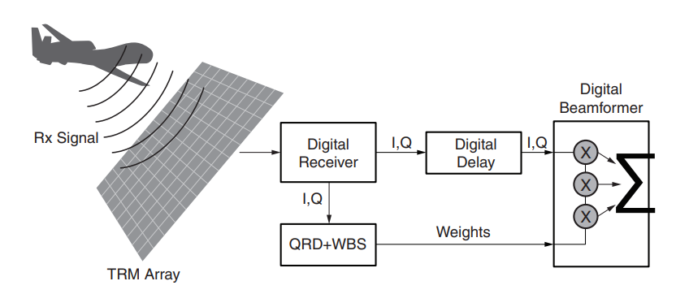
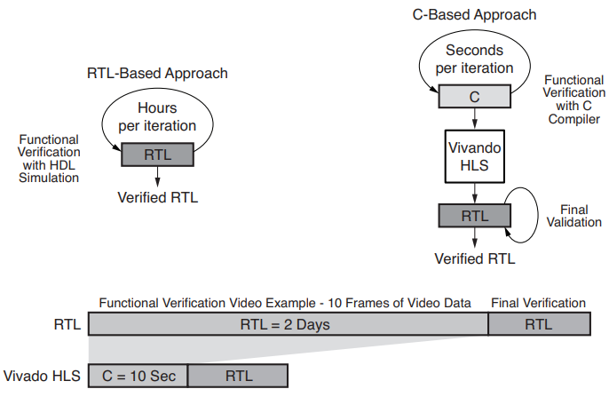
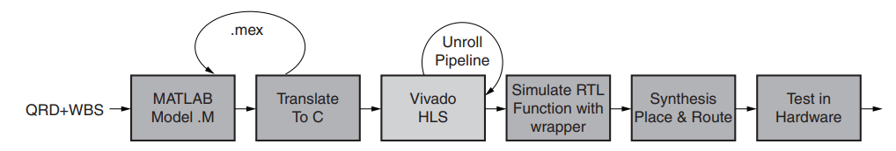
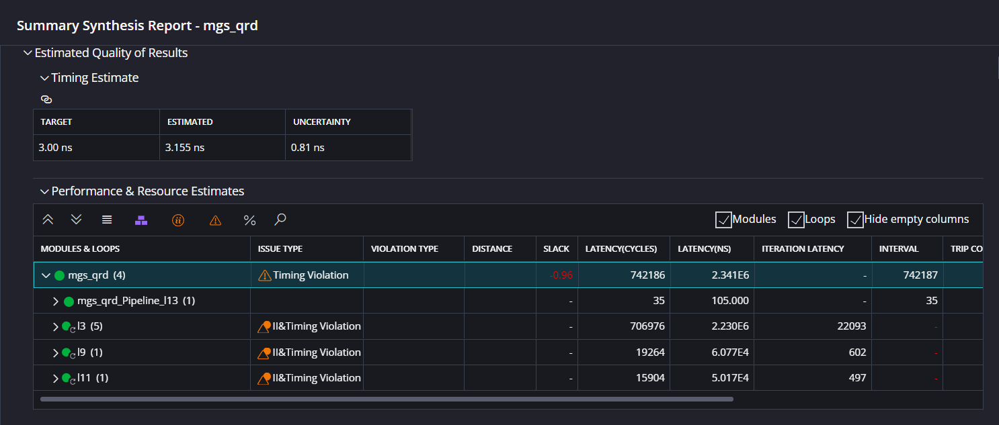
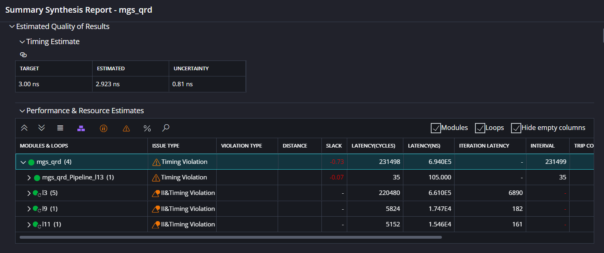

<table class="sphinxhide" width="100%">
 <tr width="100%">
    <td align="center"><h1>Vitis™ HLS Tutorials</h1>
    <a href="https://www.xilinx.com/products/design-tools/vitis/vitis-hls.html">See Vitis™ HLS landing page on xilinx.com</a>
    </td>
 </tr>
</table>

# Adaptive Beamforming for Radar:<br>Floating-Point QRD+WBS in an FPGA

***Version: Vitis 2023.2***

## ABSTRACT

The gradual transition of analog signal processing to the digital domain in radar and radio systems has led to advancements in beamforming techniques and, consequently, to new applications. The ability to steer beams digitally with great precision has radically changed the future of commercial and military radar system design.

Adaptive beamforming algorithms have pushed the signal processing world into the use of floating-point arithmetic; this has increased radar capability by allowing creation of multiple simultaneous spot beams for individual real-time target tracking.

The modified Gram-Schmidt (MGS) QR decomposition (QRD) and weight back substitution (WBS), key algorithms for radar DSP, allow a radar to form beams while suppressing side lobes, noise, and jamming. These applications require a very high number of FLOPS (floating-point operations per second).

AMD™ FPGAs and adaptive SoCs have an orders of magnitude advantage in floating-point performance compared to commercial GPUs, DSPs, and multi-core CPUs. Power consumption can also be greatly decreased compared to existing GPU and multi-core processor designs. 

AMD Vitis™ High-Level Synthesis (HLS) supports native C language design, therefore the design can be coded at the algorithmic level using C or C++ and synthesized into RTL for implementation on the device. HLS can accelerate design times by 10 to 20 times. The design described in this white paper was completed in about four hours. Hand coding a VHDL or Verilog version of this design and verifying it using RTL could take weeks or even months, depending on various factors.

Using AMD devices, adaptive beamforming performance and QoR can be increased by orders of magnitude. Using Vitis HLS, design time can be reduced by orders of magnitude. This white paper focuses on a complex floating-point, variable-sized MGS QRD+WBS, up to 128x64 in size.

## Introduction

Most radars today employ some type of adaptive digital beamforming. A high-level block overview of the receiver beamforming concept is illustrated in Figure 1.



As technical requirements increase, radar designs are expected to occupy progressively higher bandwidths, requiring receiving systems to become more reliable at suppressing the effects of noise sources, off-target antenna side-lobe content, interference from hostile jamming signals, and the “clutter” present within the wider pass-bands characteristic of the newer radar technologies. All this must be done while maintaining directional control of each antenna array element—individually and simultaneously, in real time. Successfully completing these tasks within given time limits is accomplished through element-level processing. Put simply, that means that the signal of each antenna element is received individually and processed simultaneously.

A critical part of element-level processing is adaptive digital beamforming. This white paper focuses on the technology of adaptive beamforming and how it can be implemented using AMD FPGAs and adaptive SoCs to create a beam-agile radar system at reduced cost, complexity, power consumption, and time to market than legacy solutions.

Using the technology and AMD components described in this white paper, a beam-agile radar can be created by calculating complex floating point adaptive weights. These weights are sampled from a previous pulse repetition interval (PRI). The challenge of calculating these weights is contained within the need to perform a complex matrix inversion that solves Equation 1 before the next PRI of data is received:

Equation 1:
```math
Ax = b
```
Where:
- $A$ = the complex matrix, size $\[m,n\]$ where $m \geq n$ ; these are receive samples.
- $x$ = the complex vector being solved for, which becomes the adaptive weights, size $\[n,1\]$.
- $b$ = the desired response or steering vector, size $\[m,1\]$.

To solve for $x$, one cannot divide $b$ by $A$. This is where the modified Gram-Schmidt (MGS) QR decomposition (QRD) is needed, which calculates the matrix inversion. The MGS QRD must use floating-point arithmetic to maintain the precision of the adaptive weight solution.

Solving for $x$ in Equation 1 requires a deterministic, low-latency solution of matrix size that is a function of the radar system requirements. Traditionally, this arithmetic has been performed by numerous parallel CPUs to ensure that the floating-point calculations were completed before the next PRI. Given the size, weight, and power constraints of many radar systems, the CPU/GPU approach is not the best option to accomplish these calculations. 

AMD FPGAs can perform highly parallel floating point arithmetic much more efficiently, using less hardware. The flexibility of AMD FPGAs allows the radar designer to consume vast amounts of data over flexible I/O standards such as JESD204B, SRIO, PCIe®, etc., then calculate the adaptive weights in one FPGA, in real time. 

## Vitis HLS Overview

The Vitis high-level synthesis (HLS) tool uses C/C++ as the language for hardware design, accelerating development significantly through a reduction of verification time by orders of magnitude. Accelerating algorithms in hardware often requires large input test-vector sets to ensure that the correct system response is being achieved. These simulations can take hours or even days to complete when using RTL and an event-based RTL simulator. However, when implemented using C/C++, simulation can be completed up to 10,000 times faster, finishing in seconds or minutes. This allows designers to implement faster verification times to accelerate development by enabling more design iterations per day. This concept is illustrated in Figure 2:



In addition, the C/C++ based design framework can contribute to faster design times simply by virtue of being a level of abstraction higher than traditional RTL-based method. Finally, Vitis HLS enables high-level design exploration that allows users to quickly explore multiple hardware architectures with different area vs. performance trade-offs without modifying the source code. This can be achieved using compiler directives. Additional information is available in the [Vitis HLS Feature Tutorial on Beamformer Analysis](../../Feature_Tutorials/02-Beamformer_Analysis/), which goes into detail on the methods for micro-optimization and the analysis methods that an inform that process

## The QRD and Weight Back Substitution (QRD+WBS)

The QRD converts the complex matrix $A$ into:

Equation 2:
```math
A = QR
```

Where:
- $Q$, size $\[m,n\]$, is an orthogonal matrix, which yields the identity matrix when:

Equation 3:
```math
Q^H Q = I
```

Where:
- $Q^H$ is the complex conjugate transpose for complex systems
- $Q^T$ is the transpose for real systems.

$R$, size $\[n,n\]$, is an upper triangular matrix, or right triangular matrix, meaning the lower triangle is all zeros. This makes for fast arithmetic when solving for $x$. Equation 4 follows from substituting the QR relationship back into Equation 1.

Equation 4:
```math
QRx = b
```
```math
Q^HQRx = Q^Hb
```
```math
IRx = Q^Hb
```
```math
Rx = Q^Hb
```

The last step is to solve for $x$ using back-substitution. Let $c = Q^Hb$.

Equation 5:
```math
x_j = \frac{1}{R_{j,j}} \left(c_j - \sum_{k=j+1}^{n} R_{j,k} \cdot x_k\right)
```

From this equation, we develop the HLS C code that implements the QR decomposition algorithm. The HLS C code is provided in the [reference files](./reference_files): [mgs_qrd_wbs.cpp](./reference_files/mgs_qrd_wbs.cpp), [mgs_qrd_wbs.h](./reference_files/mgs_qrd_wbs.h), and [mgs_qrd_wbs_tb.cpp](./reference_files/mgs_qrd_wbs_tb.cpp)

## Implementation and Methodology

Implementing algorithms using C/C++ and Vitis HLS creates portable and flexible IP that can used in the Vivado tool flow targeting all AMD devices. The design flow is shown in Figure 6:



Design time, when compared to writing VHDL/Verilog code by hand, is reduced by orders of magnitude, normally from months to days. This reduction of design time comes from 5 main areas:

1. The design is captured in C/C++  models, meaning the design is easy to translate from other algorithm language and remains  portable, flexible, and scalable. The designer is not locked down to a particular FPGA or family. 

2. The functionality of the design is verified with C/C++ simulation runs. Software-based simulations can be run earlier and more often. Thus, errors can be found faster and corrected earlier. The design from Vitis HLS synthesis is correct the first time, so the RTL simulation, which is up to 10,000 times slower, only needs to be run once. 

3. The user can quickly approximate performance and utilization via the Vitis HLS Synthesis Report, which documents the synthesized IP's achieved clock, resource usage, and performance metrics. 

4. An overview of available performance versus utilization trade-offs can be determined by making small adjustments to the code or by inserting compiler directives to customize the synthesis results.

5. Analysis capabilities can help to guide and advise on how to write better HLS code. Well formatted reports and visualizations allow the user additional insights into their code to help them write better HLS C.

This tutorial will focus on the process and results; to get a more in depth look at these Analysis features and a discussion why certain pragmas are utilized in this design, refer to the [Beamformer Analysis tutorial](../../Feature_Tutorials/02-Beamformer_Analysis) in the [HLS Feature Tutorials](../../Feature_Tutorials) section.

## Results

In this section, we will use Vitis to create an HLS Component with the [provided C code](./reference_files/) before synthesizing and comparing the reuslts on a Zynq™ Ultrascale+™ RFSoC and a Versal™ Premium series adaptive SoC.

1. Open the Vitis Unified IDE and specify a new or existing workspace.

2. Create a new HLS Component by clicking `Create Component` under `HLS Development` in the Welcome Screen.

3. Name the component `mgs_qrd_wbs_usplus`

3. In the `Source Files` step, add the file `./reference_files/mgs_qrd_wbs.cpp` as a Design File, add the file `./reference_files/mgs_qrd_wbs_tb.cpp` as a Test Bench File, set the `Top Function` to `mgs_qrd`, and press Next.

4. Either Browse to or type in `xczu28dr-ffve1156-1L-i`, press next, set the clock target to `3ns`, then finish the Wizard.

5. Run and verify the results of C Simulation by pressing Run under C SIMULATION in the FLOW panel. The output should resemble the following:

``` 
 INFO: [SIM 211-1] CSim done with 0 errors.
 INFO: [HLS 200-111] Finished Command csim_design CPU user time: 0 seconds. CPU system time: 2 seconds. Elapsed time: 83.491 seconds; current allocated memory: 1.836 MB.
 INFO: [HLS 200-1510] Running: close_project 
 INFO: [HLS 200-112] Total CPU user time: 3 seconds. Total CPU system time: 5 seconds. Total elapsed time: 89.947 seconds; peak allocated memory: 192.961 MB.
 INFO: [Common 17-206] Exiting vitis_hls at Thu Dec 14 11:29:08 2023...
 INFO: [vitis-run 60-791] Total elapsed time: 0h 1m 37s
 C-simulation finished successfully
 ```

6. Run C Synthesis and open the Synthesis Report. 



Now, we want to create a new HLS Component so we can analyze the results of the design on a Versal Premium series device without touching our existing results.

7. Right-click component `mgs_qrd_wbs_usplus` in the VITIS COMPONENTS panel and select Clone Component. Name the new component `mgs_qrd_wbs_versal`

8. Select `mgs_qrd_wbs_versal` in the Component dropdown of the FLOW panel.

9. Click the gear to the right of the component selection drop-down.

10. Select `hls_config.cfg`

11. Under 'General', go to 'part', and either Browse to or type in `vp1202-vsva2785-1LP-i-L`

12. Run C Synthesis and view the Synthesis Report



The results from Vitis HLS C Synthesis targeting the Zynq Ultrascale+ device and Versal Premium device are summarized in Table 1. This design is an MGS QRD+WBS core targeting a matrix of 32 rows and 32 columns. However, the design is flexible such that it can support variable rows up to 128 and variable columns up to 64.

Table 1:

|                    | Zynq Ultrascale+ | Versal Premium   |
|--------------------|------------------|------------------|
| MAX CLOCK (MHZ)    | 317              | 342              |
| LATENCY (CYCLES)   | 742186           | 231498           |
| INTERVAL (CYCLES)  | 742187           | 231499           |
| BRAM               | 128              | 128              |
| DSP                | 219              | 257              |
| FF                 | 355711           | 321193           |
| LUT                | 131661           | 318777           |
| URAM               | 0                | 0                |

The table shows that with a comparable amount of resources, the Versal Premium device was able to greatly increase performance by two key factors. First, the Versal Premium device was able to achieve a 7.9% greater maximum  clock. In addition, throughput of the design, as measured by cycles, was improved by over 3X. A key reason for this improvement is due to the more efficient DSP58 primitive on the Versal Premium device compared to the DSP48 primitive on the Zynq Ultrascale+ device. In the native floating-point mode, the DSP58 can compute a floating point multiply accumulate with just one DSP primitive, compared to the emulated DSP48 floating-point arithmetic provided by the parts in the Ultrascale+ family.

## Conclusion 

This tutorial has demonstrated that AMD FPGAs can be programmed in C/C++ using Vitis HLS by using a challenging portion of any wireless system as an example. The benefits of developing AMD FPGAs on Vitis HLS are clear. AMD FPGAs are a performance and power advantage versus other acceleration platforms, and developing in C/C++ with Vitis HLS accelerates algorithm coding, testing, deployment, and design migration.

</br>
<hr/>
<p align="center" class="sphinxhide"><b><a href="/README.md">Return to Main Page</a></b></p>

<p class="sphinxhide" align="center"><sub>Copyright © 2020–2023 Advanced Micro Devices, Inc</sub></p>

<p class="sphinxhide" align="center"><sup><a href="https://www.amd.com/en/corporate/copyright">Terms and Conditions</a></sup></p>
