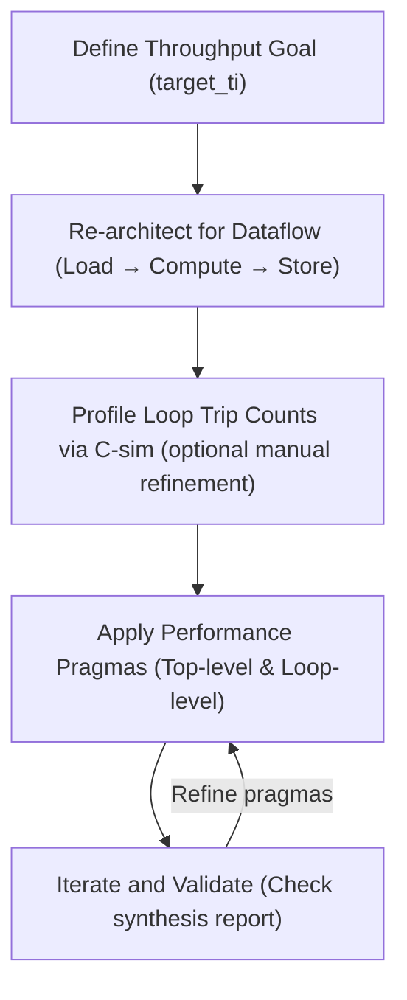
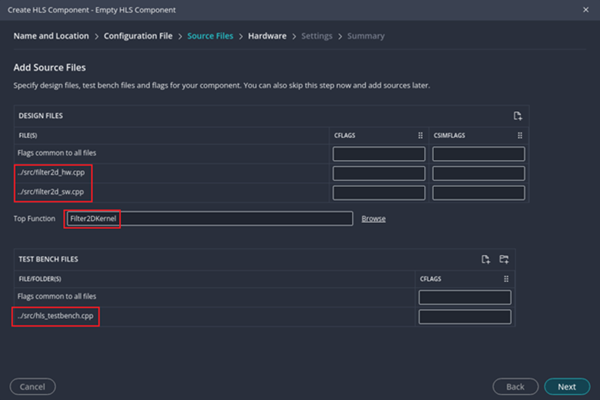
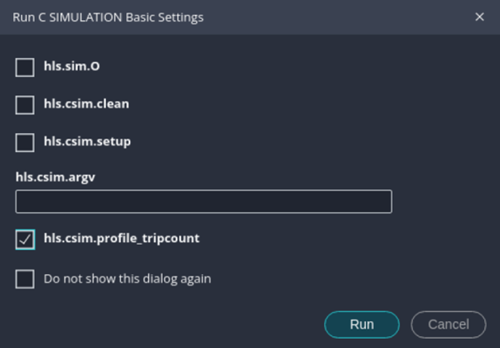
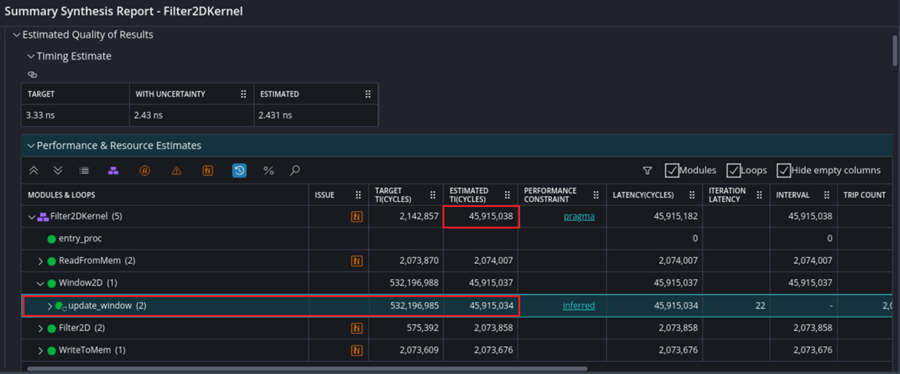
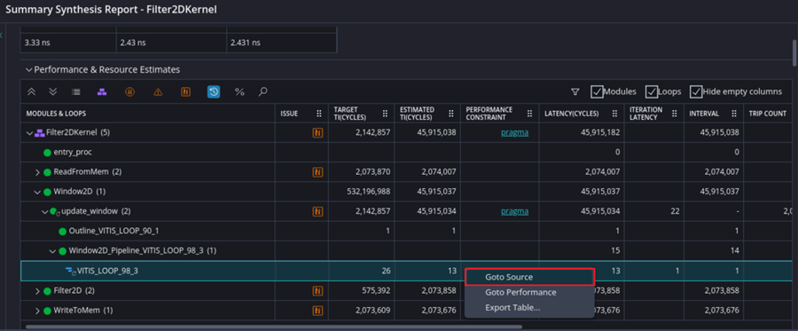
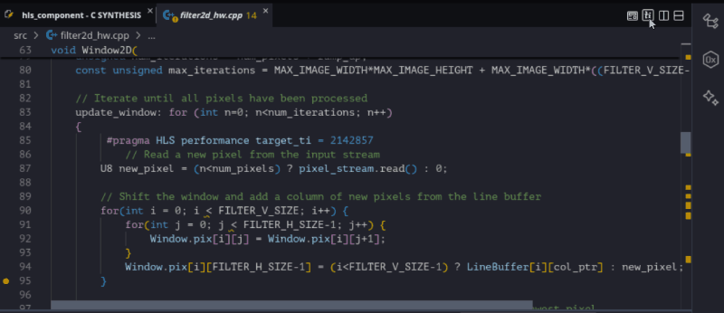

<table class="sphinxhide" style="width:100%;">
  <tr>
    <td align="center">
      <picture>
        <source media="(prefers-color-scheme: dark)" srcset="https://raw.githubusercontent.com/Xilinx/Image-Collateral/main/logo-white-text.png">
        
      </picture>
      <h1>AMD Vitis™ HLS Tutorials</h1>
      <a href="https://www.amd.com/en/products/software/adaptive-socs-and-fpgas/vitis.html">See Vitis™ Development Environment on amd.com</a>
    </td>
  </tr>
</table>

# Streamlined Optimization with Vitis HLS Performance Pragma

***Version: Vitis 2026.1***

## Introduction

Vitis™ HLS ( High-Level Synthesis) enables developers to describe hardware using C/C++ and automatically generate RTL for FPGA implementation. This approach accelerates design cycles and improves productivity compared to traditional RTL coding. However, achieving performance goals in Vitis™ HLS has traditionally required inserting low-level pragmas, such as `pipeline`, `unroll`, and `array_partition`, to guide the compiler. This manual process can be iterative, time-consuming, and highly sensitive to design changes.

To address these challenges, **Performance Pragma** provides a higher-level optimization mechanism. Instead of tuning individual loops with multiple pragmas, designers can specify a system-wide throughput goal, and the compiler automatically infers and applies the necessary optimizations. This simplifies the workflow and makes performance tuning more intuitive.

The purpose of this tutorial is to demonstrate how to use Performance Pragma effectively through a practical example. We will walk through a 2D convolution design and show how to apply Performance Pragma step by step to meet a defined performance target. By the end, you will understand not only what Performance Pragma is, but also how to integrate it into your design flow for maximum benefit.

For detailed reference on Vitis HLS concepts and pragma syntax, see the [UG1399](https://docs.amd.com/r/en-US/ug1399-vitis-hls).

## Performance Pragma Overview 

Performance Pragma introduces a top-down optimization flow that starts with defining a global performance target rather than focusing on individual loops. The methodology includes:


For more details on pragma syntax and methodology, see [UG1399](https://docs.amd.com/r/en-US/ug1399-vitis-hls/Top-Level-Performance-Pragma).

## Step-by-Step Optimization Walkthrough

In this tutorial, we use a **2D Convolution design** as a practical example to demonstrate how to apply Performance Pragma methodology step by step. The design consists of a top-level kernel function `Filter2DKernel` and supporting modules for memory access and computation.

### Original Design Structure

The [design](./src/filter2d_hw.cpp) follows a typical image processing pipeline:
- **ReadFromMem**: Reads image data and filter coefficients from global memory.
- **Window2D**: Constructs a sliding window of pixels for convolution.
- **Filter2D**: Applies the convolution filter to each window.
- **WriteToMem**: Writes the processed pixels back to global memory.


The top-level function `Filter2DKernel` orchestrates the pipeline stages. To improve throughput, the design is organized using `#pragma HLS dataflow`, which decomposes the computation into producer–consumer tasks connected by streams/FIFOs so that different stages can run concurrently (downstream stages can begin as soon as upstream data becomes available). At this point, dataflow is enabled, but the design does not yet apply any performance pragma. For dataflow region coding style and best practices, see [UG1399](https://docs.amd.com/r/en-US/ug1399-vitis-hls/Dataflow-Region-Coding-Style).

### Create HLS Component in Vitis Unified IDE

1. Clone the repository to your local system and navigate to the directory that contains this tutorial.  
2. Open the Vitis Unified IDE using the following command (ensure you have sourced the settings script to set up Vitis):  
   ```bash
   vitis
   ```  
3. From the **File** menu, select **New Component**, then click **HLS**. This will open the **Create HLS Component – Empty HLS Component** window.  
4. Confirm that the component location is the current directory, keep the default component name, and click **Next**.  
5. Do not change any settings in the **Configuration File**; click **Next** again.  
6. Add `../src/filter2d_hw.cpp` and `../src/filter2d_sw.cpp` to **DESIGN FILES**, select `Filter2DKernel` as the **Top Function**, then add `../src/hls_testbench.cpp` to **TEST BENCH FILES**. Click **Next** to continue.  

     
7. Select `xcu200-fsgd2104-2-e` as the target **Part** for this component, then click **Next**.  
8. Specify `3.33ns` as the clock, choose `vitis` as the flow target, leave other settings unchanged, and click **Next**.  
9. Click **Finish** to create the new HLS component (click **Update** if an **Update Workspace** window appears).  


> **Note:** You can open the pre-created HLS component `golden` by executing the following command.  
> However, we strongly recommend reading each step in [above section](#create-hls-component-in-vitis-unified-ide) to clearly understand how to create a project from scratch and perform simulation, synthesis, and optimization.

   ```bash
   vitis -w ./
   ```

### Calculate Performance Target
Define the throughput goal based on system requirements. For example, to process HD frames at 140 FPS on a 300 MHz clock.

- **Frame interval** = 1000 ms ÷ 140 ≈ **7.14 ms**
- **Cycle budget** = 300 MHz × 7.14 ms ≈ **2,142,857 cycles per frame**

This means the entire kernel must complete within approximately 2.14 million cycles.

### Re-architect for Dataflow
Ensure the design explicitly follows the **Load → Compute → Store** pattern and apply:
```cpp
#pragma HLS dataflow
```
This design already uses dataflow and requires no changes.

### Determine Loop Trip Counts
Starting with **Vitis HLS 2025.2**, manual loop trip count annotation is no longer required. Instead, the tool can automatically capture loop iteration counts during C simulation.
1. Run C Simulation by clicking **Run** under **C SIMULATION** in the Flow navigation panel.
2. When the **Run C SIMULATION Basic Settings** window appears, enable the option `hls.csim.profile_tripcount`, then click **Run**.

     

3. The tool will profile loop iterations, generate a `csim.tcl` file under **Output** > **csim** > **profile**, and use this data for accurate performance budgeting during C synthesis.

### Apply Top-Level Performance Pragma

Open `filter2d_hw.cpp` from the **Sources** panel, locate the `void Filter2DKernel()` function, and apply the performance pragma to the top-level function by uncommenting the following line:
```cpp
#pragma HLS performance target_ti = 2142857
```

### Identify Bottlenecks

1. Run **C Synthesis** by clicking **Run** under **C SYNTHESIS** in the Flow navigation panel. The process may take several minutes to complete.  
2. Once synthesis is finished, review the report by navigating to **REPORT > Synthesis** under **C SYNTHESIS** in the Flow navigation panel.  
3. In the report, look for loops or functions that exceed the defined **target transaction interval**. These are potential bottlenecks that require further optimization.

     

This indicates that the loop inside `Window2D` requires optimization.

### Apply Loop-Level Performance Pragmas
Open `filter2d_hw.cpp` from the **Sources** panel, locate the `void Window2D()` function, and apply the loop-level performance pragma to the `update_window` loop by uncommenting the following line:

```cpp
#pragma HLS performance target_ti = 2142857
```

After applying the pragma, re-run **C Synthesis**. 

### Validate and Iterate
Once synthesis completes, review the updated report to verify improvements and identify any remaining loops or functions that do not meet the performance target.



The report indicates that a shift loop inside the `update_window` loop still requires further optimization. The main issue is that this critical shift loop takes **13 clock cycles per shift**, whereas the ideal target is **1 cycle per shift**. This inefficiency is a major contributor to the performance bottleneck.

To address this:
- Right-click **Goto Source** in the report to navigate directly to the loop in `filter2d_hw.cpp`.
- Apply the following pragma to the shift loop:

```cpp
#pragma HLS performance target_ti = 1
```

Re-run **C Synthesis** and check the updated report to confirm that the performance target is met. The updated synthesis report shows that the entire design now meets the performance targets. By applying targeted loop-level pragmas and iterating through synthesis, we eliminated the critical bottlenecks and achieved the desired throughput for the 2D convolution. This confirms that our optimization strategy was effective and the design is ready for the next stage.

- **Target:** 2,142,857 cycles/frame
- **Achieved:** 2,087,068 cycles/frame 

### Quickly Review Optimization Results
An alternative to opening the full synthesis report is to use **Pragma Overlays in the Source Editor**, a usability improvement introduced in the 2025.1 release. This feature allows you to visually review the optimizations applied by **Performance Pragma** directly in your source code.



- You can **show or hide HLS performance pragmas** within the editor.
- The editor displays **MET = yes** when performance goals are achieved.
- Inferred pragmas and applied optimizations are highlighted for better visibility.

This enhancement makes it easier to understand what the tool has inferred and provides clear insight into how your design is being optimized—without navigating through multiple reports.


## Results and Comparison

After applying the top-level performance pragma and refining bottlenecks with loop-level pragmas, the design achieves the target throughput with fewer manual optimizations.

| Metric                          | Classic Pragmas | Performance Pragma |
|--------------------------------|-----------------|---------------------|
| Target Transaction Interval    | 2,142,857      | 2,142,857          |
| Achieved Performance           | ~140 FPS       | ~144 FPS           |
| Number of Pragmas in Design    | 8              | 3 (≈2.6× fewer)    |

This demonstrates that Performance Pragma simplifies optimization while maintaining or improving performance.

## Summary

Performance Pragma introduces a higher-level approach to optimization in Vitis HLS:

- Define a **system-wide throughput goal** using `#pragma HLS performance target_ti`.
- Use **dataflow** to enable parallel execution.
- Let **CSIM automatically determine loop trip counts**.
- Apply **loop-level pragmas** only for critical bottlenecks.
- Validate results through synthesis reports and iterate as needed.

By following this methodology, developers can reduce manual effort, improve design maintainability, and achieve performance targets efficiently.


<p class="sphinxhide" align="center"><sub>Copyright © 2020–2026 Advanced Micro Devices, Inc.</sub></p>

<p class="sphinxhide" align="center"><sup><a href="https://www.amd.com/en/legal/copyright.html">Terms and Conditions</a></sup></p>
