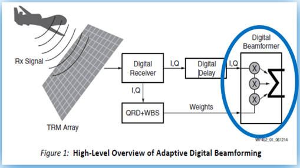
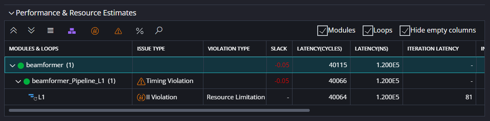
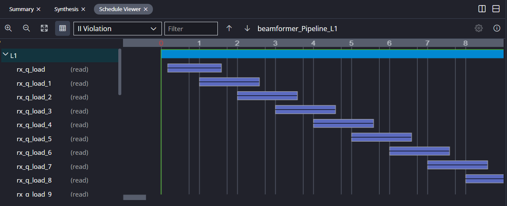
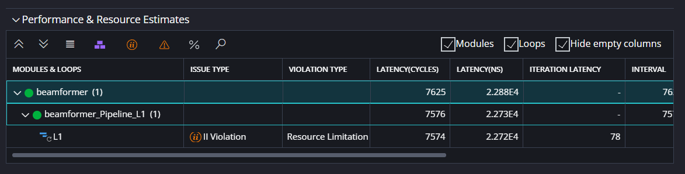
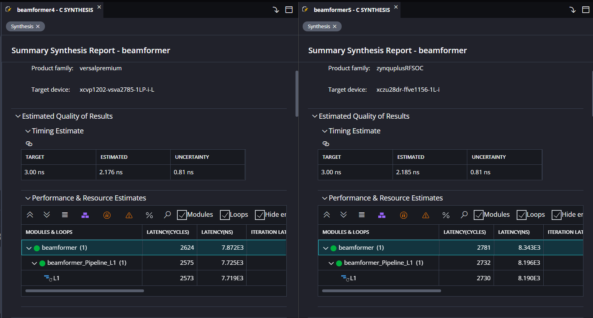

<table class="sphinxhide" width="100%">
 <tr width="100%">
    <td align="center"><h1>Vitis HLS™ Tutorials</h1>
    <a href="https://www.xilinx.com/products/design-tools/vitis/vitis-hls.html">See Vitis HLS landing page on xilinx.com</a>
    </td>
 </tr>
</table>

# HLS Micro-Optimization Tutorial using Beamformer IP

***Version: Vitis 2023.2***

## Tutorial Overview

This tutorial demonstrates the micro-optimization techniques used to increase performance for Vitis HLS designs.  The fundamental HLS pragmas used for micro-optimization are `PIPELINE`, `UNROLL`, and `ARRAY_RESHAPE` or `ARRAY_PARTITION`. This tutorial walks through the HLS analysis tools which can be used to guide the optimization process by highlighting inefficiencies and recommending pragmas.

The tutorial is based on the [Beamformer IP](../../Design_Tutorials/02-Beamformer) that is discussed in more depth in the [Design Tutorials](../../Design_Tutorials) section of the [Vitis HLS Tutorials](../../../Vitis_HLS).



That tutorial goes into more depth on the algorithm itself, whereas this tutorial will go into more depth on analysis tools and techniques used for optimization. As such, this tutorial simplifies the application by focusing on just the compute engine portion of the beamformer algorithm. The code is provided in the [reference files](./reference_files) directory:

- [beamformer.cpp](./reference_files/beamformer.cpp): C code for Beamformer design
- [beamformer.h](./reference_files/beamformer.h): Header file for Beamformer design
- [beamformer_tb.cpp](./reference_files/beamformer_tb.cpp): Testbench
- [result.golden_float.dat](./reference_files/result.golden_float.dat): Testbench simulation results used for design verification

After completing this tutorial, you will be able to:

- Build a baseline sequential version of your design that will act as a non-optimized reference point.
- Analyze the effects of applying the `PIPELINE` pragma to the outer loop of a nested loop structure and observe the automatic UNROLL that occurs to the inner loop(s).
- Use the Vitis HLS analysis views as guidance for the 'next step' required to improve performance.
- Apply the `ARRAY_RESHAPE` and/or `ARRAY_PARTITION` pragmas to improve data movement bottlenecks in your design.
- Target HLS IP to different AMD™ FPGAs and adaptive SoCs.

This tutorial will implement the compute engine portion of the beamformer with 16 RX channels, each of which has both a real and an imaginary component. In addition, the beamformer will have 3 beams. The design will be optimized to meet a performance specification and synthesized for use on a Versal™ Premium series adaptive SoC before being migrated to a Zynq™ Ultrascale+™ RFSoC device for comparison.

## Baseline and Analyze the Design Before Optimization

Before we start doing any optimization, it is helpful to start by determine the baseline performance of the design. We can confirm the functionality with a functional simulation and analyze the initial performance so we know how much optimization is required. Many users also find the optimized IP block useful - by exporting an IP block earlier, other engineers, such as a higher level system integrator can work simultaneously with the IP developer, reducing overall time to market.

To begin, we'll create a new Vitis workspace and create an HLS component with the provided beamformer code.

1. Open the Vitis Unified IDE and specify a new or existing workspace.

2. Create a new HLS Component by clicking `Create Component` under `HLS Development` in the Welcome Screen.

3. In the `Source Files` step, add the file `./reference_files/beamformer.cpp` as a Design File, add the files `./reference_files/beamformer_tb.cpp` and `./reference_files/result.golden_float.dat` as Test Bench Files, set the `Top Function` to `beamformer`, and press Next

4. In the Hardware step, set the part to the Versal Premium series device, `vp1202-vsva2785-1LP-i-L`, press next, set the clock target to `3ns`, then finish the Wizard.

5. Run and verify the results of C Simulation by pressing Run under C SIMULATION in the FLOW panel. The output should resemble the following:

``` 
  beamso_i   beamso_q
  -225.000000 1865.000000 
  -300.000000 1970.000000 
  -375.000000 2105.000000 
  beamso_i   beamso_q
  -150.000000 1790.000000 
  -225.000000 1865.000000 
  -300.000000 1970.000000 
  beamso_i   beamso_q
  -75.000000 1745.000000 
  -150.000000 1790.000000 
  -225.000000 1865.000000 
 Test passed !
 INFO: [SIM 211-1] CSim done with 0 errors.
 INFO: [SIM 211-3] *************** CSIM finish ***************
 INFO: [HLS 200-111] Finished Command csim_design CPU user time: 1 seconds. CPU system time: 1 seconds. Elapsed time: 20.18 seconds; current allocated memory: 1.480 MB.
 INFO: [HLS 200-1510] Running: close_project 
 INFO: [HLS 200-112] Total CPU user time: 3 seconds. Total CPU system time: 4 seconds. Total elapsed time: 24.896 seconds; peak allocated memory: 187.500 MB.
 INFO: [Common 17-206] Exiting vitis_hls at Wed Dec 13 15:14:09 2023...
 INFO: [vitis-run 60-791] Total elapsed time: 0h 0m 32s
 C-simulation finished successfully
 ```

By default, HLS does many optimizations to ensure a good balance of performance versus resource utilization. So, before we run C Synthesis, we want to ensure all optimizations are turned off. This can be done by editing directly in the code or by using the `HLS Directive` panel on the right hand side.

6. Open `./reference_files/beamformer.cpp` and add `#pragma HLS PIPELINE off` to loops `L1:`, `L2:`, and `L3:`, as shown here:
```
   L1:for (i=0; i<SAMPLES; i++) {
#pragma HLS LOOP_FLATTEN off
#pragma HLS PIPELINE off      
      L2: for (j=0; j<BEAMS; j++) {
#pragma HLS LOOP_FLATTEN off
#pragma HLS PIPELINE off
         si=0;
         sq=0;

         L3: for (k=0; k<CHANNELS; k++) {
#pragma HLS LOOP_FLATTEN off
#pragma HLS PIPELINE off
```
The loop flatten pragmas are already included in the unoptimized code provided, so you don't have to add them manually.

7. Run C Synthesis and open the Synthesis Report. Expand the Performance and Resource Estimates section to reveal all three nested loops:

| Modules & Loops | LATENCY(CYCLES) | LATENCY(NS) | ITERATION LATENCY | INTERVAL | TRIP COUNT |
|-----------------|-----------------|-------------|-------------------|----------|------------|
| beamformer      | 3147501         | 9.443E6     | -                 | 3147502  | -          |
| L1              | 3147500         | 9.443E6     | 1259              | -        | 2500       |
| L2              | 1257            | 3.771E3     | 419               | -        | 3          |
| L3              | 416             | 1.248E3     | 26                | -        | 16         |

The overall performance of this unoptimized design is best measured by its interval, which is 3,147,502 cycles. The interval of the top level hardware function is the number of cycles after which the function can begin a second time. In addition, we can see that the current implementation is completely sequential and therefore a good candidate for acceleration if we can properly introduce parallelism into the design. We can tell the design is sequential because the latency of each iteration of each loop is additive. Starting from loop `L3`, we can see that there are 16 iterations and each iteration has a latency of 26 clock cycles; when each iteration is run sequentially, the latency of the overall loop is 16 times 26 or 416 clock cycles. This becomes the latency of each iteration in loop `L2` plus a few extra cycles at the beginning and end of each iteration, then the pattern continues until the latency of the overall module is excessively large.

## Create a new HLS Component for Optimization

In this section, we'll start to optimize the design. Before we do this, we'll create a new component. The advantage to this is that we can apply our optimizations to the new component while keeping the existing component open and unchanged to make for easier comparisons.

8. In the VITIS COMPONENTS panel, right-click the HLS Component you created in the previous section and select `Clone Component`. 

9. Inside the newly created component, expand `Sources`, then open `beamformer.cpp`.

Note that this file is actually the same file that is being referenced by the original component. This happens when the source file is included by reference. To copy and keep separate copies of code, the code needs to be copied into the component directory and referenced locally. This is helpful if your optimizations might include code changes as well as changes to compiler. In our case, we happen to know that we won't be changing the code, so our preference is to keep just one copy of the code that all components will reference. But, that means we need to move our pragmas from the source file to the config file of the original component before optimizing the new component:

10. In the FLOW Panel, set the Component to the original component.

11. In the HLS DIRECTIVE Panel hover over one of the `HLS PIPELINE off` pragmas to highlight it, then click the pencil icon. 

12. In the Edit Directive window that opens up, select the radio icon next to `Config File`. Repeat this for all three `PIPELINE` directives.

If you wish to inspect the new location of the directives, press the gear next the the Component in the FLOW panel. That will show you the config file, `hls_config.cfg`. The compiler directives are now in that file and they will be visible in the Design Directives section of the Settings window. In addition, there is an icon at the top of that window to inspect the config file text directly. Now these compiler directives apply only to the original component because they are in a local config file instead of the shared source file. Here is a snippet of the directives in your config file for the original component:

```
syn.directive.pipeline=beamformer/L1 off
syn.directive.pipeline=beamformer/L2 off
syn.directive.pipeline=beamformer/L3 off
```

Now, when you return to the `beamformer.cpp` file, the pragmas will be removed. Then, when you return to the new component, we can apply some new optimizations.

## Optimize the design by Pipelining and Unrolling loops

Before optimizing any IP, one should start with a design goal. In the case of this Beamformer IP, the design goal is to process the Pulse Repetition Interval (PRI) of 2500 samples within 9 us. At a 3 ns clock period, or approximately 333.3 Mhz, that calculates to a maximum interval of 3000 clock cycles. If we look at the loop bounds of loop `L1` in the code, we can see that it iterates from `int i = 0` to `i = SAMPLES`, and `SAMPLES` is defined in the header as `2500`. Because the function must have an interval of less than or equal to 3000 clock cycles, we know that the loop must also have an interval of less than 3000 clock cycles. With 2500 iterations, we know that if each iteration takes 2 clock cycles, the loop interval will take at minimum 5000 iterations. Thus, in this loop, we know that each iteration must be able to execute in the very next clock cycle after the previous iteration. This metric is called the `Initiation Interval`, or `II`: the measure of the number of clock cycles in between successive iterations of the loop So, our strategy for achieving the specified performance will be to apply a `PIPELINE II=1` pragma to loop `L1` and then ensure the HLS C Synthesizer is able to meet the requested `II`.

13. In the HLS DIRECTIVE Panel, select loop `L1`, and press `+`. In the drop-down, choose the PIPELINE pragma. Switch the pragma location to Config File, and set II to `1`. Press OK. 

14. Run C Synthesis again and open the Synthesis Report. Expand the Performance and Resource Estimates section.

First, note that only one level of loop hierarchy exists. When a `PIPELINE` directive is used, Vitis HLS will infer an `UNROLL` directive on all loops within that loop scope. This is necessary to achieve the requested initiation interval. Second, notice that there is a new column called "ISSUE TYPE". In loop `L1`, the level where the Pipeline target II of 1 was applied, there is an issue labeled "II Violation", with a "Timing Violation" in the level above. We can use analysis tools to help guide us on the next steps for resolving these issues.



15. Right-click on the II violation and select "Go To II Violation"

This will bring you to the II Violation view of the Schedule Viewer. This view shows us a series of loads that were scheduled on the variable `rx_q`:



In order to achieve an II of 1, all 16 of these loads would need to occur in one clock cycle. Because they can't, the II parameter is violated and the performance target cannot be achieved. In the next section, we learn more about this issue and how to resolve it.

## Optimize interface bandwidth by reshaping or partitioning arrays

Before we proceed, now is a good time to create a new component if you want to preserve the state of the existing component. Of course, this is optional.

In the previous section, we learned that 16 loads need to occur in one clock cycle to satisfy the II=1 constraint from the pipeline pragma. We can learn more about this constraint by referring to the code. Locate the read from `rx_q[i][k]` on line 41 and recall that loop `L3` has been unrolled by the `PIPELINE` pragma on loop `L1`. This means all addresses of the second dimension of the array `k` need to be read in one clock cycle. 

The solution to this problem is to increase the size of the interface for the variable `rx_q`. By default, the interface is the size of the datatype of the array, which in this case is a `float`, or a 32-bit floating point number. The design now requires that multiple `float`s are read in one clock cycle, and this bandwidth can be provided with either the `ARRAY_RESHAPE` or `ARRAY_PARTITION` pragma, which either widen or duplicate the interface, respectively. The choice is mostly a matter of preference. In this case, we'll use the `ARRAY_RESHAPE` pragma:

16. Add the compiler directive `#pragma HLS ARRAY_RESHAPE variable=rx_q dim=2 type=complete`

By inspection of the code, we can tell that the same optimization will be required for the imaginary portion of `rx`, contained in `rx_i`, so we'll add the corresponding pragma as well:

17. Add the compiler directives `#pragma HLS ARRAY_RESHAPE variable=rx_i dim=2 type=complete`

18. Run C Synthesis once more and open the Synthesis Report to confirm the II Violation is gone, albeit replaced by another, similar II violation:



At this point, you should be familiar with the process for investigating and solving this issue. From the synthesis report, right-click the II violation to view the schedule viewer. The schedule viewer shows the load or store which causes the II violation, in this case `beamso_i`. Referencing the source code shows us a `store` operation that requires multiple stores due to an unrolled loop. 

19. Add the compiler directives `#pragma HLS ARRAY_RESHAPE variable=beamso_i dim=2 type=complete` and `#pragma HLS ARRAY_RESHAPE variable=beamso_q dim=2 type=complete`

20. Again, run C Synthesis and open the Synthesis Report to confirm the II Violation is gone and that there are no other II violations.

## Compare results 

Now that we've made a couple optimizations to the code, let's compare the results of those optimizations. If you have been creating new HLS components for each optimization, it's easy to pull up the performance numbers of each component by referencing the existing synthesis report. Otherwise, you can reference this chart:

|                   | Unoptimized | Pipeline L1 | Reshape RX  | Reshape Beam |
|-------------------|------------:|------------:|------------:|-------------:|
| SLACK (NS)        |       0.060 |      -0.054 |       0.014 |        0.014 |
| INTERVAL (CYCLES) |     3147502 |       40116 |        7626 |         2625 |
| II of Loop L1     |         N/A |          16 |           3 |            1 |
| DSP               |          16 |          18 |          96 |          288 |
| FF                |        2803 |       16274 |       27465 |        47456 |
| LUT               |        3888 |        8550 |       12551 |        11454 |

It's easy to tell that each of our optimizations had the desired effect of increasing performance as measured by the Interval of the top level hardware function. This is accomplished by way of removing bottlenecks which restrict the II of Loop L1. Originally, the Loop needs 16 cycles for the I/O to complete. By reshaping RX and Beam, Vitis HLS is able to optimize the II of the loop down to 3 and 1 respectively. Notably, the unroll pragmas on the lower level loops, which affect the complex multiply operation that utilizes the DSP primitives, were unchanged in each case. In fact, what we are seeing here is that after Vitis HLS identifies the II violation, the compiler is able to determine that the interface bandwidth is performance limiting. As such, C Synthesis culls some of the resource intensive loop unrolling because the tool understands that there will be no performance gained by allocating those user requested resources.

We should also note that the interval of the optimized code at 2625 cycles easily meets our initial target requirement of 3000 cycles.

## Design Migration

In this final section, we will highlight one of the key advantages of developing in Vitis HLS - the ability to quickly migrate a design from one AMD part to another. In our case, we will change the target device from the Versal Premium (vp1202) device we have been using to a Zynq Ultrascale+ RFSoC (ZU28DR). Then we will compare the resulting performance and resources.

In this tutorial, we'll be comparing the highest performance version of the beamformer algorithm, but you could just as easily make the comparison on a different version. One last time, feel free to clone the component you want to make comparisons to if you want to preserve the state of the existing component. This is again optional but does make it easy to do a side by side comparison, as shown in the following image:



To target the new device and generate the results shown:

21. Select the desired HLS component in the FLOW panel.

22. Click the gear to the right of the component selection drop-down.

23. Select `hls_config.cfg`

24. Under 'General', go to 'part', and either Browse to or type in `xczu28dr-ffve1156-1L-i`

25. Run C Synthesis and view the Synthesis Report

Here is a summary of the pertinent information from the two reports:

|        MODULES & LOOPS | INTERVAL (CYCLES) | DSP |     FF |    LUT |
|------------------------|-------------------|-----|--------|--------|
|         Versal Premium |              2625 | 288 |  47456 |  11454 |
| Zynq Ultrascale+ RFSoC |              2782 | 576 | 177434 | 111181 |

With no change to the HLS C code or compiler directives, we can a significant increase to the resource utilization of this design and a minor decrease in performance when targeting the previous generation part.

The performance decrease comes from the increase in latency of the complex multiply. In both cases, the II of loop `L1` remains equal to 1. However, the iteration latency increases due the to less efficient DSP48 architecture. The latency of the loop is then equal to the quantity loop Trip Count multiplied by II, plus the iteration latency incurred waiting for the last iteration of the loop to finish. This causes the overall decrease in performance of the application. Note - the `PIPELINE` pragma does have the ability to start the next loop transaction without waiting for the pipeline to flush; this is possible with the `rewind` option. The rewind option will have no affect on latency but will decrease II, thus increasing the throughput.

Targeting the Ultrascale+ part had a larger impact on utilization. As you can see, the resources required by the ZU28 are on average 4x more than for Versal: DSP utilization increased by about 2X, FF utilization increased by about 4X and LUT utilization increase by almost 10X. This is due to the more efficient DSP58 primitive on the Versal Premium device compared to the DSP48 primitive on the Zynq Ultrascale+ device. In the native floating-point mode, the DSP58 can compute a floating point multiply accumulate with just one DSP primitive. The DSP48 in ZU+ has only a fixed-point mode and must, therefore, use significantly more resources to implement complex multiple of  data type. On average, DSP58 devices are 4 times more compute efficient compared to DSP48 devices. 

## Summary

In this tutorial, we have explored advanced micro-optimization techniques in Vitis HLS, focusing on the Beamformer IP. The key takeaways are:
- Demonstrating a step-by-step process for enhancing performance in HLS designs, using the Beamformer IP as a practical example.
- Understanding and applying crucial HLS pragmas: `PIPELINE`, `UNROLL`, and `ARRAY_RESHAPE` or `ARRAY_PARTITION`.
- Leveraging HLS analysis tools for identifying optimization opportunities and applying pragmas effectively.
- Emphasizing the significance of the `PIPELINE` pragma and inferred `UNROLL` pragmas in introducing parallelism and improving loop efficiency.
- Utilizing `ARRAY_RESHAPE` and `ARRAY_PARTITION` pragmas to address data movement bottlenecks.
- Showcasing the versatility of Vitis HLS in quickly re-targeting IP to various AMD FPGA and adaptive SoC platforms
- Achieving a significant performance boost from an unoptimized design to an optimized one, meeting specific design goals.

By the end of this tutorial, you should be adept at applying these HLS directives to enhance the performance of your designs, understand the impact of each optimization, and be capable of migrating designs across different hardware platforms.

</br>
<hr/>
<p align="center" class="sphinxhide"><b><a href="/README.md">Return to Main Page</a></b></p>

<p class="sphinxhide" align="center"><sub>Copyright © 2020–2023 Advanced Micro Devices, Inc</sub></p>

<p class="sphinxhide" align="center"><sup><a href="https://www.amd.com/en/corporate/copyright">Terms and Conditions</a></sup></p>
