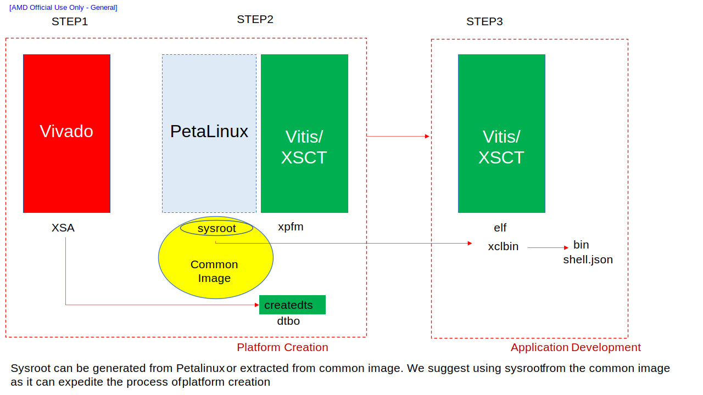

<!--
# Copyright 2021 Xilinx Inc.
#
# Licensed under the Apache License, Version 2.0 (the "License");
# you may not use this file except in compliance with the License.
# You may obtain a copy of the License at
#
#     http://www.apache.org/licenses/LICENSE-2.0
#
# Unless required by applicable law or agreed to in writing, software
# distributed under the License is distributed on an "AS IS" BASIS,
# WITHOUT WARRANTIES OR CONDITIONS OF ANY KIND, either express or implied.
# See the License for the specific language governing permissions and
# limitations under the License.
-->

<table class="sphinxhide" width="100%">
 <tr width="100%">
    <td align="center"><h1>Vitis™ Platform Creation Tutorials</h1>
    <a href="https://www.xilinx.com/products/design-tools/vitis.html">See Vitis™ Development Environment on xilinx.com </a>
    </td>
 </tr>
</table>

# Vitis Custom Embedded Platform Creation Example on KV260

***Version: Vitis 2021.1***

[Kria KV260 Vision AI Starter Kit](https://www.xilinx.com/products/som/kria/kv260-vision-starter-kit.html) is the development platform for Kria K26 SOM. The KV260 is built for advanced vision application development without requiring complex hardware design knowledge. It's based on the UltraScale+ MPSoC technology similar to ZCU104 evaluation board. In this example, we will extend the [ZCU104 custom embedded platform creation example](../../Introduction/02-Edge-AI-ZCU104/) to KV260 Vision AI Starter Kit.

To highlight the differences between KV260 and ZCU104, this example will simplify the descriptions of general steps that are shared between all MPSoC platforms, but add more KV260 specific contents. If you have question in some steps, please cross reference [ZCU104 custom embedded platform creation example](../../Introduction/02-Edge-AI-ZCU104/) or ask questions in Github Issues page.

> Note: Since KV260 BSP only releases 2021.1 version, this tutorial will skip 2021.2. The next release for this tutorial would be 2022.1.

> Note: It's validated in [Pull Request #174](https://github.com/Xilinx/Vitis-Tutorials/pull/174) by Victor that if you update [system_step1.tcl](./ref_files/step1_vivado/system_step1.tcl) line 36 from 2021.1 to 2021.2, the design would work well with Vitis 2021.2.

## Custom Platform Planning

The platform we create should be able to run these applications finally

- Vitis acceleration examples like Vector Addition
- Vitis-AI applications will be available in the future.

The hardware design of the platform would provide basic support for Vitis acceleration. It's similar to the ZCU104 example.

In regards of software setup, we will inherit what KV260 BSP provides, e.g. the device tree, kernel and rootfs settings.

## Kria SOM Architecture and Vitis Acceleration Considerations

Kria SOM has some ease-of-use designs for application developers. It provides software-like development experience on FPGA and SoC, such as real time reloading applications without rebooting the system. In order to allow updating PL design without rebooting Linux, it boots Linux from ARM Cortex-A53 and loads FPGA bitstream using Linux. To ensure the board can always boot successfully and prevent the board get into brick status by accidental mistakes, Kria SOM boot flow forces to boot Linux from QSPI mode and the boot firmware in QSPI is read only. Linux will mount rootfs in the SD card. User can update the rootfs in the SD Card.

If you have read the [Platform Creation Introduction Tutorials](../../Introduction), you have known that the Vitis platform and application development can be divided into these steps:

1. Platform hardware creation in Vivado. It exports an XSA file with clock, reset, AXI interface and interrupt signals and properties.
2. Platform software preparation with PetaLinux, including Linux kernel, rootfs, device tree and boot components.
3. Platform creation in Vitis to combine all hardware and software components and generate XPFM description.
4. Create applications in Vitis against the platform. Vitis generates host application, xclbin and sd_card.img.
5. Write sd_card.img to SD card or update host application and xclbin to an existing SD card.

Since Kria SOM Starter Kit provides an off-the-shelf boot image and has its enhanced boot sequence, Vitis platform developers and application developers can skip some steps above. Here is a summary for what needs to be done by Kris platform and acceleration application developers.

| Procedure              | Required Actions                                                     | Output                                                  | Skipped Actions   |
| ---------------------- | -------------------------------------------------------------------- | ------------------------------------------------------- | ----------------- |
| Platform Hardware      | Same as step 1                                                       | XSA                                                     | N/A               |
| Platform Software      | Same as step 2; Generate device tree overlay for platform PL of XSA; | pl.dtsi, sysroot | N/A               |
| Platform Creation      | Same as step 3                                                       | Platform (XPFM)                                         | N/A               |
| Application Creation   | Same as step 4; convert system.bit to bit.bin; Genreate dtbo         | Host App, XCLBIN, bit.bin, dtbo                         | N/A               |
| Transfer files and run | Use scp to copy generated files to Linux partition on SD card       |                                                         | Write sd_card.img |

> Note: In step 2, though PetaLinux can generate a lot of output components, the only valuable output product is this case is sysroot. It's used for host application cross-compilation. Since the boot images of KV260 Starter Kit is fixed, user doesn't need to generate any boot components, e.g., FSBL, etc.

The following chapters will explain the details about these steps.

## Step-by-Step Tutorial

We'll introduce the platform creation steps in the following pages. Each page describes one major step in the platform creation process.

- [Step 1: Create the Vivado Hardware Design and Generate XSA](./step1.md)
- [Step 2: Create the Software Components with PetaLinux](./step2.md)
- [Step 3: Create the Vitis Platform](./step3.md)
- [Step 4: Test the Platform](./step4.md)

***Let's start from [step 1: Vivado Design](./step1.md).***

## References

- [UG1393: Vitis Acceleration Flow User Guide](https://www.xilinx.com/html_docs/xilinx2021_1/vitis_doc/index.html)
  - [Platform Creation General Rules](https://www.xilinx.com/html_docs/xilinx2021_1/vitis_doc/vcm1596051749044.html)
  - [Setting up the Vitis environment](https://www.xilinx.com/html_docs/xilinx2021_1/vitis_doc/settingupvitisenvironment.html)
  - [Installing Xilinx Runtime](https://www.xilinx.com/html_docs/xilinx2021_1/vitis_doc/pjr1542153622642.html)
- Platform Examples
  - [zcu102](https://github.com/Xilinx/Vitis_Embedded_Platform_Source/tree/2021.1/Xilinx_Official_Platforms/zcu102_base) and [zcu104](https://github.com/Xilinx/Vitis_Embedded_Platform_Source/tree/2021.1/Xilinx_Official_Platforms/zcu104_base) base platform source code in [Vitis Embedded Platform Source GitHub Repository](https://github.com/Xilinx/Vitis_Embedded_Platform_Source)
- [Xilinx Run Time (XRT)](https://xilinx.github.io/XRT/master/html/index.html)
- [Vitis-AI GitHub Repository](https://github.com/Xilinx/Vitis-AI)

Copyright&copy; 2021 Xilinx

