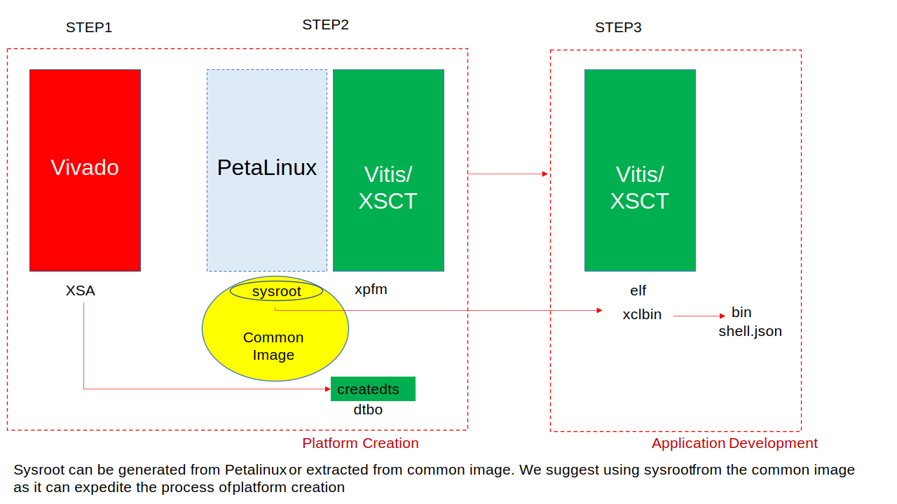

<table class="sphinxhide" width="100%">
 <tr width="100%">
    <td align="center"><h1>Vitis™ Platform Creation Tutorials</h1>
    <a href="https://www.xilinx.com/products/design-tools/vitis.html">See Vitis™ Development Environment on xilinx.com </a>
    </td>
 </tr>
</table>

# Vitis Custom Embedded Platform Creation Example on KV260

***Version: Vitis 2023.1***

The [AMD Kria™ KV260 Vision AI Starter Kit](https://www.xilinx.com/products/som/kria/kv260-vision-starter-kit.html) is the development platform for Kria K26 SOM. The KV260 is built for advanced vision application development without requiring complex hardware design knowledge. It is based on the AMD UltraScale+™ MPSoC technology similar to ZCU104 evaluation board. In this example, you will extend the [ZCU104 custom embedded platform creation example](../02-Edge-AI-ZCU104/) to KV260 Vision AI Starter Kit.

To highlight the differences between KV260 and ZCU104, this example will simplify the descriptions of general steps that are shared between all MPSoC platforms, but add more KV260 specific contents. If you have question in some steps, cross reference [ZCU104 custom embedded platform creation example](../02-Edge-AI-ZCU104/), or ask questions in Github Issues page.

For your reference, this example total system structure is similar to the following figure.

## Custom Platform Planning

The platform you create should be able to run these applications:

- Vitis acceleration examples like Vector Addition.
- Vitis-AI applications will be available in the future.

The hardware design of the platform would provide basic support for Vitis acceleration. It is similar to the ZCU104 example.

In regards of software setup, you will use the common image because it can expedite the process of platform creation.

## Kria SOM Architecture and Vitis Acceleration Considerations

Kria SOM has some ease-of-use designs for application developers. It provides software-like development experience on FPGA and SoC, such as real time reloading applications without rebooting the system. In order to allow updating PL design without rebooting Linux, it boots Linux from Arm® Cortex®-A53 and loads the FPGA bitstream using Linux. To ensure the board can always boot successfully and prevent the board get into brick status by accidental mistakes, the Kria SOM boot flow forces to boot Linux from QSPI mode and the boot firmware in QSPI is read-only. Linux will mount rootfs in the SD card. You can update the rootfs in the SD Card.

Vitis platform and application development can be divided into these parts:

1. Platform hardware creation in the AMD Vivado™ Design Suite. It exports an XSA file with clock, reset, AXI interface, and interrupt signals and properties.
2. Platform software preparation with common image or using PetaLinux tool, including Linux kernel, rootfs, device tree, and boot components.
3. Platform creation in the Vitis to combine all hardware and software components and generate XPFM description.
4. Create applications in Vitis against the platform. Vitis generates host application, xclbin and `sd_card.img`.
5. Write the `sd_card.img` to SD card or update host application and xclbin to an existing SD card.

Because the  Kria SOM Starter Kit provides an off-the-shelf boot image and has its enhanced boot sequence, Vitis platform developers and application developers can skip some steps above. Here is a summary for what needs to be done by Kria platform and acceleration application developers.

| Procedure              | Required Actions                                                                           | Output                    | Skipped Actions                 |
| ---------------------- | ------------------------------------------------------------------------------------------ | ------------------------- | ------------------------------- |
| Platform Hardware      | Same as step 1                                                                             | XSA                       | N/A                             |
| Platform Creation      | Same as step 2; generate the device tree overlay for platform programmable logic (PL) of XSA; create Vitis platform | pl.dtbo, sysroot and XPFM | Skip adding the boot components |
| Application Creation   | Same as step 3; Create application                                                         | Host App, XCLBIN          | skip generating the sd_card.img |
| Transfer files and run | Use scp to copy generated files to Linux partition on SD card                              |                           | skip writing sd_card.img        |

> **NOTE:** In step 2, after extracting the common image there are a lot of output components, the only valuable output product in this case is sysroot. It is used for host application cross-compilation. Because the boot images of KV260 Starter Kit is fixed, you do not need to generate any boot components, e.g., FSBL, etc.

> **NOTE:** In this case, we assume you start to do this experiment after you have already had your board booted up successfully. If you do not, refer to [kv260 getting started page](https://www.xilinx.com/products/som/kria/kv260-vision-starter-kit/kv260-getting-started/getting-started.html).

The following chapters will explain the details about these steps.

## Step-by-Step Tutorial

The platform creation steps are introduced in the following pages. Each page describes one major step in the platform creation process.

- [Step 1: Create the Vivado Hardware Design and Generate XSA](./step1.md)
- [Step 2: Create the Vitis Platform](./step2.md)
- [Step 3: Test the Platform](./step3.md)
- [Iteration Guidelines](./Iteration_guideline.md)
           

***Start from [Step 1: Vivado Design](./step1.md).***

## References

- [UG1393: Vitis Acceleration Flow User Guide](https://www.xilinx.com/html_docs/xilinx2021_1/vitis_doc/index.html)
  - [Platform Creation General Rules](https://www.xilinx.com/html_docs/xilinx2021_1/vitis_doc/vcm1596051749044.html)
  - [Setting up the Vitis environment](https://www.xilinx.com/html_docs/xilinx2021_1/vitis_doc/settingupvitisenvironment.html)
  - [Installing Xilinx Runtime](https://www.xilinx.com/html_docs/xilinx2021_1/vitis_doc/pjr1542153622642.html)
- Platform Examples
  - [zcu102](https://github.com/Xilinx/Vitis_Embedded_Platform_Source/tree/2023.1/Xilinx_Official_Platforms/xilinx_zcu102_base) and [zcu104](https://github.com/Xilinx/Vitis_Embedded_Platform_Source/tree/2023.1/Xilinx_Official_Platforms/xilinx_zcu104_base) base platform source code in [Vitis Embedded Platform Source Github Repository](https://github.com/Xilinx/Vitis_Embedded_Platform_Source)
- [Xilinx Run Time (XRT)](https://xilinx.github.io/XRT/master/html/index.html)
- [Vitis-AI GitHub Repository](https://github.com/Xilinx/Vitis-AI)

Copyright © 2020–2023 Advanced Micro Devices, Inc

<a href="https://www.amd.com/en/corporate/copyright">Terms and Conditions</a>

