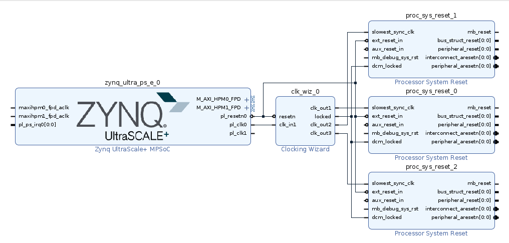

<table class="sphinxhide" width="100%">
 <tr width="100%">
    <td align="center"><h1>2023.1 Vitis™ Platform Creation Tutorials</h1>
    <a href="https://www.xilinx.com/products/design-tools/vitis.html">See Vitis™ Development Environment on xilinx.com</br></a>
    </td>
 </tr>
</table>

# Step 1: Create the Vivado Hardware Design and Generate XSA

In this step, you will create the hardware design for the KV260 Vitis acceleration platform. You will start from a KV260 preset design, add platform required peripherals, and configure them. After everything is set, You will export the hardware design to XSA.

## Create Base Vivado Project from Preset

1. Create a workspace and launch the AMD Vivado™ Design Suite.

   Run the following commands in Linux console.

   ```bash
   mkdir WorkSpace
   cd WorkSpace
   source <Vitis_Install_Directory>/settings64.sh
   vivado &
   ```

2. Create a Vivado project named **kv260_hardware_platform**.

   - Select **File->Project->New**, Click **Next**.
   - In Project Name dialog, set Project name to **kv260_hardware_platform**, and keep **Create project subdirectory** checked. Then, click **Next**.
   - Enable **Project is an extensible Vitis platform**. Click **Next**.

      

   - Select **Boards** tab.
   - Click **Refresh** button to load the latest list of boards.
   - Select **Kria KV260 Vision AI Starter Kit**.
   - Click **Connections**, click drop-down button and select **Vision AI Starter Kit carrier card**, click OK.
      

   - Click **Next**.
   - Review project summary and click **Finish**

   > **NOTE:** If you need to change an existing Vivado project to an extensible platform project, you can go to **Settings** in **Flow Navigator** in an opened Vivado design, go to **General** and enable **project is an extensible Vitis platform**

3. Create a block design.

   - In **Project Manager**, under **IP INTEGRATOR**, select **Create Block Design**.
   - (Optional) Change the design name to **system**.
   - Click **OK**.

4. Add MPSoC IP, and run block automation to configure it.

   - Right-click the Diagram view, and select **Add IP**.
   - Search for `zynq`, and then double-click the **Zynq UltraScale+ MPSoC** from the IP search results.
   - Click the **Run Block Automation** link to apply the board presets.
      In the Run Block Automation dialog, ensure the following is marked:

      - All Automation
      - Zynq_ultra_ps_e_0
      - Apply Board Presets

   - Click **OK**. You should get MPSoC block configured similar to the following:

   

**What Just Happened?**

At this stage, the Vivado block automation has added an AMD Zynq™ UltraScale+™ MPSoC block and applied all board presets for the KV260. The presets includes MPSoC PS block configurations and pin assignments.

### Customize System Design for Clock and Reset

V++ linker can automatically link the clock signals between kernel and platform. The available clock signals in the platform are exported by **PFM.CLK** property.

For simple designs, interrupt signals can be sourced by processor's **pl_clk**. The limitation is that the processor has maximum four `pl_clks` and their phase is not aligned.

To supply more interrupt signals, or to supply phase aligned clocks, you can use **Clocking Wizard**.

You will add the **Clocking Wizard** to the block diagram and enable clock signals for the platform.

1. Add the clocking wizard block to generate three clocks:

   - Right-click Diagram view, and select **Add IP**.
   - Search for, and add a **Clocking Wizard** from the IP Search dialog.
   - Double-click the **clk_wiz_0** IP block to open the Re-Customize IP dialog box.
   - Click the **Output Clocks** tab.
   - Enable clk_out1 through clk_out3 in the Output Clock column. Set the **Requested Output Freq** as follows:

      - **clk_out1** to **100** MHz
      - **clk_out2** to **200** MHz
      - **clk_out3** to **400** MHz

   - At the bottom of the dialog box, set the **Reset Type** to **Active Low**.

      

   - Click **OK** to close the dialog.

   >**NOTE:** Now you have set up the clock system for your design. This clock wizard uses the `pl_clk` as input clock and generates clocks needed for the whole logic design. In this straightforward design, you would use 100 MHz clock as the axi_lite control bus clock. 200 MHz and 400 MHz clocks are reserved for data-processing unit (DPU) AXI interface clock and DPU core clock during design linking phase. You are free to change the clock quantities and frequency to fit your target design. You will setup the clock export in future steps. First, you need to create reset signals for each clock because they are needed in clock export setup.

1. Add three Processor System Reset blocks corresponding to the three clocks:

   - Right-click Diagram view, and select **Add IP**.
   - Search for and add a **Processor System Reset** from the IP Search dialog.
   - Rename the reset block to **proc_sys_reset_1** so that it is easy to understand the relationship between reset modules and the clock signals.
   - Select the **proc_sys_reset_1** block, type Ctrl-C and Ctrl-V to replicate two modules. They are named as **proc_sys_reset_2** and **proc_sys_reset_3** by default.

1. Connect the clocks and resets:

   - Click **Run Connection Automation**, which will open a dialog that will help connect the `proc_sys_reset` blocks to the clocking wizard clock outputs.
   - Enable All Automation on the left side of the Run Connection Automation dialog box.
   - Select **clk_in1** on `clk_wiz_0`, and set the Clock Source to **/zynq_ultra_ps_e_0/pl_clk0**.
   - For each **proc_sys_reset** instance, select the **slowest_sync_clk**, and set the Clock Source as follows:

      - **proc_sys_reset_1** with **/clk_wiz_0/clk_out1**
      - **proc_sys_reset_2** with **/clk_wiz_0/clk_out2**
      - **proc_sys_reset_3** with **/clk_wiz_0/clk_out3**

   - On each `proc_sys_reset` instance, select the **ext_reset_in**, set **Board Part Interface** to **Custom**, and set the **Select Manual Source** to **/zynq_ultra_ps_e_0/pl_resetn0**.
   - Make sure all checkboxes are enabled, and click **OK** to close the dialog and create the connections.
   - Connect all the **dcm_locked** signals on each `proc_sys_reset` instance to the locked signal on **clk_wiz_0**.

      

1. Enable clocks for the platform

   - Go to **Platform Setup** tab. If it is not opened yet, select **Window -> Platform Setup** to open it.
   - Click **Clock** tab
   - Enable all clocks under clk_wiz_0: **clk_out1**, **clk_out2**, **clk_out3**.
   - Change their ID to **0**, **1** and **2**.
   - Set a default clock: click **Is Default** for **clk_out2**.
   - After everything is setup, it should report **Info: No problem with Clock interface**.

      

   >**NOTE:** There should be one and only one default clock in the platform. The v++ linker will use the default clock to connect the IP blocks if there are no user assignments for link configuration.

### Add Interrupt Support

The v++ linker can automatically link the interrupt signals between kernel and platform. The available interrupt signals in the platform are exported by **PFM.IRQ** property.

For simple designs, interrupt signals can be sourced by processor's **pl_ps_irq**. The limitation is that it can only supply maximum 16 interrupt signals. To supply more interrupt signals, you can use **AXI Interrupt Controller**. You will enable **AXI HPM0 LPD** to control the **AXI Interrupt Controller**, add the **AXI Interrupt Controller** and enable interrupt signals for **PFM.IRQ**.

1. Enable **AXI HPM0 LPD** to control the **AXI Interrupt Controller**

   - In the block diagram, double-click the **Zynq UltraScale+ MPSoC** block.
   - Select **PS-PL Configuration > PS-PL interfaces > Master interface**.
   - Enable the **AXI HPM0 LPD** option.
   - Expand the arrow before **AXI HPM0 LPD**. Check the **AXI HPM0 LPD Data width** settings and keep it as default **32**.
   - Disable **AXI HPM0 FPD** and **AXI HPM1 FPD**
   - Click **OK** to finish the configuration.

   >**NOTE:**
   >
   >- Use **AXI HPM0 LPD** for controlling purpose. It would read and write 32-bit control registers. If the interface is more than 32, AXI Interconnect or SmartConnect will do AXI bus width conversion using PL logic. It would cost logic resource and introduce unnecessary latency.
   > - Reserve **AXI HPM0 FPD** and **AXI HPM1 FPD** for kernel usage. Disabling them from the block diagram can prevent auto connection to use it by accident. You can export the unused AXI interfaces in Platform Setup, no matter it is visible in the block diagram or not.

2. Add the **AXI Interrupt Controller** and configure it.

   - Right-click Diagram view, and select **Add IP**, search and add **AXI Interrupt Controller** IP. It is instantiated as **axi_intc_0**.
   - Double-click the AXI Interrupt Controller block, change **Interrupt Output Connection** to **Single** so that it can be connected to PS IRQ interface.
   - Click **OK**.

3. Connect AXI Interfaces of `axi_intc_0` to AXI HPM0 LPD of PS.

   - Click **Run Connection Automation**.
   - Review the settings (**axi_intc_0** is enabled, **s_axi** Master interface is to be connect to **/zynq_ultra_ps_e_0/M_AXI_HPM0_LPD**).
   - Set **Clock Source for Slave Interface** and **Clock Source for Master Interface** to **/clk_wiz_0/clk_out2(200 MHz)**.
   - Click **OK**.

   >**NOTE:** You wish interrupt controller and most kernel IRQ signals are synchronous to one clock. It is best for stability. But do not worry about the asynchronous IRQ if kernels are running at different clocks. The interrupt controller can manage asynchronous IRQ with level interrupt signals as well.

4. Connect irq of the Interrupt Controller

   - Connect **axi_intc_0.irq** to **zynq_ultra_ps_e_0.pl_ps_irq[0:0]**

      The IPI design connection would like the following until now:

      

   > **NOTE:** If you have more than one `irq` signals to connect to `pl_ps_irq` of PS, use a **concat** IP to concatenate them to a bus and then connect the bus to `pl_ps_irq`.

5. Enable interrupt signals for the platform.

   - Go to the Platform Setup tab.
   - Go to the Interrupt tab.
   - Enable intr under axi_intc_0.

### Enable AXI Interfaces for the Platform

1. Enable AXI Master interfaces from the processing system (PS).

   - Go to **Platform Setup** tab.
   - Go to **AXI Port** tab in Platform Setup.
   - Under **zynq_ultra_ps_e_0**, enable **M_AXI_HPM0_FPD** and **M_AXI_HPM1_FPD**. Keep the Memport and sptag default to M_AXI_GP and empty.

   >**NOTE:**
   >
   >- M_AXI_GP means general purpose AXI Master interface.
   >- sptag is only applicable to AXI slave interfaces.
   >- The v++ linker will instantiate AXI Interconnect automatically to connect between PS AXI Master interfaces and slave interfaces of acceleration kernels. One AXI Master interface will connect up to 16 kernels.

2. Enable AXI Master interfaces from AXI Interconnect.

   - Under ps8_0_axi_periph, click M01_AXI, press Shift and click M07_AXI to multi-select master interfaces from M01_AXI to M07_AXI.
   - Right click the selection and click on **Enable**.
   - Keep the Memport and sptag default to M_AXI_GP and empty.

   >**NOTE:**
   >
   >- v++ will not cascade another level of AXI Interconnect if the AXI master interface is exported from AXI Interconnect IP.
   >- AXI Master interfaces from PS and AXI Interconnect are functionally equivalent to the platform.
   >- In general, platform designer should export as many as AXI interfaces to the platform. The application developer should decide which interface to use.

3. Enable AXI Slave interfaces from PS to allow kernels access DDR memory.

   - Under zynq_ultra_ps_e_0, multi-select all AXI slave interfaces: press **Ctrl** and click **S_AXI_HPC0_FPD**, **S_AXI_HPC1_FPD**, **S_AXI_HP0_FPD**, **S_AXI_HP1_FPD**, **S_AXI_HP2_FPD**, **S_AXI_HP3_FPD**.
   - Right click the selections and select **enable**.
   - Change Memport of **S_AXI_HPC0_FPD** and **S_AXI_HPC1_FPD** to **S_AXI_HP** because we will not use any coherent features for these interfaces.
   - Type in simple sptag names for these interfaces so that they can be selected by v++ configuration during linking phase. **HPC0**, **HPC1**, **HP0**, **HP1**, **HP2**, **HP3**.

      

### Modify the IP address in address editor (Optional)

   >Note: This step is not mandatory for platform creation. Please refer to it according to your requirement.

   If users need to modify the IP address please go through following steps.
   1. Check the location address space of your IP 
   2. Go to address editor by clicking **Window**-> **Address editor** to open it.

   Next, we will use the example of modifying the interrupt controller IP address to illustrate how to modify the IP address in the address editor.

   - As the interrupt controller is connected with **M_AXI_HPM0_LPD** domain, we need check LPD domain supported address space. Please check the [ZYNQMP Technical Reference Manual](https://docs.xilinx.com/r/en-US/ug1085-zynq-ultrascale-trm/PL-AXI-Interface). You could find following address range. That means the IP connected to LPD domain could be placed in 0x8000_0000-0x9FFF_FFFF address space. But conflict is not allowed.

      

   - Go to address editor, modify the interrupt controller IP base address according to your requirement.

      
      
   >Note: The modified base address should be in the LPD address space and the high address should also be in the LPD address space.
### Export Hardware XSA

1. Validate the block design

   - Click the **Validate Design** button in the block design Diagram window

   **Note**: During validation, Vivado reports a critical warning that **/axi_intc_0/intr** is not connected. This warning can be safely ignored because v++ linker will link kernel interrupt signals to this floating intr signal.

   ```bash
   CRITICAL WARNING: [BD 41-759] The input pins (listed below) are either not connected or do not have a source port, and they do not have a tie-off specified. These pins are tied-off to all 0's to avoid error in Implementation flow.
   Please check your design and connect them as needed: 
   /axi_intc_0/intr
   ```

2. Create a top module wrapper for the block design.

   - In **Source** tab, right click **system.bd** in Design Sources group
   - Select **Create HDL Wrapper...**.
   - Select **Let Vivado manage wrapper and auto-update**.
   - Click **OK** to generate wrapper for block design.

3. Generate the design.

   - Select **Generate Block Design** from Flow Navigator.
   - Select **Synthesis Options** to **Global**. It will skip IP synthesis during generation.
   - Click **Generate**.
   - Click **Generate Bitstream** in Flow Navigator window.
   - Click **Yes**.

4. Export the platform.

   - Click menu **File -> Export -> Export Platform** to launch the **Export Hardware Platform** wizard. This wizard can also be launched by **Export Platform** button in **Flow Navigator** or **Platform Setup** window.
   - Click Next in the first information page.
   - Select Platform Type: **Hardware and Hardware Emulation**, click Next. If you skipped the emulation setup previously, select **Hardware** here.
   - Select Platform State: **Pre-synthesis**, enable **Include Bitstream**, click Next
   - Input Platform Properties and click **Next**. For example,
     - Name: kv260_hardware_platform
     - Vendor: xilinx
     - Board: kv260
     - Version: 0.0
     - Description: This platform provides high PS DDR bandwidth and three clocks: 100MHz, 200MHz and 400MHz.
   - Fill in XSA file name: **kv260_hardware_platform** and keep the export directory as default.
   - Click **Finish**. **kv260_hardware_platform.xsa** will be generated. The export path is reported in the Tcl console.

   >**NOTE:** You enable Include Bitstream to fulfill the requirement of the `fpga-manager-util` package in PetaLinux.

   Alternatively, the above export can be done in Tcl scripts

   ```tcl
   # Setting platform properties
   set_property platform.default_output_type "sd_card" [current_project]
   set_property platform.design_intent.embedded "true" [current_project]
   set_property platform.design_intent.server_managed "false" [current_project]
   set_property platform.design_intent.external_host "false" [current_project]
   set_property platform.design_intent.datacenter "false" [current_project]
   # Write pre-synthesis expandable XSA
   write_hw_platform -include_bit -force -file ./kv260_hardware_platform.xsa
   ```

### Next Step

Now you finish the Hardware platform creation flow, then you should go to the [Step 2: Vitis Platform Creation](./step2.md)

<p class="sphinxhide" align="center"><sub>Copyright © 2020–2023 Advanced Micro Devices, Inc</sub></p>

<p class="sphinxhide" align="center"><sup><a href="https://www.amd.com/en/corporate/copyright">Terms and Conditions</a></sup></p>
