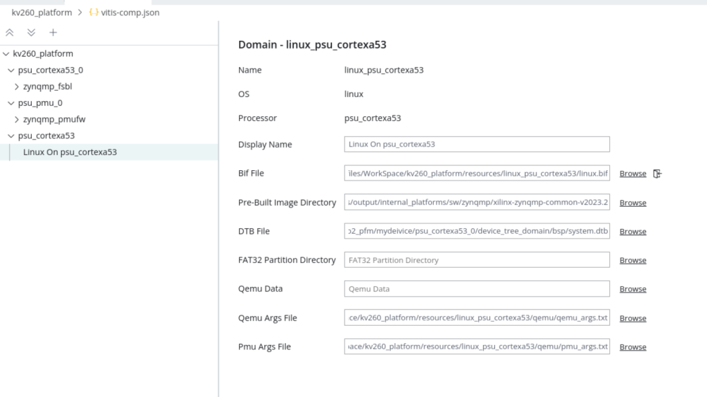

<table class="sphinxhide" width="100%">
 <tr width="100%">
    <td align="center"><h1>2024.1 Vitis™ Platform Creation Tutorials</h1>
    <a href="https://www.xilinx.com/products/design-tools/vitis.html">See Vitis™ Development Environment on xilinx.com</br></a>
    </td>
 </tr>
</table>

# Step 2: Create the Vitis Platform

In this step, you will create a Vitis platform running a Linux operation system. The Vitis platform requires several software components which need to be prepared in advance. Due to the boot flow differences between KV260 and base platforms for AMD evaluation boards like ZCU104, platform developer needs to prepare one additional DTBO file besides the normal software components for Vitis platforms because device tree file of programmable logic (PL) side depends on the hardware design and is loaded after Linux boots up. In addition, application developers need to add this DTBO file to the application deployment package as well. The other software components generation flow is similar to the flow described in the [ZCU104 tutorial](../02-Edge-AI-ZCU104/step2.md). However, in this case, the valuable software component is sysroot,which is used for host application cross-compilation. So you will go on utilizing the common image which provides the sysroot and expedite the process of platform creation.

### Prepare the Common Image

1. Download common image from [Xilinx website download page.](https://www.xilinx.com/support/download.html). Go to the **WorkSpace** folder you created in step 1, and place the image package in **WorkSpace** folder.

   ```bash
   cd WorkSpace
   tree -L 1     # to see the directory hierarchy
   ├── kv260_hardware_platform
   └── xilinx-zynqmp-common-v2024.1.tar.gz
   ```

2. Extract the common image.


   ```bash
   cd WorkSpace
   tar xvf ../xilinx-zynqmp-common-v2024.1.tar.gz -C .
   ```

   You can see **xilinx-zynqmp-common-v2024.1** folder which contains the components located in **WrokSpace** folder.

   ```bash
   tree -L 2
   ├── xilinx-zynqmp-common-v2024.1
   │   ├── bl31.elf
   │   ├── boot.scr
   │   ├── Image
   │   ├── README.txt
   │   ├── rootfs.ext4
   │   ├── rootfs.manifest
   │   ├── rootfs.tar.gz
   │   ├── sdk.sh
   │   └── u-boot.elf
   ```

From the above picture, you can see SDK tool and other components are ready.

### Generate Software Components from the KV260 Starter Kit BSP(Optional)

If you need to do system customization, take the following steps as reference. For more advanced tweaks, like kernel or uboot customization, refer to the [PetaLinux customization page](../../Feature_Tutorials/02_petalinux_customization/README.md) for reference.

<details>

<summary><strong>Click for Detailed Steps</strong></summary>  

1. Check the [AMD Kria™ K26 SOM wiki](https://xilinx-wiki.atlassian.net/wiki/spaces/A/pages/1641152513/Kria+K26+SOM), and download the BSP package from the following link: <https://www.xilinx.com/member/forms/download/xef.html?filename=xilinx-k26-starterkit-v2024.1-final.bsp>

   Save it to **WorkSpace** directory.

2. Set up the PetaLinux environment.

    ```bash
    cd WorkSpace
    mkdir kv260_petalinux
    cd kv260_petalinux
    source <petaLinux_tool_install_dir>/settings.sh
    ```

3. Update the PetaLinux eSDK to enable the recipes needed by the Starter Kit SOM BSP.

    ```bash
    petalinux-upgrade -u 'http://petalinux.xilinx.com/sswreleases/rel-v2004/sdkupdate/' -p 'aarch64'
    ```

4. Create PetaLinux with the Starter Kit SOM BSP, and the XSA export from step 1.

    ```bash
    petalinux-create --type project -s xilinx-kv260-starterkit-v2024.1-final.bsp
    cd xilinx-kv260-starterkit-2024.1
    petalinux-config --get-hw-description=<vivado_design_dir> --silent  
    ```

5. Add XRT to rootfs.

    KV260 PetaLinux BSP does not enable Xilinx Runtime (XRT) because it installs XRT with an overlay. To create sysroot for application developer cross compiling, enable XRT in the rootfs. All the XRT required libraries are packaged into one group.

    - Run `petalinux-config -c rootfs` to launch rootfs configuration window.
    - Go to **Petalinux Package Groups -> packagegroup-petalinux-vitis-acceleration-essential**.
    - Enable `packagegroup-petalinux-vitis-acceleration-essential` and `packagegroup-petalinux-vitis-acceleration-dbg`.
    - Press **Exit** to exit configuration. Press Save to save the configuration.

6. Build PetaLinux and generate SDK.

    ```bash
    petalinux-build
    petalinux-build --sdk
    ```

    The PetaLinux image files and sysroot sdk.sh will be generated in `<PetaLinux Project>/images/linux` directory. You will use them in the next step.

</details>

### Generate Device Tree Overlay

  Because the KV260 loads the PL after Linux boots up, the PL IP information in the platform needs to be loaded dynamically as device tree overlay. One additional requirement for the KV260 acceleration platform software is to generate the device tree overlay for the platform PL IPs. This device tree overlay serves two purposes:

  1. It needs to have ZOCL node so that XRT driver can be loaded properly.
  2. It can include any configurations of the PL IP in the platform logic designed in step 1.

  The device tree information for PL in your application is loaded after Linux boot together with the XCLBIN file which contains the PL bitstream. A device tree overlay (DTBO) can be loaded and unloaded in Linux. For more information about DTBO, refer to <https://lkml.org/lkml/2012/11/5/615>.

  AMD provides a new command, `createdts`, executed in the XSCT tool to generate device tree from XSA file exported from the AMD Vivado™ Design Suite.

  Run the following steps to generate DTBO from XSA

1. Generate device tree file.

   ```bash
   source <Vitis_tool_install_dir>/settings64.sh
   cd WrokSpace
   xsct
   createdts -hw kv260_hardware_platform/kv260_hardware_platform.xsa -zocl -out . \
   -platform-name mydevice -git-branch xlnx_rel_v2024.1 -overlay -compile
   ```

   The `createdts` command has the following input values. Specify them as you need.

   - `-platform-name`: Platform name
   - `-hw`: Hardware XSA file with path
   - `-out`: Specify the output directory
   - `-git-branch`: Device tree branch
   - `-zocl`: Enable the zocl driver support
   - `-overlay`: Enable the device tree overlay support
   - `-compile`: Specify the option to compile the device tree to DTB file

   The following information would show in XSCT console. Ignore the warning and that also means you succeed to get `system.dtb` file which is located in `<mydevice/psu_cortexa53_0/device_tree_domain/bsp>`.

   ```bash
   pl.dtsi:9.21-32.4: Warning (unit_address_vs_reg): /amba_pl@0: node has a unit name, but no reg property                                                      
   system-top.dts:26.9-29.4: Warning (unit_address_vs_reg): /memory: node has a reg or ranges property, but no unit name
   zynqmp.dtsi:790.43-794.6: Warning (pci_device_reg): /axi/pcie@fd0e0000/legacy-interrupt-controller: missing PCI reg property
   pl.dtsi:27.26-31.5: Warning (simple_bus_reg): /amba_pl@0/misc_clk_0: missing or empty reg/ranges property
   ```

   > **NOTE:** The `createdts` command is used within the XSCT console to generate device tree files. This command requires several inputs to produce the desired device tree files. If you're unsure about the specific options and their meanings, you can execute a help command to access detailed information. Additionally, it's important to note that XSCT is a console tool integrated into Vitis. You can initiate it by typing `xsct` in the Linux terminal or, alternatively, select the **Xilinx > XSCT** Console option from the Vitis menu after launching the Vitis tool.
   

   > **NOTE**: Device tree knowledge is a common know-how. Please refer to [AMD Device tree WIKI page](https://xilinx-wiki.atlassian.net/wiki/spaces/A/pages/862421121/Device+Trees) or [Device Tree WIKI page](https://en.wikipedia.org/wiki/Devicetree#Linux) for more information if you are not familiar with it.
   
   Execute the following command to exit XSCT console.

   ```bash
   exit
   ```

2. Compile the dtsi to dtbo.

   Run the following command to build the dtsi file and create a directory to store the dtbo file.

   ```bash
   cd WrokSpace
   dtc -@ -O dtb -o mydevice/psu_cortexa53_0/device_tree_domain/bsp/pl.dtbo mydevice/psu_cortexa53_0/device_tree_domain/bsp/pl.dtsi
   mkdir dtg_output
   cp mydevice/psu_cortexa53_0/device_tree_domain/bsp/pl.dtbo dtg_output
   ```

   > **NOTE:** `dtc` is device tree compiler. For more info about dtc, check its [man page](http://manpages.ubuntu.com/manpages/trusty/man1/dtc.1.html) and [source code](https://git.kernel.org/pub/scm/utils/dtc/dtc.git/tree/README?h=main).

### Create the Vitis Platform


1. Install sysroot.

   - Go to `<WorkSpace/xilinx-zynqmp-common-v2024.1>` directory.
   - Type `./sdk.sh -d <Install Target Dir>` to install PetaLinux SDK. Use the `-d` option to provide a full pathname to the output directory. For example: `./sdk.sh -d .`. **.** means the current directory. 
   >**NOTE:** The environment variable **LD_LIBRARY_PATH** must not be set when running this command.


   >Note: Sysroot is not mandatory components for the platform itself. It is the cross compile tool prepared for applications compilation.

2. Create a Vitis platform.

   For this example, you will use the Vitis Unifeid IDE to create the Vitis Platform. Got to `WorkSpace` directory and follow steps below to create the platform.

   1. Run Vitis by typing `vitis -w .` in the console. `-w` is to specify the workspace. `.` means the current workspace directory.
   2. In the Vitis Unified IDE, from menu select **File > New Component > Platform** to create a platform component.
   3. On the **Create Platform Component** setup dialog
      - Enter the component name and location. For this example, type `kv260_custom` and use default location. Click **Next**.
      - Click **Browse** button, select the XSA file generated by the Vivado. In this case, it is `kv260_hardware_platform.xsa`. 
      - Set the operating system to **linux**.</br>
      - Set the processor to **psu_cortexa53**.</br>
      - Check the option **Generate boot artifacts**. Then click **Next**.</br> 
         >Note: Enabling this option will trigger the tool to automatically generate a PMU firmware domain and an FSBL (First Stage Boot Loader) domain into the platform
      - Review the summary and click **Finish**.
      >Note: After a few moments, the platform component will be prepared and available in the component view. Simultaneously, the platform configuration file, `vitis-comp.json`, will be automatically displayed in the main view. Users can access the `vitis-comp.json` file by expanding the Settings section under the platform component.

3. Set up the software settings in the Platform configuration view by clicking the **Linux On psu_cortexa53** domain, browse to the locations and select the directory or file needed to complete the dialog box for the following:

   - **Display Name**:  update it as `xrt`
   - **Bif file**: Click the button to generate bif file or click **Browse** to select existing bif file. 

     >**Note:** The filenames in `<>` are placeholders in the bif file. Vitis will replace the placeholders with the relative path to platform during platform packaging. V++ packager, which runs when building the final application#, would expand it further to the full path during image packaging. Filename placeholders point to the files in boot components directory. The filenames in boot directory need to match with placeholders in BIF file. `<bitstream>` is a reserved keyword. V++ packager will replace it with the final system bit file.

   - **Pre-Built Image Directory**: Browse to **xilinx-zynqmp-common-v2024.1** and click **OK**.

   - **DTB File**: Browse to **mydevice/psu_cortexa53_0/device_tree_domain/bsp** and select system.dtb, then click **OK**.
      >Note: If the directory you specified for Pre-build image directory already contains DTB file, this DTB field will be automatically updated. 

   - **FAT32 Partition Directory**: This directory is used to add additional file to the fat32 partition. User can set it according to your requirement.

   - **QEMU Data**: This Directory is used to add additional file for emulation. User can set it accordingly.

   

   >**Note:**: **Qemu Args File** and **Pmu Args File**  are populated by the tool automatically. If there are additional QEMU settings, please update it accordingly.

4. Select **kv260_custom** platform component in the flow navigator, then click the **Build** button to build the platform.

   

   >**Note:** The generated platform is placed in the export directory. BSP and source files are also provided for rebuilding the FSBL, if required, and are associated with the platform. The platform is ready to be used for application development.

   

   >Note: Once the compilation is complete, users can find the XPFM file by expanding the Output directory, which offers a structured view of the output. The actual file path of platform file is located in the `WorkSapce/kv260_custom/export/kv260_custom/` directory. Additionally, users can access the full path of the platform file by hovering the mouse pointer over the XPFM file.

   >Note: The Vitis Unified IDE will find the boot-related files mentioned in the software components in begin of this step from Pre-buit image directory and place them in the boot folder of the platform.

   If you create a Vitis application component in the same workspace as this platform component, you can find this platform available in the platform selection page in the application Creation wizard. If you want to reuse this platform in another workspace, add its path to the `PLATFORM_REPO_PATHS` environment variable before launching the Vitis GUI, or use the "Add" button on the platform selection page of the Vitis GUI to add its path.


### Next Step

Next, try to [build applications on this platform and test them.](./step3.md)

<p class="sphinxhide" align="center"><sub>Copyright © 2020–2024 Advanced Micro Devices, Inc</sub></p>

<p class="sphinxhide" align="center"><sup><a href="https://www.amd.com/en/corporate/copyright">Terms and Conditions</a></sup></p>
