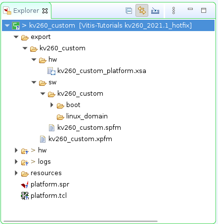

<table class="sphinxhide" width="100%">
 <tr width="100%">
    <td align="center"><h1>2023.1 Vitis™ Platform Creation Tutorials</h1>
    <a href="https://www.xilinx.com/products/design-tools/vitis.html">See Vitis™ Development Environment on xilinx.com</br></a>
    </td>
 </tr>
</table>

# Step 2: Create the Vitis Platform

In this step, you will create a Vitis platform running a Linux operation system. The Vitis platform requires several software components which need to be prepared in advance. Due to the boot flow differences between KV260 and base platforms for AMD evaluation boards like ZCU104, platform developer needs to prepare one additional DTBO file besides the normal software components for Vitis platforms because device tree file of programmalbe logic (PL) side depends on the hardware design and is loaded after Linux boots up. In addition, application developers need to add this DTBO file to the application deployment package as well. The other software components generation flow is similar to the flow described in the [ZCU104 tutorial](../02-Edge-AI-ZCU104/step2.md). However, in this case, the valuable software component is sysroot,which is used for host application cross-compilation. So you will go on utilizing the common image which provides the sysroot and expedite the process of platform creation.

## Prepare the Common Image

1. Download common image from [Xilinx website download page.](https://www.xilinx.com/support/download.html). Go to the **WorkSpace** folder you created in step 1, and place the image package in **WorkSpace** folder similar to the following:

   ```bash
   cd WorkSpace
   tree -L 1     # to see the directory hierarchy
   ├── kv260_hardware_platform
   └── xilinx-zynqmp-common-v2023.1.tar.gz
   ```

2. Extract the common image.

    You will create one folder named **kv260_vitis_platform** to store the work content for this step 2.

   ```bash
   mkdir kv260_vitis_platform
   cd kv260_vitis_platform
   tar xvf ../xilinx-zynqmp-common-v2023.1.tar.gz -C .
   ```

   You can see **xilinx-zynqmp-common-v2023.1** folder which contains the components located in **kv260_vitis_platform** folder similar to the following.

   ```bash
   tree -L 2
   ├── xilinx-zynqmp-common-v2023.1
   │   ├── bl31.elf
   │   ├── boot.scr
   │   ├── Image
   │   ├── README.txt
   │   ├── rootfs.ext4
   │   ├── rootfs.manifest
   │   ├── rootfs.tar.gz
   │   ├── sdk.sh
   │   └── u-boot.elf
   ```

From the above picture, you can see SDK tool and other components are ready.

### Generate Software Components from the KV260 Starter Kit BSP(Optional)

If you need to do system customization, take the following steps as reference. For more advanced tweaks, like kernel or uboot customization, refer to the [PetaLinux customization page](../../Feature_Tutorials/02_petalinux_customization/README.md) for reference.

<details>

<summary><strong>Click for Detailed Steps</strong></summary>  

1. Check the [AMD Kria™ K26 SOM wiki](https://xilinx-wiki.atlassian.net/wiki/spaces/A/pages/1641152513/Kria+K26+SOM), and download the BSP package from the following link: <https://www.xilinx.com/member/forms/download/xef.html?filename=xilinx-k26-starterkit-v2023.1-final.bsp>

    Save it to **WorkSpace** directory.

2. Set up the PetaLinux environment.

    ```bash
    cd WorkSpace
    mkdir kv260_vitis_platform
    cd kv260_vitis_platform
    source <petaLinux_tool_install_dir>/settings.sh
    ```

3. Update the PetaLinux eSDK to enable the recipes needed by the Starter Kit SOM BSP.

    ```bash
    petalinux-upgrade -u 'http://petalinux.xilinx.com/sswreleases/rel-v2022/sdkupdate/' -p 'aarch64'
    ```

4. Create PetaLinux with the Starter Kit SOM BSP, and the XSA export from step 1.

    ```bash
    petalinux-create --type project -s xilinx-kv260-starterkit-v2023.1-final.bsp
    cd xilinx-kv260-starterkit-2023.1
    petalinux-config --get-hw-description=<vivado_design_dir> --silent  
    ```

5. Add XRT to rootfs.

    KV260 PetaLinux BSP does not enable Xilinx Runtime (XRT) because it installs XRT with an overlay. To create sysroot for application developer cross compiling, enable XRT in the rootfs. All the XRT required libraries are packaged into one group.

    - Run `petalinux-config -c rootfs` to launch rootfs configuration window.
    - Go to **Petalinux Package Groups -> packagegroup-petalinux-vitis-acceleration-essential**.
    - Enable `packagegroup-petalinux-vitis-acceleration-essential` and `packagegroup-petalinux-vitis-acceleration-dbg`.
    - Press **Exit** to exit configuration. Press Save to save the configuration.

6. Build PetaLinux and generate SDK.

    ```bash
    petalinux-build
    petalinux-build --sdk
    ```

    The PetaLinux image files and sysroot sdk.sh will be generated in `<PetaLinux Project>/images/linux` directory. You will use them in the next step.

</details>

### Generate Device Tree Overlay

  Because the KV260 loads the PL after Linux boots up, the PL IP information in the platform needs to be loaded dynamically as device tree overlay. One additional requirement for the KV260 acceleration platform software is to generate the device tree overlay for the platform PL IPs. This device tree overlay serves two purposes:

  1. It needs to have ZOCL node so that XRT driver can be loaded properly.
  2. It can include any configurations of the PL IP in the platform logic designed in step 1.

  The device tree information for PL in your application is loaded after Linux boot together with the XCLBIN file which contains the PL bitstream. A device tree overlay (DTBO) can be loaded and unloaded in Linux. For more information about DTBO, refer to <https://lkml.org/lkml/2012/11/5/615>.

  AMD provides a new command, `createdts`, executed in the XSCT tool to generate device tree from XSA file exported from the AMD Vivado™ Design Suite.

  Run the following steps to generate DTBO from XSA

1. Generate device tree file.

   ```bash
   source <Vitis_tool_install_dir>/settings64.sh
   cd kv260_vitis_platform
   xsct
   createdts -hw ../kv260_hardware_platform/kv260_hardware_platform.xsa -zocl -out . \
   -platform-name mydevice -git-branch xlnx_rel_v2023.1 -overlay -compile
   ```

   The `createdts` command has the following input values. Specify them as you need.

   - `-platform-name`: Platform name
   - `-hw`: Hardware XSA file with path
   - `-out`: Specify the output directory
   - `-git-branch`: Device tree branch
   - `-zocl`: Enable the zocl driver support
   - `-overlay`: Enable the device tree overlay support
   - `-compile`: Specify the option to compile the device tree to DTB file

   The following information would show in XSCT console. Ignore the warning and that also means you succeed to get `system.dtb` file which is located in `<mydevice/psu_cortexa53_0/device_tree_domain/bsp>`.

   ```bash
   pl.dtsi:9.21-32.4: Warning (unit_address_vs_reg): /amba_pl@0: node has a unit name, but no reg property                                                      
   system-top.dts:26.9-29.4: Warning (unit_address_vs_reg): /memory: node has a reg or ranges property, but no unit name
   zynqmp.dtsi:790.43-794.6: Warning (pci_device_reg): /axi/pcie@fd0e0000/legacy-interrupt-controller: missing PCI reg property
   pl.dtsi:27.26-31.5: Warning (simple_bus_reg): /amba_pl@0/misc_clk_0: missing or empty reg/ranges property
   ```

   > **NOTE:** Createdts is a command executing in XSCT console to generate device files. This command needs several inputs to generate the device tree files. Regarding the meaning of every option, you can execute a help command to check the details. Besides XSCT is a Console tool of Vitis. You can start it by typing `xsct` in Linux terminal to start it. Or, you can select menu **Xilinx > XSCT Console** to start the XSCT tool after you launch Vitis.

   > **NOTE**: Device tree knowledge is a common know-how. Please refer to [AMD Device tree WIKI page](https://xilinx-wiki.atlassian.net/wiki/spaces/A/pages/862421121/Device+Trees) or [Device Tree WIKI page](https://en.wikipedia.org/wiki/Devicetree#Linux) for more information if you are not familiar with it.
   
   Execute the following command to exit XSCT console.

   ```bash
   exit
   ```

2. Compile the dtsi to dtbo.

   Run the following command to build the dtsi file and create a directory to store the dtbo file.

   ```bash
   cd kv260_vitis_platform
   dtc -@ -O dtb -o mydevice/psu_cortexa53_0/device_tree_domain/bsp/pl.dtbo mydevice/psu_cortexa53_0/device_tree_domain/bsp/pl.dtsi
   mkdir dtg_output
   cp mydevice/psu_cortexa53_0/device_tree_domain/bsp/pl.dtbo dtg_output
   ```

   > **NOTE:** `dtc` is device tree compiler. For more info about dtc, check its [man page](http://manpages.ubuntu.com/manpages/trusty/man1/dtc.1.html) and [source code](https://git.kernel.org/pub/scm/utils/dtc/dtc.git/tree/README?h=main).

### Create the Vitis Platform

1. Then you create a `pfm` folder, plus `boot` and `sd_dir` inside the `pfm` folder to store all the necessary files for Vitis platform creation. The `boot` directory for boot components and `sd_dir` for FAT32 partition contents in SD card will give Vitis when creating the platform.

   ```bash
   cd kv260_vitis_platform
   mkdir pfm
   mkdir pfm/boot
   mkdir pfm/sd_dir
   ```

   The following files are the content of `boot` directory and the sources of creating `BOOT.BIN` as well. They are required for the Vitis workflow, but because KV260 Starter Kit boot components are fixed in the QSPI flash, these files will not be used in our flow. So just leave it empty.

   - `zynqmp_fsbl.elf`: MPSoC first stage boot loader
   - `pmufw.elf`: MPSoC PMU Firmware
   - `bl31.elf`: MPSoC Arm Trusted Firmware
   - `u-boot.elf`: U-boot with device tree in the elf
   - `system.dtb`: Device tree for Linux

   Contents in `sd_dir` directory will be packaged to FAT32 partition of `sd_card.img` by the v++ package tool. Usually, you will store `boot.scr` and `system.dtb` in this directory. Because the KV260 workflow does not program the SD card, you can skip adding contents to this directory. Leave it empty.

2. Install sysroot.

   - Go to `<xilinx-zynqmp-common-v2023.1>` directory.
   - Type `./sdk.sh -d <Install Target Dir>` to install PetaLinux SDK. Use the `-d` option to provide a full pathname to the output directory **kv260_vitis_platform** (this is an example) and confirm.
   >**NOTE:** The environment variable **LD_LIBRARY_PATH** must not be set when running this command.

   After this step, your WorkSpace directory hierarchy looks like the following.

   ```bash
   - v260_hardware_platform             # Vivado Project Directory
   - kv260_vitis_platform               # Software components and vitis platform directory
     - xilinx-zynqmp-common-v2023.1     # common image directory
     - device-tree-xlnx                 # device tree repo directory
     - mydevice                         # device tree source file directory
     - dtg_output                       # DTBO file directory
     - sysroots                         # Extracted Sysroot Directory
     - pfm                              # Platform Packaging Sources
       - boot                           # boot components directory
       - sd_dir                         # Files to be put in FAT32 partition of SD card
   ```

3. Create a Vitis platform.

    First, create a Vitis platform project with the XSA file generated by Vivado from Step 1.

   1. Launch the Vitis IDE.
      - Go to the **kv260_vitis_platform** folder you created:

         ```bash
         cd <full_pathname_to_kv260_vitis_platform>
         ```

      - Launch Vitis by typing `vitis &` in the console.
      - Select **kv260_vitis_platform** folder as workspace directory.

   2. Create a new platform project.

      - Select menu **File > New > Platform Project** to create a platform project.
      - Enter the project name. For this example, type `kv260_custom`. Click **Next**.
      - In the Platform page:
        - Click **Browse** button, select the XSA file generated by the Vivado. In this case, it is `kv260_hardware_platform.xsa`.
        - Set the operating system to **linux**.
        - Set the processor to **psu_cortexa53**.
        - Architecture: **64-bit**
        - **Uncheck** option **Generate boot components** because we will use PetaLinux generated boot components.
        - Click **Finish**.

   3. Setup software settings in Platform Settings view.

      - Click the **linux on psu_cortexa53** domain, browse to the locations, and select the directory or file needed to complete the dialog box for the following:

      - **Bif file**: Click the drop-down icon and select **Generate BIF**.

        > **NOTE:** The file names in `<>` are placeholders. Vitis will replace the placeholders with the relative path to platform during platform packaging. V++ packager, which runs when building the final application would expand it further to the full path during image packaging. Filename placeholders point to the files in boot components directory. The filenames in boot directory need to match with placeholders in BIF file. `<bitstream>` is a reserved keyword. V++ packager will replace it with the final system bit file.

      - **Boot Components Directory**: Browse to **kv260_vitis_platform/pfm/boot** and click **OK**.

      - **FAT32 Partition Directory**: Browse to **kv260_vitis_platform/pfm/sd_dir** and click **OK**.

   4. Click **kv260_custom** project in the Vitis Explorer view, click the **Build** button to generate the platform.

      

      >**NOTE:** The generated platform is placed in the export directory. BSP and source files are also provided for re-building the FSBL and PMU, if desired, and are associated with the platform. The platform is ready to be used for application development.

      

      If you would create an Vitis application in the same workspace as this platform, you can find this platform available in the platform selection page in platform creation wizard. If you want to reuse this platform in another workspace, add its path to PLATFORM_REPO_PATHS environment variable before launching Vitis GUI, or use the **Add** button in platform selection page of Vitis GUI to add its path.

### Next Step

Next, try to [build applications on this platform and test them.](./step3.md)

<p class="sphinxhide" align="center"><sub>Copyright © 2020–2023 Advanced Micro Devices, Inc</sub></p>

<p class="sphinxhide" align="center"><sup><a href="https://www.amd.com/en/corporate/copyright">Terms and Conditions</a></sup></p>
