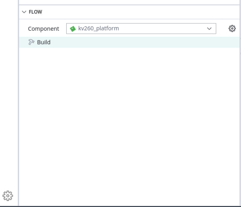
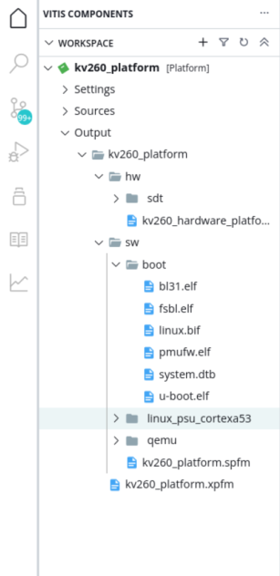

<!--
# Copyright 2021 Xilinx Inc.
#
# Licensed under the Apache License, Version 2.0 (the "License");
# you may not use this file except in compliance with the License.
# You may obtain a copy of the License at
#
#     http://www.apache.org/licenses/LICENSE-2.0
#
# Unless required by applicable law or agreed to in writing, software
# distributed under the License is distributed on an "AS IS" BASIS,
# WITHOUT WARRANTIES OR CONDITIONS OF ANY KIND, either express or implied.
# See the License for the specific language governing permissions and
# limitations under the License.
-->

<table class="sphinxhide" width="100%">
 <tr width="100%">
    <td align="center"><h1>2021.1 Vitis™ Platform Creation Tutorials</h1>
    <a href="https://www.xilinx.com/products/design-tools/vitis.html">See Vitis™ Development Environment on xilinx.com</br></a>
    </td>
 </tr>
</table>

# Step 3: Create the Vitis Platform

## Prepare Files for Platform Packaging

1. We would store all the necessary files for Vitis platform creation flow. Here we name it `kv260_custom_pkg `. Then we create a `pfm` folder inside to hold platform creation source components. 

   ```bash
   mkdir kv260_custom_pkg
   cd kv260_custom_pkg
   mkdir pfm
   ```

   After this step, your directory hierarchy looks like this.

   ```bash
   - kv260_custom_platform # Vivado Project Directory
   - kv260_custom_plnx     # PetaLinux Project Directory
   - kv260_custom_pkg      # Platform Packaging Directory
     - pfm                  # Platform Packaging Sources
   ```

2. Install sysroot:

   - Go to `<PetaLinux Project>/images/linux` directory.
   - Type `./sdk.sh -d <Install Target Dir>` to install PetaLinux SDK. use the `-d` option to provide a full pathname to the output directory **kv260_custom_pkg** (This is an example ) and confirm.
   - Note: The environment variable **LD_LIBRARY_PATH** must not be set when running this command


3. Create `boot` directory and `sd_dir` directory inside pfm directory

   ```bash
   cd kv260_custom_pkg/pfm
   mkdir boot
   mkdir sd_dir
   ```

   After this step, your directory hierarchy looks like this.

   ```bash
   - kv260_custom_platform # Vivado Project Directory
   - kv260_custom_plnx     # PetaLinux Project Directory
   - kv260_custom_pkg      # Platform Packaging Directory
     - sysroots             # Extracted Sysroot Directory
     - pfm                  # Platform Packaging Sources
       - boot               # Platform boot components
       - sd_dir             # Files to be put in FAT32 partition of SD card
   ```

   When creating the Vitis platform, we will give boot directory for boot components and sd_dir for FAT32 partition contents in SD card.

4. Prepare for the boot components

   Note: This step is to fulfill the requirements of Vitis IDE 2021.1 workflow. KV260 doesn't use the generated files because KV260 Starter Kit boot components are fixed in the QSPI Flash. The files can be dummy files.

   Copy the generated Linux software boot components from **<your_petalinux_dir>/images/linux directory** to the **<full_pathname_to_kv260_custom_pkg>/pfm/boot** directory to prepare for running the Vitis platform packaging flow:

   - `zynqmp_fsbl.elf`: MPSoC first stage boot loader
   - `pmufw.elf`: MPSoC PMU Firmware
   - `bl31.elf`: MPSoC Arm Trusted Firmware
   - `u-boot-dtb.elf`: U-boot with device tree in the elf. Please rename it to **u-boot.elf**
   - `system.dtb`: Device tree for Linux

   

5. Prepare **sd_dir** directory. 

   KV260 platform creation can skip this step because KV260 Starter Kit workflow uses the pre-built SD card image.

   Contents in this directory can be packaged to FAT32 partition of sd_card.img by v++ package tool. Usually we will store boot.scr and system.dtb in this directory. Since KV260 workflow uses the pre-built SD card, rather than the v++ package generated sd_card.img, we can skip adding contents to this directory. 

### Create a Vitis Platform

First we create a Vitis platform project with the XSA file generated by Vivado from Step 1.

1. Launch Vitis IDE
   - Go to the **kv260_custom_pkg** folder you created:

   ```bash
   cd <full_pathname_to_kv260_custom_pkg>
   ```

   - Launch Vitis by typing `vitis &` in the console.
   - Select **kv260_custom_pkg** folder as workspace directory.

2. Create a new platform project

   - Select menu **File > New > Platform Project** to create a platform project.
   - Enter the project name. For this example, type `kv260_custom`. Click **Next**.
   - In the Platform page,
     - Click **Browse** button, select the XSA file generated by the Vivado. In this case, it is `kv260_custom_platform.xsa`.
     - Set the operating system to **linux**.</br>
     - Set the processor to **psu_cortexa53**.</br>
     - Architecture: **64-bit**</br>
     - **Uncheck** option **Generate boot components** because we will use PetaLinux generated boot components.</br>
     - Click **Finish**.

3. Setup software settings in Platform Settings view.

   - Click the **linux on psu_cortexa53** domain, browse to the locations and select the directory or file needed to complete the dialog box for the following:

   - **Bif file**: Click the drop-down icon and select **Generate BIF**.

     > Note: The file names in `<>` are placeholders. Vitis will replace the placeholders with the relative path to platform during platform packaging. V++ packager, which runs when building the final application would expand it further to the full path during image packaging. Filename placeholders point to the files in boot components directory. The filenames in boot directory need to match with placeholders in BIF file. `<bitstream>` is a reserved keyword. V++ packager will replace it with the final system bit file.

   - **Boot Components Directory**: Browse to **kv260_custom_pkg/pfm/boot** and click OK.

   - **FAT32 Partition Directory**: Browse to **kv260_custom_pkg/pfm/sd_dir** and click OK.

4. Click **kv260_custom** project in the Vitis Explorer view, click the **Build** button to generate the platform.

   

   **Note: The generated platform is placed in the export directory. BSP and source files are also provided for re-building the FSBL and PMU if desired and are associated with the platform. The platform is ready to be used for application development.**

   

   If you would create an Vitis application in the same workspace as this platform, you can find this platform available in the platform selection page in platform creation wizard. If you'd like to reuse this platform in another workspace, add its path to PLATFORM_REPO_PATHS environment variable before launching Vitis GUI, or use "Add" button in platform selection page of Vitis GUI to add its path.

### Next Step

Next let us try to [build applications on this platform and test them.](./step4.md)

<p class="sphinxhide" align="center"><sup>Copyright&copy; 2021 Xilinx</sup></p>
