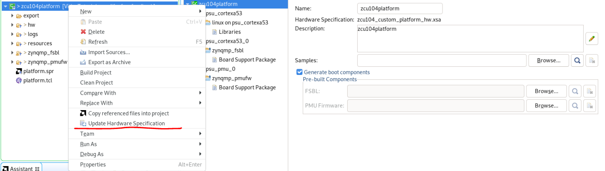

<table class="sphinxhide" width="100%">
 <tr width="100%">
    <td align="center"><h1>Vitis Platform Creation Tutorials</h1>
    <a href="https://www.xilinx.com/products/design-tools/vitis.html">See AMD Vitis™ Development Environment on xilinx.com </a>
    </td>
 </tr>
</table>

# Iteration Guidelines

When using Vitis flow to create platform and develop acceleration applications, iteration could be divided into three cases: hardware updates, software update and application. Iteration steps should obey from the following steps.

1. Hardware updates

    - Reexport the **XSA** file if you update the Hardware design in [Step1](step1.md)
    - Update the Hardware specification in [Step2](step2.md). Right click the platform and select **Update Hardware Specification**, then choose the updated **XSA** file and rebuild the platform.

    

    - Clean the Application and rebuild the Application in [Step3](step3.md)

2. Software component updates

    - Copy the software component to boot or sd_dir directory if you update the boot components in [step2](step2.md). Then clean the platform and rebuild the platform. For example, if DTB is updated, please copy new DTB to boot directory. Then clean the platform and rebuild it again. You would get updated platform.
    - Clean the Application and rebuild the Application in [Step3](step3.md)

3. Application updates

    - If user update the host code, they just need to clean the host first and then rebuild the host. After copying the host ELF to the fat partition of the sd card.
    - If user update the Kernel code, they just need to clean the kernel and hardware link first and then rebuild the kernel and hardware link. After coping the XCLBIN file to the fat partition of the sd card.

When using Vitis export to Vivado flow to develop acceleration application, please follow [Vitis Export to Vivdao](../../Feature_Tutorials/03_Vitis_Export_To_Vivado/README.md) to do iteration.

Copyright © 2020–2023 Advanced Micro Devices, Inc

<a href="https://www.amd.com/en/corporate/copyright">Terms and Conditions</a>

