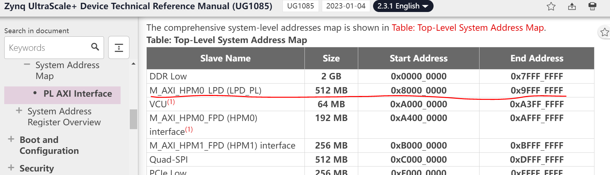
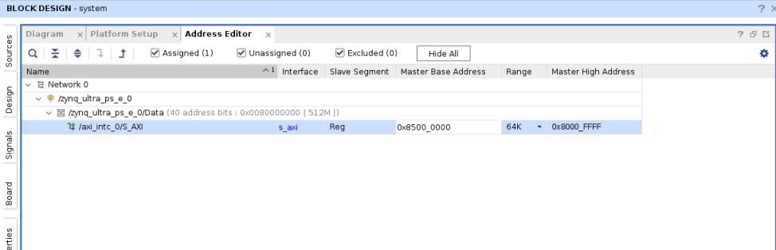

<table class="sphinxhide" width="100%">
 <tr width="100%">
    <td align="center"><h1>Vitis™ Platform Creation Tutorials</h1>
    <a href="https://www.xilinx.com/products/design-tools/vitis.html">See Vitis™ Development Environment on xilinx.com</br></a>
    </td>
 </tr>
</table>

# Step 1: Create a Hardware Platform

Use the AMD Vivado™ tools to create the hardware design for the ZCU104 AMD Vitis™ acceleration platform. Start from a ZCU104 preset design, add platform required peripherals, and configure them. After everything is set, export the hardware design to XSA.

## Create the Base Vivado Project from Preset

1. Create workspace and Launch Vivado

   Run the following commands on a Linux console.

   ```bash
   source <Vivado_Install_Directory>/settings64.sh
   mkdir WorkSpace
   cd WorkSpace
   mkdir zcu104_hardware_platform  #create directory for our step1 
   cd zcu104_hardware_platform
   vivado &
   ```

2. Create a Vivado project named **zcu104_custom_platform**.

   1. Select **File->Project->New**, and click **Next**.
   2. In Project Name dialog box, set Project name to **zcu104_custom_platform**. Uncheck **Create project subdirectory**, and click **Next**.
   3. Enable **Project is an extensible Vitis platform** and click **Next**.

      

   4. Select the **Boards** tab, then select **Zynq UltraScale+ ZCU104 Evaluation Board**, and click **Next**.
   5. Review the project summary and click **Finish**.

      >**Note:** If you need to change an existing Vivado project to an extensible Vitis platform project, you can go to **Settings** in **Flow Navigator** in an opened Vivado design, go to **General** and enable **project is an extensible Vitis platform**

      

3. Create a block design.

   1. In **Project Manager**, under **IP INTEGRATOR**, select **Create Block Design**.
   2. (Optional) Change the design name to **system**.
   3. Click **OK**.

4. Add the AMD Zynq™ UltraScale+™ MPSoC IP and run block automation to configure it.

   1. Right-click Diagram view, and select **Add IP**.
   2. Search for `zynq` and then double-click the **Zynq UltraScale+ MPSoC** from the IP search results.
   3. Click the **Run Block Automation** link to apply the board presets.
   4. In the Run Block Automation dialog, ensure the following is checked:

      - All Automation
      - Zynq_ultra_ps_e_0
      - Apply Board Presets

   5. Click **OK**. You should get MPSoC block configured like below:

      

**What Just Happened?**

At this stage, the Vivado block automation has added a Zynq UltraScale+ MPSoC block and applied all board presets for the ZCU104. The presets includes MPSoC PS side block configurations and pin assignments.

**What to do for custom boards?**

For a custom board, double-click MPSoC block and set up parameters according to the board hardware. Next, add the IP blocks and metadata to create a base hardware design that supports the acceleration kernels.

## Customize the System Design for Clock and Reset

The V++ linker can automatically link the clock signals between kernel and platform. The available clock signals in the platform are exported by **PFM.CLK** property.

For simple designs, interrupt signals can be sourced by the processor's **pl_clk**. The limitation is that the processor has a maximum of four `pl_clks` and their phase is not aligned.

To provide more interrupt signals, or to provide phase-aligned clocks, use the Clocking Wizard.

To add the **Clocking Wizard** to the block diagram and enable clock signals for the platform, follow these steps:

1. Add the clocking wizard block to generate three clocks:

   1. Right-click Diagram view and select **Add IP**.
   2. Search for and add a **Clocking Wizard** from the IP Search dialog box.
   3. Double-click the **clk_wiz_0** IP block to open the Re-Customize IP dialog box.
   4. Click the **Output Clocks** tab.
   5. Enable `clk_out1` through `clk_out3` in the Output Clock column. Set the **Requested Output Freq** as follows:

      - **clk_out1** to **100** MHz.
      - **clk_out2** to **200** MHz.
      - **clk_out3** to **400** MHz.

   6. At the bottom of the dialog box set the **Reset Type** to **Active Low**.

      

   7. Click **OK** to close the dialog box.

      >**Note:** So now you have set up the clock system for your design. This clock wizard uses the `pl_clk` as input clock and generates clocks needed for the whole logic design. In this simple design, use a 100 MHz clock as the `axi_lite` control bus clock. 200 MHz and 400 MHz clocks are reserved for the DPU AXI interface clock and the DPU core clock during the design linking phase. You can modify the clock quantities and frequency to fit your target design. Before exporting the clock, you must create reset signals for each clock because they are needed in clock export setup.**

2. Add three Processor System Reset blocks corresponding to the three clocks:

   1. Right-click Diagram view and select **Add IP**.
   2. Search for and add a **Processor System Reset** from the IP Search dialog box.
   3. Rename the reset block to **proc_sys_reset_1** so that it is easy to understand the relationship between reset modules and clock signals.
   4. Select the **proc_sys_reset_1** block, type Ctrl-C and Ctrl-V to replicate two modules. They are named as **proc_sys_reset_2** and **proc_sys_reset_3**, by default.

3. Connect Clocks and Resets:

   1. Click **Run Connection Automation** to open a dialog box to connect the `proc_sys_reset` blocks to the clocking wizard clock outputs.
   2. Enable **All Automation** on the left side of the Run Connection Automation dialog box.
   3. Select **clk_in1** on `clk_wiz_0`, and set the Clock Source to **/zynq_ultra_ps_e_0/pl_clk0**.
   4. For each **proc_sys_reset** instance, select the **slowest_sync_clk**, and set the Clock Source as follows:

      - **proc_sys_reset_1** with **/clk_wiz_0/clk_out1**
      - **proc_sys_reset_2** with **/clk_wiz_0/clk_out2**
      - **proc_sys_reset_3** with **/clk_wiz_0/clk_out3**

   5. On each `proc_sys_reset` instance, select **ext_reset_in**, set **Board Part Interface** to **Custom** and set the **Select Manual Source** to **/zynq_ultra_ps_e_0/pl_resetn0**.
   6. Make sure all checkboxes are enabled, and click **OK** to close the dialog and create the connections.
   7. Connect all the **dcm_locked** signals on each `proc_sys_reset` instance to the **locked** signal on **clk_wiz_0**.

      

4. Enable clocks for the platform

   1. Go to the **Platform Setup** tab.

      If it does not open, use menu **Window -> Platform Setup** to open it.

   2. Click the **Clock** tab.
   3. Enable all clocks under `clk_wiz_0`: **clk_out1**, **clk_out2**, **clk_out3**.
   4. Change their ID to **1**, **2**, and **3**.
   5. Set a default clock, and click **Is Default** for **clk_out2**.

      After everything is set up, it should report ``Info: No problem with Clock interface``.

      

      >**Note**: There should be one and only one default clock in the platform. During the v++ linking stage, the linker uses the default clock to connect the IP blocks if there are no user assignments for link configuration.

## Add Interrupt Support

The V++ linker can automatically link the interrupt signals between kernel and platform. The available interrupt signals in the platform are exported by **PFM.IRQ** property.

For simple designs, interrupt signals can be sourced by processor's **pl_ps_irq**. The limitation is that it can only provide a maximum of 16 interrupt signals. To provide more interrupt signals, use **AXI Interrupt Controller**. You can also enable **AXI HPM0 LPD** to control the **AXI Interrupt Controller**. In the next steps, you have to add the **AXI Interrupt Controller** and enable interrupt signals for **PFM.IRQ**.

1. Enable **AXI HPM0 LPD** to control the **AXI Interrupt Controller**

   1. In the block diagram, double-click the **Zynq UltraScale+ MPSoC** block.
   2. Select **PS-PL Configuration > PS-PL interfaces > Master interface**.
   3. Enable the **AXI HPM0 LPD** option.
   4. Expand the arrow before **AXI HPM0 LPD**. Check the **AXI HPM0 LPD Data width** settings and keep it as default **32**.
   5. Disable **AXI HPM0 FPD** and **AXI HPM1 FPD**.
   6. Click **OK** to finish the configuration.

      >**Note**:
      >
      > - **AXI HPM0 LPD** is used mainly for controlling purposes. It reads and writes 32-bit control registers. If the interface has more than 32 bits, AXI Interconnect or SmartConnect will perform the AXI bus width conversion using PL logic. However, it would cost logic resource and introduce unnecessary latency.
      > - **AXI HPM0 FPD** and **AXI HPM1 FPD** are reserved for kernel usage. Disabling them from the block diagram can prevent auto connection using it by accident. Unused AXI interfaces can be exported in the Platform Setup, irrespective of its visibility in the block diagram.

2. Add the **AXI Interrupt Controller** and configure it.

   1. Right-click Diagram view and select **Add IP**, search and add **AXI Interrupt Controller** IP. It is instantiated as **axi_intc_0**.
   2. Double click the AXI Interrupt Controller block, change **Interrupt Output Connection** to **Single** so that it can be connected to PS IRQ interface.
   3. Click **OK**.

3. Connect AXI Interfaces of `axi_intc_0` to AXI HPM0 LPD of PS.

   1. Click **Run Connection Automation**
   2. Review the settings (**axi_intc_0** is enabled, **s_axi** is to be connect to **/zynq_ultra_ps_e_0/M_AXI_HPM0_LPD**).
   3. Set **Clock Source for Slave Interface** and **Clock Source for Master Interface** to **/clk_wiz_0/clk_out2(200 MHz)**.
   4. Click **OK**.

   >**Note:** In this example, the interrupt controller and most kernel IRQ signals are synchronous to one clock for stability. It is okay to have asynchronous IRQ if kernels are running at different clocks. The interrupt controller can also handle asynchronous IRQ with level interrupt signals.

4. Connect IRQ of the Interrupt Controller by connecting **axi_intc_0.irq** to **zynq_ultra_ps_e_0.pl_ps_irq[0:0]**

   >**Note:** If you have more than one IRQ signals to connect to `pl_ps_irq` of PS, use a **concat** IP to concatenate them to a bus and then connect the bus to `pl_ps_irq`.

5. Enable interrupt signals for the platform.

   1. Go to Platform Setup tab.
   2. Go to Interrupt tab.
   3. Enable **intr** under `axi_intc_0`.
   4. Tcl console shows the corresponding `Tcl` command for this setup:

      ```tcl
      set_property PFM.IRQ {intr { id 0 range 32 }} [get_bd_cells /axi_intc_0]
      ```

At this stage, the IPI design connection will look as shown in the following diagram:


## Enable AXI Interfaces for the Platform

1. Enable AXI Master interfaces from PS.

   1. Go to the Platform Setup tab.
   2. Go to AXI Port tab in Platform Setup.
   3. Under `zynq_ultra_ps_e_0`, enable **M_AXI_HPM0_FPD** and **M_AXI_HPM1_FPD**. Keep the Memport and sptag default to M_AXI_GP and empty.

   >**Note:**
   >
   > - M_AXI_GP means general purpose AXI Master interface.
   > - sptag is only applicable to AXI slave interfaces.
   > - v++ linker will instantiate AXI Interconnect automatically to connect between PS AXI Master interfaces and slave interfaces of acceleration kernels. One AXI Master interface will connect up to 16 kernels.

2. Enable AXI Master interfaces from AXI Interconnect.

   - Under ps8_0_axi_periph, click **M01_AXI**, press **Shift** and click **M07_AXI** to multi-select master interfaces from **M01_AXI** to **M07_AXI**.
   - Right-click the selection and click on Enable.
   - Keep the Memport and sptag default to M_AXI_GP and empty.

   >**Note:**
   >
   >- v++ will not cascade another level of AXI Interconnect if the AXI master interface is exported from AXI Interconnect IP.
   >- AXI Master interfaces from PS and AXI Interconnect are functionally equivalent to the platform.
   >- In general, platform designer should export as many as AXI interfaces to the platform. Application developer should decide which interface to use.

3. Enable AXI Slave interfaces from PS to allow kernels access DDR memory.

   - Under zynq_ultra_ps_e_0, multi-select all AXI slave interfaces: press **Ctrl** and click **S_AXI_HPC0_FPD**, **S_AXI_HPC1_FPD**, **S_AXI_HP0_FPD**, **S_AXI_HP1_FPD**, **S_AXI_HP2_FPD**, **S_AXI_HP3_FPD**.
   - Right-click the selections and select **enable**.
   - Change Memport of **S_AXI_HPC0_FPD** and **S_AXI_HPC1_FPD** to **S_AXI_HP** because any coherent features for these interfaces will not be used in this example.
   - Type in simple sptag names for these interfaces so that they can be selected by v++ configuration during linking phase: **HPC0**, **HPC1**, **HP0**, **HP1**, **HP2**, **HP3**.

   

## Emulation Setup (Optional)

>**Note:** This step is only required when creating an emulation-capable platform.

When a component comes with multiple types of simulation models, selecting a SystemC TLM (Transaction-level Modeling) model is recommended as it is faster than an RTL model. For Processing System component, it is mandatory to use TLM for Hardware Emulation.

1. Change PS simulation model to TLM.

   1. Select the PS instance **zynq_ultra_ps_e_0** in the block diagram
   2. check the **Block Properties** window.
   3. The **Properties** tab shows `ALLOWED_SIM_MODELS=tlm,rtl`. It means this component supports two types of simulation models.
      - Scroll down to `SELECTED_SIM_MODEL` property. Change it from **rtl** to **tlm** to select to use TLM model.
      - Notice the equivalent Tcl command shown in the Tcl console is:

      ```tcl
      set_property SELECTED_SIM_MODEL tlm [get_bd_cells /zynq_ultra_ps_e_0]
      ```
## Modify the IP address in address editor (Optional)

   >Note: This step is not mandatory for platform creation. Please refer to it according to your requirement.

   If users need to modify the IP address in some cases please go through following steps.
   1. Check the location address space of your IP 
   2. Go to address editor by clicking **Window**-> **Address editor** to open it.

   Next, we will use the example of modifying the interrupt controller IP address to illustrate how to modify the IP address in the address editor.

   - As the interrupt controller is connected with **M_AXI_HPM0_LPD** domain, we need check LPD domain supported address space. Please check the [ZYNQMP Technical Reference Manual](https://docs.xilinx.com/r/en-US/ug1085-zynq-ultrascale-trm/PL-AXI-Interface). You could find following address range. That means the IP connected to LPD domain could be placed in 0x8000_0000-0x9FFF_FFFF address space. But conflict is not allowed.

      

   - Go to address editor, modify the interrupt controller IP base address according to your requirement.

      
      
   >Note: The modified base address should be in the LPD address space and the high address should also be in the LPD address space.
## Export Hardware XSA

1. Validate the block design. by clicking the **Validate Design** button in the block design diagram window.

   >**Note**: During validation, Vivado reports a critical warning that **/axi_intc_0/intr** is not connected. This warning can be safely ignored because v++ linker will link kernel interrupt signals to this floating intr signal.

   ```
   CRITICAL WARNING: [BD 41-759] The input pins (listed below) are either not connected or do not have a source port, and they don't have a tie-off specified. These pins are tied-off to all 0's to avoid error in Implementation flow.
   Please check your design and connect them as needed: 
   /axi_intc_0/intr
   ```

2. Create a top module wrapper for the block design.

   1. In **Source** tab, right-click **system.bd** in Design Sources group.
   2. Select **Create HDL Wrapper...**.
   3. Select **Let Vivado manage wrapper and auto-update**.
   4. Click **OK** to generate wrapper for block design.

3. Generate pre-synth design

   - Select **Generate Block Design** from Flow Navigator
   - Select **Synthesis Options** to **Global**. It will skip IP synthesis during generation.
   - Click **Generate**. .

4. Generate Bitstream (Optional).

   This step is optional for Vitis platforms. In most cases, a flat (non-DFX) Vitis platform does not need to generate bitstream before exporting the platform. You can execute this step after you understand its benefits and your requirements.

   Generating bitstream will run through hardware design implementation for the platform. It can report errors in the early stage if your platform hardware design has potential errors that cannot be reported by the Validated Design DRC.

   Here are the steps to generate bitstream:

   1. Click **Generate Bitstream** in the navigation window.
   2. Select a proper **number of jobs** for **Launch runs on local host**.
   3. Click **OK** to start building.

5. Export the platform.

   In this step, export XSA for hardware design and hardware emulation separately. These XSA files are used in step 2.

   >**Note:** Vivado 2023.2 can still export XSA with both hardware and hardware emulation info. This feature will be deprecated in the future. In most real designs, due to the complexity of the design, some peripherals cannot be emulated, or does not need to emulate at a cycle accurate level. It is a common practice to provide a simplified hardware design for hardware emulation to reduce the emulation runtime.

   1. Click **File -> Export -> Export Platform** to launch the **Export Hardware Platform** wizard. This wizard can also be launched by **Export Platform** button in **Flow Navigator** or **Platform Setup** window.
   2. Click **Next** in the first information page.
   3. Select Platform Type: **Hardware**, click **Next**. If you skipped the emulation setup previously, select **Hardware** here.
   4. Select Platform State: **Pre-synthesis**
   5. (Optional) If you have generated bitstream in step4, enable **Include bitstream**, click **Next**.
   6. Input Platform Properties and click **Next**. For example,
      - Name: zcu104_custom_platform
      - Vendor: xilinx
      - Board: zcu104
      - Version: 0.0
      - Description: This platform provides high PS DDR bandwidth and three clocks: 100MHz, 200MHz, and 400MHz.
   7. Fill in XSA file name: **zcu104_custom_platform_hw** and keep the export directory as default.
   8. Click **Finish**.
   9. **zcu104_custom_platform_hw.xsa** will be generated. The export path is reported in the Tcl console.

   (Optional: Only for Hardware Emulation. If you skipped the emulation setup previously, please skip the following step.)

   Rerun the Export Platform wizard again and export the XSA for hardware emulation.

   >**Note:** The same hardware and hardware emulation design is used for this simple project. You can use different Vivado designs for hardware and hardware emulation. Platform developers should keep the two designs logically identical. Otherwise your emulation result cannot represent your hardware design.

   1. Click **File -> Export -> Export Platform** to launch the **Export Hardware Platform** wizard. This wizard can also be launched by **Export Platform** button in **Flow Navigator** or **Platform Setup** window.
   2. Click **Next** in the first information page.
   3. Select Platform Type: **Hardware Emulation**, click **Next**.
   4. Select Platform State: **Pre-synthesis**, click **Next**.
   5. Input Platform Properties and click **Next**. For example,
      - Name: zcu104_custom_platform
      - Vendor: xilinx
      - Board: zcu104
      - Version: 0.0
      - Description: This platform provides high PS DDR bandwidth and three clocks: 100MHz, 200MHz, and 400MHz.
   6. Fill in XSA file name: **zcu104_custom_platform_hwemu** and keep the export directory as default.
   7. Click **Finish**.
   8. **zcu104_custom_platform_hwemu.xsa** will be generated. The export path is reported in the Tcl console.

   Alternatively, the above export can be done using Tcl scripts:

   ```tcl
   # Setting platform properties
   set_property platform.default_output_type "sd_card" [current_project]
   set_property platform.design_intent.embedded "true" [current_project]
   set_property platform.design_intent.server_managed "false" [current_project]
   set_property platform.design_intent.external_host "false" [current_project]
   set_property platform.design_intent.datacenter "false" [current_project]
   # Write pre-synthesis expandable XSA
   write_hw_platform -hw -force -file ./zcu104_custom_platform_hw.xsa
   write_hw_platform -hw_emu -force -file ./zcu104_custom_platform_hwemu.xsa
   ```

### Fast Track

Scripts are provided to re-create projects and generate outputs. To use these scripts, run the following steps.

1. Run build:

   ```bash
   # cd to the step directory, e.g.
   cd step1_vivado
   make all
   ```

2. To clean the generated files, run the following command:

   ```bash
   make clean
   ```

This script creates the same design, generate block diagram and export XSA.

A top level all in one build script is also provided. To build everything (step 1 to step 3) with one command, go to ***ref_files*** directory and run the following command:

```bash
make all COMMON_IMAGE_ZYNQMP=<path/to/common_image/>  #Specify the path of the common image
```

This command is to generate platform with pre-built software components and do software emulation by running `vadd` application to test this platform:

```bash
make sd_card COMMON_IMAGE_ZYNQMP=<path/to/common_image/>  #Specify the path of the common image
```

This command is to generate platform with pre-built software components and do hw test on board by running `vadd` application to test this platform. To clean all the generated files, run the following command:

```bash
make clean
```

## Next Steps

The Hardware platform creation flow is now complete. You can go to the [Step2: Create Vitis Software platform](./step2.md).

<p class="sphinxhide" align="center"><sub>Copyright © 2020–2023 Advanced Micro Devices, Inc</sub></p>

<p class="sphinxhide" align="center"><sup><a href="https://www.amd.com/en/corporate/copyright">Terms and Conditions</a></sup></p>
