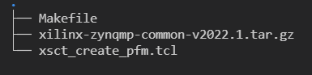

<!--
# Copyright 2020 Xilinx Inc.
#
# Licensed under the Apache License, Version 2.0 (the "License");
# you may not use this file except in compliance with the License.
# You may obtain a copy of the License at
#
#     http://www.apache.org/licenses/LICENSE-2.0
#
# Unless required by applicable law or agreed to in writing, software
# distributed under the License is distributed on an "AS IS" BASIS,
# WITHOUT WARRANTIES OR CONDITIONS OF ANY KIND, either express or implied.
# See the License for the specific language governing permissions and
# limitations under the License.
-->

## Step 2: Create Vitis Software Platform

This time we will create a Vitis platform running Linux operation system. This Vitis platform requires several software components. We need prepare these components for the platform first. Since Xilinx provides common software images for quick evaluation. We assume you are using Xilinx evaluation boards and will utilize the common images. Certainly if you are using your own designed board which needs to customize the system like kernel or rootfs you can refer the [PetaLinux customization page](../../Feature_Tutorials/02_platform_creation_petalinux_component/README.md) for customization. Besides for device tree file we need to create it by ourselves because PL side peripherals are defined by ourselves. Below are the software components we need for our platform and its provenance.

| Component                                     | Conventional Path or Filename | Description                                                      | Provenance                         |
| --------------------------------------------- | ----------------------------- | ---------------------------------------------------------------- | ---------------------------------- |
| Boot components in BOOT.BIN                   | boot/fsbl.elf                 | First stage boot loader                                          | Generated with platform creation   |
| Boot components in BOOT.BIN                   | boot/pmufw.elf                | Chip internal power and security related management              | Generated with platform creation   |
| Boot components in BOOT.BIN                   | boot/bl31.elf                 | ARM trusted firmware/ secure monitor                             | Extracted from common image        |
| Boot components in BOOT.BIN                   | boot/u-boot.elf               | Second stage boot loader                                         | Extracted from common image        |
| Boot components in BOOT.BIN                   | boot/system.dtb               | Device tree information file                                     | Generated from "createdts" command |
| Boot components in FAT32 partition of SD card | sd_dir/boot.scr               | U-boot configuration file to store in FAT32 partition of SD card | Extracted from common image        |
| Linux Software Components                     | sw_comp/Image                 | Linux kernel  Image                                              | Extracted from common image        |
| Linux Software Components                     | sw_comp/rootfs.ext4           | Linux file system                                                | Extracted from common image        |
| Linux SDK                                     | sysroot                       | Cross compile and header files                                   | Extracted from common image        |


As most of the components are extracted from common image package we will prepare the common image first.

### Prepare the common images
 
1. Download common image from [Xilinx website download page.](https://www.xilinx.com/support/download.html)  go to the **WorkSpace** folder we created in step1 and Place the image package in **WorkSpace** folder like below: 
   
   ```bash
   cd WorkSpace
   tree -L 1     # to see the directory hierarchy
   ```

   

2. Extract the common image.
    
    We will create one folder named **zcu104_software_platform** to store the work content for our step2. Then the coming operations and products will be stored in this folder.

   ```bash
   mkdir zcu104_software_platform
   cd zcu104_software_platform
   tar xvf ../xilinx-zynqmp-common-v2022.1.tar.gz -C .
   ```

   you can see **xilinx-zynqmp-common-v2022.1** folder which contains some components in **zcu104_software_platform** folder like below.
   
   

From above picture we can see we have boot file, kernel image rootfs and SDK tool. We still do not have DTB and first stage boot related files. As Vitis Platform Creation process can generate FSBL and PMU with XSA file. So we will create a simple Vitis platform to generate the FSBL and PMU file.

### Create FSBL and PMU file

As mentioned in above we will create a simple Vitis Platform with standalone domain to get our FSBL and PMU file. We can create a Vitis platform with Vitis IDE or with XSCT command line. Vitis IDE can create the platform if your design only contains one XSA. If your design has two XSA (hw and hw-emu), please use XSCT to create the platform.


 <details>

 <summary><strong>Click here to expand the detailed steps using Vitis IDE to create a Vitis platform</strong></summary>  
 First we create a Vitis platform project with the XSA file generated by Vivado from Step 1.

 1. Launch Vitis IDE
    
   - Prepare Vitis environment
  
      ```bash
      source <Vitis_tool_install_dir>/settings64.sh
      ```

   - Launch Vitis by typing `vitis &` in the console.
   - Select `zcu104_software_platform` folder as workspace directory.

 2. Create a new platform project

   - Select menu **File > New > Platform Project** to create a platform project.
   - Enter the project name. For this example, type `zcu104_custom_fsbl`. Click **Next**.
   - In the Platform page,
     - Click **Browse** button, select the XSA file generated by the Vivado. In this case, it is `zcu104_custom_platform.xsa`.
     - Set the operating system to **standalone**.</br>
     - Set the processor to **psu_cortexa53_0**.</br>
     - **check** option **Generate boot components**, because the auto generated FSBL and PMU boot are our goals.</br>
     - Click **Finish**.

 3. Click **zcu104_custom_fsbl** project in the Vitis Explorer view, click the **Build** button to generate the platform.

  After building we can get FSBL and PMU file. 

 </details>

 <details>

 <summary><strong>Click here to expand the detailed steps using XSCT to create a Vitis platform</strong></summary>  

Create a tcl file with XSCT commands. For example, here is the parts of [xsct_create_pfm.tcl](./ref_files/step3_pfm/xsct_create_pfm.tcl)

```Tcl
setws .
#set OUTPUT platform_repo
platform create -name $platform_name \
    -desc "A custom platform ZCU104 platform" \
    -hw ${xsa_path}/${xsa_name}_hw.xsa \
    -hw_emu ${xsa_path}/${xsa_name}_hwemu.xsa \
    -fsbl-target psu_cortexa53_0 \
#    -out ./${OUTPUT} 
 
# standalone domain
domain create -name standalone -proc psu_cortexa53_0 -os standalone -arch {64-bit} 
# Linux domain
#domain create -name xrt -proc psu_cortexa53 -os linux -arch {64-bit} -runtime {ocl} -sd-dir {./sd_dir}  -bootmode {sd}
# domain active xrt
#domain config -boot {./boot}
#domain config -generate-bif
#domain config -qemu-data ./boot

platform write
platform generate
```

> Note: Please replace the file name and directory name in the script with your project file location.

> Note: If you don't need to support hardware emulation, you can omit the option `-hw_emu` and its value for the command `platform create`.

The `platform create` command needs the following input values:

- `-name`: Platform name
- `-hw`: Hardware XSA file location
- `-hw_emu`: Hardware emulation XSA file location
- `-out`: platform output path  #if you use `setws` to specify the workspace there is no need for this option 
- `-sd-dir`: the directory that contains the files to be included in the FAT32 partition of the SD card image.
- `-fsbl-target`: specify the CPU core and generate corresponding FSBL and PMU image.

The `domain` command will setup standalone domain or  the Linux domain with SD boot mode. It will use files in `./sd_dir` to form the FAT32 partition of the SD card image and files in `./boot` directory to generate boot.bin.

You can pass the values to the script directly by replacing the variable with the actual value, or define them in the header of the tcl script, or pass the value to XSCT when calling this script. 

Here's an example of calling XSCT if you hard code all contents in xsct_create_pfm.tcl.

```bash
xsct xsct_create_pfm.tcl
```

To support better generalization, the example [Makefile](./ref_files/step3_pfm/Makefile) and [xsct_create_pfm.tcl](./ref_files/step2_pfm/xsct_create_pfm.tcl) in ref_files directory use variables to represent the file names and directory location. Please refer to them if you would like to get more programmability in your scripts.

</details>


just now we create a simple standalone platform to get FSBL and PMU file. We will add all the components to platform at last step. The rest file we do not have is the DTB file.

### Create the device tree file

Utilize XSCT tool to execute one command to generate device tree files:

   ```bash
   cd zcu104_software_platform
   xsct 
   ```
   Then execute ` createdts ` command in XSCT console like below:

   ```bash
   createdts -hw ../zcu104_hardware_platform/zcu104_custom_platform.xsa -zocl  -platform-name mydevice  -git-branch xlnx_rel_v2021.1 -board  zcu104-revc -compile
   ```
   The `createdts` command needs the following input values:

   -  `-name`: Platform name
   -  `-hw`: Hardware XSA file with path
   -  `-git-branch`: device tree branch
   -  `-board`: board name of the device. You can check the board name at <DTG Repo>/device_tree/data/kernel_dtsi.
   -  `-zocl`: enable the zocl driver support
   -  `-compile`: specify the option to compile the device tree

   Notice below information would show in XSCT console.Please ignore the warning and that means you succeed to get system.dtb file which is located in <mydevice/psu_cortexa53_0/device_tree_domain/bsp>.

   ```bash
   pl.dtsi:9.21-32.4: Warning (unit_address_vs_reg): /amba_pl@0: node has a unit name, but no reg property                                                      system-top.dts:26.9-29.4: Warning (unit_address_vs_reg): /memory: node has a reg or ranges property, but no unit name
   zynqmp.dtsi:790.43-794.6: Warning (pci_device_reg): /axi/pcie@fd0e0000/legacy-interrupt-controller: missing PCI reg property
   pl.dtsi:27.26-31.5: Warning (simple_bus_reg): /amba_pl@0/misc_clk_0: missing or empty reg/ranges property
   ```

   > Note: Createdts is a command executing in XSCT console to generate device files. This command needs several inputs to generate the device tree files. Regarding the meaning of every option you can execute help command to check the details. Besides XSCT is a Console tool of Vitis. You can start it by typing `xsct` in Linux terminal to start it like above operation. Also you can also select menu **Xilinx > XSCT Console ** to start the XSCT tool after you launching Vitis.

   Execute below command to exit XSCT console.

   ```bash
   exit
   ```

   After this step, we get all the must components we need. The next we will attach all the components to our platform and build it.
   
#### (Optional) Update the Device tree

   Device tree describes the hardware components of the system. `createdts` command can generate the device tree according to hardware configurations from XSA file. User needs to add customization settings in system-user.dtsi if there are any settings not available in XSA, for example, any driver nodes that don't have a corresponding hardware, or if user have their own design hardware.
   Click below to get example steps about how to update DTS and DTB.

   <details>
  <summary><b>Update device tree</b></summary>

   Below steps show how to modify device tree and compile it.

   1. Modify system-top.dts located in <zcu104_software_platform/mydevice/psu_cortexa53_0/device_tree_domain/bsp/> and replace the content of chosen node like below:

      ```bash
      / {
      chosen {
         bootargs = "earlycon console=ttyPS0,115200 clk_ignore_unused root=/dev/mmcblk0p2 rw rootwait cma=512M";
            };
         };
      ```

   2. Compile the dts

      ```bash
      cd zcu104_software_platform/mydevice/psu_cortexa53_0/device_tree_domain/bsp/
      gcc -I my_dts -E -nostdinc -undef -D__DTS__ -x assembler-with-cpp -o system.dts system-top.dts  #preprocess the dts file because DTC command can not recognize the #include grammar
      dtc -I dts -O dtb -o system.dtb system.dts # compile the dts
      ```
 
   Then you can find the updated system.dtb file in <zcu104_software_platform/mydevice/psu_cortexa53_0/device_tree_domain/bsp/> directory.
   
</details>

### Create Vitis Platform
   
1. First We will create three directories : **pfm, boot, sd_dir** to store the components and copy files to the directories.

   ```bash
   cd WorkSpace/zcu104_software_platform
   mkdir pfm 
   mkdir pfm/boot
   mkdir pfm/sd_dir
   mkdir pfm/sw_comp 
   cp zcu104_platform_fsbl/zynqmp_fsbl/fsbl_a53.elf pfm/boot/fsbl.elf        #rename it to fsbl.elf in case of V++ can not find it by name 
   cp zcu104_platform_fsbl/zynqmp_pmufw/pmufw.elf pfm/boot/
   cp xilinx-zynqmp-common-v2022.1/bl31.elf pfm/boot/
   cp xilinx-zynqmp-common-v2022.1/u-boot.elf pfm/boot/
   cp mydevice/psu_cortexa53_0/device_tree_domain/bsp/system.dtb  pfm/boot/
   cp xilinx-zynqmp-common-v2022.1/boot.scr pfm/sd_dir/
   cp mydevice/psu_cortexa53_0/device_tree_domain/bsp/system.dtb  pfm/sd_dir/
   cp xilinx-zynqmp-common-v2022.1/rootfs.ext4 pfm/sw_comp
   cp xilinx-zynqmp-common-v2022.1/Image pfm/sw_comp
   ```

   > Note: fsbl_a53.elf, pmufw.elf, bl31.elf, u-boot.elf and system.dtb in boot DIR are the source of BOOT.BIN image, and will be used during emulation. Boot.src and system.dtb in sd_dir are for u-boot initialization and Linux boot up and will be packaged to FAT32 partition by V++ package tool. Image and rootfs.ext4 are Linux kernel and root file system and also will be packaged to SD.IMG by V++ tool.
   
2. Install the sysroot 

   - Go to common image extracted directory <WorkSpace/zcu104_software_platform/xilinx-zynqmp-common-v2022.1/>
   - Type ./sdk.sh -d <Install Target Dir> to install PetaLinux SDK. use the `-d` option to provide a full pathname to the output directory  **.** (This is an example. < . > means current Dir ) and confirm.
   - Note: The environment variable **LD_LIBRARY_PATH** must not be set when running this command

3. Create Vitis platform 
 
   This time we will use IDE to create Vitis Platform. if you want to use XSCT to create platform please check [Using XSCT to create Vitis Platform](#Create-FSBL-and-PMU-file). 

   - Open Vitis workspace you were using before in step2
   - Select menu **File > New > Platform Project** to create a platform project.
   - Enter the project name. For this example, type `zcu104_custom`. Click **Next**.
   - In the Platform page,
     - Click **Browse** button, select the XSA file generated by the Vivado. In this case, it is `zcu104_custom_platform.xsa`.
     - Set the operating system to **linux**.</br>
     - Set the processor to **psu_cortexa53**.</br>
     - Architecture: **64-bit**</br>
     - **uncheck** option **Generate boot components**, because we have got FSBL and PMU already.</br>
     - Click **Finish**.
  
4. Set up the software settings in Platform Settings view
   
   - Click the **linux on psu_cortexa53** domain, browse to the locations and select the directory or file needed to complete the dialog box for the following:

   - **Bif file**: Click the drop down icon and select **Generate BIF**.

     > Note: The file names in `<>` are placeholders. Vitis will replace the placeholders with the relative path to platform during platform packaging. V++ packager, which runs when building the final application would expand it further to the full path during image packaging. Filename placeholders point to the files in boot components directory. The filenames in boot directory need to match with placeholders in BIF file. `<bitstream>` is a reserved keyword. V++ packager will replace it with the final system bit file.

   - **Boot Components Directory**: Browse to **zcu104_software_platform/pfm/boot** and click OK.

   - **FAT32 Partition Directory**: Browse to **zcu104_software_platform/pfm/sd_dir** and click OK.

   

   > Note: Starting from 2020.2, Vitis will setup default QEMU arguments to enable Vitis platform emulation. If there are additional QEMU settings, please write your own qemu_args.txt and set the file name in **QEMU Arguments** field.

5. Click **zcu104_custom** project in the Vitis Explorer view, click the **Build** button to build the platform.

   

   **Note: The generated platform is placed in the export directory. BSP and source files are also provided for re-building the FSBL and PMU if desired and are associated with the platform. The platform is ready to be used for application development.**

   

   If you'd create an Vitis application in the same workspace as this platform, you can find this platform available in the platform selection page in platform creation wizard. If you'd like to reuse this platform in another workspace, add its path to PLATFORM_REPO_PATHS environment variable before launching Vitis GUI, or use "Add" button in platform selection page of Vitis GUI to add its path.

### Fast Track

Scripts are provided to create the Vitis platform. To use these scripts, please run the following steps.

1. Run build
   > Note: As downloading common image from Xilinx website needs verification. So we will download manually. Please download common image from [Xilinx website download page.](https://www.xilinx.com/support/download.html) Place the image package in <ref_files/step2_pfm> folder like below: 

   

   ```
   # cd to the step directory, e.g.
   cd step2_pfm
   make all
   ```

2. To clean the generated files, please run

   ```bash
   make clean
   ```

### Next Step

Next let's try to [build some applications on this platform and test them.](./step3.md)

<p align="center"><sup>Copyright&copy; 2022 Xilinx</sup></p>

