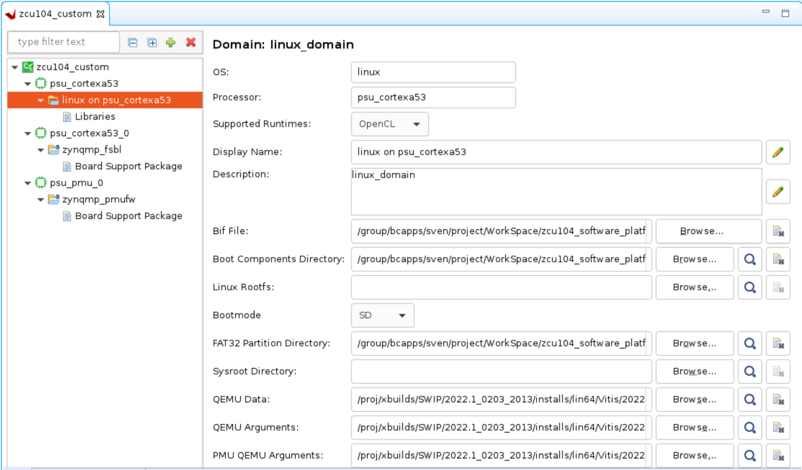
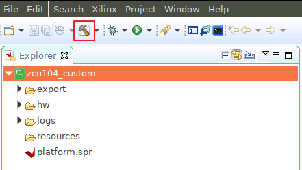
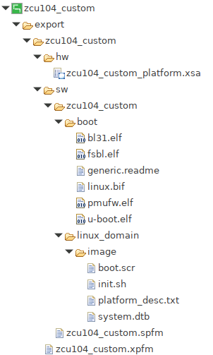

<table class="sphinxhide" style="width:100%;">
  <tr>
    <td align="center">
      <picture>
        <source media="(prefers-color-scheme: dark)" srcset="https://raw.githubusercontent.com/Xilinx/Image-Collateral/main/logo-white-text.png">
        
      </picture>
      <h1>AMD Vitis™ Platform Creation Tutorials</h1>
      <a href="https://www.amd.com/en/products/software/adaptive-socs-and-fpgas/vitis.html">See Vitis™ Development Environment on amd.com</a>
    </td>
  </tr>
</table>

# Step 2: Create the Vitis Software Platform


In this step, you will create an AMD Vitis™ platform running the Linux operating system. The Vitis platform relies on several essential software components that must be prepared in advance. To expedite the process, AMD offers common software images for quick evaluation, and you could leverage these common images to jump-start your project.

Device Tree Blob (DTB) files are not included in the common image package, as different platforms may have unique device peripherals. To generate a DTB file, enable the Device Tree Blob Generation option in the Platform Wizard when creating a platform. The DTB file will then be automatically generated along with the platform.

If you require further customization of the system image, such as modifying the kernel or root file system (rootfs), please refer to the the [PetaLinux customization page](../../Feature_Tutorials/02_petalinux_customization/README.md) customization page for detailed instructions.

Listed below are the software components necessary for this platform:

| Component                                     | Conventional Path or Filename | Description                                                      | Provenance                         |
| --------------------------------------------- | ----------------------------- | ---------------------------------------------------------------- | ---------------------------------- |
| Boot components in BOOT.BIN                   | fsbl.elf                 | First stage boot loader                                          | Generated with platform creation   |
| Boot components in BOOT.BIN                   | pmufw.elf                | Chip internal power and security related management              | Generated with platform creation   |
| Boot components in BOOT.BIN                   | bl31.elf                 | ARM trusted firmware/ secure monitor                             | Extracted from common image        |
| Boot components in BOOT.BIN                   | u-boot.elf               | Second stage boot loader                                         | Extracted from common image        |
| Boot components in BOOT.BIN                   | system.dtb               | Device tree information file                                     | Generated along with platform creation |
| Boot components in FAT32 partition of SD card | boot.scr               | U-boot configuration file to store in FAT32 partition of SD card | Extracted from common image        |
| Linux Software Components                     | Image                 | Linux kernel  Image                                              | Extracted from common image        |
| Linux Software Components                     | rootfs.ext4           | Linux file system                                                | Extracted from common image        |
| Linux SDK                                     | sysroot                       | Cross compile and header files                                   | Extracted from common image        |

>Note: The Kernel Image, Linux file system, and Sysroot are not mandatory components for the platform itself. Instead, they are utilized by applications to generate the SD Card Image.

As most of the components are extracted from the common image package, we will prepare the common image first.

## Prepare the Common Images

1. Download the common image from [website download page.](https://www.xilinx.com/support/download.html).

2. Navigate to the **WorkSpace** folder that you created in step1 and place the image package in **WorkSpace** folder.

   ```bash
   cd WorkSpace
   tree -L 1     # to see the directory hierarchy
   .
   ├── xilinx-zynqmp-common-v2025.2.tar.gz
   └── zcu104_custom_platform
   ```

3. Extract the common image.

   Please follow steps below to extract the common image.

   ```bash
   cd WorkSpace
   tar xvf xilinx-zynqmp-common-v2025.2.tar.gz -C .
   ```

You can see the ``xilinx-zynqmp-common-v2025.2`` folder which contains some components located in the ``WorkSpace`` folder as shown below:

```
   tree -L 2
   ├── xilinx-zynqmp-common-v2025.2
   │   ├── bl31.elf
   │   ├── boot.scr
   │   ├── Image
   │   ├── README.txt
   │   ├── rootfs.ext4
   │   ├── rootfs.manifest
   │   ├── rootfs.tar.gz
   │   ├── sdk.sh
   │   └── u-boot.elf
```

From the above directory structure, you can see that the boot file, kernel image, rootfs, and SDK tool are ready. DTB and first stage boot related files are not available. Among them, the PMU (Platform Management Unit) firmware FSBL (First Stage Boot Loader) can be generated by enabling the **Generate Boot artifacts** option during the platform creation process. 

## Create a Vitis Platform

1. Install the sysroot 

   - Go to common image extracted directory `<WorkSpace/xilinx-zynqmp-common-v2025.2/>`.
   - Type ``./sdk.sh -d <Install Target Dir>`` to install the PetaLinux SDK. Use the `-d` option to provide a full pathname to the output directory  **.** (This is an example. **.** means current directory. ) and confirm.

   The environment variable **LD_LIBRARY_PATH** must not be set when running this command.

   >Note: Sysroot is not mandatory components for the platform itself. It is the cross compile tool prepared for applications compilation.

2. Create the Vitis platform.

   For this example, you will use the Vitis Unified IDE to create the Vitis Platform. Got to `WorkSpace` directory and follow steps below to create the platform.

   1. Run Vitis by typing `vitis -w .` in the console. `-w` is to specify the workspace. `.` means the current worksapce directory.
   2. In the Vitis Unified IDE, from menu select **File > New Component > Platform** to create a platform component.
   3. On the **Create Platform Component** setup dialog
      - Enter the component name and location. For this example, type `zcu104_custom` and use default location. Click **Next**.
      - Click **Broswe** button, select the XSA file generated by the Vivado. In this case, it is `zcu104_custom_platform_hw.xsa`. 
         >Note: If you want to create a platform with emulation support please click **Emulation** and select the emulation XSA file.
      - Expand the **Advanced Options** and set the items as following:

         

         - SDT Source Repo: This is used to replace the built-in SDT tool. For this tutorial, leave it empty.
         - Board DTSI: Specify the board machine name, which is used to retrieve the board-level DTSI file. For this tutorial, please input `zcu104-revc`. To check the board machine name, refer to [UG1144 Machine Name Checking](https://docs.amd.com/r/en-US/ug1144-petalinux-tools-reference-guide/Importing-a-Hardware-Configuration)
         - User DTSI: Allows you to specify a custom DTSI file. For this tutorial, Click **Browse** and select the system-suer.dtsi file located in [ref_files](ref_files/sep2_pfm/system-user.dtsi) folder.
         - DT ZOCL: Enables Zocl node generation for the XRT driver. Ensure this option is enabled, then click **Next**.
      - Set the operating system to **linux**.</br>
      - Set the processor to **psu_cortexa53**.</br>
      - Check the option **Generate boot artifacts**. Then click **Next**.</br>
         >Note: Enabling this option will trigger the tool to automatically generate a PMU firmware domain and an FSBL (First Stage Boot Loader) domain into the platform
      - Enable the **Generate Device Tree Blob (DTB)** option, then click Next.
         >Note: Enabling this option allows the tool to automatically generate a DTB file using the provided DTSI and XSA files. The DTB file is located in `<platform component>/hw/sdt/` folder.
      - Review the summary and click **Finish**.
      >Note: After a few moments, the platform component will be prepared and available in the component view. Simultaneously, the platform configuration file, `vitis-comp.json`, will be automatically displayed in the main view. Users can access the `vitis-comp.json` file by expanding the Settings section under the platform component.

3. Set up the software settings in the Platform configuration view by clicking the **Linux On psu_cortexa53** domain, browse to the locations and select the directory or file needed to complete the dialog box for the following:

   - **Display Name**:  update it as `xrt`
   - **Bif file**: Click the button to generate bif file or click **Browse** to select existing bif file.

     >**Note:** The filenames in `<>` are placeholders in the bif file. Vitis will replace the placeholders with the relative path to platform during platform packaging. V++ packager, which runs when building the final application#, would expand it further to the full path during image packaging. Filename placeholders point to the files in boot components directory. The filenames in boot directory need to match with placeholders in BIF file. `<bitstream>` is a reserved keyword. V++ packager will replace it with the final system bit file.

   - **Pre-Built Image Directory**: Browse to **xilinx-zynqmp-common-v2025.2** and click **OK**.

   - **DTB File**: It will be generated automatically and populated in this area.

   - **FAT32 Partition Directory**: This directory is used to add additional file to the fat32 partition. User can set it according to your requirement.

   - **QEMU Data**: This Directory is used to add additional file for emulation. User can set it according tyour requirement.

   

   >**Note:**: **Qemu Args File** and **Pmu Args File**  are populated by the tool automatically. If there are additional QEMU settings, please update it accordingly.

5. Select **zcu104_custom** platform component in the flow navigagor, then click the **Build** button to build the platform.

   

   >**Note:** The generated platform is placed in the export directory. BSP and source files are also provided for rebuilding the FSBL, if required, and are associated with the platform. The platform is ready to be used for application development.

   

   >Note: After compilation, users can locate the XPFM file by expanding the Output directory. This provides a logical view of the output. The actual path of platform file is under `workspace/zcu104_custom/export/zcu104_custom/` directory. Users can also view the complete path of the platform file by simply hovering the mouse pointer over the XPFM file.

   >Note: The Vitis Unified IDE will find the boot-related files menntioned in the software components in begin of this step and place them in the boot folder of the platform.

   If you create a Vitis application component in the same workspace as this platform component, you can find this platform available in the platform selection page in the application Creation wizard. If you want to reuse this platform in another workspace, add its path to the `PLATFORM_REPO_PATHS` environment variable before launching the Vitis GUI, or use the "Add" button on the platform selection page of the Vitis GUI to add its path.

  
   User could also use Vitis python command to create the platform component.

   </details>

   <details>
   <summary><strong>Click here to see how to use Vitis python command to create a Vitis platform</strong></summary>  

   Create a python script. For example, here is the parts of [platform_creation.py](./ref_files/step2_pfm/platform_creation.py).

   ```Tcl
   import vitis
   import argparse
   import os

   print("Platform generation")
   parser = argparse.ArgumentParser()
   parser.add_argument("--platform_name", type=str, dest="platform_name")
   parser.add_argument("--xsa_path", type=str, dest="xsa_path")
   parser.add_argument("--xsa-emu_path", type=str, dest="emuxsa_path")
   parser.add_argument("--boot", type=str, dest="boot")
   parser.add_argument("--user_dtsi", type=str, dest="user_dtsi")
   args = parser.parse_args()
   platform_name=args.platform_name
   xsa_path=args.xsa_path
   emuxsa_path=args.emuxsa_path
   user_dtsi=args.user_dtsi
   boot=args.boot
   print('args',args)
   client = vitis.create_client()
   workspace_path = os.getcwd() + "/ws" 
   client.set_workspace(path=workspace_path)
   advanced_options = client.create_advanced_options_dict(board_dtsi="zcu104-revc",dt_overlay="0",dt_zocl="1",user_dtsi=user_dtsi)
   platform = client.create_platform_component(name = platform_name, hw_design =xsa_path, emu_design = emuxsa_path,os = "linux",cpu = "psu_cortexa53",generate_dtb = True,advanced_options = advanced_options )
   platform = client.get_component(name=platform_name)
   domain = platform.get_domain(name="linux_psu_cortexa53")
   status = domain.update_name(new_name="xrt")
   status = domain.generate_bif() 
   status = domain.set_boot_dir(path=boot)
   status = platform.build()
   ```


   This python script is for user to create a platform. It needs the following input values.

   - `name`: Platform name.
   - `hw`: Hardware XSA file location.
   - `emulation_xsa_path`: Hardware emulation XSA file location.
   - `boot`: pre-built image path.
   - `user_dtsi`: user DTSI file path.

   The following is the command brief explanation.
   - `client.create_platform_component` is used to create a platform with standalone domain or the Linux domain. 
   - `domain.add_boot_dir` is used to set the pre-built image path.  
   - `advanced_options` is used to provide source files for DTB generation or switch to another SDT tool.

   You can pass the values to the script directly by replacing the variable with the actual value, or pass the value to python script.

   Here is an example of calling python script.

   ```bash
   vitis -s platform_creation.py --platform_name <> --xsa_path <> --xsa-emu_path <> --boot <> --user_dtsi <>
   ```
   </details>

### Fast Track

Scripts are provided to create the Vitis platform component. To use these scripts, run the following steps.

1. Run build.

   >**Note:** Download the common image from the [website download page](https://www.xilinx.com/support/download.html) and give its path to the following command.


   ```bash
   # cd to the step directory, e.g.
   cd step2_pfm
   make all COMMON_IMAGE_ZYNQMP=<path/to/common_image/>
   ```

2. To clean the generated files, run the following command:

   ```bash
   make clean
   ```

## Next Steps

In the next step, you will [build some applications on this platform and test them.](./step3.md).

<p class="sphinxhide" align="center"><sub>Copyright © 2020–2025 Advanced Micro Devices, Inc.</sub></p>

<p class="sphinxhide" align="center"><sup><a href="https://www.amd.com/en/corporate/copyright">Terms and Conditions</a></sup></p>
