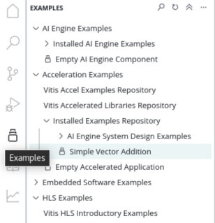
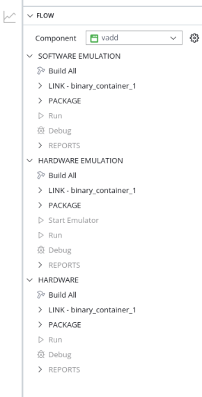
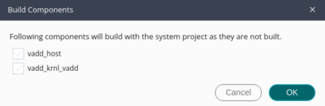
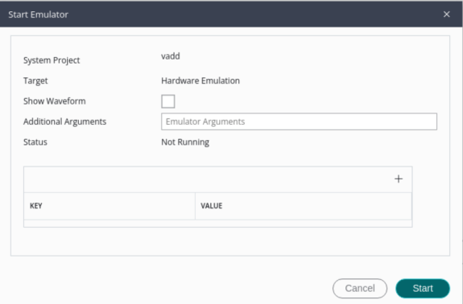
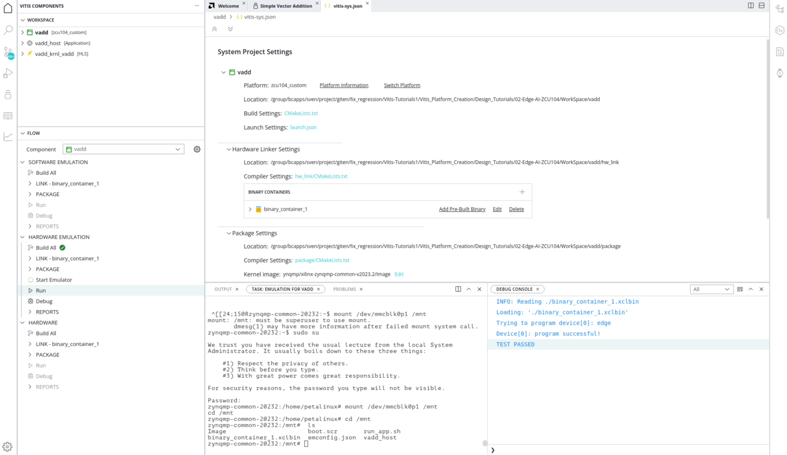

<table class="sphinxhide" width="100%">
 <tr width="100%">
    <td align="center"><h1>Vitis Platform Creation Tutorials</h1>
    <a href="https://www.xilinx.com/products/design-tools/vitis.html">See AMD Vitis™ Development Environment on xilinx.com</br></a>
    </td>
 </tr>
</table>

# Step 3: Test the Platform

- [Step 3: Test the Platform](#step-3-test-the-platform)
  - [Test 1: Read Platform Info](#test-1-read-platform-info)
  - [Test 2: Run Vector Addition Application](#test-2-run-vector-addition-application)
    - [Fast Track for Vector Addition](#fast-track-for-vector-addition)
  - [Congratulations](#congratulations)
  - [Next Steps](#next-steps)

## Test 1: Read Platform Info

Using the AMD Vitis Unified integrated development environment (IDE) setup in step2, the **platforminfo** tool can report XPFM platform information.

<details>
<summary><strong>Click for detailed logs</strong></summary>  

```bash
# Run in zcu104_software_platform directory
platforminfo ./zcu104_custom/export/zcu104_custom/zcu104_custom.xpfm

==========================
Basic Platform Information
==========================
Platform:           zcu104_custom
File:               /group/bcapps/sven/project/giten/Vitis-Tutorials1/Vitis_Platform_Creation/Design_Tutorials/02-Edge-AI-ZCU104/GUI/zcu104_custom/export/zcu104_custom/zcu104_custom.xpfm
Description:        

=====================================
Hardware Platform (Shell) Information
=====================================
Vendor:                           xilinx
Board:                            ZCU104_Custom_Platform
Name:                             ZCU104_Custom_Platform
Version:                          0.0
Generated Version:                2023.2
Hardware:                         1
Software Emulation:               1
Hardware Emulation:               0
Hardware Emulation Platform:      0
FPGA Family:                      zynquplus
FPGA Device:                      xczu7ev
Board Vendor:                     xilinx.com
Board Name:                       xilinx.com:zcu104:1.1
Board Part:                       xczu7ev-ffvc1156-2-e

=================
Clock Information
=================
  Default Clock Index: 2
  Clock Index:         1
    Frequency:         100.000000
  Clock Index:         2
    Frequency:         200.000000
  Clock Index:         3
    Frequency:         400.000000

==================
Memory Information
==================
  Bus SP Tag: HP0
  Bus SP Tag: HP1
  Bus SP Tag: HP2
  Bus SP Tag: HP3
  Bus SP Tag: HPC0
  Bus SP Tag: HPC1

=============================
Software Platform Information
=============================
Number of Runtimes:            1
Default System Configuration:  zcu104_custom
System Configurations:
  System Config Name:                      zcu104_custom
  System Config Description:               
  System Config Default Processor Group:   linux_psu_cortexa53
  System Config Default Boot Image:        standard
  System Config Is QEMU Supported:         1
  System Config Processor Groups:
    Processor Group Name:      linux_psu_cortexa53
    Processor Group CPU Type:  cortex-a53
    Processor Group OS Name:   Linux On psu_cortexa53
  System Config Boot Images:
    Boot Image Name:           standard
    Boot Image Type:           
    Boot Image BIF:            boot/linux.bif
    Boot Image Data:           linux_psu_cortexa53/image
    Boot Image Boot Mode:      
    Boot Image RootFileSystem: 
    Boot Image Mount Path:     
    Boot Image Read Me:        
    Boot Image QEMU Args:      qemu/pmu_args.txt:qemu/qemu_args.txt
    Boot Image QEMU Boot:      
    Boot Image QEMU Dev Tree:  
Supported Runtimes:
  Runtime: C/C++
```

</details>

You can verify clock information and memory information are set as expected.

## Test 2: Run Vector Addition Application

Vector addition is the simplest acceleration PL kernel. The Vitis Unified IDE can create this application automatically. Running this test can check the AXI control bus, memory interface, and interrupt setting in platform are working properly.

1. Creating Vector Addition Application

   - Go to `WorkSpace` directory created in step1
   - Run Vitis by typing `vitis -w .` in the console. `-w` is to specify the workspace. `.` means the current workspace directory. Close the welcome tab after Vitis launches.
   - Go to example view by clicking the example button and select and click **Simple Vector Addition**.
      
   - Click **Create Application from Template**. The project creation wizard would pop up. 
      - Input the **System project name** as `vadd` and use the default location for **System project location**. Then click **Next**.
      - Select **zcu104_custom** platform, click **Next**.
         >Note: If the platform component is not in the current workspace user could click **+** button to add the platform component.
      - Set **Kernel Image** to ```xilinx-zynqmp-common-v2023.2/Image```.
      - Set **Root FS** to ```xilinx-zynqmp-common-v2023.2/rootfs.ext4```.
      - Set **Sysroot** to ```zcu104_software_platform/xilinx-zynqmp-common-v2023.1/sysroots/cortexa72-cortexa53-xilinx-linux```. Then click **Next**.
      - Review the summary of your `vadd` system project and click **Finish**.

   After seconds the vadd system project, vadd host component and vadd kernel component will be ready in the component view.

2. Building Vector Addition Application

   Vadd system project supports three targets: Software emulation, Hardware emulation and Hardware. User could select the target accordingly following steps below.

   - Go to flow navigator and select vadd system project.

      

   - Click **Build All** under the target
   - In the Build Component setup dialog please enable all the components. Then click **OK**.

      

   After compilation is finished. Users can locate the `sd_card.img` by expanding the Output directory. This provides a logical view of the output. The actual path of `sd_card.img` file is located in `WrokSpace/vadd/build/<TARGET>/package/package/` directory. For example, if user targets hardware emulation, the `sd_card.img` file is in located in `WrokSpace/vadd/build/hw_emu/package/package/`. Users can also view the complete path of the `sd_card.img` file by simply hovering the mouse pointer over the image file.

3. Running Hardware Emulation 

   After the compilation for hardware emulation is finished, please follow steps below to run hardware emulation.

   - Click **Start Emulator** under **HARDWARE EMULATION** target. The Start Emulator setup page would pop up. Then click **Start**.

      

   - Click **Run** after the emulator boots up to terminal

      

   - Click **Stop emulator** to stop emulation after emulation is finished.

      

4. Running Vector Addition Application on the Board

   After the compilation for hardware is finished, please follow steps below to run on board.
   1. Copy ``vadd/build/hw/package/package/sd_card.img`` to local if the Vitis IDE is running on a remote server.

   2. Write ``sd_card.img`` onto the SD Card with SD Card image writer applications like Etcher on Windows or dd on Linux.

   3. Boot ZCU104 board with the SD card in SD boot mode.

      <details>
      <summary><strong>Steps to run the application:</strong></summary>

      First, login with user `petalinux` and set up a new password (it is then also the sudo password):

      1. Log into the system

         ```bash
         petalinux login:petalinux
         You are required to change your password immediately (administrator enforced).
         New password:
         Retype new password:
         petalinux:~$ sudo su
         We trust you have received the usual lecture from the local System
         Administrator. It usually boils down to these three things:
               #1) Respect the privacy of others.
               #2) Think before you type.
               #3) With great power comes great responsibility.
         Password:
         petalinux:/home/petalinux#
         ```

      2. Go to auto mounted FAT32 partition

         ```bash
         petalinux:/home/petalinux# cd /run/media/mmcblk0p1/
         ```

      3. Run vadd application

         ```bash
         ./simple_vadd krnl_vadd.xclbin
         ```

      It should show program prints and XRT debug information.

      ```
      TEST PASSED
      ```

      </details>


### Fast Track for Vector Addition

Scripts are provided to create the test applications on the custom platform we created. To use these scripts, please run the following steps.

1. Run build

   ```bash
   # cd to the step directory, e.g.
   cd step3_validate
   make all
   ```

   The default verification uses hardware emulation. To verify vadd application on hardware board, run the following command to generate the SD card image.

   ```bash
   cd step3_validate
   make sd_card
   ```

2. To clean the generated files, run the following commands:

   ```bash
   make clean
   ```

The command line flow has slight differences comparing to Vitis IDE flow.

The vector addition application is called `vadd` and `binary_container_1.xclbin` in the Vitis IDE flow. The generated files in command line flow are called `simple_vadd` and `krnl_vadd.xclbin`.


## Congratulations

You have completed creating a custom platform from scratch and verifying it with a simple vadd application and a relatively complex Vitis AI use cases.

Feel free to check more tutorials in this repository.

## Next Steps

If user need to do iteration for your project, you could go through the [Iteration Guidelines](./Iteration_guideline.md) to do iterations.

<p class="sphinxhide" align="center"><sub>Copyright © 2020–2023 Advanced Micro Devices, Inc</sub></p>

<p class="sphinxhide" align="center"><sup><a href="https://www.amd.com/en/corporate/copyright">Terms and Conditions</a></sup></p>
