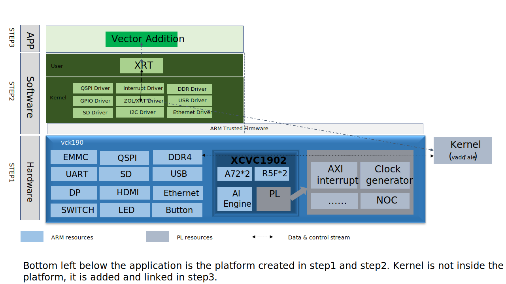

<table class="sphinxhide" width="100%">
 <tr width="100%">
    <td align="center"><h1>Vitis™ Platform Creation Tutorials</h1>
    <a href="https://www.xilinx.com/products/design-tools/vitis.html">See Vitis™ Development Environment on xilinx.com </a>
    </td>
 </tr>
</table>

# Versal Custom Platform Creation Tutorial

***Version: 2023.1***

In this module, the VCK190 board will be regarded as a customer's board. You will create a hardware design based on the AMD Versal™ Adaptive SoC Extensible Part Support Example Design, using a pre-built Linux common image and `createdts` command to generate software components.Then, you create an embedded Versal acceleration platform for this customer's board. Finally, you will run several applications to test this platform. If you merely create a platform to validate your kernels, then the [Vitis Platform Quick Start](../../../Getting_Started/Vitis_Platform/README.md) would be a quick choice for you.

For your reference, this example system total structure is similar to the following.

In a general Vitis acceleration platform design, the Vitis platform and application development can be divided into these parts:

1. Platform hardware design creation in the AMD Vivado™ Design Suite. It exports an XSA file with clock, reset, AXI interface, and interrupt signals and properties.
2. Platform software preparation with common image or using PetaLinux tool, including Linux kernel, rootfs, device tree, and boot components.
3. Platform creation in Vitis to combine all hardware and software components and generate XPFM description.
4. Create applications in Vitis against the platform. Vitis generates a host application, xclbin, and `sd_card.img`.
5. Write `sd_card.img` to a SD card or update host application and xclbin to an existing SD card.

In this module, you will utilize the Versal Extensible Part Support Design (CED) to create a hardware design. Compared with the Versal Extensible Design, which is used in [Vitis Platform Quick Start](../../../Getting_Started/Vitis_Platform/README.md), the part support design leaves the board level configurations, e.g., processing system (PS) side peripherals and double data rate (DD) related parameters for you to do configuration.

To prepare the software components, you will utilize common image released by AMD and `createdts` command to generate the device tree file.

After the whole software and hardware components are ready, you will package the platform.

In each step, you will validate the generated files to make sure they work as expected. A frequent test methodology can help to narrow down the root causes if any error occurs. Lastly, you will run several test applications on this platform to test this platform.

The total flow is similar the following:

Navigate through these steps with the following table of contents links.

- [Step 1: Create a Hardware Design](./step1.md)
- [Step 2: Create a Vitis Platform](./step2.md)
- [Step 3: Run Applications on the Vitis Platform](./step3.md)
- [Iteration Guidelines](./Iteration_guideline.md)
- [Frequently Asked Questions](faq.md)

## Reference

- [UG1393: Vitis Acceleration Flow User Guide](https://docs.xilinx.com/r/en-US/ug1393-vitis-application-acceleration)
- [Vitis Embedded Platform Source Github Repository](https://github.com/Xilinx/Vitis_Embedded_Platform_Source)
- [Versal Adaptive SoC Programmable Network on Chip and Integrated Memory Controller LogiCORE IP Product Guide (PG313)](https://docs.xilinx.com/r/en-US/pg313-network-on-chip)

## Changelog

### 2022.2

- `createdts` add support for your device tree.

### 2022.1

- From this version, you begin to use pre-built Linux common image instead of building Linux components with PetaLinux because the pre-built common image provides most common features for Vitis acceleration, and it can help expedite the platform creation process. If you wish to leverage the PetaLinux tool to customize your system, refer to the [PetaLinux Customization Tutorial](../../Feature_Tutorials/02_petalinux_customization/README.md).
- Simplify the device tree generation flow by using the newly introduced `createdts` XSCT command.
- Add validation for every step's output.

### 2021.2

- In Step 1, the Vivado project exports the XSA for hardware and hardware emulation seperatedly. When creating the platform in [step3](./step3.md), it is recommended to provide seperate XSA for hardware and hardware emulation.

Copyright © 2020–2023 Advanced Micro Devices, Inc

<a href="https://www.amd.com/en/corporate/copyright">Terms and Conditions</a>

