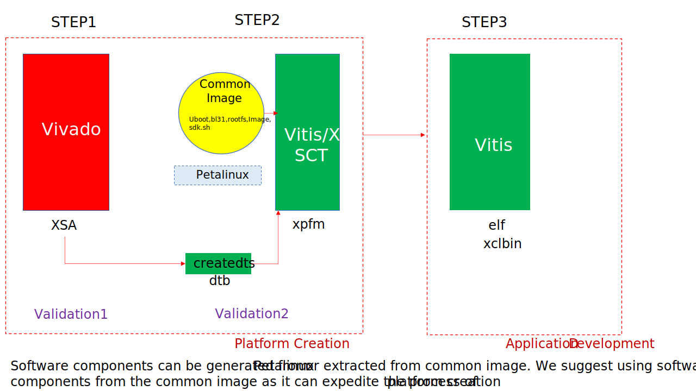

<!-- 
# Copyright 2022 Xilinx Inc.
# 
# Licensed under the Apache License, Version 2.0 (the "License");
# you may not use this file except in compliance with the License.
# You may obtain a copy of the License at
#
#     http://www.apache.org/licenses/LICENSE-2.0
#
# Unless required by applicable law or agreed to in writing, software
# distributed under the License is distributed on an "AS IS" BASIS,
# WITHOUT WARRANTIES OR CONDITIONS OF ANY KIND, either express or implied.
# See the License for the specific language governing permissions and
# limitations under the License.
-->

<table class="sphinxhide" width="100%">
 <tr width="100%">
    <td align="center"><h1>Vitis™ Platform Creation Tutorials</h1>
    <a href="https://www.xilinx.com/products/design-tools/vitis.html">See Vitis™ Development Environment on xilinx.com </a>
    </td>
 </tr>
</table>

# Versal Custom Platform Creation Tutorial

***Version: 2022.2***

In this module, VCK190 board will be regarded as a customer's board. We will create a hardware design based on the Versal Extensible Part Support Example Design, use pre-built Linux common image and `createdts` command to generate software components. And then create an embedded Versal acceleration platform for this customer's board. Last we will run several applications to test this platform. If you merely create a platform to validate your kernels. Then the [Vitis Platform Quick Start](../../../Getting_Started/Vitis_Platform/README.md) would be a quick choice for you.

This example system total structure is like the following for your reference.

In a general Vitis acceleration platform design, Vitis platform and application development can be divided into these parts:

1. Platform hardware design creation in Vivado. It exports an XSA file with clock, reset, AXI interface and interrupt signals and properties.
2. Platform software preparation with common image or using PetaLinux tool, including Linux kernel, rootfs, device tree and boot components.
3. Platform creation in Vitis to combine all hardware and software components and generate XPFM description.
4. Create applications in Vitis against the platform. Vitis generates host application, xclbin and sd_card.img.
5. Write sd_card.img to SD card or update host application and xclbin to an existing SD card.

In this module we will utilize the Versal Extensible Part Support Design (CED) to create a hardware design. Compared with the Versal Extensible Design which is used in [Vitis Platform Quick Start](../../../Getting_Started/Vitis_Platform/README.md), the part support design leaves the board level configurations, e.g., PS side peripherals and DDR related parameters for user to do config.

To prepare the software components, we will utilize common image released by Xilinx and `createdts` command to generate Device tree file. 

After the whole software and hardware components are ready, we'll package the platform. 
 
In each step, we'll validate the generated files to make sure they work as expected. A frequent test methodology can help to narrow down the root causes if any error occurs. At last, we'll run several test applications on this platform to test this platform.

The total flow is like the following:

Please navigate through these steps with the following table of contents links.

- [Step 1: Create a Hardware Design](./step1.md)
- [Step 2: Create a Vitis Platform](./step2.md)
- [Step 3: Run applications on the Vitis Platform](./step3.md)
- [Frequently Asked Questions](faq.md)

## Reference

- [UG1393: Vitis Acceleration Flow User Guide](https://docs.xilinx.com/r/en-US/ug1393-vitis-application-acceleration)
- [Vitis Embedded Platform Source Github Repository](https://github.com/Xilinx/Vitis_Embedded_Platform_Source)
- [Versal ACAP Programmable Network on Chip and Integrated Memory Controller LogiCORE IP Product Guide (PG313)](https://docs.xilinx.com/r/en-US/pg313-network-on-chip)

## Changelog
### 2022.2
- `createdts` add support for user's device tree
### 2022.1
- From this version we begin to use pre-built Linux common image instead of building Linux components with PetaLinux because the pre-built common image provides most common features for Vitis acceleration and it can help expedite the platform creation process. If you wish to leverage the PetaLinux tool to customize your system you can refer to the [PetaLinux Customization Tutorial](../../Feature_Tutorials/02_petalinux_customization/README.md).
- Simplify the device tree generation flow by using the newly introduced `createdts` XSCT command.
- Add validation for every step's output.
### 2021.2
- In Step 1, the Vivado project exports XSA for hardware and hardware emulation seperatedly. When creating the platform in [step3](./step3.md), it's recommended to provide seperate XSA for hardware and hardware emulation.

Copyright&copy; 2022 Xilinx

