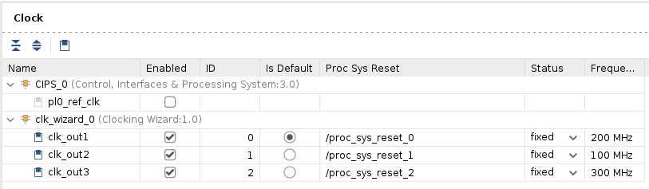

<!-- 
# Copyright 2020 Xilinx Inc.
# 
# Licensed under the Apache License, Version 2.0 (the "License");
# you may not use this file except in compliance with the License.
# You may obtain a copy of the License at
#
#     http://www.apache.org/licenses/LICENSE-2.0
#
# Unless required by applicable law or agreed to in writing, software
# distributed under the License is distributed on an "AS IS" BASIS,
# WITHOUT WARRANTIES OR CONDITIONS OF ANY KIND, either express or implied.
# See the License for the specific language governing permissions and
# limitations under the License.
-->

<table width="100%">
 <tr width="100%">
    <td align="center"><h1>Versal Custom Platform Creation Tutorial</h1>
    </td>
 </tr>
</table>

## Step 1: Hardware Settings for Vitis Platform

The Versal Extensible Platform Example has setup the platform properties. We will review these properties in this step.

For a custom board platform, you will need to setup these properties manually. They can be set in GUI or Tcl. We will discuss the setup flow in detail.

### Review the Versal Extensible Platform Example Platform Setup

1. Launch Vivado and open the design we created in step 0 if you haven't

   - Make sure the block design is open. If not, click **Open Block Design** in **Flow Navigator**

2. (Optional) Export block diagram tcl to cross check the tcl commands or recreate design in the future.

   - Click **File -> Export -> Export Block Diagram**
   - Check the Tcl file location and click **OK**
   - Open the exported tcl file

2. Go to **Platform Setup** tab. 

   - If it's not open, click menu Window -> Platform Setup to open it.

   > Note: If you can't find Platform Setup tab, please make sure your design is a Vitis platform project. Open **Settings** in **Project Manager**, go to **Project Settings -> General** tab, make sure **Project is an extensible Vitis platform** is enabled.

3. Review the AXI port settings

   - In **axi_noc_ddr4**, S01_AXI to S27_AXI are enabled. **SP Tag** is set to **DDR**

   

   **Note**: Vitis emulation automation scripts require that AXI slave interfaces on Versal platforms to have SP Tag as either **DDR** or **LPDDR**. 

   - In **icn_ctrl_0** and **icn_ctrl_1** , M01_AXI to M15_AXI are enabled. In **icn_ctrl**, M03_AXI and M04_AXI are enabled. Memport is set to M_AXI_GP. SP Tag is empty. These ports provide the AXI master interfaces to control PL kernels. In the block diagram, icn_ctrl_0 and icn_ctrl_1 connects to an AXI Verification IP because the AXI SmartConnect IP requires a load. The AXI Verification IP is used here as a dummy.

   

   **Note**: SP Tag for AXI Master doesn't take effect.

4. Review the Clock settings

   - In Clock tab, clk_out1, clk_out2, clk_out3 from **clk_wizard_0** are enabled with id {0,1,2}, frequency {200MHz, 100MHz, 300MHz}.
   - clk_out1 is the default clock. V++ linker will use this clock to connect the kernel if link configuration doesn't specify any clocks.
   - The Proc Sys Reset property is set to the synchronous reset signal associated with each clock.

   

5. Review the Interrupt Tab

   - In Interrupt tab, In0 to In31 port of **xlconcat** is enabled.

   

### Review the Simulation Model

The Versal Extensible Platform Example has setup the simulation model of each IP properly. We will review the settings in this session. If you created the block design by yourself, please make sure these settings are applied before running emulation on your platform.

Some blocks in the block design has multiple types of simulation models. Vitis emulation requires these blocks to use SystemC TLM (Transaction-level Modeling) model when available. TLM is the default simulation model for CIPS, NOC and AI Engine. We can review them to make sure they are correct before exporting the hardware.

1. Review CIPS simulation model settings

   - In Vivado GUI, select the CIPS instance
   - Check the ***Block Properties*** window
   - In ***Properties*** tab, it shows **ALLOWED_SIM_MODELS** is `tlm,rtl`, **SELECTED_SIM_MODEL** is `tlm`. It means this block supports two simulation models. We selected to use `tlm` model.

   

2. Review the simulation model property for NOC and AI Engine in the block diagram.

### Export Hardware XSA

1. Generate Block Diagram

   - Click **Generate Block Diagram** from Flow Navigator window

   

   - Select **Synthesis Options** to **Global** to save generation time. 

   

   - Click **Generate** button

   > Note: Synthesis default option **Out of context per IP** will synthesize each IP in the block diagram. Since we will use pre-synthesis XSA in next steps, we don't need to synthesize these IPs.

   **Note**: It's safe to ignore this critical warning. Vitis will connect this signal in the future.

   

2. Export hardware platform with the following scripts

   - Click **File -> Export -> Export Platform**. Alternative ways are: **Flow Navigator** window: **IP Integrator -> Export Platform**, or the **Export Platform** button on the bottom of **Platform Setup** tab.
   - Click **Next** on Export Hardware Platform page
   - Select **Hardware**. If there are any IP that doesn't support simulation, we need to generate Hardware XSA and Hardware Emulation XSA separately. Click **Next**
   - Select **Pre-synthesis**, because we're not making an DFX platform. Click **Next**
   - Input Name: **VCK190_Custom_Platform**, click Next
   - Update file name to **vck190_custom_hw**, click Next.
   - Review the summary. Click **Finish**

### Export Hardware Emulation XSA

A change in Vitis 2021.2 requires hardware and hardware emulation provide their own XSA files during platform creation step in XSCT. One XSA with both hardware and hardware emulation content is still supported in 2021.2. It will be deprecated in the future.

> Note: We used the same hardware and hardware emulation design for this simple project. You can use different Vivado designs for hardware and hardware emulation. Platform developers should keep the two designs logically identical. Otherwise your emulation result cannot represent your hardware design. 

1. Export hardware emulation platform with the following scripts

   - Click **File -> Export -> Export Platform**. Alternative ways are: **Flow Navigator** window: **IP Integrator -> Export Platform**, or the **Export Platform** button on the bottom of **Platform Setup** tab.
   - Click **Next** on Export Hardware Platform page
   - Select **Hardware Emulation**. If there are any IP that doesn't support simulation, we need to generate Hardware XSA and Hardware Emulation XSA separately. Click **Next**
   - Select **Pre-synthesis**, because we're not making an DFX platform. Click **Next**
   - Input Name: **VCK190_Custom_Platform**, click Next
   - Update file name to **vck190_custom_hwemu**, click Next.
   - Review the summary. Click **Finish**

### Next Step

Now we finish the Hardware platform creation flow. Next we would go to [step 2](./step2.md) to create platform software.
   

## References

[AR# 72033: How do I add boards and example designs to my Vivado environment?](https://www.xilinx.com/support/answers/72033.html)

Copyright&copy; 2021 Xilinx

