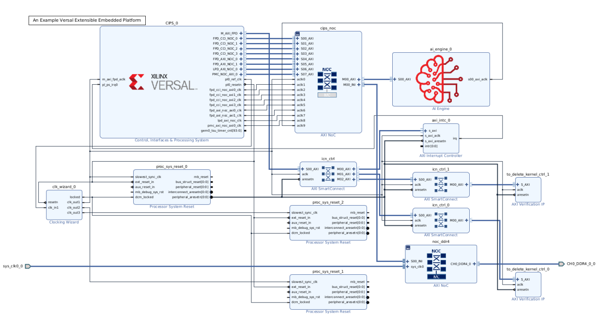

<table class="sphinxhide" width="100%">
 <tr width="100%">
    <td align="center"><h1>Vitis™ Platform Creation Tutorials</h1>
    <a href="https://www.xilinx.com/products/design-tools/vitis.html">See Vitis™ Development Environment on xilinx.com</br></a>
    </td>
 </tr>
</table>

# Step 1: Create a Hardware Platform for the Customer's VCK190

In this step, you will create a hardware design using the AMD Versal™ Adaptive SoC Extensible Embedded Part Support Example Platform for customer's VCK190 board (as mentioned, you will regard VCK190 as a customer's board). As a part support design for Versal adaptive SoCs, it has already added the CIPS, NOC, NOC DDR, AI Engine, and other platform required IPs. And board-level configurations are reserved, e.g., PS side peripherals, clock, and DDR-related parameters for you to configure due to different boards have different peripherals. After you configure the PS side CIPS, DDR-related parameters, and other platform related properties, the XSA file will be exported.

## Create the Vivado Project

1. Create workspace and launch the AMD Vivado™ Design Suite.

   Run the following command to create a workspace and launch Vivado in the console.

   ```bash
   mkdir WorkSpace #create workspace
   cd WorkSpace
   source <Vivado_Install_Directory>/settings64.sh
   ```

2. Download the Versal Customer Extensible Embedded Platform Example.

   - Click menu **Tools -> Vivado Store..**.
   - Click **OK** to agree to download open source examples from web.
   - Select **Example Designs ->Platform -> Versal Extensible Embedded Platform part_support** , and click the download button on the tool bar.
   - Click **Close** after the installation is complete.

      

3. Create the Versal Extensible Embedded Part Support Platform Example project.

   - Click **File -> Project -> Open Example..**.
   - Click **Next**.
   - Select **Versal Extensible Embedded Platform (Part based)** in Select Project Template window. Then click **Next**.
   - In Project Name dialog set Project name to **custom_hardware_platform**, and confirm your project location is in **Workspace** directory. Keep **Create project subdirectory** option checked. Then, click **Next**.
   - In default part dialog, select the silicon model. Select **XCVC1902-vsva2197-2MP-e-S** as the chip on VCK190 board is `XCVC1902-vsva2197-2MP-e-S`, which you can find on board user manual.

      

   - Click **Next**. The following table displays.

      

   - Configure the Clocks Settings. You can enable more clocks, update output frequency, and define default clock in this view. In this example, you can keep the default settings.
   - Configure the Interrupt Settings. You can choose how many interrupt should this platform supports. 63 interrupts mode will use two `AXI_INTC` in cascade mode. In this example, you can keep the default setting.
   - Enable AIE or not. In this example, you can keep the default setting.
   - Click **Next**.
   - Review the new project summary and click **Finish**.
   - After a while, you will see the design example has been generated.

   The generated design is simliar to the following:

   

   At this stage, the Vivado block automation has added a Control, Interface & Processing System (CIPS) block, AXI NOC block, AI Engine, and all supporting logic blocks to the diagram. However, board level-related configurations are not set as different board has different resources. Then you will configure the CIPS PS part and DDR related parameters according to the board.

### Configure the Block

1. Configure the Versal_cips IP.

   This step is mainly to configure the peripherals according to your board.

   - Double-click `CIPS_0` in the Block Diagram window. Click **Next**, then click **PS PMC** to config the PS-PMC parts one by one.
  
     - Go to **Boot Mode**, and select the supported boot interface according to your board. In this case, you use the default selection **SD1/eMMC1** boot as VCK190 support **SD1/eMMC1** boot. Then choose slot type as **SD3.0** by clicking the drop-down button. Enable **Detect Location** and **Bus Power Location**. The configured setting look similar to the following:

         

     - Go to **Peripherals**, select the peripherals according to your board. In this case we select several interfaces like the following. Please enable the **MDIO** support when you select **GEM0**.

         

         >**NOTE:** When you configure the peripherals, there are some red warnings about pin conflicts. In this case, just ignore it; you will resolve it in IO configuration tab.  

     - Go to **IO**, select the corresponding IO pins according to your board. In this case, you configure the IO pins like the following:

         

         - Click **Finish** to exit PS PMC configuration.
         - Click **Finish** to exit Versal_cips configuration.

         >**NOTE:**
         >
         >- Select the peripherals, boot mode, and IO pin-group according to your own board.
         >- Regarding the clock, you use the default configuration. If you have other configurations for your board, go to clocking part to configure it.

2. Configure the noc_ddr4 IP.

   This step is to configure the DDR-related parameters.

   - Double-click the noc_ddr4 IP. Click **DDR Basic** tab, and configure the following settings for this tab.

      

      >**NOTE:** Set the input system clock period according to your board. In this case, you change the input system clock period to 5000 as the input frequency is 200M on VCK190 board.

   - Click **DDR Memory** tab, configure the following settings for this tab.

      

      >**NOTE:** Set the DDR memory parameters according to the DDR on your board.

   - Also, double-click the external port `sys_clk0_0`, and change the value of Frequency to **200**M HZ beacuse the 200M HZ is provided for DDR4 on a VCK190 board.

      Now you have configured the PS side peripherals and DDR-related parameters. But the external DDR port connection is not set. Therefore, you will add the DDR constraint file to set the DDR PIN placement.

3. Config the noc_lpddr4 IP. This step is to config the LPDDR4 related parameters.

   - Double-click the noc_lpddr4 IP, click the **General** tab, and configure the following settings for this tab.
  
      

   - Click the **DDR Basic** tab, configure the following settings for this tab.

      

   - Click the **DDR Memory** tab, enable the **Flipped Pinout** option like the foolowing:

      

   - Click **OK** to confirm and exit the configuration.
   - Click **Run Connection Automation**, select all the interfaces, then click **OK**.

      

   - Double-click the external port `sys_clk0_1`, and change the value of Frequency to **200.321** M HZ.

      >**NOTE:** Set the LPDDR memory parameters according to the LPDDR4 on your board.

### Add the Constraint File

   As customer board has no ready-made board file, which contains the pin placement data. Pin location file in XDC file format, which contains the DDR, clocks, and resets-related pin placement, is required for the hardware design. In this case, you have two external ports related to DDR on your design which should be declared about the PIN connections. Therefore, a [ddr.xdc](./ref_files/step1_vivado/ddr.xdc) file for DDR pin placement is prepared in advance to illustrate how to prepare the XDC file. Use the following steps to add the XDC format constraint file.

- Copy the DDR.xdc file to the **WorkSpace** directory
  - Click the **source** under the **BLOCK DESIGN** dialog, select the **conttraints** by clicking your right button on your mouse, selct **Add source**.
  - In Add source set dialog, click **Next**.
  - Click **Add files**, then browse to **WorkSpace** directory and select **ddr.xdc file**
  - Keep the option of **copy the constraint files into  project** checked.

      

  - Click **Finish**

Now you have completed the hardware design. In the coming steps, you will review the platform-related property settings.

### Modify the IP address in address editor (Optional)

   >Note: This step is not mandatory for platform creation. Please refer to it according to your requirement.

   If users need to modify the IP address please go through following steps.
   1. Check the location address space of your IP 
   2. Go to address editor by clicking **Window**-> **Address editor** to open it.

   Next, we will use the example of modifying the interrupt controller IP address to illustrate how to modify the IP address in the address editor.

   - As the interrupt controller is connected with **M_AXI_FPD** domain, we need check FPD domain supported address space. Please check the [Versal Technical Reference Manual](https://docs.xilinx.com/r/en-US/am011-versal-acap-trm/High-level-Address-Map). You could find following address range. That means the IP connected to FPD domain could be placed in 0xA400_0000-0xAFFF_FFFF or 0xB000_0000-0xBFFF_FFFF address space. But conflict is not allowed.

      

   - Go to address editor, modify the interrupt controller IP base address according to your requirement. Following is just an example.

      
      
   >Note: The modified base address should be in the LPD address space and the high address should also be in the LPD address space.
### Review the Versal Extensible Platform Example Part_base Platform Setup

1. (Optional) Export block diagram Tcl to cross check the Tcl commands, or recreate design in the future.

   - Click **File -> Export -> Export Block Diagram**.
   - Check the Tcl file location, and click **OK**.
   - Open the exported tcl file

2. Go to the **Platform Setup** tab.

   - If the tab is not open, click menu **Window -> Platform Setup** to open it.

      > **NOTE:** If you cannot find Platform Setup tab, make sure your design is a Vitis platform project. Open **Settings** in **Project Manager**, go to **Project Settings -> General** tab, and make sure **Project is an extensible Vitis platform** is enabled.

3. Review the AXI port settings.

   - In **axi_noc_ddr4**, S01_AXI to S27_AXI are enabled. **SP Tag** is set to **DDR**.

      

      >**NOTE:** Vitis emulation automation scripts require that AXI slave interfaces on Versal platforms to have SP Tag as either **DDR** or **LPDDR**.

   - In **icn_ctrl_0** and **icn_ctrl_1**, M01_AXI to M15_AXI are enabled. In **icn_ctrl**, M03_AXI and M04_AXI are enabled. Memport is set to M_AXI_GP. SP Tag is empty. These ports provide the AXI master interfaces to control PL kernels. In the block diagram, icn_ctrl_0 and icn_ctrl_1 connects to an AXI Verification IP because the AXI SmartConnect IP requires a load. The AXI Verification IP is used here as a dummy.

      

      >**NOTE:** SP Tag for AXI Master does not take effect.

4. Review the clock settings.

   - In Clock tab, `clk_out` is the default clock. V++ linker will use this clock to connect the kernel if link configuration doesn't specify any clocks.
   - The Proc Sys Reset property is set to the synchronous reset signal associated with each clock.

      

5. Review the Interrupt tab.

   - In Interrupt tab, **intr** is enabled.

      

### Review the Simulation Model

The Versal Extensible Platform Example has set up the simulation model of each IP properly. You will review the settings in this session. If you created the block design by yourself, ensure these settings are applied before running emulation on your platform.

Some blocks in the block design has multiple types of simulation models. Vitis emulation requires these blocks to use the SystemC transaction-level modeling (TLM) model when available. TLM is the default simulation model for CIPS, NOC, and AI Engine. Review them to make sure they are correct before exporting the hardware.

1. Review CIPS simulation model settings.

   - In Vivado GUI, select the CIPS instance.
   - Check the ***Block Properties*** window.
   - In **Properties** tab, it shows **ALLOWED_SIM_MODELS** is `tlm,rtl`, **SELECTED_SIM_MODEL** is `tlm`. It means this block supports two simulation models. You selected to use `tlm` model.

       

2. Review the simulation model property for NOC and AI Engine in the block design.

### Export Hardware XSA

1. Validate the block design by clicking ***Validate Design*** button

   - There should be only one interrupt controller related Critical Warning in the above design, because intr is floating and v++ will be responsible to connect it during acceleration application compiling.

      ```
      [BD 41-759] The input pins (listed below) are either not connected or do not have a source port, and they don't have a tie-off specified. These pins are tied-off to all 0's to avoid error in Implementation flow.
      Please check your design and connect them as needed: 
      /axi_intc_0/intr
      ```

2. Update the module wrapper file.

   Because you have changed the block design, the top module wrapper file should be updated.

   - In **Sources** tab, right-click the **ext_platform_part_wrapper** file.
   - Select **Remove file from project** and slect **also delete the project local file form disk** and click **OK**.

      

   - Right-click **ext_platform_part.bd** in Design Sources group.
   - Select **Create HDL Wrapper...**.
   - Select **Let Vivado manage wrapper and auto-update**.
   - Click **OK** to generate wrapper for block design.

3. Select **Generate Block Design** from Flow Navigator. Set **Synthesis Options** to **Global**. It will skip IP synthesis during generation. Then, click **Generate**.

4. Export hardware platform with the following scripts

   - Click **File -> Export -> Export Platform**. Alternative ways are: **Flow Navigator** window: **IP Integrator -> Export Platform**, or the **Export Platform** button on the bottom of **Platform Setup** tab.
   - Click **Next** on Export Hardware Platform page.
   - Select **Hardware**. If there are any IP that doesn't support simulation, we need to generate Hardware XSA and Hardware Emulation XSA separately. Click **Next**
   - Select **Pre-synthesis**, because we're not making an DFX platform. Click **Next**
   - Keep it as it is in **Platform properties** setup dialog, click **Next**
   - Input XSA file name to **custom_hardware_platform_hw**, click Next.
   - Review the summary. Click **Finish**.
   - **custom_hardware_platform_hw.xsa** file will be generated in `custom_hardware_platform` directory.

   Rerun the Export Platform wizard again, and export the XSA for hardware emulation.

   - Click **File -> Export -> Export Platform**. Alternative ways are: **Flow Navigator** window: **IP Integrator -> Export Platform**, or the **Export Platform** button on the bottom of **Platform Setup** tab.
   - Click **Next** on Export Hardware Platform page
   - Select **Hardware emulation**. If there are any IP that doesn't support simulation, we need to generate Hardware XSA and Hardware Emulation XSA separately. Click **Next**
   - Select **Pre-synthesis**, because we're not making an DFX platform. Click **Next**
   - Keep it as it is in **Platform properties** setup dialog, click **Next**
   - Input XSA file name to **custom_hardware_platform_hwemu**, click Next.
   - Review the summary. Click **Finish**. **custom_hardware_platform_hwemu.xsa** file will be generated in `custom_hardware_platform` directory.
  
   You can also execute the following scripts to export the platform.

   ```tcl
   # Setting platform properties
   set_property pfm_name {xilinx:vck190_es:VCK190_Custom_Platform:0.0} [get_files -norecurse *.bd]
   set_property platform.default_output_type "sd_card" [current_project]
   set_property platform.design_intent.embedded "true" [current_project]
   set_property platform.design_intent.server_managed "false" [current_project]
   set_property platform.design_intent.external_host "false" [current_project]
   set_property platform.design_intent.datacenter "false" [current_project]
   # Export Expandable XSA with PDI
   write_hw_platform -hw -force -file ./custom_hardware_platform_hw.xsa
   write_hw_platform -hw_emu -force -file ./custom_hardware_platform_hwemu.xsa
   ```

### Validate the Output of Step 1

   Refer to [Platform Validation Example](../..//Feature_Tutorials/03_platform_validation/)

### Fast Track

Scripts are provided to recreate projects, and generate outputs in each step. To use these scripts, run the following steps.

1. Run build.

   ```bash
   # cd to the step directory, e.g.
   cd step1_vivado
   make all
   ```

2. To clean the generated files, run:

   ```bash
   make clean
   ```

This script creates the same design, generate block diagram and export XSA.

A top level all in one build script is also provided. To build everything (step 1 to step 3) with one command, go to ***ref_files*** directory and run:

```bash
cd ref_files
make all COMMON_IMAGE_VERSAL=<path/to/common_image/>  #Specify the path of the common image
```

This command is to generate platform with pre-built software components and do software emulation by running vadd applicationand aie_adder to test this platform.

```
make sd_card COMMON_IMAGE_VERSAL=<path/to/common_image/>  #Specify the path of the common image
```

This command is to generate platform with pre-built software components and do hardware test on board by running vadd and aie_adder application to test this platform.

To clean all the generated files, run:

```bash
make clean
```

### Next Step

Now you have a hardware design. Next, you will go to [Step 2: Create the Vitis Platform with Common Image](./step2.md).

<p class="sphinxhide" align="center"><sub>Copyright © 2020–2023 Advanced Micro Devices, Inc</sub></p>

<p class="sphinxhide" align="center"><sup><a href="https://www.amd.com/en/corporate/copyright">Terms and Conditions</a></sup></p>
