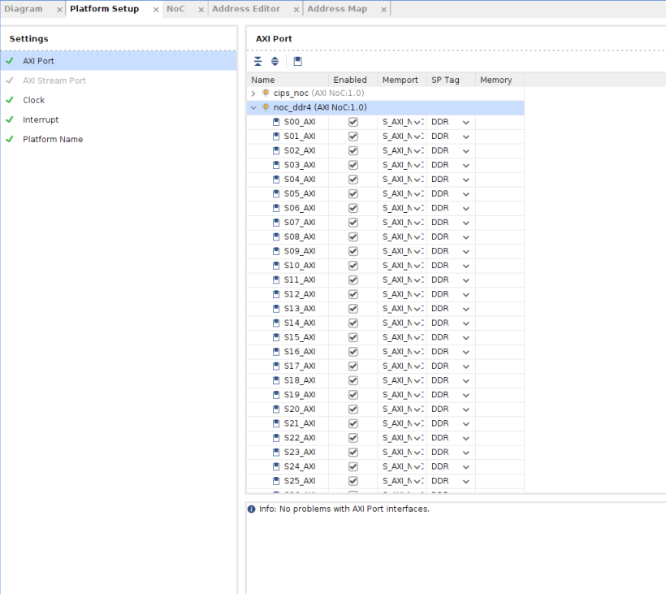

<!-- 
# Copyright 2022 Xilinx Inc.
# 
# Licensed under the Apache License, Version 2.0 (the "License");
# you may not use this file except in compliance with the License.
# You may obtain a copy of the License at
#
#     http://www.apache.org/licenses/LICENSE-2.0
#
# Unless required by applicable law or agreed to in writing, software
# distributed under the License is distributed on an "AS IS" BASIS,
# WITHOUT WARRANTIES OR CONDITIONS OF ANY KIND, either express or implied.
# See the License for the specific language governing permissions and
# limitations under the License.
-->

## Step 1: Create a hardware platform for customer's VCK190

In this step, we will utilize Versal Extensible Embedded Part_Support Example Platform to create a hardware design for customer's vck190 board (as mentioned we will regard vck190 as a customer's board). As a part support design for Versal it has already added the CIPS, NOC, NOC DDR, AI engine and other platform required IPs and leaves the board level configurations, e.g. PS side peripherals, clock and DDR related parameters for user to configure due to different boards have different peripherals. After we config the PS side of the CIPS, DDR related parameters and other platform related properties, XSA file will be exported. At last we will do three tests to validate the output of this step.


### Create Vivado project 

1. Create workspace and Launch Vivado if you haven't

   Run the following command to create a workspace and launch Vivado in the console

   ```bash
   mkdir WorkSpace #create workspace
   cd WorkSpace
   source <Vivado_Install_Directory>/settings64.sh
   ```

2. Download the Versal Customer Extensible Embedded Platform Example
   
   - Click menu **Tools -> Vivado Store..**
   - Click **OK** to agree to download open source examples from web
   - Select **Example Designs ->Platform -> Versal Extensible Embedded Platform part_support** and click the download button on the tool bar
   - Click **Close** after installation complete.

   

3. Create the Versal Extensible Embedded Part Support Platform Example project.

   - Click **File -> Project -> Open Example..**
   - Click **Next**
   - Select **Versal Extensible Embedded Platform (Part based)** in Select Project Template window. Then click **Next**.
   - In Project Name dialog set Project name to **custom_hardware_platform** and confirm your project location is in **Workspace** directory. Keep **Create project subdirectory** option checked. Then click **Next**.
   - In default part dialog select the silicon model. Please select **XCVC1902-vsva2197-2MP-e-S** as the chip on VCK190 board is `XCVC1902-vsva2197-2MP-e-S`  which you can find on board user manual. 

   

   - Click **Next**. You would get following table.

   

   - Configure Clocks Settings. You can enable more clocks, update output frequency and define default clock in this view. In this example, we can keep the default settings.
   - Configure Interrupt Settings. You can choose how many interrupt should this platform support. 63 interrupts mode will use two AXI_INTC in cascade mode. In this example, we can keep the default setting.
   - Configure Memory Settings. By default, the example design will only enable DDR4. If you enable LPDDR4, it will enable both DDR4 and LPDDR4. In this example, we can keep the default setting.
   - Enable AIE or not. In this example, we can keep the default setting.
   - Click **Next**.
   - Review the new project summary and click **Finish**.
   - After a while, you will see the design example has been generated.

   The generated design is like the following:

   

   At this stage, the Vivado block automation has added a Control, Interface & Processing System (shorten with CIPS in the future) block, AXI NOC block, AI Engine, and all supporting logic blocks to the diagram. But board level related configurations are not set as different board has different resources. Then we will config the CIPS PS part and DDR related parameters according to the board.

### Config the block

1. Config the Versal_cips IP

   This step is mainly to config the peripherals according to our board.
      
   - Double-click `CIPS_0` in the Block Diagram window. Click **Next**, then click **PS PMC** to config the PS-PMC parts one by one
  
     - Go to **Boot Mode**, select the supported boot interface according to your board. In this case we use the default selection **SD1/eMMC1** boot as VCK190 support **SD1/eMMC1** boot. Then choose slot type as **SD3.0** by clicking drop-down button. Enable **Detect Location** and **Bus Power Location**. configured setting is like the following:

     

     - Go to **Peripherals**, select the peripherals according to your board. In this case we select several interfaces like the following. Please enable the **MDIO** support when you select **GEM0**.
      
     
     
     >Note: When you configure the peripherals, there are some red warnings about pin conflicts. In this case just ignore it we will resolve it in IO configuration tab.  

     - Go to **IO**, select the corresponding IO pins according to your board. In this case we configure the IO pins like the following:
      
     

   - Click **Finish** to exit PS PMC config. 
   - Click **Finish** to exit Versal_cips config. th present block is like the following:

   

   **Note**:
      - Select the peripherals, boot mode and IO pin-group according to your own board. 
      - Regarding the clock, we use the default configuration. If you have other configuration for your board please go to clocking part to config it. 

2. Config the noc_ddr4 IP

   This step is to config the DDR related parameters.

   - Double click the axi_noc_0 IP, Click **DDR Basic** tab, configure the following settings for this tab.

   

   >Note: Please set the input system clock period according to your board. In this case we change the input system clock period to 5000 as the input frequency is 200M on VCK190 board.

   - Click **DDR Memory** tab, configure the following settings for this tab.

   

   >Note: Please set the DDR memory parameters according to the DDR on your board

   - As well, double click the external port `sys_clk0_0`,change the value of Frequency to **200**M HZ as we provide 200M HZ for DDR4 on vck190 board.

   Now we have configured the PS side peripherals and DDR related parameters. But the external DDR port connection is not set. Therefore the next we will add DDR constraint file to set the DDR PIN placement.

### Add constraint file

   As customer board has no ready-made board file which contains the pin placement data. Pin location file in XDC file format which contains the DDR, clocks and resets related pin placement is required for the hardware design. In this case we have two external ports related to DDR on our design which should be declared about the PIN connections. Therefore a [ddr.xdc](./ref_files/step1_vivado/ddr.xdc) file for DDR pin placement is prepared in advance to illustrate how to prepare the XDC file. And please follow the below steps to add the XDC format constraint file. 

   - Copy the DDR.xdc file to the **WorkSpace** directory
   - Click the **source** under the **BLOCK DESIGN** dialog, select the **conttraints** by clicking your right button on your mouse, selct **Add source**,
   - In Add source set dialog, click **Next**,
   - Click **Add files**, then browse to **WorkSpace** directory and select **ddr.xdc file**
   - Keep the option of **copy the constraint files into  project** checked.

   

   - Click **Finish**

Now we have complete the hardware design. In the coming steps we will review the platform related property settings.

### Review the Versal Extensible Platform Example Part_base Platform Setup

1. (Optional) Export block diagram tcl to cross check the tcl commands or recreate design in the future.

   - Click **File -> Export -> Export Block Diagram**
   - Check the Tcl file location and click **OK**
   - Open the exported tcl file

2. Go to **Platform Setup** tab. 

   - If it's not open, click menu Window -> Platform Setup to open it.

   > Note: If you can't find Platform Setup tab, please make sure your design is a Vitis platform project. Open **Settings** in **Project Manager**, go to **Project Settings -> General** tab, make sure **Project is an extensible Vitis platform** is enabled.

3. Review the AXI port settings

   - In **axi_noc_ddr4**, S01_AXI to S27_AXI are enabled. **SP Tag** is set to **DDR**

   

   **Note**: Vitis emulation automation scripts require that AXI slave interfaces on Versal platforms to have SP Tag as either **DDR** or **LPDDR**. 

   - In **icn_ctrl_0** and **icn_ctrl_1** , M01_AXI to M15_AXI are enabled. In **icn_ctrl**, M03_AXI and M04_AXI are enabled. Memport is set to M_AXI_GP. SP Tag is empty. These ports provide the AXI master interfaces to control PL kernels. In the block diagram, icn_ctrl_0 and icn_ctrl_1 connects to an AXI Verification IP because the AXI SmartConnect IP requires a load. The AXI Verification IP is used here as a dummy.

   

   **Note**: SP Tag for AXI Master doesn't take effect.

4. Review the Clock settings

   - In Clock tab, clk_out1, clk_out2, clk_out3 from **clk_wizard_0** are enabled with id {0,1,2}, frequency {200MHz, 100MHz, 300MHz}.
   - clk_out1 is the default clock. V++ linker will use this clock to connect the kernel if link configuration doesn't specify any clocks.
   - The Proc Sys Reset property is set to the synchronous reset signal associated with each clock.

   


5. Review the Interrupt Tab

   - In Interrupt tab, **intr** is enabled.

   


### Review the Simulation Model

The Versal Extensible Platform Example has setup the simulation model of each IP properly. We will review the settings in this session. If you created the block design by yourself, please make sure these settings are applied before running emulation on your platform.

Some blocks in the block design has multiple types of simulation models. Vitis emulation requires these blocks to use SystemC TLM (Transaction-level Modeling) model when available. TLM is the default simulation model for CIPS, NOC and AI Engine. We can review them to make sure they are correct before exporting the hardware.

1. Review CIPS simulation model settings

   - In Vivado GUI, select the CIPS instance
   - Check the ***Block Properties*** window
   - In ***Properties*** tab, it shows **ALLOWED_SIM_MODELS** is `tlm,rtl`, **SELECTED_SIM_MODEL** is `tlm`. It means this block supports two simulation models. We selected to use `tlm` model.

   

2. Review the simulation model property for NOC and AI Engine in the block design.


### Export Hardware XSA

1. Validate the block design by clicking ***Validate Design*** button

   - There should be only one interrupt controller related Critical Warning in the above design, because intr is floating and v++ will be responsible to connect it during acceleration application compiling.

   ```
   [BD 41-759] The input pins (listed below) are either not connected or do not have a source port, and they don't have a tie-off specified. These pins are tied-off to all 0's to avoid error in Implementation flow.
   Please check your design and connect them as needed: 
   /axi_intc_0/intr
   ```     

2. Select ***Generate Block Design*** from Flow Navigator, Select **Synthesis Options** to **Global**. It will skip IP synthesis during generation. Then click **Generate**.

4. Export hardware platform with the following scripts

   - Click **File -> Export -> Export Platform**. Alternative ways are: **Flow Navigator** window: **IP Integrator -> Export Platform**, or the **Export Platform** button on the bottom of **Platform Setup** tab.
   - Click **Next** on Export Hardware Platform page
   - Select **Hardware**. If there are any IP that doesn't support simulation, we need to generate Hardware XSA and Hardware Emulation XSA separately. Click **Next**
   - Select **Pre-synthesis**, because we're not making an DFX platform. Click **Next**
   - Keep it as it is in **Platform properties** setup dialog, click **Next**
   - Input XSA file name to **custom_hardware_platform_hw**, click Next.
   - Review the summary. Click **Finish**.
   - **custom_hardware_platform_hw.xsa** file will be generated in `custom_hardware_platform` directory.

   Rerun the Export Platform wizard again and export the XSA for hardware emulation.

   - Click **File -> Export -> Export Platform**. Alternative ways are: **Flow Navigator** window: **IP Integrator -> Export Platform**, or the **Export Platform** button on the bottom of **Platform Setup** tab.
   - Click **Next** on Export Hardware Platform page
   - Select **Hardware emulation**. If there are any IP that doesn't support simulation, we need to generate Hardware XSA and Hardware Emulation XSA separately. Click **Next**
   - Select **Pre-synthesis**, because we're not making an DFX platform. Click **Next**
   - Keep it as it is in **Platform properties** setup dialog, click **Next**
   - Input XSA file name to **custom_hardware_platform_hwemu**, click Next.
   - Review the summary. Click **Finish**.
   - **custom_hardware_platform_hwemu.xsa** file will be generated in `custom_hardware_platform` directory.
  
   You can also execute the following scripts to export the platform.

   ```tcl
   # Setting platform properties
   set_property pfm_name {xilinx:vck190_es:VCK190_Custom_Platform:0.0} [get_files -norecurse *.bd]
   set_property platform.default_output_type "sd_card" [current_project]
   set_property platform.design_intent.embedded "true" [current_project]
   set_property platform.design_intent.server_managed "false" [current_project]
   set_property platform.design_intent.external_host "false" [current_project]
   set_property platform.design_intent.datacenter "false" [current_project]
   # Export Expandable XSA with PDI
   write_hw_platform -hw -force -file ./custom_hardware_platform_hw.xsa
   write_hw_platform -hw_emu -force -file ./custom_hardware_platform_hwemu.xsa
   ```

### Validation the output of step1

   To run the following step, please make sure the project is a normal project. **This project is an extensible Vtis platform** should **NOT**  be selected during Vivado project creation. Go to **Flow Navigator -> Project Manager -> Settings**. Uncheck **This project is an extensible Vtis platform** if it's enabled.

   

#### Method1: Go through Implementation

   As the hardware platform is created from part support example design, it's recommended to run through implementation and device image generation to find errors in early stage for the base bootable design. The platform doesn't need the implementation results, the implementation is used for design validation only. 

<details>
  <summary><b>Show Detailed Steps of Implementation</b></summary>


1. Validate the Block Design

   - Click ***Validate Design (F6)*** button in block diagram toolbar.

2. Create HDL Wrapper

   - In Sources tab, right click system.bd and select ***Create HDL Wrapper***. In the pop-up window, select ***Let Vivado Manage***.

3. Select ***Run implementation*** from Flow Navigator, Click **OK** in **Launch Runs** setup dialog. 

4. Generate Device Image (For Method2)

   - Click ***Generate Device Image*** in Flow Navigator

   - Click ***Yes*** if it pops up a message to say *No Implementation Results Available*.

   

   - Click ***OK*** for default options for Launch Runs dialogue.

   It takes a while to generate block diagram and run through implementation.

   PDI is generated in `custom_hardware_platform.runs/impl_1/`

5. Export fixed XSA file (For Method3)

   a) Click Menu ***File -> Export -> Export Hardware***. Click Next.

   b) Select Output to ***Include Device Image***. Click Next.

   c) Set output XSA file name as `xsa_for_petalinux` and the directory. Click Next.

   d) Click Finish
</details>

#### Method2: Validate PDI on Hardware

As the hardware platform is created from part support example design, it's recommended to test the device image (PDI) on hardware to make sure the device initialization configuration is set correctly as well. This is not a required step for platform creation, but it can reduce issues you find in the last platform validation stage.

<details>
<summary><b>Show Detailed Steps of how to download the PDI file</b></summary>

- Connect hardware server in XSCT

   ```tcl
   # If JTAG cable is connected locally
   connect

   # If JTAG cable is connected on another server, launch hw_server on that server then connect to that remote hardware server
   connect -url TCP:<SERVER NAME or IP>:3121
   ```

- Download PDI in XSCT

   ```tcl
   device program <PDI file>
   ```

PDI program should download without errors. If any error occurs in XSCT console, please check block design settings.

Here's the sample prints on UART console of VCK190 board


<!--TODO: update for 2021.2 log -->
<details>
<summary><b>Show Log</b></summary>

   ```
   [8.716546]****************************************
   [10.387178]Xilinx Versal Platform Loader and Manager
   [15.181959]Release 2020.2   Nov 30 2020  -  07:20:11
   [19.889662]Platform Version: v1.0 PMC: v1.0, PS: v1.0
   [24.684093]BOOTMODE: 0, MULTIBOOT: 0x0
   [28.172159]****************************************
   [32.817343] 28.506881 ms for PrtnNum: 1, Size: 2224 Bytes
   [37.939565]-------Loading Prtn No: 0x2
   [41.975581] 0.531603 ms for PrtnNum: 2, Size: 48 Bytes
   [46.307975]-------Loading Prtn No: 0x3
   [153.848428] 104.031565 ms for PrtnNum: 3, Size: 57168 Bytes
   [156.392071]-------Loading Prtn No: 0x4
   [159.994956] 0.012506 ms for PrtnNum: 4, Size: 2512 Bytes
   [165.110546]-------Loading Prtn No: 0x5
   [168.715028] 0.014362 ms for PrtnNum: 5, Size: 3424 Bytes
   [173.831756]-------Loading Prtn No: 0x6
   [177.430206] 0.007693 ms for PrtnNum: 6, Size: 80 Bytes
   [182.427400]+++++++Loading Image No: 0x2, Name: pl_cfi, Id: 0x18700000
   [188.652918]-------Loading Prtn No: 0x7
   [1564.072421] 1371.823162 ms for PrtnNum: 7, Size: 707472 Bytes
   [1566.876806]-------Loading Prtn No: 0x8
   [1956.351062] 385.792100 ms for PrtnNum: 8, Size: 365712 Bytes
   [1959.102465]+++++++Loading Image No: 0x3, Name: fpd, Id: 0x0420C003
   [1965.172668]-------Loading Prtn No: 0x9
   [1969.287834] 0.436437 ms for PrtnNum: 9, Size: 992 Bytes
   [1974.032078]***********Boot PDI Load: Done*************
   [1979.057962]55080.597596 ms: ROM Time
   [1982.528018]Total PLM Boot Time
   ```
</details>

If the PDI can't load successfully, please check the CIPS configuration. 

</details>

#### Method3: Create PetaLinux Project and boot up the Linux system (optional)

   If the custom platform is created from part support example design, it's recommended to test building the PetaLinux image and run on hardware before turning this project into a platform project. This is not a step required for platform creation, but it can reduce issues you find in the next step.

   <details>
  <summary><b>Show Detailed Steps of creating petalinux project and run Linux image</b></summary>
   For a quick start, we'll update minimal PetaLinux project properties by using prepared device file. It helps to setup peripheral properties, such as Ethernet MAC phy address, etc. These settings are specific to each board. It needs BSP engineer to develop during board bring up phase.


1. create a petalinux project

   ```bash
   petalinux-create -t project --template versal --force -n petalinux
   cd petalinux
   petalinux-config --get-hw-description=<path to `xsa_for_petalinux`> --silentconfig
   ```

   Here we name the PetaLinux project as petalinux. You can also use other project names.
2. add the device tree

   We prepared `ref_file/step2_pfm/system-user.dtsi` is a board level device tree file for this project. Please copy it to device tree bsp directory.

   ```bash
   cp -f system-user.dtsi petalinux/project-spec/meta-user/recipes-bsp/device-tree/files/system-user.dtsi
   ```

4. Build PetaLinux Image

   ```
   petalinux-build
   petalinux-package --boot --u-boot
   ```

   Output ***BOOT.BIN***, ***boot.scr*** and ***image.ub*** are located in ***images/linux*** directory.

5. Validate PetaLinux image on Board

   - Copy ***BOOT.BIN***, ***image.ub*** and ***boot.scr*** from **build/petalinux/images/linux** directory to SD card (fat32 partition).

   - Insert SD card to VCK190, set boot mode to SD boot (0001) and boot the board.

   - Make sure that Linux can boot successfully. Login with username: petalinux,  set your own password.


   </details>
### Fast Track

Scripts are provided to re-create projects and generate outputs in each step. To use these scripts, please run the following steps.

1. Run build

   ```bash
   # cd to the step directory, e.g.
   cd step1_vivado
   make all
   ```
   
2. To clean the generated files, please run

   ```bash
   make clean
   ```
This script creates the same design, generate block diagram and export XSA.

   

A top level all in one build script is also provided. To build everything (step 1 to step 3) with one command, please go to ***ref_files*** directory and run

```bash
make all COMMON_IMAGE_VERSAL=<path/to/common_image/> #Specify the path of the common image
```

To clean all the generated files, please run

```bash
make clean
```

### Next Step

Now we have a hardware design. Next we'll go to [step 2 create Vitis Platform with common image](./step2.md).


<p align="center"><sup>Copyright&copy; 2022 Xilinx</sup></p>
