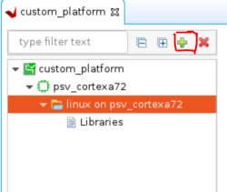
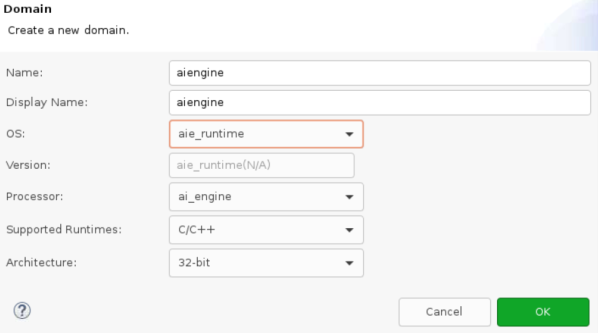

<table class="sphinxhide" width="100%">
 <tr width="100%">
    <td align="center"><h1>Vitis™ Platform Creation Tutorials</h1>
    <a href="https://www.xilinx.com/products/design-tools/vitis.html">See Vitis™ Development Environment on xilinx.com</br></a>
    </td>
 </tr>
</table>

# Step 2: Create the Vitis Software Platform

In this step, you will create a Vitis platform running Linux operation system. The Vitis platform requires several software components which need to be prepared in advance. AMD  provides common software images for quick evaluation. Therefore, you will utilize the common image for a quick start. DTB file is not prepared in the common image package as different platforms have different device peripherals. So you will use the `createdts` command to generate the device tree file for your platform. Certainly, if you need to customize the system image like kernel or rootfs, you can refer to the [PetaLinux customization page](../../Feature_Tutorials/02_petalinux_customization/README.md) for customization. Below are the software components we need for our platform and its provenance.

| Component                                     | Conventional Path or Filename | Description                                                      | Provenance                         |
| --------------------------------------------- | ----------------------------- | ---------------------------------------------------------------- | ---------------------------------- |
| Boot components in BOOT.BIN                   | boot/bl31.elf                 | Arm® trusted firmware/ secure monitor                             | Extracted from common image        |
| Boot components in BOOT.BIN                   | boot/u-boot.elf               | Second stage boot loader                                         | Extracted from common image        |
| Boot components in BOOT.BIN                   | boot/system.dtb               | Device tree information file                                     | Generated from "createdts" command |
| Boot components in FAT32 partition of SD card | sd_dir/boot.scr               | U-boot configuration file to store in FAT32 partition of SD card | Extracted from common image        |
| Linux Software Components                     | sw_comp/Image                 | Linux kernel  Image                                              | Extracted from common image        |
| Linux Software Components                     | sw_comp/rootfs.ext4           | Linux file system                                                | Extracted from common image        |
| Linux SDK                                     | sysroot                       | Cross compile and header files                                   | Extracted from common image        |

As most of the components are extracted from the common image package, you will prepare the common image first.

## Prepare the Common Images

1. Download common image from [Xilinx website download page.](https://www.xilinx.com/support/download/index.html/content/xilinx/en/downloadNav/embedded-platforms.html). Go to the **WorkSpace** folder you created in step 1, and place the image package in **WorkSpace** folder:

   ```bash
   cd WorkSpace
   tree -L 1     # to see the directory hierarchy
   .
   ├── custom_hardware_platform
   ├── custom_vitis_platform
   └── xilinx-versal-common-v2023.1.tar.gz
   ```

2. Extract the common image.

    You will create one folder named **custom_vitis_platform** to store the work content for this step 2. Then, the coming operations and products will be stored in this folder.

   ```bash
   mkdir custom_vitis_platform
   cd custom_vitis_platform
   tar xvf ../xilinx-versal-common-v2023.1.tar.gz -C .
   ```

   You can see the **xilinx-zynqmp-common-v2023.1** folder which contains some components located in **custom_vitis_platform** folder like the following.

   ```bash
   tree -L 2
   .
   ├── xilinx-versal-common-v2023.1
   │   ├── bl31.elf
   │   ├── boot.scr
   │   ├── Image
   │   ├── README.txt
   │   ├── rootfs.ext4
   │   ├── rootfs.manifest
   │   ├── rootfs.tar.gz
   │   ├── sdk.sh
   │   └── u-boot.elf
   ```

From the above picture, you can see boot file, kernel image, rootfs, and SDK tool are ready. DTB is not available. So you will use the `createdts` command to generate the DTB file in the coming step.

## Create the Device Tree File

The device tree describes the hardware components of the system. The `createdts` command can generate the device tree file according to the hardware configurations from the XSA file. If there are any settings not available in XSA, for example, any driver nodes that does not have corresponding hardware, or you have their own design hardware, you need to add customization settings in `system-user.dtsi`.

   Besides uboot, the common image does not have default environment variables. Updating the bootargs manually is needed. A pre-prepared [system-user.dtsi](ref_files/step2_pfm/system-user.dtsi) file which adds pre-defined bootargs is under `ref_files` directory. Copy `system-user.dtsi` to  the `custom_vitis_platform` directory, and use the following steps to generate the DTB file.

Utilize XSCT tool to execute one command to generate device tree files:

   ```bash
   cd custom_vitis_platform
   xsct 
   ```

   Then execute the `createdts` command in XSCT console:

   ```bash
   createdts -hw ../custom_hardware_platform/custom_hardware_platform.xsa -zocl  -out .  \
   -platform-name mydevice  -git-branch xlnx_rel_v2023.1  -dtsi system-user.dtsi -compile
   ```

   The `createdts` command has the following main input options:

- `-hw`: Hardware XSA file with path
- `-platform-name`: Platform name
- `-git-branch`: device tree branch
- `-board`: board name of the device. You can check the board name at <DTG Repo>/device_tree/data/kernel_dtsi.
- `-out`: Specify the output directory
- `-zocl`: enable the zocl driver support
- `-dtsi`: Add user's device tree file support
- `-compile`: specify the option to compile the device tree

   Notice the following information would show in the XSCT console. Ignore the warning and that means you succeed to get `system.dtb` file which is located in `<mydevice/psv_cortexa72_0/device_tree_domain/bsp/>` directory.

   ```bash
   pl.dtsi:9.21-71.4: Warning (unit_address_vs_reg): /amba_pl@0: node has a unit name, but no reg or ranges property
   pl.dtsi:52.26-56.5: Warning (simple_bus_reg): /amba_pl@0/misc_clk_0: missing or empty reg/ranges property
   pl.dtsi:57.15-65.5: Warning (simple_bus_reg): /amba_pl@0/zyxclmm_drm: missing or empty reg/ranges property
   pl.dtsi:66.42-70.5: Warning (simple_bus_reg): /amba_pl@0/aie_core_ref_clk_0: missing or empty reg/ranges property
   pl.dtsi:9.21-71.4: Warning (unique_unit_address): /amba_pl@0: duplicate unit-address (also used in node /memory@0)
   versal.dtsi:316.24-325.5: Warning (interrupt_provider): /axi/gpio@ff0b0000: Missing #address-cells in interrupt provider
   ```

   > **NOTE:** `createdts` is a command executing in XSCT console to generate device files. This command needs several inputs to generate the device tree files. Regarding the meaning of every option, you can execute the `help` command to check the details. Besides XSCT is a Console tool of Vitis. You can start it by typing `xsct` in Linux terminal to start it. Or you can select menu **Xilinx > XSCT Console** to start the XSCT tool after you launch Vitis.

   > **NOTE**: Device tree knowledge is a common know-how. Please refer to [AMD Device tree WIKI page](https://xilinx-wiki.atlassian.net/wiki/spaces/A/pages/862421121/Device+Trees) or [Device Tree WIKI page](https://en.wikipedia.org/wiki/Devicetree#Linux) for more information if you are not familiar with it.
   

   Execute the following command to exit XSCT console.

   ```bash
   exit
   ```

After this step, all the components platform creation required is ready. Next, you will attach all the components to our platform and build it.

### Create the Vitis Platform

1. First, you will create four directories: **pfm, boot, sd_dir sw_comp** to store the components and copy files to these directories.

   ```bash
   cd WorkSpace/custom_vitis_platform
   mkdir pfm 
   mkdir pfm/boot
   mkdir pfm/sd_dir
   mkdir pfm/sw_comp 
   cp xilinx-versal-common-v2023.1/bl31.elf pfm/boot/
   cp xilinx-versal-common-v2023.1/u-boot.elf pfm/boot/
   cp mydevice/psv_cortexa72_0/device_tree_domain/bsp/system.dtb pfm/boot/
   cp xilinx-versal-common-v2023.1/boot.scr pfm/sd_dir/
   cp xilinx-versal-common-v2023.1/rootfs.ext4 pfm/sw_comp
   cp xilinx-versal-common-v2023.1/Image pfm/sw_comp
   ```

   > **NOTE:** `Bl31.elf`, `u-boot.elf`, and `system.dtb` in boot DIR are the source of the BOOT.BIN image. `Boot.src` in `sd_dir` is for u-boot initialization and will be packaged to FAT32 partition by V++ package tool. `Image` and `rootfs.ext4` are Linux kernel and root file system which are not platform required and also will be packaged to SD.IMG by V++ tool in step 3.

2. Install the sysroot.

   - Go to `<WorkSpace/custom_vitis_platform/>` directory.
   - Type  `sh xilinx-versal-common-v2023.1/sdk.sh -d . -y ` to install the SDK tool, **.** means the current directory.  The `-d` option is to provide a full pathname to the output directory and `-y` option is to confirm that directory.
   >**NOTE:** The environment variable **LD_LIBRARY_PATH** must not be set when running this command.

3. Create the Vitis platform.

   You can create a Vitis platform with the Vitis IDE or with XSCT command line. The Vitis IDE can create the platform if your design only contains one XSA. If your design has two XSAs (`hw` and `hw-emu`), use XSCT to create the platform.

   <details>

   <summary><strong>Click here to expand the detailed steps using Vitis IDE to create a Vitis platform.</strong></summary>

   - Open the Vitis workspace you were using in step 2.
   - Select **File > New > Platform Project** to create a platform project.
   - Enter the project name. For this example, type `custom_platform`. Click **Next**.
   - In the Platform page:
     - Click **Browse** button, select the XSA file generated by the Vivado IDE. In this case, it is `custom_hardware_platform_hw.xsa`.
     - Set the operating system to **linux**.
     - Set the processor to **psu_cortexa72**.
     - Click **Finish**.

   - Set up the software settings in Platform Settings view.
     - Click the **linux on psv_cortexa72** domain, browse to the locations, and select the directory or file needed to complete the dialog box for the following:

     - **Bif file**: Click the drop-down icon and select **Generate BIF**.

     > **NOTE:** The file names in `<>` are placeholders. Vitis will replace the placeholders with the relative path to platform during platform packaging. V++ packager, which runs when building the final application would expand it further to the full path during image packaging. Filename placeholders point to the files in boot components directory. The filenames in boot directory need to match with placeholders in BIF file. `<bitstream>` is a reserved keyword. V++ packager will replace it with the final system bit file.

     > **NOTE:** `custom_hardware_platform_hw.xsa` is for hardware. If you choose to do hardware emulation, select `custom_hardware_platform_hwemu.xsa` to create the platform.

     - **Boot Components Directory**: Browse to **custom_vitis_platform/pfm/boot**, and click **OK**.

     - **FAT32 Partition Directory**: Browse to **custom_vitis_platform/pfm/sd_dir**, and click **OK**.

     - **QEMU Data**: Browse to **custom_vitis_platform/pfm/boot** and click **OK**.

         

     > **NOTE:** Setting QEMU DATA to boot components directory would help emulator to find the boot components during Linux boot when doing emulation.

     > **NOTE:** If there are additional QEMU settings, update `qemu_args.txt` accordingly.

   - Add the AI Engine domain.

     - Click Add domain icon.

         

     - Set Name to **aiengine**.
     - Change OS to **aie_runtime**.
     - Keep other settings to default and click **OK**.

         

         >**NOTE:** The Vitis IDE and XSCT will add QEMU arguments for AI Engine domain automatically.

      - Click **custom_platform** project in the Vitis Explorer view, click the **Build** button to build the platform.

         

         >**NOTE:** The generated platform is placed in the `custom_platform` directory. The platform is ready to be used for application development.**

         

      If you created a Vitis application in the same workspace as this platform, you can find this platform available in the platform selection page in platform creation wizard. If you want to reuse this platform in another workspace, add its path to `PLATFORM_REPO_PATHS` environment variable before launching Vitis GUI, or use the **Add** button in platform selection page of Vitis GUI to add its path.

   </details>

   <details>
   <summary><strong>Click here to expand the detailed steps using XSCT to create a Vitis platform</strong></summary>  

   Create a Tcl file with XSCT commands.

   ```Tcl
   # Create a platform project
   platform create -name custom_platform \
      -desc "A custom platform for VCK190" \
      -hw <Hardware>.xsa \
      -hw_emu <Hardware_Emulation>.xsa \
      -out <Output_Directory> \
      -no-boot-bsp 

   # If you do not need to support hardware emulation, you can omit the option -hw_emu and its value.

   # AIE domain
   domain create -name aiengine -os aie_runtime -proc ai_engine

   # Add Linux domain
   domain create -name xrt -proc psv_cortexa72 -os linux -arch {64-bit} -runtime {ocl} -sd-dir {./sd_dir}  -bootmode {sd}
   domain config -boot {./boot}
   domain config -generate-bif
   domain config -qemu-data ./boot

   platform write
   platform generate
   ```

   > **NOTE:** Replace the file name and directory name in the script with your project file location.

   > **NOTE:** If you do not need to support hardware emulation, you can omit the option `-hw_emu` and its value for the command `platform create`.

   The `platform create` command needs the following input values:

   - `-name`: Platform name
   - `-hw`: Hardware XSA file location.
   - `-hw_emu`: Hardware emulation XSA file location.
   - `-out`: Platform output path,this time we set <`custom_platform`> as the output directory.
   - `-sd-dir`: The directory that contains the files to be included in the FAT32 partition of the SD card image.

   The `domain` command will setup one AI Engine domain and one Linux domain. The Linux domain has SD boot mode. It will use files in `./sd_dir` to form the FAT32 partition of the SD card image and files in `./boot` directory to generate boot.bin. You have prepared the required components in above steps.

   You can pass the values to the script directly by replacing the variable with the actual value, or define them in the header of the Tcl script, or pass the value to XSCT when calling this script.

   Here is an example of calling XSCT if you hard code all contents in `xsct_create_pfm.tcl`.

   ```bash
   xsct xsct_create_pfm.tcl
   ```

   To support better generalization, the example [Makefile](./ref_files/step2_pfm/Makefile) and [xsct_create_pfm.tcl](./ref_files/step2_pfm/xsct_create_pfm.tcl) in `ref_files` directory use variables to represent the file names and directory location. Refer to them if you would like to get more programmability in your scripts.

   </details>

   Now you have completed the platform creation. Next, you will validate the output of this step.

### Validate the Output of Step 2

With Vitis environment setup, the **platforminfo** tool can report XPFM platform information.

You can verify hardware configuration (clocks, memory) and software configuration (domain) are set as expected.

<details>
  <summary><b>Show Log</b></summary>

```bash
#  go to the  XPFM file directory
cd custom_vitis_platform/custom_platform/export/custom_platform/
# Report Platform Info
platforminfo custom_platform.xpfm
==========================
Basic Platform Information
==========================
Platform:           custom_platform
File:               /Vitis-Tutorials/Vitis_Platform_Creation/Design_Tutorials/03_Edge_VCK190/ref_files/step2_pfm/custom_platform/export/custom_platform/custom_platform.xpfm
Description:        
A custom board platform
    

=====================================
Hardware Platform (Shell) Information
=====================================
Vendor:                           xilinx.com
Board:                            extensible_platform_base
Name:                             extensible_platform_base
Version:                          1.0
Generated Version:                2023.1
Hardware:                         1
Software Emulation:               1
Hardware Emulation:               1
Hardware Emulation Platform:      0
FPGA Family:                      versal
FPGA Device:                      xcvc1902
Board Vendor:                     
Board Name:                       
Board Part:                       

=================
Clock Information
=================
  Default Clock Index: 0
  Clock Index:         0
    Frequency:         156.250000

==================
Memory Information
==================
  Bus SP Tag: DDR
  Bus SP Tag: LPDDR

=============================
Software Platform Information
=============================
Number of Runtimes:            1
Default System Configuration:  custom_platform
System Configurations:
  System Config Name:                      custom_platform
  System Config Description:               custom_platform
  System Config Default Processor Group:   xrt
  System Config Default Boot Image:        standard
  System Config Is QEMU Supported:         1
  System Config Processor Groups:
    Processor Group Name:      aiengine
    Processor Group CPU Type:  ai_engine
    Processor Group OS Name:   aie_runtime
    Processor Group Name:      xrt
    Processor Group CPU Type:  cortex-a72
    Processor Group OS Name:   linux
  System Config Boot Images:
    Boot Image Name:           standard
    Boot Image Type:           
    Boot Image BIF:            custom_platform/boot/linux.bif
    Boot Image Data:           custom_platform/xrt/image
    Boot Image Boot Mode:      sd
    Boot Image RootFileSystem: 
    Boot Image Mount Path:     /mnt
    Boot Image Read Me:        custom_platform/boot/generic.readme
    Boot Image QEMU Args:      custom_platform/qemu/pmc_args.txt:custom_platform/qemu/qemu_args.txt
    Boot Image QEMU Boot:      
    Boot Image QEMU Dev Tree:  
   Supported Runtimes:
  Runtime: OpenCL
```

</details>

### Fast Track

Scripts are provided to create the Vitis platform. To use these scripts, please run the following steps.

1. Run build.
   > **NOTE:** Download the common image from [Xilinx website download page.](https://www.xilinx.com/support/download.html) and give its path to the following command.

   ```
   # cd to the step directory, e.g.
   cd step2_pfm
   make all COMMON_IMAGE_VERSAL=<path/to/common_image/>
   ```

2. To clean the generated files, please run

   ```bash
   make clean
   ```

### Next Step

Next, try to [build some applications on this platform and test them.](./step3.md)


<p class="sphinxhide" align="center"><sub>Copyright © 2020–2023 Advanced Micro Devices, Inc</sub></p>

<p class="sphinxhide" align="center"><sup><a href="https://www.amd.com/en/corporate/copyright">Terms and Conditions</a></sup></p>
