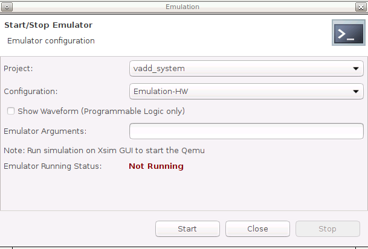

<table class="sphinxhide" width="100%">
 <tr width="100%">
    <td align="center"><h1>Vitis™ Platform Creation Tutorials</h1>
    <a href="https://www.xilinx.com/products/design-tools/vitis.html">See Vitis™ Development Environment on xilinx.com</br></a>
    </td>
 </tr>
</table>

# Step 3: Run Application on the Platform

## Application 1: Run a PL Acceleration Application

 You will create an acceleration application with PL kernel running on the platform created in step 2.

1. Create a application folder, and launch Vitis.

   ```
   cd WorkSpace
   mkdir -p custom_application
   cd custom_application
   vitis -workspace ./ &
   ```

   Close the welcome tab after Vitis launches.

2. Add the custom platform.

   - Select menu **Xilinx -> Add custom platform...**.
   - Click **Add** button.
   - Select the directory that [step2](./step2.md) generates. For example `custom_vitis_platform/custom_platform`.
   - Click **OK**.

3. Create a vector addition application on the custom platform.

   - Select menu **File -> New -> Application Project**.
   - Go through the welcome page, and click **Next**.
   - On Platform page, select **custom_platform** platform in the platform list. Click **Next**.

   - Set **Application project name** to **vadd**, target processor **psv_cortexa72_SMP**. Click **Next**.

     

   - Input **Sysroot** path `<custom_vitis_platform/sysroots/cortexa72-cortexa53-xilinx-linux>`, as you created by running `sdk.sh` in step 2.
   - Input **RootFS** path `<custom_vitis_platform/pfm/sw_comp/rootfs.ext4>`
   - Input **Kernel Image** path `<custom_vitis_platform/pfm/sw_comp/Image>`. These components were prepared in [step 2](./step2.md). Click **Next**.

   - Select the template **Vector Addition**. Click **Finish**.

4. (Optional) Build the vector addition application for hardware emulation.

   - Select the **vadd_system** project.
   - Click the drop down of the **Build** hammer icon on toolbar, select **Emulation-HW**. Alternatively, this step can be done by selecting **Active Build Configuration** to **Emulation HW**, and click the build icon.
   - If it pops-up a dialog to ask whether to clean the project, select **Don't clean**.

5. Build the vector addition application for hardware.

   - Select the **vadd_system** project.
   - Click the drop down of **Build** hammer icon on tool bar, select **Hardware**. Alternatively, this step can be done by selecting **Active Build Configuration** to **Hardware** and click the build icon.
   - It takes some time to build hardware. Finally, Vitis will generate **sd_card.img** in `vadd_system/Hardware/package` directory.

### (Optional) Test the Application on Hardware Emulation

1. Launch the Emulator for PS.

   - Click menu **Xilinx -> Start/Stop Emulator**.
   - Select Project: **vadd_system**, Configuration: **Emulation-HW**.

      

   - Click **Start**.
   - There will be prints on Emulation Console.
   - Wait for it to boot Linux. The wait window will disappear after it detects Linux boot successfully.

2. Launch PL emulation.

   - Right click **vadd_system**, select **Run as -> Run Configurations**.
   - Select **vadd_system-Default**.
   - Change **Build Configuration** to **Emulation-HW**.
   - Click **Run**.
   - Check run result.

      

3. Stop the Emulator.

   - Click menu **Xilinx -> Start/Stop Emulator**.
   - Click the **Stop** button.

#### Test the Application on Hardware

1. Copy `vadd_system/Hardware/package/sd_card.img` to local if you build the project on a remote server or virtual machine.

2. Program the `sd_card.img` to a SD card. Refer to [AR#73711](https://www.xilinx.com/support/answers/73711.html) for detailed steps.

   > **NOTE:** The programmed SD card has two partitions. The FAT32 partition with boot components and the EXT4 partition with Linux root file system. By default, the Windows system cannot see the contents of EXT4 partition.

   > **NOTE:** Eject the SD card properly from the system after programming it.

3. Insert the SD card, and boot the VCK190 board with SD boot mode (SW1[4:1] = "1110": OFF, OFF, OFF, ON) and power on.

   > **NOTE:** Refer to [VCK190 Evaluation Board User Guide](https://www.xilinx.com/support/documentation/boards_and_kits/vck190/ug1366-vck190-eval-bd.pdf) for details about boot mode.

4. Connect to UART console.

5. Launch the test application from UART console.

   <details>
   <summary><strong>Use the following steps to run the application</strong></summary>

     You will need to log in with user `petalinux` first and set up a new password (it is then also the sudo password):

     - Log into the system

         ```bash
         petalinux login:petalinux
         You are required to change your password immediately (administrator enforced).
         New password:
         Retype new password:
         petalinux:~$ sudo su
         We trust you have received the usual lecture from the local System
         Administrator. It usually boils down to these three things:
               #1) Respect the privacy of others.
               #2) Think before you type.
               #3) With great power comes great responsibility.
         Password:
         petalinux:/home/petalinux#
         ```

     - Go to auto mounted FAT32 partition and run the application as:

         ```
         petalinux:/home/petalinux# cd /run/media/sd-mmcblk0p1
         petalinux:/home/petalinux# ./simple_vadd krnl_vadd.xclbin
         ```
   </details>  

6. Expected print on UART console

<details>
  <summary><b>Show Log</b></summary>

```
root@petalinux:/run/media/mmcblk0p1# ./vadd binary_container_1.xclbin
EXE: /run/media/mmcblk0p1/simple_vadd
[XRT] WARNING: The xrt.ini flag "opencl_summary" is deprecated and will be removed in a future release.  A summary file is generated when when any profiling is enabled, so please use the appropriate settings from "opencl_trace=true", "device_counter=true", and "device_trace=true."
[XRT] WARNING: The xrt.ini flag "opencl_device_counter" is deprecated and will be removed in a future release.  Please use the equivalent flag "device_counter."
INFO: Reading krnl_vadd.xclbin
Loading: 'krnl_vadd.xclbin'
[   74.394840] zocl-drm amba_pl@0:zyxclmm_drm: zocl_create_client: created KDS client for pid(577), ret: 0
[   74.395731] zocl-drm amba_pl@0:zyxclmm_drm: zocl_destroy_client: client exits pid(577)
[   74.401000] zocl-drm amba_pl@0:zyxclmm_drm: zocl_create_client: created KDS client for pid(577), ret: 0
Trying to program device[0]: edge
[   74.937477] [drm] skip kind 29(AIE_RESOURCES) return code: -22
[   74.938038] [drm] found kind 8(IP_LAYOUT)
[   74.938641] [drm] found kind 9(DEBUG_IP_LAYOUT)
[   74.939375] [drm] skip kind 25(AIE_METADATA) return code: -22
[   74.939688] [drm] found kind 7(CONNECTIVITY)
[   74.940087] [drm] found kind 6(MEM_TOPOLOGY)
[   74.940907] [drm] Memory 0 is not reserved in device tree. Will allocate memory from CMA
[   74.948647] [drm] Memory 1 is not reserved in device tree. Will allocate memory from CMA
[   74.963753] cu_drv CU.2.auto: cu_probe: CU[0] created
[   74.974174] cu_drv CU.2.auto:  ffff000803cbac10 xrt_cu_intr_thread: CU[0] start
[   74.989334] [drm] zocl_xclbin_read_axlf f4f049d5-183a-e265-264d-ecfa34a51343 ret: 0
[   75.037345] [drm] bitstream f4f049d5-183a-e265-264d-ecfa34a51343 locked, ref=1
[   75.038188] zocl-drm amba_pl@0:zyxclmm_drm:  ffff000800323c10 kds_add_context: Client pid(577) add context CU(0xffffffff) shared(true)
[   75.041054] zocl-drm amba_pl@0:zyxclmm_drm:  ffff000800323c10 kds_del_context: Client pid(577) del context CU(0xffffffff)
[   75.042096] [drm] bitstream f4f049d5-183a-e265-264d-ecfa34a51343 unlocked, ref=0
[   75.094803] [drm] bitstream f4f049d5-183a-e265-264d-ecfa34a51343 locked, ref=1
[   75.095393] zocl-drm amba_pl@0:zyxclmm_drm:  ffff000800323c10 kds_add_context: Client pid(577) add context CU(0xffffffff) shared(true)
Device[0]: program successful!
[   75.188269] zocl-drm amba_pl@0:zyxclmm_drm:  ffff000800323c10 kds_add_context: Client pid(577) add context CU(0xffffffff) shared(true)
[   75.192218] zocl-drm amba_pl@0:zyxclmm_drm:  ffff000800323c10 kds_add_context: Client pid(577) add context CU(0x0) shared(true)
TEST PASSED
[   78.347703] zocl-drm amba_pl@0:zyxclmm_drm:  ffff000800323c10 kds_del_context: Client pid(577) del context CU(0xffffffff)
[   78.349191] zocl-drm amba_pl@0:zyxclmm_drm:  ffff000800323c10 kds_del_context: Client pid(577) del context CU(0x0)
[   78.354584] zocl-drm amba_pl@0:zyxclmm_drm:  ffff000800323c10 kds_del_context: Client pid(577) del context CU(0xffffffff)
[   78.355356] [drm] bitstream f4f049d5-183a-e265-264d-ecfa34a51343 unlocked, ref=0
[   78.462912] zocl-drm amba_pl@0:zyxclmm_drm: zocl_destroy_client: client exits pid(577)
  ```

</details>

>**NOTE**: The `[   35.116279] [drm]` messages are print from XRT for debugging purpose. It only shows up on UART. It will now print on ssh. This debugging message can be turned off by turning down the system dmesg reporting level.

```
echo "4" > /proc/sys/kernel/printk
```

### Application 2: Run an AIE + PL Acceleration Application Project

To verify the platform functionality, you will create a project with AIE + PL kernel and PS application, and run it on this custom-VCK190 board.

1. Create vector addition application on the custom platform.

   - Select menu **File -> New -> Application Project**.
   - Go through the welcome page, and click **Next**.
   - On Platform page, select **custom_platform** in the platform list. Click **Next**.
   - Set application name **plaie**, target processor **psv_cortexa72_SMP**. Click **Next**.
   - Input Sysroot path, RootFS path and Kernel Image. Click **Next**.
   - Select template **AI Engine System Design Examples -> AI Engine, PL and PS System Design**. Click **Finish**.

2. Build the vector addition application for hardware.

   - Select **plaie_system** project.
   - Click the drop down of the **Build** hammer icon on tool bar, and select **Hardware**. Alternatively, this step can be done by selecting **Active Build Configuration** to **Hardware** and click the **Build** icon.

3. (Optional) Build the vector addition application for hardware emulation.

   - Select **plaie_system** project.
   - Click the drop down of the **Build** hammer icon on tool bar, and  select **Emulation-HW**. Alternatively, this step can be done by selecting **Active Build Configuration** to **Emulation HW** and click the **Build** icon.
   - If a dialog displays to ask whether to clean the project, select **Don't clean**.

4. After a successful build, `sd_card.img` is generated in `plaie_system/Hardware/package` and `plaie_system/Hardware/package_aie_debug` directory. They include all files in `sd_card` directory in the first FAT32 partition and contents of `rootfs.ext4` in second EXT4 partition. The differences are the `sd_card.img` in `package_aie_debug` directory has a package parameter `enable_aie_debug=1`. It is used for debugging. The one in **package** can work for free running.

### Test the Application on Hardware

1. Copy the `sd_card.img` from `plaie_system/Hardware/package` directory to local, if the project is run on a server or virtual machine.

   > **NOTE:** Vitis will generate images with aie_debug enabled and disabled. The image with aie_debug disabled will run freely; the image with aie_debug enabled will halt AI Engine and wait for the debugger to connect to it.

2. Program `sd_card.img` to the SD card. Refer to [AR#73711](https://www.xilinx.com/support/answers/73711.html) for detailed steps.

   > **NOTE:** The programmed SD card has two partitions: the FAT32 partition with boot components and the EXT4 partition with Linux root file system. By default, the Windows system cannot see the contents of EXT4 partition.

   > **NOTE:** Eject the SD card properly from the system after programming it.

3. Insert the SD card, and boot the VCK190 board with SD boot mode (SW1[4:1] = "1110": OFF, OFF, OFF, ON) and power on.

   > **NOTE:** Refer to [VCK190 Evaluation Board User Guide](https://www.xilinx.com/support/documentation/boards_and_kits/vck190/ug1366-vck190-eval-bd.pdf) for details about boot mode.

4. Launch test application from the UART console.

   <details>
   <summary><strong>Use the following steps to run the application</strong></summary>

     You will need to login with user `petalinux` first, and set up a new password (it is then also the sudo password):

     - Log into the system.

         ```bash
         petalinux login:petalinux
         You are required to change your password immediately (administrator enforced).
         New password:
         Retype new password:
         petalinux:~$ sudo su
         We trust you have received the usual lecture from the local System
         Administrator. It usually boils down to these three things:
               #1) Respect the privacy of others.
               #2) Think before you type.
               #3) With great power comes great responsibility.
         Password:
         petalinux:/home/petalinux#
         ```

     - Go to the auto mounted FAT32 partition and run the application :

         ```
         petalinux:/home/petalinux# cd /run/media/sd-mmcblk0p1
         petalinux:/home/petalinux# ./plaie binary_container_1.xclbin
         ```
   </details> 

5. Expected print on UART console.

<details>
  <summary><b>Show Log</b></summary>

   ```
   root@petalinux:/mnt/sd-mmcblk0p1# ./plaie binary_container_1.xclbin
   Initializing ADF API...
   [   39.786629] zocl-drm axi:zyxclmm_drm: zocl_create_client: created KDS client for pid(697), ret: 0
   [   39.795569] zocl-drm axi:zyxclmm_drm: zocl_destroy_client: client exits pid(697)
   [   39.813998] zocl-drm axi:zyxclmm_drm: zocl_create_client: created KDS client for pid(697), ret: 0
   [   40.245746] [drm] found kind 29(AIE_RESOURCES)
   [   40.245765] [drm] found kind 8(IP_LAYOUT)
   [   40.250535] [drm] found kind 9(DEBUG_IP_LAYOUT)
   [   40.254738] [drm] found kind 25(AIE_METADATA)
   [   40.259429] [drm] found kind 7(CONNECTIVITY)
   [   40.263937] [drm] found kind 6(MEM_TOPOLOGY)
   [   40.268417] [drm] Memory 0 is not reserved in device tree. Will allocate memory from CMA
   [   40.280809] [drm] Memory 1 is not reserved in device tree. Will allocate memory from CMA
   [   40.296964] cu_drv CU.2.auto: cu_probe: CU[0] created
   [   40.302294] cu_drv CU.3.auto: cu_probe: CU[1] created
   [   40.307630] cu_drv CU.4.auto: cu_probe: CU[2] created
   [   40.312842] cu_drv CU.2.auto:  ffff000804e4ac10 xrt_cu_intr_thread: CU[0] start
   [   40.320432] cu_drv CU.3.auto:  ffff00080271e810 xrt_cu_intr_thread: CU[1] start
   [   40.321470] [drm] zocl_xclbin_read_axlf 8e1f87ed-725e-07da-c6b3-6786f6df2f1f ret: 0
   [   40.327753] cu_drv CU.4.auto:  ffff000802696410 xrt_cu_intr_thread: CU[2] start
   XAIEFAL: INFO: Resource group Avail is created.
   XAIEFAL: INFO: Resource group Static is created.
   XAIEFAL: INFO: Resource group Generic is created.
   [   40.390527] [drm] bitstream 8e1f87ed-725e-07da-c6b3-6786f6df2f1f locked, ref=1
   [   40.390547] zocl-drm axi:zyxclmm_drm:  ffff00080085d410 kds_add_context: Client pid(697) add context Domain(0) CU(0xffffffff) shared(true)
   [   40.410331] zocl-drm axi:zyxclmm_drm:  ffff00080085d410 kds_del_context: Client pid(697) del context Domain(0) CU(0xffffffff)
   Input memory virtual addr 0x0xffffb91ea000x
   Input memory virtual addr 0x0xffffb91e9000x
   in_bohdl0 in_bohdl1 sync[   40.421650] [drm] bitstream 8e1f87ed-725e-07da-c6b3-6786f6df2f1f unlocked, ref=0
   started
   in_bohdl0 in_bohdl1 sy[   40.429988] [drm] bitstream 8e1f87ed-725e-07da-c6b3-6786f6df2f1f locked, ref=1
   nc done
   Output memory virtual a[   40.439461] zocl-drm axi:zyxclmm_drm:  ffff00080085d410 kds_add_context: Client pid(697) add context Domain(0) CU(0xffffffff) shared(true)
   ddr 0x0xffffb91e8000x
   [   40.464816] zocl-drm axi:zyxclmm_drm:  ffff00080085d410 kds_add_context: Client pid(697) add context Domain(0) CU(0x1) shared(true)
   run pl_mm2s_1
   [   40.478710] zocl-drm axi:zyxclmm_drm:  ffff00080085d410 kds_add_context: Client pid(697) add context Domain(0) CU(0x0) shared(true)
   run pl_mm2s_2
   [   40.492018] zocl-drm axi:zyxclmm_drm:  ffff00080085d410 kds_add_context: Client pid(697) add context Domain(0) CU(0x2) shared(true)
   run pl_s2mm
   graph init. This does nothing be[   40.506280] zocl-drm axi:zyxclmm_drm:  ffff00080085d410 kds_del_context: Client pid(697) del context Domain(0) CU(0x1)
   cause CDO in boot PDI already con[   40.519845] zocl-drm axi:zyxclmm_drm:  ffff00080085d410 kds_del_context: Client pid(697) del context Domain(0) CU(0x0)
   figures AIE.
   graph run
   graph end[   40.533494] zocl-drm axi:zyxclmm_drm:  ffff00080085d410 kds_del_context: Client pid(697) del context Domain(0) CU(0xffffffff)

   mm2s_1 completed with status(4[   40.547611] zocl-drm axi:zyxclmm_drm:  ffff00080085d410 kds_del_context: Client pid(697) del context Domain(0) CU(0x2)
   )
   mm2s_2 completed with status(4)
   s2mm completed with status(4)
   TEST PASSED
   Releasing host Buffers...
   Releasing remaining XRT objects...
   [   40.561044] [drm] bitstream 8e1f87ed-725e-07da-c6b3-6786f6df2f1f unlocked, ref=0
   [   40.578375] zocl-drm axi:zyxclmm_drm: zocl_destroy_client: client exits pid(697)
   ```
</details>

#### (Optional) Test the Application on Hardware Emulation

1. Launch Emulator for PS

   - Click menu Xilinx -> Start/Stop Emulator
   - Select Project: plaie_system, Configuration: Emulation-HW
   - Click Start
   - There will be prints on Emulation Console. 
   - Wait for it to boot Linux. The wait window will disappear after it detects Linux boot successfully.

2. Launch PL and AIE emulation

   - Right click plaie_system, select Run as -> Run Configurations
   - Select plaie_system-Launch
   - Click Run

   

3. Stop Emulator

   - Click menu **Xilinx -> Start/Stop Emulator**
   - Click **Stop** button


**What Just Happened?**

Vitis runs PS emulation in QEMU, PL and AIE emulation in XSIM. They can communicate with each other. When running the emulation, Vitis downloads executable and xclbin to Remote Working Directory and launch it.

Congratulations now you've created a custom platform that PL acceleration kernel and AIE applications can work on it.

### Next Steps

If user need to do iteration for your project, you could go through the [Iteration Guidelines](./Iteration_guideline.md) to do iterations.


[In next chapter](./faq.md), we'll list some frequently encountered problems and frequently asked questions. Please take a look if you'd like to understand more of platform creation.


<p class="sphinxhide" align="center"><sub>Copyright © 2020–2023 Advanced Micro Devices, Inc</sub></p>

<p class="sphinxhide" align="center"><sup><a href="https://www.amd.com/en/corporate/copyright">Terms and Conditions</a></sup></p>

