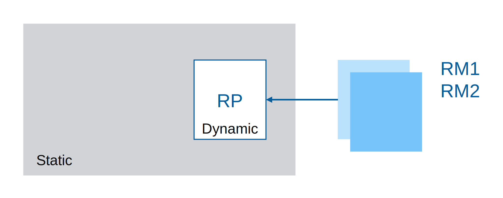
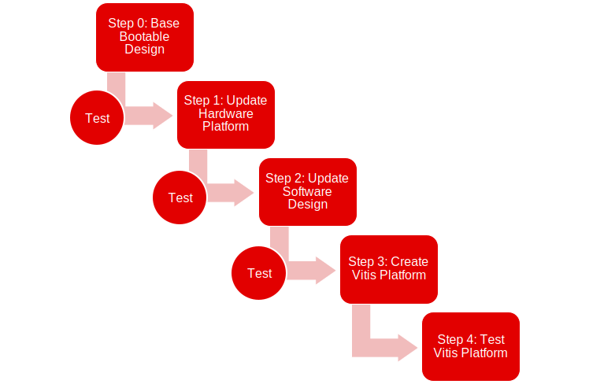

<table class="sphinxhide" width="100%">
 <tr width="100%">
    <td align="center"><h1>Vitis™ Platform Creation Tutorials</h1>
    <a href="https://www.xilinx.com/products/design-tools/vitis.html">See Vitis™ Development Environment on xilinx.com </a>
    </td>
 </tr>
</table>

# AMD Versal Custom DFX Platform Creation Tutorial

***Version: 2023.1***

In this module, you will create a custom Dynamic Function eXchange (DFX) platform to run acceleration applications for VCK190 evaluation board. Platforms that support DFX features allows you to reload acceleration kernels during runtime.

You can define one reconfigurable partition (RP) region and create multiple reconfigurable modules (RM). The RP defines the boundary between reconfigurable region and static region. The RM defines the content to be reconfigured each time. The RP can include Programmable Logic and AI Engine resources. You can reconfigure the RM (``rm1.xclbin``, ``rm2.xclbin``, etc.) during runtime with XRT. The AI Engine needs to be fully reconfigured or not at all. Multi-partition AI Engine and PL DFX is not supported in this version.

This tutorial assumes that you understand the basics of the AMD Versal™ Custom Platform creation steps, for example, creating AMD Vivado™ designs from Vivado Customizable Example Design template, setting up software components with common images or PetaLinux, creating AMD Vitis™ platforms, and creating basic acceleration applications for platform validation. This tutorial will focus on the differences between the DFX platforms and the normal flat platforms.

In a general Vitis acceleration platform design, you start from building a base bootable design, then add platform required components and properties to it. You must validate each step before going to the next step to prevent error propagating. This workflow is described in the following diagram.

In this tutorial, you will use the Vivado Versal DFX customizable example design to create the hardware design.

To prepare the software components, use the common image released by AMD and the `createdts` command to generate the device tree file.

After the software and hardware components are ready, you can package the platform.

In each step, test the generated files to make sure they work as expected. A frequent test methodology can help to narrow down the root causes if any error occurs. Finally, run several test applications on this platform to test this customized platform.

Navigate through this tutorial using the following table of contents links.

- [Step 1: Hardware Settings for Vitis Platform](./step1.md)
- [Step 2: Create the Software Components and Generate Platform](./step2.md)
- [Step 3: Test the Platform](./step3.md)
- [Iteration Guidelines](./Iteration_guideline.md)
- [Frequently Asked Questions](faq.md)

## Requirements and Assumptions

This tutorial design uses VCK190 production board for demonstration. The methodology works for all boards.

This design requires a Linux host machine with Internet access. The Linux OS needs to support the Vitis software and PetaLinux.

This tutorial assumes that you are familiar with Vitis platform creation flow. If not, refer to VCK190 Platform Creation Tutorial and *Vitis Acceleration Flow User Guide* [(UG1393)](https://docs.xilinx.com/access/sources/dita/map?isLatest=true&ft:locale=en-US&url=ug1393-vitis-application-acceleration) for more information.

## What's Next

Start with [Step 1](./step1.md).

## Reference

- *Vitis Acceleration Flow User Guide* [(UG1393)](https://docs.xilinx.com/access/sources/dita/map?isLatest=true&ft:locale=en-US&url=ug1393-vitis-application-acceleration)

   - [Creating Embedded Platforms in Vitis](https://docs.xilinx.com/access/sources/dita/topic?isLatest=true&ft:locale=en-US&url=ug1393-vitis-application-acceleration&resourceid=rjs1596051748503.html)

- [Vitis Embedded Platform Source Github Repository](https://github.com/Xilinx/Vitis_Embedded_Platform_Source)

## Changelog

### 2023.1

- Hardware emulation XSA file is no longer mandatory required to create a platform

### 2022.2

- Versal DFX CED is utilized to create the hardware design

### 2022.1

- New Tutorial

Copyright © 2020–2023 Advanced Micro Devices, Inc

<a href="https://www.amd.com/en/corporate/copyright">Terms and Conditions</a>

