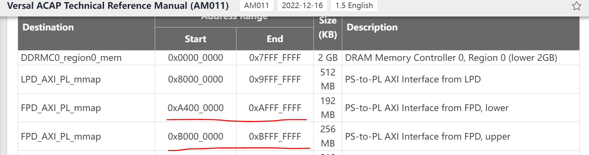
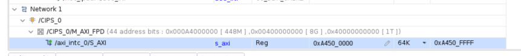

<table class="sphinxhide" width="100%">
 <tr width="100%">
    <td align="center"><h1>Vitis Platform Creation Tutorials</h1>
    <a href="https://www.xilinx.com/products/design-tools/vitis.html">See AMD Vitis™ Development Environment on xilinx.com</br></a>
    </td>
 </tr>
</table>

# Step 1: Create the Hardware Design

This hardware design illustrates how to create a DFX hardware platform. You will use the AMD Versal™ DFX Extensible Embedded Example Design. You can extend the design to fulfill more complex requirements later.

The major differences between the AMD Vitis™ DFX platform and flat Vitis Platform is the AMD Vivado™ design. It needs to define the Block Design Container (BDC) for reconfigurable partition. BDC defines the dynamic region, or Reconfigurable Partition (RP).

Versal devices support partial reconfiguration for almost all component types. Refer to the *Vivado Design Suite User Guide: Dynamic Function eXchange* [(UG909)](https://docs.xilinx.com/r/en-US/ug909-vivado-partial-reconfiguration/Design-Elements-Inside-Reconfigurable-Modules?tocId=zNU4eeS04V2g~W3rO2mHgA) for more details about the supported element types.

Here are some common practices for partitioning the IPs in Vitis platform designs.

| IP Type                   | Static Region        | Dynamic Region                |
| :------------------------ | :------------------- | :---------------------------- |
| CIPS                      | Y                    |                               |
| AI Engine                 |                      | Y                             |
| Memory                    | Memory Controller    | Export platform interfaces    |
| Clock            | Y                    | Y                             |
| Reset            | Y                    | Y                             |
| Interrupt                 | Interrupt Controller | Export platform interfaces    |
| AXI Master for IP Control |                      | Export platform interfaces    |
| Decoupling for DFX        | DFX Decoupler        | Slice Registers when required |

- **Control, Interface & Processing System (CIPS)** must stay in the static region. The hard blocks in CIPS cannot be reconfigured.

- **AI Engine** must stay in the dynamic region because it requires v++ to link to acceleration kernels during application development phase.

- If the **memory controllers** are shared by the static region and the dynamic region (as shared by Arm® processors and acceleration kernels,), they should be instantiated to the static region.

- Static region and dynamic region can have their own **clock** generator and **reset** logic. Dynamic region signals can be independent or derived from static region.

- The **Interrupt Controller** should be instantiated in the static region because in order to avoid reloading the interrupt controller driver after DFX configuration. Interrupt signals and platform AXI interface signals can be exported from BDC.

- The **decoupling** logics are required on the boundary between static region and dynamic region to help with timing closure and prevent metastability. XRT can turn on DFX Decoupler isolation mode before reconfiguration and turn off isolation after reconfiguration.

You will create the hardware design in Vivado first and then explain the details about the submodule in the CED DFX design.

## Vivado Design Creation

### Project Creation

1. Create a workspace and Launch Vivado if you haven't

   1. ``mkdir WorkSpace``.
   2. ``cd WorkSpace``.
   3. un `source <Vitis_Install_Directory>/settings64.sh` to set up the Vivado running environment.
   4. Run Vivado by typing `vivado` in the console.

2. Download the Versal Extensible Embedded Platform Example

   1. Click **Tools -> Vivado Store..**
   2. Click **OK** to agree to download open source examples from web.
   3. Select **Example Designs -> Platforms -> Versal DFX Extensible Embedded Platform** and click the download button on the tool bar.
   4. Click **Close** after installation complete.

   

3. Create the Versal DFX Extensible Embedded Platform Example project.

   1. Click **File -> Project -> Open Example...**.
   2. Click **Next**.
   3. Select **Versal DFX Extensible Embedded Platform** in the Select Project Template window.
   4. Input **project name** and **project location**. Keep **Create project subdirectory** checked. Click **Next**.
   5. Select target board in Default Part window. In this example, **Versal VCK190 Evaluation Platform** is used. Click **Next**.
  
      

   6. Configure Clocks Settings. You can enable more clocks, update output frequency and define default clock in this view for the static region. In this example, you can retain the default settings.
   7. Configure Interrupt Settings. You can choose the number of interrupts. 63 interrupts will use two AXI_INTC in cascade mode. In this example, you can retain the default setting.
   8. Configure Memory Settings. By default, the example design will enable the on board DDR4. If you select the additional on board memories option, you will enable the LPDDR4 on board.
   9. Click **Next**.
   10. Review the new project summary and click **Finish**.
   11. After a while, you will see the design example has been generated.

The generated design is shown in the following figure:


At this stage, the Vivado block automation has already created a top block design and a dynamic region block. It added the CIPS, AXI NOC block, dfx_decoupler, and supporting logic blocks to the top diagram. It also added the AI engine, AXI NOC and clock in dynamic region (`VitisRegion.bd`) and also applied all board presets for the VCK190. Block generation and address aperture setting has also been done. In the following sections, we will delve into the sub-modules within this CED DFX platform. The sub-module design methodology is a fundamental aspect applied to all DFX designs.

### DFX Platform Design Submodule Explanation

The following sections provide the platform hardware submodule explanation with diagrams. In the diagrams, the Vitis region is the dynamic area (RP). Blocks outside of the Vitis Region are in the static region. They will be loaded at boot time and won't be reconfigured.

#### Memory Subsystem


*Figure 1*

Static region and dynamic region shares the DDR memory. Use the NOC stub in the Vitis Region to export the memory interface for the platform. V++ linker can connect the PL kernel memory interfaces to the NoC stub to access memory.  

For the interfaces from NoC stub to DDR Memory Controller, set up the aperture property so that Vivado can lock the address space assignment.

#### Control Subsystem


*Figure 2*

The control path needs a DFX Decoupler IP. The DFX decoupler can turn off the channels during reconfiguration  to prevent unexpected requests from the static region cause invalid status on AXI interface and prevent random toggles generated by RP reconfiguration cause unexpected side-effects in static region. XRT will turn on DFX decoupler before the reconfiguration process and turn off after the reconfiguration completes. It needs to work with the Register Slice inside Vitis Region to ensure shortest path across the boundary.

The SmartConnect in Vitis Region can export control interfaces for the platform. V++ linker would connect PL kernel control interface to the SmartConnect.

For the control AXI interface across the boundary, you need to set up the aperture property so that Vivado can lock the address space assignment.

#### AI Engine Subsystem


*Figure 3*

CIPS needs to control the AI Engine. AI Engine generates a clock which feedbacks to NoC for the AXI interfaces between NoC and AI Engine.

You create an NoC specific for AI Engine in the Vitis Region. `PS_NOC` and `AIE_NOC` communicates with NoC INI.

#### Interrupt Subsystem


*Figure 4*

The platform exports interrupt signals through the concat IP in the Vitis Region. Concat and the interrupt controller in the static region are connected through the DFX_Decoupler IP. Interrupt Controller outputs to CIPS IRQ.

#### Clock and Reset


*Figure 5*

Static region and dynamic region can have their own clock and reset signals.

The Clock Wizard in static region is required so that the device tree generator (DTG) can generate correct device tree to describe this clock topology.

### Modify the IP address in address editor (Optional)

   >Note: This step is not mandatory for platform creation. Please refer to it according to your requirement.

   If users need to modify the IP address please go through following steps.
   1. Check the location address space of your IP 
   2. Go to address editor by clicking **Window**-> **Address editor** to open it.

   Next, we will use the example of modifying the interrupt controller IP address to illustrate how to modify the IP address in the address editor.

   - As the interrupt controller is connected with **M_AXI_FPD** domain, we need check FPD domain supported address space. Please check the [Versal Technical Reference Manual](https://docs.xilinx.com/r/en-US/am011-versal-acap-trm/High-level-Address-Map). You could find following address range. That means the IP connected to FPD domain could be placed in 0xA400_0000-0xAFFF_FFFF or 0xB000_0000-0xBFFF_FFFF address space. But conflict is not allowed.

      

   - Go to address editor, modify the interrupt controller IP base address according to your requirement. Following is just an example.

      
      
   >Note: The modified base address should be in the LPD address space and the high address should also be in the LPD address space.

### Export Hardware Emulation XSA

The Versal Extensible Platform Example has set up the simulation model of each IP properly. You will review the settings in this session. If you created the block design by yourself, ensure these settings are applied before running emulation on your platform.

Some blocks in the block design has multiple types of simulation models. Vitis emulation requires these blocks to use SystemC TLM (Transaction-level Modeling) model when available. TLM is the default simulation model for CIPS, NoC, and AI Engine. You can review them to make sure they are correct before exporting the hardware.

1. Review CIPS simulation model settings:

   1. In the Vivado GUI, select the CIPS instance.
   2. Check the ***Block Properties*** window.
   3. In ***Properties*** tab, it shows **ALLOWED_SIM_MODELS** is `tlm,rtl`, **SELECTED_SIM_MODEL** is `tlm`. It means this block supports two simulation models. You have selected the `tlm` model.

      

2. Review the simulation model property for NoC and AI Engine in the block diagram.

3. Run the following scripts to generate the emulation XSA.

   ```tcl
   set_property PREFERRED_SIM_MODEL "tlm" [current_project]
   generate_switch_network_for_noc
   launch_simulation -scripts_only
   launch_simulation -step compile
   launch_simulation -step elaborate
   set_property platform.platform_state "pre_synth" [current_project] # Default Value
   write_hw_platform -hw_emu -file hw_emu/hw_emu.xsa
   ```

### Export Hardware XSA

1. Run Implementation.

   1. Click **Generate Device Image** from Flow Navigator. Wait until the implementation process completes.
   2. Click **Open Implemented Design**.

2. Export hardware platform XSA.

   Run the following scripts to generate XSA for static region and dynamic region.

   ```tcl
   set_property platform.platform_state "impl" [current_project]
   # Write fixed XSA for static region
   write_hw_platform -force -fixed -static -file vck190_custom_dfx_static.xsa
   # Write extensible XSA for dynamic region
   write_hw_platform -rp versal_dfx_platform_i/VitisRegion vck190_custom_dfx_rp.xsa
   ```

   Export the static region in fixed XSA format and dynamic region in extensible XSA format, because the Vitis v++ linker are suppose only to update the hardware in the dynamic region.

   The fixed XSA for the static region will be used to generate the device tree for the static region.

### Fast Track

Scripts are provided to re-create projects and generate outputs in each step. To use these scripts, run the following steps

To build the hardware design, run the following commands:

   ```bash
   # cd to the step directory, e.g.
   cd ref_files/step1_hw
   make all
   ```

To clean the generated files, run the following commands:

   ```bash
   make clean
   ```
  
A top level all in one build script is also provided. To build everything (step 1 to step 4) with one command, go to ***ref_files*** directory and run:

```bash
make all
```

To clean all the generated files, run the following commands:

```bash
make clean
```

### Next Step

You have completed the Hardware platform creation flow. Next go to [step 2](./step2.md) to create platform software.

## References

- Turn a Block Design Container into a Reconfigurable Partition in *Vivado Design Suite User Guide: Dynamic Function eXchange* [(UG909)](https://docs.xilinx.com/r/en-US/ug909-vivado-partial-reconfiguration/Turn-a-Block-Design-Container-into-a-Reconfigurable-Partition)
- Create a Floorplan for the Reconfigurable Region in *Vivado Design Suite User Guide: Dynamic Function eXchange* [(UG909)](https://docs.xilinx.com/r/en-US/ug909-vivado-partial-reconfiguration/Create-a-Floorplan-for-the-Reconfigurable-Region)

<p class="sphinxhide" align="center"><sub>Copyright © 2020–2024 Advanced Micro Devices, Inc</sub></p>

<p class="sphinxhide" align="center"><sup><a href="https://www.amd.com/en/corporate/copyright">Terms and Conditions</a></sup></p>
