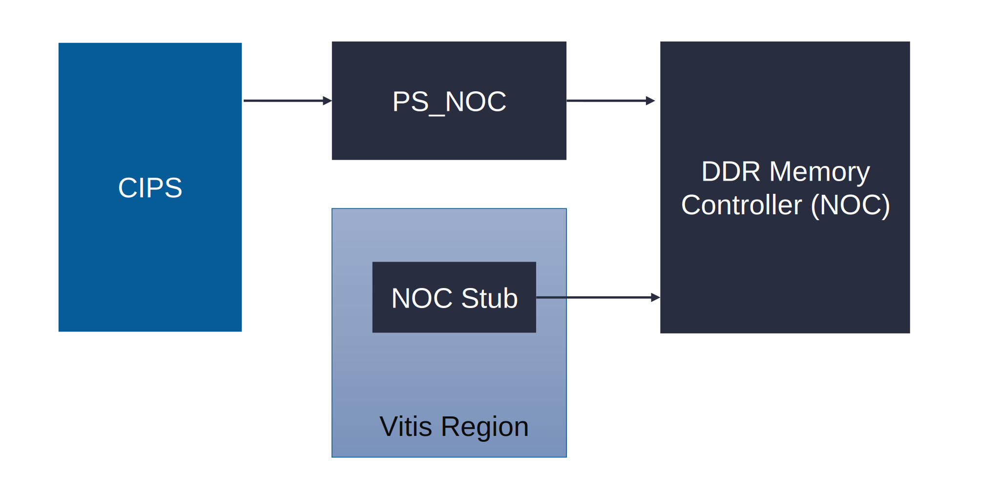
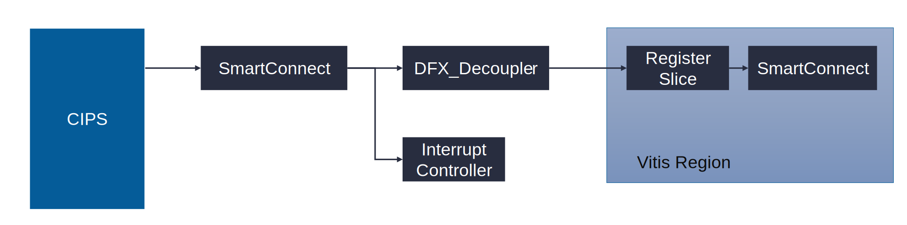
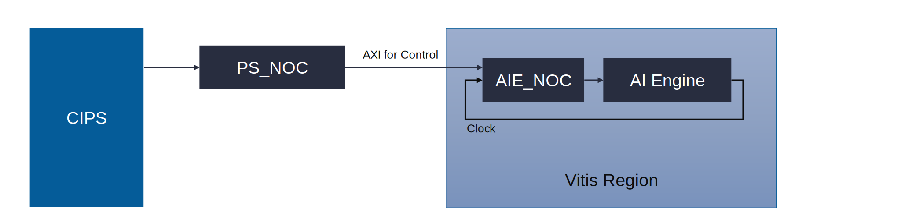
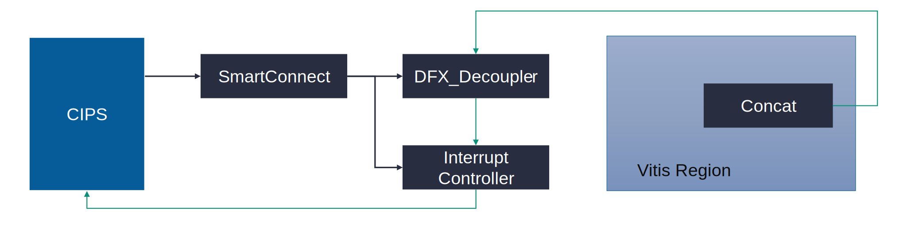
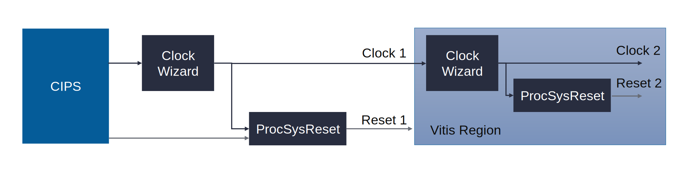
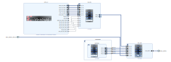
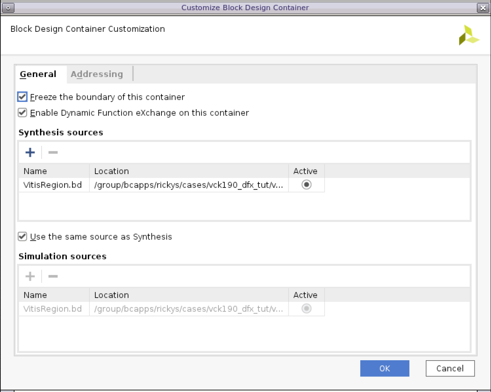
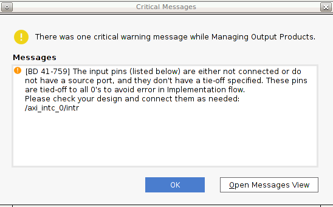
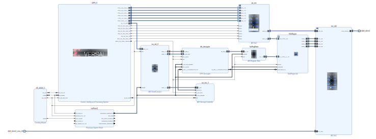
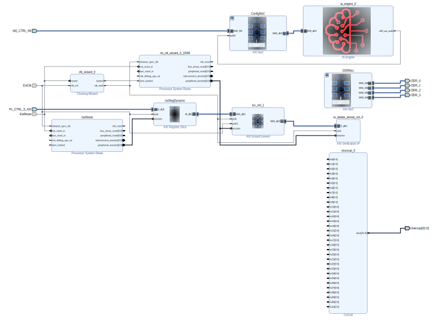

<!-- 
# Copyright 2020 Xilinx Inc.
# 
# Licensed under the Apache License, Version 2.0 (the "License");
# you may not use this file except in compliance with the License.
# You may obtain a copy of the License at
#
#     http://www.apache.org/licenses/LICENSE-2.0
#
# Unless required by applicable law or agreed to in writing, software
# distributed under the License is distributed on an "AS IS" BASIS,
# WITHOUT WARRANTIES OR CONDITIONS OF ANY KIND, either express or implied.
# See the License for the specific language governing permissions and
# limitations under the License.
-->


<table width="100%">
 <tr width="100%">
    <td align="center"><h1>Custom Versal DFX Platform Creation Tutorial</h1>
    </td>
 </tr>
</table>

## Step 1: Create the Hardware Design

The target of this hardware design is to illustrate how to partition of static region and dynamic region for DFX platforms. We will keep the design as simple as possible. Users can extend the design to fulfill more complex requirements later.

The major differences between the Vitis DFX platform and flat Vitis Platform is the Vivado design. It needs to define the Block Design Container (BDC) for reconfigurable partition. BDC defines the dynamic region, or Reconfigurable Partition (RP). 

Versal devices support partial reconfiguration for almost all component types. Please check [UG909 Vivado Design Suite User Guide: Dynamic Function eXchange](https://docs.xilinx.com/r/en-US/ug909-vivado-partial-reconfiguration/Design-Elements-Inside-Reconfigurable-Modules?tocId=zNU4eeS04V2g~W3rO2mHgA) for more details about the supported element types.

Here are some common practices for partitioning the IPs in Vitis platform designs.

| IP Type                   | Static Region        | Dynamic Region                |
| :------------------------ | :------------------- | :---------------------------- |
| CIPS                      | Y                    |                               |
| AI Engine                 |                      | Y                             |
| Memory                    | Memory Controller    | Export platform interfaces    |
| Clock            | Y                    | Y                             |
| Reset            | Y                    | Y                             |
| Interrupt                 | Interrupt Controller | Export platform interfaces    |
| AXI Master for IP Control |                      | Export platform interfaces    |
| Decoupling for DFX        | DFX Decoupler        | Slice Registers when required |

- **CIPS** has to stay in static region. The hard blocks in CIPS cannot be reconfigured.
- **AI Engine** needs to stay in dynamic region because it requires v++ to link to acceleration kernels during application development phase.
- If the **memory controllers** are shared by static region and dynamic region, like used by ARM processors and acceleration kernels, they should be instantiated to the static region.
- Static region and dynamic region can have their own **clock** generator and **reset** logic. Dynamic region signals can be independent or derived from static region.
- The **Interrupt Controller** is better to be instantiated in static region because we don't wish to reload interrupt controller driver after DFX configuration. Interrupt signals and platform AXI interface signals can be exported from BDC.
- The **decoupling** logics are required on the boundary between static region and dynamic region to help with timing closure and prevent metastability. XRT can turn on DFX Decoupler isolation mode before reconfiguration and turn off isolation after reconfiguration.

We will explain the details about each submodule design first, and create the hardware design in Vivado.

> Note: If you have a working flat platform and you wish to convert it to a DFX platform, you can focus on the special requirements of DFX platforms. This is also a common practice which can help isolating platform issues. This tutorial creates the hardware design from scratch to provide the full context.

### Platform Hardware Submodule Explanation

The following sections provide the platform hardware submodule explanation with diagrams. In the diagrams, Vitis Region is the dynamic area (RP). Blocks out side of Vitis Region are in the static region. They will be loaded at boot time and won't be reconfigured.

#### Memory Subsystem


*Figure 1*

Static region and dynamic region shares the DDR memory. We use the NOC stub in Vitis Region to export memory interface for the platform. V++ linker can connect the PL kernel memory interfaces to the NOC stub to access memory.  

For the interfaces from NOC stub to DDR Memory Controller, we need to setup aperture property so that Vivado can lock the address space assignment.

#### Control Subsystem


*Figure 2*

The control path needs a DFX Decoupler IP. The DFX decoupler can turn off the channels during reconfiguration  to prevent unexpected requests from the static region cause invalid status on AXI interface and prevent random toggles generated by RP reconfiguration cause unexpected side-effects in static region. XRT will turn on DFX decoupler before the reconfiguration process and turn off after the reconfiguration completes. It needs to work with the Register Slice inside Vitis Region to ensure shortest path across the boundary. 

The SmartConnect in Vitis Region can export control interfaces for the platform. V++ linker would connect PL kernel control interface to the SmartConnect.

For the control AXI interface across the boundary, we need to setup aperture property so that Vivado can lock the address space assignment.

#### AI Engine Subsystem


*Figure 3*

CIPS needs to control AI Engine. AI Engine generates a clock which feedback to NOC for the AXI interfaces between NOC and AI Engine.

We create a NOC specific for AI Engine in the Vitis Region. PS_NOC and AIE_NOC communicates with NOC INI.

#### Interrupt Subsystem



*Figure 4*

The platform exports interrupt signals through the concat IP in the Vitis Region. Concat and the interrupt controller in the static region are connected through the DFX_Decoupler IP. Interrupt Controller outputs to CIPS IRQ. 

#### Clock and Reset



*Figure 5*

Static region and dynamic region can have their own clock and reset signals. 

The Clock Wizard in static region is required so that device tree generator (DTG) can generate correct device tree to describe this clock topology.


### Vivado Design Creation

Vivado supports creating DFX designs with top-down flow or bottom-up flow. Top-down flow is commonly used when creating the design from scratch. It creates a full design in the block diagram, adds the modules for RM into one **hierarchy** and convert the hierarchy to a block design container (**BDC**). 

BDC and hierarchy has their special characters.

- BDC can be used for DFX partition definition while Hierarchy cannot.
- Vivado supports to move blocks across hierarchy, but not BDC.

When you frequently adjust the design connectivity, you can start with hierarchy mode. After the design structure is stable, you can convert the hierarchy to BDC to setup DFX configurations. After the hierarchy is converted to BDC, it cannot convert back to hierarchy because the BDC is a separate block diagram which is instantiated in the root block diagram. 

We will use top-down flow in this tutorial when creating the block designs. 

> Note: The makefile flow of this design example uses the bottom-up flow, which recreates the Vivado project from scripts, by creating the block first and assembles them. Bottom-up flow is friendly to iterations because when you make any changes to the block diagram, you can make use the tcl exported from block diagram and other scripts doesn't need any changes.

#### Project Creation

1. Launch Vivado
2. Open **New Project** wizard
   1. Click menu **File** -> **Project** -> **New**.
3. In the **New Project** wizard
   1. Set **Project Name** to any names, e.g. `project_1`; 
   2. Setup Project Location; 
   3. Enable **Create project subdirectory**. 
   4. Click **Next**.
4. In the **Project Type** page,
   1. Select **RTL project**. 
   2. Enable **Do not specify sources at this time** 
   3. Enable **Project is an extensible Vitis platform**. 
   4. Click **Next**.
5. In the **Default Part** page, 
   1. Click **Boards**
   2. select **Versal VCK190 Evaluation Platform**. 
   3. Click **Next**.
6. Review the summary and click **Finish**.


#### Memory Subsystem Creation

Create the memory subsystem in the Vivado block diagram according to the memory sub-system diagram explained before.

1. Create a block diagram
   1. Select **IP Integrator** -> **Create Block Design** in Flow Navigator
   2. Specify the design name. In this tutorial, we keep the default design name `design_1`
   3. Click **OK**.

2. Add CIPS to the block diagram
   1. Right click in the diagram, select **Add IP**
   2. Input keyword **cips** in the search box
   3. Double click **Control, Interface & Processing System**

3. Update CIPS configuration using Block Automation
   1. After the CIPS is added, click the CIPS block, go to **Block Properties** window and change the instance **Name** to **CIPS_0**. 
   > Note: We follow the names from the VCK190 base platform in this tutorial so that it could be easy to compare the differences between the minimal setup which is mainly for demonstration and the base setup which takes system performance into consideration. 
   2. Click **Run Block Automation** from the top of the diagram window
   3. Select CIPS_0, change **PL Clocks** to **1**, **PL Reset** to **1**; Keep **Memory Controller** Type to **None**.
   4. Click OK.

4. Add NOC for CIPS
   1. Right click on the empty area of the diagram, select **Add IP**.
   2. Add **AXI NoC**
   3. Select the created AXI NoC instance and rename it to **ps_noc**. 

5. Update PS NOC configuration using Block Automation
   1. Click **Run Block Automation** from the top of the diagram window
   2. Select ps_noc
   3. Enable **Control, Interfaces and Processing System** in **Options -> Sources** section.
   4. Set **Memory Controller Type** to **None** in **Destinations** section.
   5. Click OK.
   6. After automation, the CIPS_0 block and ps_noc block will be connected with multiple coherent and non-coherent AXI interfaces.

6. Add NOC for Memory Controller
   1. Right click on the empty area of the diagram, select **Add IP**.
   2. Add **AXI NoC**
   3. Select the created AXI NoC instance and rename it to **noc_ddr**.

7. Configure noc_ddr using Block Automation
   1. Click **Run Block Automation** from the top of the diagram window
   2. Select noc_ddr
   3. Disable **Control, Interfaces and Processing System** in **Options -> Sources** section.
   4. Set **Memory Controller Type** to **DDR** in **Destinations** section.
   5. Click OK
   6. The block automation helps to setup DDR memory configuration, adds DDR clock and data pin connections and adds a noc_clk_gen block for simulation.
   7. Remove the generated noc_clk_gen block because will will setup the clock and reset manually later. This block is only needed if your design doesn't use CIPS generated PL clocks. 

8. Configure noc_ddr to maximize the internal interface bandwidth and DDR capacity. 
   1. Double click noc_ddr
   2. Go to **General** tab, update **Number of Memory Controller Ports** to **4**, update **DDR Address Region 1** to **DDR LOW1**
   3. Go to **Inputs** tab, change the **AXI Inputs** to **0**; Change **Inter-NoC Inputs** to **5**. We will use the first INI to connect to ps_noc. Other INI interfaces will be used for PL kernels and AI Engine in the dynamic region.
   4. Keep the **INI Connectivity Strategy** of **S00_INI** to **Auto** and update **S01_INI** to **S04_INI** to **load**.
   5. Go to **Connectivity** tab, enable the connection between the following interfaces. This configuration enables dedicated memory controller port for each INI interface for dynamic region. The memory bandwidth requirement from PS would be small. We connect it to the last memory controller port because if kernels numbers are not too high, MC Port 3 would have less connections than other ports. 
      - S00_INI - MC Port 3
      - S01_INI - MC Port 0
      - S02_INI - MC Port 1
      - S03_INI - MC Port 2
      - S04_INI - MC Port 3
   6. Go to QoS tab, change the bandwidth settings of **S00_INI - MC Port 3** because PS required bandwidth is small. 
      - **Bandwidth Read** to **100** MB/s
      - **Bandwidth Write** to **100** MB/s

9. Connect noc_ddr to ps_noc
   1. Double click ps_noc
   2. Go to **Outputs** tab, set **Inter-NoC Outputs** to **2**. Keep **INI Connectivity Strategy** to Auto. We will use one for connecting ddr_noc, and another to connect to the dynamic region to control AI Engine.
   3. Go to **Connectivity** tab, click **Connect All** button, following by disabling the connectivity from **S04_AXI (ps_rpu)** to **M01_INI**, because RPU doesn't need to read or write to AI Engine in general applications.
   4. Go to QoS tab, set **Bandwidth Read** and **Bandwidth Write** to **100** MB/s for all interfaces.
   5. Click OK.
   6. Connect **M00_INI** of **ps_noc** to **S00_INI** of **noc_ddr**.

10. Add NOC for memory interface stub for the dynamic region
    1. Right click on the empty area of the diagram, select **Add IP**
    2. Add **AXI NoC**
    3. Select the created AXI NoC instance and rename it to **DDRNoc**.

11. Configure and Connect DDRNoc
    1. Double click DDRNoc
    2. Go to General tab, set **Number of AXI Slave Interfaces** to **0**, **Number of AXI Master Interfaces** to **0**, **Number of AXI Clocks** to **0**.
    3. Go to **Outputs** tab, set **Inter-NoC Outputs** to 4, set **INI Connection Strategy** to **load**.
    4. Connect **M00_INI** to **M03_INI** of **DDRNoc** to **S01_INI** to **S04_INI** of **noc_ddr**.

12. Move DDRNoc to VitisRegion hierarchy
    1. Right click DDRNoc, select **Create Hierarchy ...**
    2. Input **VitisRegion** for **Cell name**
    3. Keep **Move 'DDRNoc' selected block to new hierarchy** enabled
    4. Click OK

13. Rename VitisRegion interface
    1. Select M00_INI, rename to DDR_0
    2. Similarly, rename M01_INI to DDR_1, M02_INI to DDR_2, M03_INI to DDR_3.

Section-end block diagram



#### AXI Control Path, Clock, Reset and Isolation Creation

We will add the blocks for AXI control paths in this section. The AXI for control would be exported from SmartConnect in the dynamic region (referring to figure 1). Since the SmartConnect block requires clock and reset signals, we will also setup clock and reset modules to generate the corresponding signals (referring to figure 5).

1. Update CIPS generated PL Clock to 100MHz 
   1. Double click CIPS
   2. Click Next
   3. Click **PS PMC**
   4. Go to **Clocking** page, select **Output Clocks** tab, expand **PL Fabric Clocks**, change the enabled **PL CLK 0** requested Freq to **100** MHz. 
   5. Go to **PS PL Interfaces** page, enable **M_AXI_FPD**, set its **data width** to **32**.
   6. Click Finish twice to exit configuration.

2. Add **Clocking Wizard**
   1. Right click on the empty area of the diagram, select **Add IP**
   2. Add **Clocking Wizard**
   3. Double click the created clk_wizard_0, go to **Clocking Features** tab, enable **Phase Alignment**, set **Jitter Options** to **Minimize Output Jitter**
   4. Go to Optional Ports tab, enable **Reset** and **Locked** ports, change **Reset Type** to **Active Low**.
   5. Click OK.
   6. Select clk_wizard_0, copy and paste to get **clk_wizard_1**. 
   7. Move clk_wizard_0 to VitisRegion. We will use clk_wizard_0 for the dynamic region and clk_wizard_1 for the static region.
   > Note: In this tutorial, we provide 100 MHz for both static region and dynamic region. You can add more clocks according to your design requirements. 

3. Add Reset blocks
   1. Right click on the empty area of the diagram, select **Add IP**
   2. Add **Processor System Reset**
   3. Rename the created proc_sys_reset_0 block to **IsoReset**
   4. Select IsoReset, copy, paste twice to get **IsoReset1** and **IsoReset2**. Rename IsoReset2 to **rst_clk_wizard_0_100M**
   5. Move IsoReset and rst_clk_wizard_0_100M to VitisRegion. IsoReset will be used to synchronize with external clock provided by the static region. rst_clk_wizard_0_100M will be used to synchronize with the clocking wizard in the dynamic region.

4. Connect clock and reset blocks
   1. Click Run Connection Automation
   2. Select clk_wizard_1 and IsoReset1
   3. Change the connection according to the following table

      Block | Port | Connection Source
      ------|------|-------
      clk_wizard_1 | clk_in_1 | /CIPS_0/pl0_ref_clk
      clk_wizard_1 | resetn   | /CIPS_0/pl0_resetn
      IsoReset1 | ext_reset_in | /CIPS_0/pl0_resetn
      IsoReset1 | slowest_sync_clk   | /clk_wizard_1/clk_out1

   4. Connect the following ports manually. If the signal crosses the VitisRegion boundary, rename the signal with VitisRegion Boundary Net Name

      Block | Port | Connection Source | VitisRegion Boundary Net Name
      ------|------|------- | ---
      IsoReset1 | dcm_locked | /clk_wizard_1/locked |
      VitisRegion/clk_wizard_0 | clk_in_1 | /clk_wizard_1/clk_out1 | ExtClk
      VitisRegion/clk_wizard_0 | resetn | /IsoReset1/peripheral_resetn | ExtReset
      VitisRegion/IsoReset | slowest_sync_clk | /clk_wizard_1/clk_out1 | 
      VitisRegion/IsoReset | ext_reset_in | /IsoReset1/peripheral_resetn | 
      VitisRegion/rst_clk_wizard_0_100M | ext_reset_in | /IsoReset1/peripheral_resetn | 
      VitisRegion/rst_clk_wizard_0_100M | slowest_sync_clk | VitisRegion/clk_wizard_0/clk_out1 | 
      VitisRegion/rst_clk_wizard_0_100M | dcm_locked | /VitisRegion/clk_wizard_0/locked |


5. Add the DFX Decoupler.
   1. Right click on the empty area of the diagram, select **Add IP**
   2. Add **DFX Decoupler**
   3. Select the created **dfx_decoupler_0** and rename it to **dfx_decoupler**
   4. Double click dfx_decoupler
   5. Select **Enable the AXI Lite interface** and **deselect** the remaining choices in the **Global Options** tab.
   6. Go to **Interface Options** tab
   7. Click **New Interface** button
   8. Change the **Interface VLNV** of the created intf_0 to **xilinx.com:interface:aximm rtl:1.0**
   9. Change **Interface Mode at RP** to **Slave**.
   10. Click **New Interface** button again
   11. Change the **Interface VLNV** of the created intf_1 to **xilinx.com:signal:interrupt rtl:1.0**
   12. Click OK


6. Add AXI Register Slice blocks
   1. Right click on the empty area of the diagram, select **Add IP**
   2. Add **AXI Register Slice**
   3. Rename the created axi_register_slice_0 to **IsoRegStatic**
   4. Double click IsoRegStatic
   5. In Settings tab, change all settings to Manual and set according to the following table because we wish the AXI interface of Vitis Region could be fixed.
   
      Parameter | Value
      -----| ----------
      Protocol | AXI4
      READ_WRITE Mode | READ WRITE
      Address Width | **44**
      Data Width | 32
      ID Width | **16**
      AWUSER Width | **16**
      ARUSER Width | **16**
      WUSER Width | **4**
      RUSER Width | **4**
      BUSER Width | 0
      REG_AW | **Bypass**
      REG_AR | **Bypass**
      REG_W | **Bypass**
      REG_R | **Bypass**
      REG_B | **Bypass**

   7. Go to Advanced Settings tab, change all settings to **Manual** and set according to the following table.

      Parameter | Value
      -----| ----------
      WUSER BITS PER BYTE | 0
      RUSER BITS PER BYTE | 0
      NUM READ THREADS | 1
      NUM WRITE THREADS | 1
      NUM READ OUTSTANDING | 1
      NUM WRITE OUTSTANDING | 1
      MAX BURST LENGTH | 256
      SUPPORTS NARROW BURST | 1
      HAS BURST | 1
      HAS LOCK | 1
      HAS CACHE | 1
      HAS REGION | 0
      HAS PROT | 1
      HAS QOS | 1
      HAS WSTRB | 1
      HAS BRESP | 1
      HAS RRESP | 1
      Reserved Mode | Register Slice

   8. Click OK

   9. Copy **IsoRegStatic**, paste, rename the pasted block to **IsoRegDynamic**, and move it to VitisRegion. 

   These two Register Slice blocks are used to force the control AXI from static region to dynamic region to use manual width parameters. 

7. Add a SmartConnect blocks for exporting AXI control interfaces
   1. Right click on the empty area of the diagram, select **Add IP**
   2. Add **AXI SmartConnect**
   3. Rename the created smartconnect_1 to icn_ctrl_0.
   4. Select icn_ctrl_0, copy and paste to get **icn_ctrl_1**. 
   5. Move icn_ctrl_1 to VitisRegion. We will use icn_ctrl_0 for the static region and icn_ctrl_1 for the dynamic region.
   6. Double click **icn_ctrl_0**, change **Number of Slave Interfaces** to **1** and **Number of Master Interfaces** to **3**. The three master interfaces will be used for controlling dfx_decoupler, smartconnect in dynamic region and interrupt controller.
   7. Double click **icn_ctrl_1**, change **Number of Slave Interfaces** to **1**, **Number of Master Interfaces** to **1**, **Number of Clock Inputs** to **2**.

8. Add a AXI Verification IP as a dummy slave for VitisRegion/icn_ctrl_1 because SmartConnect DRC requires at least one slave.
   1. Right click on the empty area of the diagram, select **Add IP**
   2. Add **AXI Verification IP**
      > Note: Do not use AXI4-Stream Verification IP. 
   3. Rename the created axi_vip_0 to **to_delete_kernel_ctrl_0**.
   4. Move it to VitisRegion
   5. Double click it to configure its parameters
   6. Set **Interface Mode** to **Slave**; set **Has USER_BITS_PER_BYTE** to **YES**.
   7. Click OK.

9. Connect the dfx_decoupler to the CIPS_0 with Connection Automation
   1. Click Connection Automation
   2. Select dfx_decoupler -> s_axi_reg
   3. Choose the connection options like the following table

      Option Name | Option Value
      -- | -- 
      Master Interface | /CIPS_0/M_AXI_FPD
      Bridge IP | /icn_ctrl_0
      Clock source for driving Bridge IP | /clk_wizard_1/clk_out1
      Clock source for Slave interface | /clk_wizard_1/clk_out1
      Clock source for Master interface | /clk_wizard_1/clk_out1
   
   4. Click OK

10. Make connection from DFX Decoupler interfaces, Register Slice and SmartConnect according to the following table.

      Block | Port | Connection Source | VitisRegion Boundary Net Name
      -- | -- | -- | --
      dfx_decoupler | s_intf_0 | /icn_ctrl_0/M01_AXI | 
      dfx_decoupler | intf_0_aclk | /clk_wizard_1/clk_out1 | 
      dfx_decoupler | intf_0_aresetn | /IsoReset/peripheral_resetn | 
      dfx_decoupler | s_axi_reg_aresetn | /IsoReset/peripheral_resetn | 
      IsoRegStatic | S_AXI | /dfx_decoupler/rp_intf_0 | 
      IsoRegStatic | aclk | /clk_wizard_1/clk_out1 | 
      IsoRegStatic | aresetn | /IsoReset/peripheral_resetn | 
      VitisRegion/IsoRegDynamic | S_AXI | /IsoRegStatic/M_AXI | PL_CTRL_S_AXI
      VitisRegion/IsoRegDynamic | aclk | /clk_wizard_1/clk_out1 | ExtClk
      VitisRegion/IsoRegDynamic | aresetn | /VitisRegion/IsoReset/peripheral_resetn | 
      VitisRegion/icn_ctrl_1 | S_AXI | VitisRegion/IsoRegDynamic/M_AXI |
      VitisRegion/icn_ctrl_1 | aclk  | VitisRegion/clk_wizard_0/clk_out1 |
      VitisRegion/icn_ctrl_1 | aclk1  | /clk_wizard_1/clk_out1 | ExtClk
      VitisRegion/icn_ctrl_1 | aresetn | VitisRegion/rst_clk_wizard_0_100M/peripheral_resetn | 
      VitisRegion/to_delete_kernel_ctrl_0 | S_AXI | VitisRegion/icn_ctrl_1/M_AXI | 
      VitisRegion/to_delete_kernel_ctrl_0 | aclk | VitisRegion/clk_wizard_0/clk_out1 | 
      VitisRegion/to_delete_kernel_ctrl_0 | aresetn | VitisRegion/rst_clk_wizard_0_100M/peripheral_resetn | 

   


#### AI Engine

1. Add AI Engine in VitisRegion
   1. Select VitisRegion
   2. Right click, select Add IP
   3. Select **AI Engine**
   4. Press Enter.
2. Add NOC in VitisRegion, rename to ConfigNoC, configure it for AI Engine connection
   1. Select VitisRegion
   2. Right click, select Add IP
   3. Select **AXI NoC**
   4. Press Enter to add it to the diagram.
   5. Rename it to **ConfigNoC**
   6. Double click ConfigNoC to configure its settings.
   7. In **General** tab, set **Number of AXI Slave Interfaces** to **0**, **Number of AXI Master Interfaces** to **1**, **Number of Inter-NOC Slave Interfaces** to **1**.
   8. In **Inputs** tab, set S00_INI **INI connection strategy** to **load**
   9. In **Outputs** tab, set M00_AXI connected to **AIE**
   10. In **Connectivity** tab, enable the connection between S00_INI and M00_AXI.
   11. Click OK.
3. Connect AI Engine according to the following table

   Block | Port | Connection Source | VitisRegion Boundary Net Name
   -- | -- | -- | --
   VitisRegion/ConfigNoC | S00_INI | ps_noc/M01_INI | AIE_CTRL_INI
   VitisRegion/ConfigNoC | aclk0 | VitisRegion/ai_engine_0/s00_axi_clk | 
   VitisRegion/ai_engine_0 | S00_AXI | VitisRegion/ConfigNoC/M00_AXI | 

#### Interrupt

1. Enable CIPS PL-PS Interrupt
   1. Double click CIPS_0, click PS_PMC
   2. Interrupts tab: PL to PS Interrupts -> FPD -> Enable **IRQ 8**
2. Add **AXI Interrupt Controller**
   1. Right click on the empty area of the diagram, select **Add IP**
   2. Add **AXI Interrupt Controller**
   3. Double click axi_intc_0
   4. Set **Interrupt Output Connection** to **Single**.
4. Run Connection Automation
   1. Select axi_intc_0/s_axi
   2. Set Master interface to /CIPS_0/M_AXI_FPD, keep others in Auto, click OK.
5. Add Concat in VitisRegion
   1. Right click VitisRegion, select Add IP
   2. Select Concat, press Enter
   3. Double click xlconcat_0 to configure settings.
   4. Set **Number of Ports** to **32**
   5. Click OK
6. Connect Concat to CIPS_0Interrupt Controller through DFX Decoupler according to the following connection settings.

   Block | Port | Connection Source | VitisRegion Boundary Net Name
   -- | -- | -- | --
   dfx_decoupler | rp_intf_1_INTERRUPT | VitisRegion/xlconcat_0/dout[31:0] | interrupt
   axi_intc_0 | intr[0:0] | dfx_decoupler/s_intf_1_INTERRUPT
   CIPS_0 | pl_ps_irq8 | /axi_intc_0/irq

7. Validate design. The design now should have no warnings.


#### AXI Address Aperture

V++ will add kernels during the link phase. It will assign address for the kernels. Since the CIPS and AXI SmartConnect are in the static region, we need to setup an address range for the dynamic region so that the CIPS and the SmartConnect can access kernels in the dynamic region after linking. 

A common practice is to assign blocks in the static region at the beginning of the FPD address range and reserve the rest to the dynamic region.

1. Check the auto assigned address
   1. Go to Address Editor
   2. Expand the network of /CIPS_0/M_AXI_FPD
   3. Check the address range of each child node.
2. Set nodes in /VitisRegion in the latter part of the available address range
   1. Modify the **Master Base Address** of **/VitisRegion/to_delete_kernel_ctrl_0** to 0xA700_0000.
3. Set apertures to VitisRegion AXI interfaces
   1. Select PL_CTRL_S_AXI
   2. Go to Block Interface Properties window, Properties tab, set APERTURES to `{{0xA700_0000 144M}}`
4. Set apertures to DDR interfaces
   1. Select DDR_0 of VitisRegion
   2. Set APERTURES to `{{0x0 2G} {0x800000000 6G}}` to DDR_0
   3. Repeat and apply the same APERTURES region to DDR_1, DDR_2 and DDR_3.
5. Lock the aperture settings by typing the following command in the Tcl console

   ```tcl
   set_property HDL_ATTRIBUTE.LOCKED TRUE [get_bd_intf_pins /VitisRegion/PL_CTRL_S_AXI]
   set_property HDL_ATTRIBUTE.LOCKED TRUE [get_bd_intf_pins /VitisRegion/DDR_0]
   set_property HDL_ATTRIBUTE.LOCKED TRUE [get_bd_intf_pins /VitisRegion/DDR_1]
   set_property HDL_ATTRIBUTE.LOCKED TRUE [get_bd_intf_pins /VitisRegion/DDR_2]
   set_property HDL_ATTRIBUTE.LOCKED TRUE [get_bd_intf_pins /VitisRegion/DDR_3]
   ```

#### Setup Block Design Container (BDC) for DFX

The block design setup is almost done in previous steps. In this step, we will convert the hierarchy into a Block Design Container (BDC).

1. Validate the design. Make sure no warnings are reported.

2. Create HDL wrapper as top module

3. Convert the hierarchy to BDC
   1. Right click VitisRegion, select **Create Block Design Container..**
   2. Set New Block Design name to **VitisRegion**
   3. Click OK

4. Update VitisRegion BDC properties for DFX
   1. Double click VitisRegion BDC
   2. enable **Freeze the boundary of this container** and **Enable Dynamic Function eXchange on this container**.
   3. Go to Addressing page, review the aperture address, set all nodes to **Manual**.
   4. Click OK. Vivado will show the corresponding Tcl commands
      ```tcl
      set_property -dict [list CONFIG.LOCK_PROPAGATE {true} CONFIG.ENABLE_DFX {true}] [get_bd_cells VitisRegion]
      set_property APERTURES { {{0x200_0000_0000 4G}}} [get_bd_intf_pins /VitisRegion/AIE_CTRL_INI]
      set_property APERTURES { {{0x0 2G} {0x8_0000_0000 6G}}} [get_bd_intf_pins /VitisRegion/DDR_0]
      set_property APERTURES { {{0x0 2G} {0x8_0000_0000 6G}}} [get_bd_intf_pins /VitisRegion/DDR_1]
      set_property APERTURES { {{0x0 2G} {0x8_0000_0000 6G}}} [get_bd_intf_pins /VitisRegion/DDR_2]
      set_property APERTURES { {{0x0 2G} {0x8_0000_0000 6G}}} [get_bd_intf_pins /VitisRegion/DDR_3]
      set_property APERTURES { {{0xA700_0000 144M}}} [get_bd_intf_pins /VitisRegion/PL_CTRL_S_AXI]
      ```

      

5. Convert the design to enable DFX
   1. Select menu **Tools** -> **Enable Dynamic Function eXchange**
   2. Click **convert**. Vivado prints the corresponding tcl command.
      ```tcl
      set_property PR_FLOW 1 [current_project]
      ```
6. Generate block design
   1. Click Generate Block Design
   2. Select Out-of-Context per IP
   3. Click Generate

7. Configure Dynamic Function eXchange Wizard
   1. Click **Dynamic Function eXchange Wizard** in Flow Navigator
   2. Click Next
   3. Review Configurable Modules
      1. Reconfigurable Module is VitisRegion_inst_0
      2. Partition Definition is design_1_VitisRegion
      3. Click Next
   4. In Edit Configurations page, add a configuration
      1. click + button
      2. Set config name **config_1**
      3. Keep instance VitisRegion_inst_0
      4. Click Next
   5. Setup Configuration Runs
      1. Click automatically create configuration runs
      2. Click Next
   6. Click Finish. Vivado reports the equivalent Tcl commands as following

      ```tcl
      create_pr_configuration -name config_1 -partitions [list design_1_i/VitisRegion:VitisRegion_inst_0 ]
      set_property PR_CONFIGURATION config_1 [get_runs impl_1]
      ```

      

8. Add Pblock constraints for BDC
   1. Click **Project Manager** -> **Add Sources** in **Flow Navigator**
   2. Select **Add or create constraints**
   3. Select **Add Files** and navigate to pblock.xdc. pblock.xdc is located in [ref_files/step1_hw](ref_files/step1_hw/pblock.xdc) directory.
   4. Click **Finish**.

Note: For more information about the Vivado DFX flow, please refer to the following documents.

- https://docs.xilinx.com/r/en-US/ug909-vivado-partial-reconfiguration/Top-Down-Flow
- https://docs.xilinx.com/r/en-US/ug909-vivado-partial-reconfiguration/Bottom-Up-Flow


#### Setup Platform Properties

1. Setup generic platform properties
   1. Change the current design to top BD

   ```tcl
   current_bd_design [get_bd_designs design_1]
   ```

   2. Apply the following properties. These properties are common all types of embedded platform designs, flat and DFX.

   ```tcl
   set_property platform.default_output_type "sd_card" [current_project]
   set_property platform.design_intent.embedded "true" [current_project]
   set_property platform.design_intent.server_managed "false" [current_project]
   set_property platform.design_intent.external_host "false" [current_project]
   set_property platform.design_intent.datacenter "false" [current_project]
   ```

2. Setup the DFX platforms properties.
   ```tcl
   # Specify that this platform supports DFX
   set_property platform.uses_pr true [current_project]
   # Specify the dynamic region instance path for hardware run
   set_property platform.dr_inst_path {design_1_i/VitisRegion} [current_project]
   # Specify the dynamic region instance path for emulation
   set_property platform.emu.dr_bd_inst_path {design_1_wrapper_sim_wrapper/design_1_wrapper_i/design_1_i/VitisRegion} [current_project]
   ```

3. Setup platform interfaces
   1. Open VitisRegion.bd
      > Note: v++ linker will link kernels in dynamic region only. So we export platform interface from the RP.
   2. Go to **Platform Setup** tab. 

      - If it's not open, click menu Window -> Platform Setup to open it.

      > Note: If you can't find Platform Setup tab, please make sure your design is a Vitis platform project. Open **Settings** in **Project Manager**, go to **Project Settings -> General** tab, make sure **Project is an extensible Vitis platform** is enabled.

   3. Setup the AXI port for memory

      - Enable Slave AXI of DDRNoc. The number of the interfaces to enable depends on the kernels you'd like to support. In this example, we enable **S00_AXI** to **S09_AXI**. Set **SP Tag** to **S_AXI_NOC**

   4. Setup the AXI interfaces for controlling kernels
   
      - In **icn_ctrl_1** , enable master AXI interfaces for future kernel connection. In this example, we enable **M01_AXI** to **M10_AXI**. 

      **Note**: SP Tag for AXI Master doesn't take effect.

   5. Setup the Clock settings

      - In Clock tab, enable **clk_out1**, set id to **0**, set **Is Default** to selected.
      - The Proc Sys Reset property is automatically set to the synchronous reset signal associated with the clock.

   6. Setup the Interrupt

      - Add **In0** to **In31** port of xlconcat for interrupt.
      - Normally, we should just enable **In0** to **In31** port of **xlconcat** in the Interrupt tab. But the generated tcl has some issues. Please do not use the interrupt tab at this time but run the following tcl after step 7.
        ```tcl
        set_property PFM.IRQ {In0 {id 0} In1 {id 1} In2 {id 2} In3 {id 3} In4 {id 4} In5 {id 5} In6 {id 6} In7 {id 7} In8 {id 8} In9 {id 9}  In10 {id 10} In11 {id 11} In12 {id 12} In13 {id 13} In14 {id 14} In15 {id 15} In16 {id 16} In17 {id 17} In18 {id 18} In19 {id 19}  In20 {id 20} In21 {id 21} In22 {id 22} In23 {id 23} In24 {id 24} In25 {id 25} In26 {id 26} In27 {id 27} In28 {id 28} In29 {id 29}  In30 {id 30} In31 {id 31}} [get_bd_cells /xlconcat_0]
        ```

   6. Setup the Platform name

      - In Platform Name tab, set the field according to your requirements. In this tutorial, we set Name to VCK190_Custom_DFX, Board to xd, Vendor to xilinx.com, Version to 1.0.

   7. Press Ctrl+S to save the settings.

#### Export Hardware Emulation XSA

The Versal Extensible Platform Example has setup the simulation model of each IP properly. We will review the settings in this session. If you created the block design by yourself, please make sure these settings are applied before running emulation on your platform.

Some blocks in the block design has multiple types of simulation models. Vitis emulation requires these blocks to use SystemC TLM (Transaction-level Modeling) model when available. TLM is the default simulation model for CIPS, NOC and AI Engine. We can review them to make sure they are correct before exporting the hardware.

1. Review CIPS simulation model settings

   - In Vivado GUI, select the CIPS instance
   - Check the ***Block Properties*** window
   - In ***Properties*** tab, it shows **ALLOWED_SIM_MODELS** is `tlm,rtl`, **SELECTED_SIM_MODEL** is `tlm`. It means this block supports two simulation models. We selected to use `tlm` model.

   

2. Review the simulation model property for NOC and AI Engine in the block diagram.


3. Run the following scripts to generate the emulation XSA

   ```tcl
   set_property PREFERRED_SIM_MODEL "tlm" [current_project]
   generate_switch_network_for_noc
   launch_simulation -scripts_only
   launch_simulation -step compile
   launch_simulation -step elaborate
   set_property platform.platform_state "pre_synth" [current_project] # Default Value
   write_hw_platform -hw_emu -file hw_emu/hw_emu.xsa
   ```

#### Export Hardware XSA


1. Generate Block Diagram

   - Click **Generate Block Diagram** from Flow Navigator window

   - Click **Generate** button

   > Note: Synthesis default option **Out of context per IP** will synthesize each IP in the block diagram. It's required for DFX designs.

   **Note**: It's safe to ignore this critical warning. Vitis will connect this signal in the future.

   

2. Run Implementation
   1. Click **Generate Device Image** from Flow Navigator. Wait until the implementation process completes.
   2. Click **Open Implemented Design**

3. Export hardware platform XSA

   Run the following scripts to generate XSA for static region and dynamic region.

   ```tcl
   set_property platform.platform_state "impl" [current_project]
   # Write fixed XSA for static region
   write_hw_platform -force -fixed -static -file vck190_custom_dfx_static.xsa
   # Write extensible XSA for dynamic region
   write_hw_platform -rp design_1_i/VitisRegion vck190_custom_dfx_rp.xsa
   ```

   We export the static region in fixed XSA format and dynamic region in extensible XSA format, because the Vitis v++ linker are suppose only to update the hardware in the dynamic region.

   The fixed XSA for the static region will be used to generate the device tree for the static region.


#### Platform Hardware Creation Summary

Here are the final diagrams for top design (design_1.bd) and the dynamic region (VitisRegion.bd).





### Fast Track

Scripts are provided to re-create projects and generate outputs in each step. To use these scripts, please run the following steps

To build the hardware design, please run:

   ```bash
   # cd to the step directory, e.g.
   cd ref_files/step1_hw
   make all
   ```
   
To clean the generated files, please run

   ```bash
   make clean
   ```
  

A top level all in one build script is also provided. To build everything (step 1 to step 4) with one command, please go to ***ref_files*** directory and run

```bash
make all
```

To clean all the generated files, please run

```bash
make clean
```
### Next Step

Now we finish the Hardware platform creation flow. Next we would go to [step 2](./step2.md) to create platform software.
   

## References

https://docs.xilinx.com/r/en-US/ug909-vivado-partial-reconfiguration/Turn-a-Block-Design-Container-into-a-Reconfigurable-Partition
https://docs.xilinx.com/r/en-US/ug909-vivado-partial-reconfiguration/Create-a-Floorplan-for-the-Reconfigurable-Region

<p align="center"><sup>Copyright&copy; 2022 Xilinx</sup></p>
