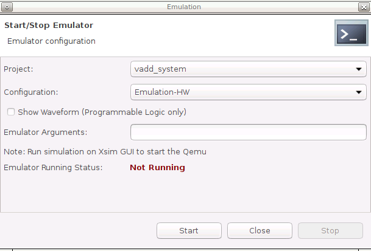
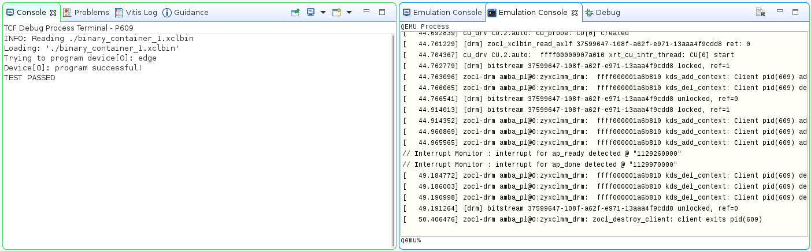

<table width="100%">
 <tr width="100%">
    <td align="center"><h1>Versal Custom Platform Creation Tutorial</h1>
    </td>
 </tr>
</table>

# Step 3: Test the Platform

## Test 1: Read Platform Info

With the AMD Vitis™ environment setup, **platforminfo** tool can report XPFM platform information.

You can verify hardware configuration (clocks, memory) and software configuration (domain) are set as expected.

<details>
  <summary><b>Show Log</b></summary>

  ```bash
   # Find the XPFM file
   cd ref_files/step2_sw/build/pfm/vck190_custom_dfx/export/vck190_custom_dfx
   # Report Platform Info
   platforminfo vck190_custom_dfx.xpfm

   ==========================
   Basic Platform Information
   ==========================
   Platform:           vck190_custom_dfx
   File:               Vitis-Tutorials/Vitis_Platform_Creation/Design_Tutorials/04_Edge_VCK190_DFX/ref_files/step2_sw/build/pfm/vck190_custom_dfx/export/vck190_custom_dfx/vck190_custom_dfx.xpfm
   Description:        
   A custom VCK190 DFX platform
      

   =====================================================
   Reconfigurable Partition Platform (Shell) Information
   =====================================================
   Reconfigurable Partition:
      id: 0
      Hardware Platform:            Vitis-Tutorials/Vitis_Platform_Creation/Design_Tutorials/04_Edge_VCK190_DFX/ref_files/step2_sw/build/pfm/vck190_custom_dfx/export/vck190_custom_dfx/hw/vck190_custom_dfx_rp.xsa
      Hardware Emulation Platform:  Vitis-Tutorials/Vitis_Platform_Creation/Design_Tutorials/04_Edge_VCK190_DFX/ref_files/step2_sw/build/pfm/vck190_custom_dfx/export/vck190_custom_dfx/hw_emu/vck190_custom_dfx_hw_emu.xsa

   =====================================
   Hardware Platform (Shell) Information
   =====================================
   Vendor:                           xilinx.com
   Board:                            versal_extensible_dfx_platform_base
   Name:                             versal_extensible_dfx_platform_base
   Version:                          1.0
   Generated Version:                2023.1
   Hardware:                         1
   Software Emulation:               1
   Hardware Emulation:               0
   Hardware Emulation Platform:      0
   FPGA Family:                      versal
   FPGA Device:                      xcvc1902
   Board Vendor:                     xilinx.com
   Board Name:                       xilinx.com:vck190:3.2
   Board Part:                       xcvc1902-vsva2197-2MP-e-S

   ==========
   Design IDs
   ==========
   Design ID:             3720683517
   Parent ID:             4170761552
   Node ID:               3684403989

   =================
   Clock Information
   =================
   Default Clock Index: 0
   Clock Index:         0
      Frequency:         156.250000
   Clock Index:         1
      Frequency:         104.166666

   =====================
   Resource Availability
   =====================
   =====
   Total
   =====
      LUTs:  893687
      FFs:   1790592
      BRAMs: 967

   ==================
   Memory Information
   ==================
   Bus SP Tag: DDR

   =============================
   Software Platform Information
   =============================
   Number of Runtimes:            1
   Default System Configuration:  vck190_custom_dfx
   System Configurations:
   System Config Name:                      vck190_custom_dfx
   System Config Description:               vck190_custom_dfx
   System Config Default Processor Group:   xrt
   System Config Default Boot Image:        standard
   System Config Is QEMU Supported:         1
   System Config Processor Groups:
      Processor Group Name:      aiengine
      Processor Group CPU Type:  ai_engine
      Processor Group OS Name:   aie_runtime
      Processor Group Name:      xrt
      Processor Group CPU Type:  cortex-a72
      Processor Group OS Name:   linux
   System Config Boot Images:
      Boot Image Name:           standard
      Boot Image Type:           
      Boot Image BIF:            vck190_custom_dfx/boot/linux.bif
      Boot Image Data:           vck190_custom_dfx/xrt/image
      Boot Image Boot Mode:      sd
      Boot Image RootFileSystem: 
      Boot Image Mount Path:     /mnt
      Boot Image Read Me:        vck190_custom_dfx/boot/generic.readme
      Boot Image QEMU Args:      vck190_custom_dfx/qemu/pmc_args.txt:vck190_custom_dfx/qemu/qemu_args.txt
      Boot Image QEMU Boot:      
      Boot Image QEMU Dev Tree:  
      Supported Runtimes:
   Runtime: C/C++

   ```

</details>

## Test 2: Test PL kernels on the DFX platform

To verify the DFX platform functionality for PL kernels, run the following tests

1. Create an acceleration project with a PL kernel (for example, Vector Addition). Test the design on hw-emu and hw. In this step, boot with static region and configure the RM on hardware. The hw-emu cannot fully reflect the configuration process but it can help to find potential issues in early stage.

2. Create an acceleration project with another PL kernel (for example, Burst Read Write). Reboot the board and test the design on hw-emu and hw. In this step, you are perform the same action as step 1 but verifying if another kernel is working as expected.

3. Reboot the board and test the reconfiguration function by configuring a PL kernel design (Vector Addition in this case). Next, re-configure a new PL kernel (Burst Read Write in this case) design without reboot and check its results.

The user flow for configuring the XCLBIN to DFX platforms and flat platforms are identical.

### Create a Vector-Addition application

1. Launch the Vitis platform.

   ```bash
   mkdir -p ref_files/step4_verify
   cd ref_files/step4_verify
   vitis -workspace ./ &
   ```

   Close the welcome tab after Vitis launches.

2. Add a custom platform.

   1. Select **Xilinx -> Add custom platform...**.
   2. Click the **add** button.
   3. Select the directory that [step3](./step3.md) generates. For example `ref_files/step2_sw/pfm`.
   4. Click **OK**.

3. Create vector addition application on the custom platform.

   1. Select **File -> New -> Application Project**.
   2. Go through the welcome page and click **Next**.
   3. On the Platform page, select the **vck190_custom_dfx** platform in the platform list. Click **Next**.
   4. Set **Application project name** to the **vadd**, target processor ``psv_cortexa72_SMP``. Click **Next**.

      

   5. Input **Sysroot** path (`step3_pfm/sw_comp/sysroots/cortexa72-cortexa53-xilinx-linux`)
   6. Input **RootFS** path (`step3_pfm/sw_comp/rootfs.ext4`)
   7. Input **Kernel Image** path (`step3_pfm/sw_comp/Image`). These components were prepared in [step 3](./step3.md). Click **Next**.
   8. Select template **Vector Addition**. Click **Finish**.

4. Build the vector addition application for hardware emulation.

   >**Note**: Skip this step if you are updating the code to support hardware emulation.

   1. Select the **vadd_system** project.
   2. Click the drop-down of **Build** hammer icon on the tool bar, select **Emulation-HW**. Alternatively, this step can be done by selecting **Active Build Configuration** to **Emulation HW** and clicking the build icon.
   3. If a dialogue box opens and asks whether to clean the project, select **Don't clean**.

5. Build the vector addition application for hardware.

   1. Select the **vadd_system** project.
   2. Click the drop-down of **Build** hammer icon on the tool bar, select **Hardware**. Alternatively, this step can be done by selecting **Active Build Configuration** to **Hardware** and clicking the build icon.

   It takes some time to build the hardware. Finally the Vitis tool will generate an `sd_card.img` file in the `vadd_system/Hardware/package` directory.

### Test the Application on Hardware Emulation

>**Note**:Skip this step if you want to update the code to support hardware emulation.

Validating the application with hardware emulation can first test the base functions of the platform such as boot initialization, PetaLinux configuration, basic acceleration feature, etc. The DFX feature cannot be emulated in hw-emu. It must be emulated in hardware as described below:

1. Launch Emulator for PS.

   1. Click **Xilinx -> Start/Stop Emulator**.
   2. Select Project: **vadd_system**, Configuration: **Emulation-HW**.

      

   3. Click **Start**

   There will be prints on the Emulation Console. Wait for it to boot Linux. The wait window will disappear after it detects Linux boot successfully.

2. Launch PL emulation.

   1. Right-click **vadd_system**, select **Run as -> Run Configurations**.
   2. Select **vadd_system-Default**.
   3. Change **Build Configuration** to **Emulation-HW**.
   4. Click Run.
   5. Check run result.

      

3. Stop the Emulator.

   1. Click **Xilinx -> Start/Stop Emulator**.
   2. Click **Stop** button.

### Test the Application on Hardware

1. Copy `vadd_system/Hardware/package/sd_card.img` to your local machine if you build the project on a remote server or virtual machine.

2. Program `sd_card.img` to SD card. Refer to [AR#73711](https://www.xilinx.com/support/answers/73711.html) for detailed steps.

   >**Note:** The programmed SD card has two partitions: FAT32 partition with boot components, and EXT4 partition with Linux root file system. Windows systems, by default, cannot see the contents of EXT4 partition.

   >**Note:** Eject the SD card properly from the system after programming it.

3. Insert the SD card and boot the VCK190 board with SD boot mode (SW1[4:1] = "1110": OFF, OFF, OFF, ON) and power on.

   >**Note:** Refer to the [VCK190 Evaluation Board User Guide](https://www.xilinx.com/support/documentation/boards_and_kits/vck190/ug1366-vck190-eval-bd.pdf) for details about boot mode.

4. Connect to UART console.

5. Launch the test application from UART console.

   <details>
   <summary><strong>Follow below steps to run the application</strong></summary>

     You will need to login with user `petalinux` first and setup a new password (it's then also the sudo password):

     - Log into the system

      ```bash
      petalinux login:petalinux
      You are required to change your password immediately (administrator enforced).
      New password:
      Retype new password:
      petalinux:~$ sudo su
      We trust you have received the usual lecture from the local System
      Administrator. It usually boils down to these three things:
            #1) Respect the privacy of others.
            #2) Think before you type.
            #3) With great power comes great responsibility.
      Password:
      petalinux:/home/petalinux#
      ```

     - Go to auto mounted FAT32 partition and run the application like below:

     ```
     petalinux:/home/petalinux# cd /run/media/sd-mmcblk0p1
     petalinux:/home/petalinux# ./simple_vadd krnl_vadd.xclbin
     ```

   </details>  

6. Expected print on UART console.

   <details>
   <summary><b>Show Log</b></summary>

   ```
   root@petalinux:/run/media/mmcblk0p1# ./vadd binary_container_1.xclbin
   EXE: /run/media/mmcblk0p1/simple_vadd
   [XRT] WARNING: The xrt.ini flag "opencl_summary" is deprecated and will be removed in a future release.  A summary file is generated when when any profiling is enabled, so please use the appropriate settings from "opencl_trace=true", "device_counter=true", and "device_trace=true."
   [XRT] WARNING: The xrt.ini flag "opencl_device_counter" is deprecated and will be removed in a future release.  Please use the equivalent flag "device_counter."
   INFO: Reading krnl_vadd.xclbin
   Loading: 'krnl_vadd.xclbin'
   [   74.394840] zocl-drm amba_pl@0:zyxclmm_drm: zocl_create_client: created KDS client for pid(577), ret: 0
   [   74.395731] zocl-drm amba_pl@0:zyxclmm_drm: zocl_destroy_client: client exits pid(577)
   [   74.401000] zocl-drm amba_pl@0:zyxclmm_drm: zocl_create_client: created KDS client for pid(577), ret: 0
   Trying to program device[0]: edge
   [   74.937477] [drm] skip kind 29(AIE_RESOURCES) return code: -22
   [   74.938038] [drm] found kind 8(IP_LAYOUT)
   [   74.938641] [drm] found kind 9(DEBUG_IP_LAYOUT)
   [   74.939375] [drm] skip kind 25(AIE_METADATA) return code: -22
   [   74.939688] [drm] found kind 7(CONNECTIVITY)
   [   74.940087] [drm] found kind 6(MEM_TOPOLOGY)
   [   74.940907] [drm] Memory 0 is not reserved in device tree. Will allocate memory from CMA
   [   74.948647] [drm] Memory 1 is not reserved in device tree. Will allocate memory from CMA
   [   74.963753] cu_drv CU.2.auto: cu_probe: CU[0] created
   [   74.974174] cu_drv CU.2.auto:  ffff000803cbac10 xrt_cu_intr_thread: CU[0] start
   [   74.989334] [drm] zocl_xclbin_read_axlf f4f049d5-183a-e265-264d-ecfa34a51343 ret: 0
   [   75.037345] [drm] bitstream f4f049d5-183a-e265-264d-ecfa34a51343 locked, ref=1
   [   75.038188] zocl-drm amba_pl@0:zyxclmm_drm:  ffff000800323c10 kds_add_context: Client pid(577) add context CU(0xffffffff) shared(true)
   [   75.041054] zocl-drm amba_pl@0:zyxclmm_drm:  ffff000800323c10 kds_del_context: Client pid(577) del context CU(0xffffffff)
   [   75.042096] [drm] bitstream f4f049d5-183a-e265-264d-ecfa34a51343 unlocked, ref=0
   [   75.094803] [drm] bitstream f4f049d5-183a-e265-264d-ecfa34a51343 locked, ref=1
   [   75.095393] zocl-drm amba_pl@0:zyxclmm_drm:  ffff000800323c10 kds_add_context: Client pid(577) add context CU(0xffffffff) shared(true)
   Device[0]: program successful!
   [   75.188269] zocl-drm amba_pl@0:zyxclmm_drm:  ffff000800323c10 kds_add_context: Client pid(577) add context CU(0xffffffff) shared(true)
   [   75.192218] zocl-drm amba_pl@0:zyxclmm_drm:  ffff000800323c10 kds_add_context: Client pid(577) add context CU(0x0) shared(true)
   TEST PASSED
   [   78.347703] zocl-drm amba_pl@0:zyxclmm_drm:  ffff000800323c10 kds_del_context: Client pid(577) del context CU(0xffffffff)
   [   78.349191] zocl-drm amba_pl@0:zyxclmm_drm:  ffff000800323c10 kds_del_context: Client pid(577) del context CU(0x0)
   [   78.354584] zocl-drm amba_pl@0:zyxclmm_drm:  ffff000800323c10 kds_del_context: Client pid(577) del context CU(0xffffffff)
   [   78.355356] [drm] bitstream f4f049d5-183a-e265-264d-ecfa34a51343 unlocked, ref=0
   [   78.462912] zocl-drm amba_pl@0:zyxclmm_drm: zocl_destroy_client: client exits pid(577)
   ```

   </details>

   >**Note**: The `[   35.116279] [drm]` messages are printed from XRT for debugging purpose. It only shows up on UART. It will now print on ssh. This debugging message can be turned off by turning down the system dmesg reporting level.
   >
   >```
   >echo "4" > /proc/sys/kernel/printk
   >```

**What Just Happened?**

You validated the DFX platform with PL only kernels.

## Test 3: Run an AI Engine + PL Acceleration Application Project

To verify the platform functionality, you will create a project with an AI Engine + PL kernel and PS application and run it on VCK190 board.

### Create an AI Engine and PL System Design

1. Create an AI Engine system design application on the custom platform.

   1. Select **File -> New -> Application Project**.
   2. Go through the welcome page and click **Next**.
   3. On the Platform page, select the **vck190_custom_dfx** platform in the platform list, and click **Next**.
   4. Set application name **plaie**, target processor **psv_cortexa72_SMP**. Click **Next**.
   5. Input Sysroot path, RootFS path, and Kernel Image. Click **Next**.
   6. Select template **AI Engine System Design Examples -> AI Engine, PL and PS System Design**. Click **Finish**.

2. Build the AI Engine system design application for hardware emulation.

   1. Select **plaie_system** project.
   2. Click the drop down of **Build** hammer icon on tool bar, select **Hardware-HW**. Alternatively, this step can be done by selecting **Active Build Configuration** to **Emulation HW** and clicking build icon.

3. Build the AI Engine system design application for hardware.

   - Select the **plaie_system** project.
   - Click the drop-down of **Build** hammer icon on tool bar, select **Hardware**. Alternatively, this step can be done by selecting **Active Build Configuration** to **Hardware** and clicking build icon.
   - If a dialogue box opens to ask whether to clean the project, select **Don't clean**.

4. After a successful build, an `sd_card.img` file is generated in the `plaie_system/Hardware/package` and `plaie_system/Hardware/package_no_aie_debug` directories. They include all files in `sd_card` directory in the first FAT32 partition and contents of `rootfs.ext4` in second EXT4 partition. The differences are the `sd_card.img` in `package` directory has a package parameter `enable_aie_debug=1`. It is used for debugging. The one in **package_no_aie_debug** can work for free running.

### Test the Application on Hardware Emulation

>**Note**: Skip this step if you want to update the code to support hardware emulation.

1. Launch Emulator for PS.

   1. Click **Xilinx -> Start/Stop Emulator**.
   2. Select Project: **plaie_system**, Configuration: **Emulation-HW**.
   3. Click **Start**.

   There will be prints on Emulation Console. Wait for it to boot Linux. The wait window will disappear after it detects Linux boot successfully.

2. Launch PL and AIE emulation.

   1. Right-click plaie_system, select **Run as -> Run Configurations**.
   2. Select **plaie_system-Launch**.
   3. Click **Run**.

   

3. Stop Emulator.

   1. Click **Xilinx -> Start/Stop Emulator**
   2. Click **Stop**.

### Test the Application on Hardware

1. Copy the `sd_card.img` from `plaie_system/Hardware/package_no_aie_debug` directory to your local system, if the project is run on a server or virtual machine.

   >**Note:** Vitis tools will generate images with `aie_debug` enabled and disabled. The image with `aie_debug` disabled will run freely. The image with `aie_debug` enabled will halt AI Engine and wait for the debugger to connect to it.

2. Program ``sd_card.img`` to the SD card. Refer to [AR#73711](https://www.xilinx.com/support/answers/73711.html) for detailed steps.

   >**Note:** The programmed SD card has two partitions: FAT32 partition with boot components, and EXT4 partition with Linux root file system. Windows systems, by default, cannot see the contents of EXT4 partition.

   >**Note:** Eject the SD card properly from the system after programming it.

3. Insert the SD card and boot the VCK190 board with SD boot mode (SW1[4:1] = "1110": OFF, OFF, OFF, ON) and power on.

   >**Note:** Refer to [VCK190 Evaluation Board User Guide](https://www.xilinx.com/support/documentation/boards_and_kits/vck190/ug1366-vck190-eval-bd.pdf) for details about boot mode.

4. Launch test application from UART console.

   <details>
   <summary><strong>Follow below steps to run the application </strong></summary>

     You will need to login with user `petalinux` first and setup a new password (it's then also the sudo password):

     - Log into the system
     
     ```bash
     petalinux login:petalinux
     You are required to change your password immediately (administrator enforced).
     New password:
     Retype new password:
     petalinux:~$ sudo su
     We trust you have received the usual lecture from the local System
     Administrator. It usually boils down to these three things:
         #1) Respect the privacy of others.
         #2) Think before you type.
         #3) With great power comes great responsibility.
     Password:
     petalinux:/home/petalinux#
     ```

     - Go to auto mounted FAT32 partition and run the application like below:

     ```
     petalinux:/home/petalinux# cd /run/media/sd-mmcblk0p1
     petalinux:/home/petalinux# ./plaie binary_container_1.xclbin
     ```

   </details>

5. Expected print on UART console.

   <details>
   <summary><b>Show Log</b></summary>

      ```
      root@petalinux:/mnt/sd-mmcblk0p1# ./plaie binary_container_1.xclbin
      Initializing ADF API...
      [   39.786629] zocl-drm axi:zyxclmm_drm: zocl_create_client: created KDS client for pid(697), ret: 0
      [   39.795569] zocl-drm axi:zyxclmm_drm: zocl_destroy_client: client exits pid(697)
      [   39.813998] zocl-drm axi:zyxclmm_drm: zocl_create_client: created KDS client for pid(697), ret: 0
      [   40.245746] [drm] found kind 29(AIE_RESOURCES)
      [   40.245765] [drm] found kind 8(IP_LAYOUT)
      [   40.250535] [drm] found kind 9(DEBUG_IP_LAYOUT)
      [   40.254738] [drm] found kind 25(AIE_METADATA)
      [   40.259429] [drm] found kind 7(CONNECTIVITY)
      [   40.263937] [drm] found kind 6(MEM_TOPOLOGY)
      [   40.268417] [drm] Memory 0 is not reserved in device tree. Will allocate memory from CMA
      [   40.280809] [drm] Memory 1 is not reserved in device tree. Will allocate memory from CMA
      [   40.296964] cu_drv CU.2.auto: cu_probe: CU[0] created
      [   40.302294] cu_drv CU.3.auto: cu_probe: CU[1] created
      [   40.307630] cu_drv CU.4.auto: cu_probe: CU[2] created
      [   40.312842] cu_drv CU.2.auto:  ffff000804e4ac10 xrt_cu_intr_thread: CU[0] start
      [   40.320432] cu_drv CU.3.auto:  ffff00080271e810 xrt_cu_intr_thread: CU[1] start
      [   40.321470] [drm] zocl_xclbin_read_axlf 8e1f87ed-725e-07da-c6b3-6786f6df2f1f ret: 0
      [   40.327753] cu_drv CU.4.auto:  ffff000802696410 xrt_cu_intr_thread: CU[2] start
      XAIEFAL: INFO: Resource group Avail is created.
      XAIEFAL: INFO: Resource group Static is created.
      XAIEFAL: INFO: Resource group Generic is created.
      [   40.390527] [drm] bitstream 8e1f87ed-725e-07da-c6b3-6786f6df2f1f locked, ref=1
      [   40.390547] zocl-drm axi:zyxclmm_drm:  ffff00080085d410 kds_add_context: Client pid(697) add context Domain(0) CU(0xffffffff) shared(true)
      [   40.410331] zocl-drm axi:zyxclmm_drm:  ffff00080085d410 kds_del_context: Client pid(697) del context Domain(0) CU(0xffffffff)
      Input memory virtual addr 0x0xffffb91ea000x
      Input memory virtual addr 0x0xffffb91e9000x
      in_bohdl0 in_bohdl1 sync[   40.421650] [drm] bitstream 8e1f87ed-725e-07da-c6b3-6786f6df2f1f unlocked, ref=0
      started
      in_bohdl0 in_bohdl1 sy[   40.429988] [drm] bitstream 8e1f87ed-725e-07da-c6b3-6786f6df2f1f locked, ref=1
      nc done
      Output memory virtual a[   40.439461] zocl-drm axi:zyxclmm_drm:  ffff00080085d410 kds_add_context: Client pid(697) add context Domain(0) CU(0xffffffff) shared(true)
      ddr 0x0xffffb91e8000x
      [   40.464816] zocl-drm axi:zyxclmm_drm:  ffff00080085d410 kds_add_context: Client pid(697) add context Domain(0) CU(0x1) shared(true)
      run pl_mm2s_1
      [   40.478710] zocl-drm axi:zyxclmm_drm:  ffff00080085d410 kds_add_context: Client pid(697) add context Domain(0) CU(0x0) shared(true)
      run pl_mm2s_2
      [   40.492018] zocl-drm axi:zyxclmm_drm:  ffff00080085d410 kds_add_context: Client pid(697) add context Domain(0) CU(0x2) shared(true)
      run pl_s2mm
      graph init. This does nothing be[   40.506280] zocl-drm axi:zyxclmm_drm:  ffff00080085d410 kds_del_context: Client pid(697) del context Domain(0) CU(0x1)
      cause CDO in boot PDI already con[   40.519845] zocl-drm axi:zyxclmm_drm:  ffff00080085d410 kds_del_context: Client pid(697) del context Domain(0) CU(0x0)
      figures AIE.
      graph run
      graph end[   40.533494] zocl-drm axi:zyxclmm_drm:  ffff00080085d410 kds_del_context: Client pid(697) del context Domain(0) CU(0xffffffff)

      mm2s_1 completed with status(4[   40.547611] zocl-drm axi:zyxclmm_drm:  ffff00080085d410 kds_del_context: Client pid(697) del context Domain(0) CU(0x2)
      )
      mm2s_2 completed with status(4)
      s2mm completed with status(4)
      TEST PASSED
      Releasing host Buffers...
      Releasing remaining XRT objects...
      [   40.561044] [drm] bitstream 8e1f87ed-725e-07da-c6b3-6786f6df2f1f unlocked, ref=0
      [   40.578375] zocl-drm axi:zyxclmm_drm: zocl_destroy_client: client exits pid(697)
      ```
   </details>

### Test the reconfiguration feature on hardware

1. Keep the SD card image of the AI Engine system design application. Copy `xclbin` and `elf` of vector addition application to FAT32 partition of the SD card.
2. Boot the device.
3. Run the vadd application.
4. Run the AI Engine system application.

Congratulations now you have created a custom platform that the PL acceleration kernel and AI Engine applications can work on it.

### Next Steps

If user need to do iteration for your project, you could go through the [Iteration Guidelines](./Iteration_guideline.md) to do iterations.

## What's Next

[The next chapter](./faq.md) will list some frequently encountered problems and frequently asked questions.

<p class="sphinxhide" align="center"><sub>Copyright © 2020–2023 Advanced Micro Devices, Inc</sub></p>

<p class="sphinxhide" align="center"><sup><a href="https://www.amd.com/en/corporate/copyright">Terms and Conditions</a></sup></p>
