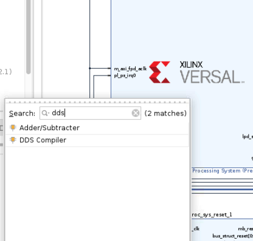
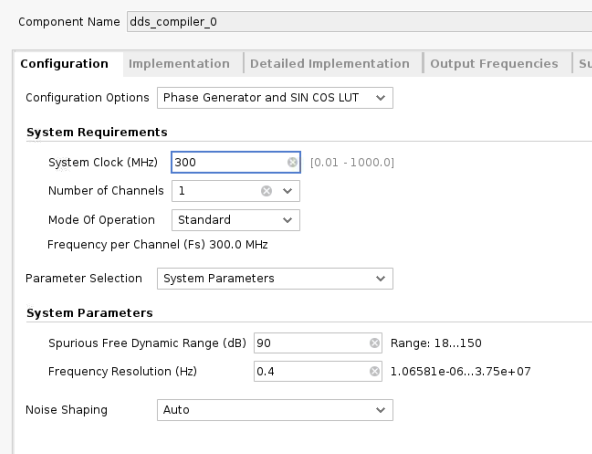
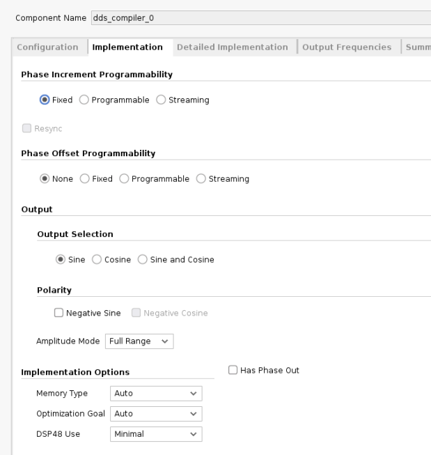
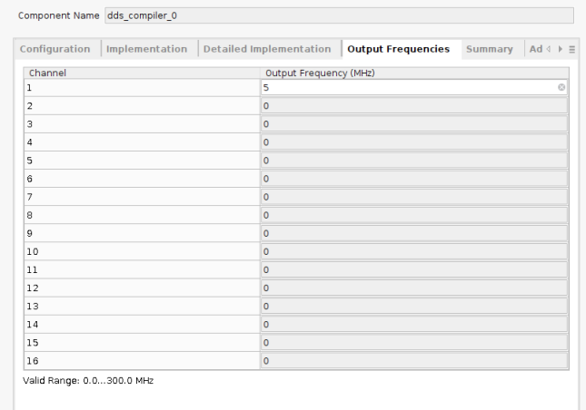
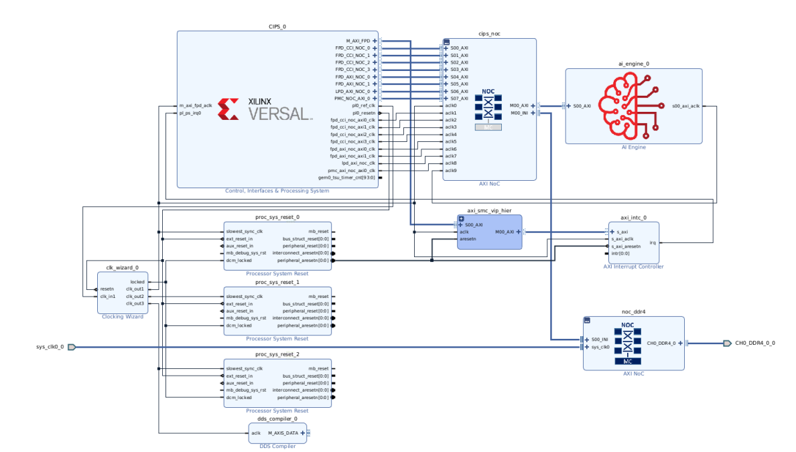
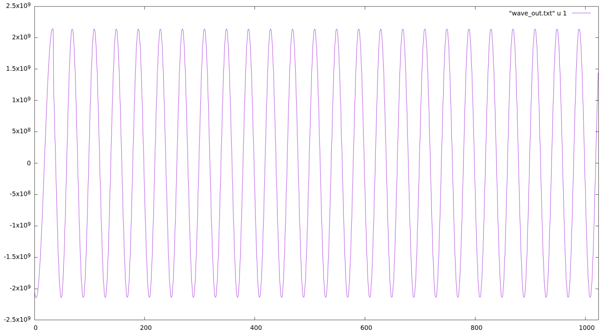

<table class="sphinxhide" width="100%">
 <tr>
   <td align="center"><h1>Vitis™ Platform Creation Tutorials</h1>
   </td>
 </tr>
</table>

# Versal Platform Creation with Custom IP

***Version: Vitis 2023.1***

This tutorial explains how to add custom IPs into a Versal™ adaptive SoC platform. This tutorial is an 'add-on' to the basic [Versal platform creation tutorial](../../Design_Tutorials/03_Edge_VCK190/). Therefore, for each step, there is a pointer to the corresponding part of that tutorial, as required.

This tutorial targets the Versal board. 

## Overview
The tutorial is structured as follows:
- [Versal Platform Creation with Custom IP](#versal-platform-creation-with-custom-ip)
  - [Overview](#overview)
    - [Step 1: Create a Hardware Platform](#step-1-create-a-hardware-platform)
    - [Step 2: Add Custom IP into the Block Design](#step-2-add-custom-ip-into-the-block-design)
    - [Step 3: Package the Platform in the Vitis Software Platform](#step-3-package-the-platform-in-the-vitis-software-platform)
    - [Step 4: Test the Platform](#step-4-test-the-platform)
  - [Fast Track](#fast-track)
    - [Support](#support)

### Step 1: Create a Hardware Platform

In this tutorial, you use the prebuilt example design for Versal to build the hardware platform. This method saves time instead of manually creating the IP integrator block design.

Follow the instructions in [Versal platform creation tutorial-Step1](../../Design_Tutorials/03_Edge_VCK190/step1.md). You may skip the optional steps.


### Step 2: Add Custom IP into the Block Design

In this step, you add a DDS compiler IP into the platform design that you created in the last step. The DDS compiler IP is provided in the AMD IP catalog in the Vivado Design Suite. For more details, see [PG141](https://www.xilinx.com/support/documentation/ip_documentation/dds_compiler/v6_0/pg141-dds-compiler.pdf). Because it is a publicly available IP, it supports simulation inherently. If you want to add your own IP cores, you must provide simulation models to support simulation.

1. Reopen the system block design that was created in last step if you have already closed it.

2. Click the **Add IP** (plus icon) button and search for **dds**. Double click the DDS compiler IP to add it to the canvas.

   

3. Configure the DDS IP as follows. Be aware that some of the settings are not a hard requirement and are just for the purpose of this design. The only hard requirement is that there is only a single AXI4-Stream interface for this IP and therefore the phase output port is disabled.

    a. Configuration Tab Settings:

    

    b. Implementation Tab Settings:

    

    c. Detailed Implementation Tab Settings:

    Keep the default settings for this page.

    d. Output Frequency Tab Settings:

    You can adjust the frequency value but keep the sample rate in mind. The clocking rate is 300 MHz. If there are too few samples within one cycle, the sine wave cannot be sampled correctly.

       

4. Exit the configuration page and connect the `aclk` port to the `clk_out1` signal of clocking wizard.

5. Now the block design should look like the following:

  

6. Open up platform setup window and enable the M_AXIS_DATA port. Set the SP Tag to `AXIS` - this will be used by the Vitis™ linker to connect to the accelerator.

    

7. Regenerate the block design output products.

8. Export the hardware platform. In the platform type selection page, choose **Hardware and hardware emulation** to run emulation with this platform.


### Step 3: Package the Platform in the Vitis Software Platform

In this step, you pack the hardware XSA with software components in the Vitis IDE. Follow the instructions in [Versal platform creation tutorial-Step2](../../Design_Tutorials/03_Edge_VCK190/step2.md).


### Step 4: Test the Platform

In this step, you build a simple `vadd` application and run hardware emulation to test the platform. Follow the instructions in [Versal platform creation tutorial-Step3](../../Design_Tutorials/03_Edge_VCK190/step3.md) along with the following modifications.

You need to run Application1 on the above page. After creating the `vadd` system project, make the following changes.

1. Open up the `krnl_vadd.cpp` file under the `src` folder of the `vadd_kernels` project. Add the following header files at the beginning of this file. These are used to support the AXIS data type and HLS stream data type.

```
#include "ap_int.h"
#include "ap_axi_sdata.h"
```
2. Define a type named `pkt` before the kernel function definition.

```
typedef ap_axis<15, 0, 0, 0> pkt;
```

3. In this design, the data from the DDS IP is not processed. It is only passed on to the DDR. To do that, add a function similar to the following:

```
static void dss_process( int *wave, hls::stream<pkt> &s_in) {
    for (int i = 0; i < 1024; i++) 
    {
        #pragma HLS PIPELINE II = 1
        pkt value = s_in.read();
        wave[i] = value.data;
    }
}
```

4. Add two ports into the top level function. The `dds_in` port is an AXI4-Stream type and the `wave_out` port is an AXI-MM type.

```
void krnl_vadd(uint32_t* in1, uint32_t* in2, uint32_t* out, int size, int *wave_out, hls::stream<pkt> &dds_in) 
```

5. Declare the two ports added in step4 in the `krnl_vadd` function.

```
#pragma HLS INTERFACE m_axi port = wave_out bundle = gmem2
#pragma HLS INTERFACE axis port = dds_in
```

6. Add one line to call the `dss_process` function in the `krnl_vadd` function.

```
dss_process(wave_out,dds_in);
```

Now the kernel code modification is complete. Save your work and close the file.

> Note: For the complete modification code reference on the  `vadd` kernel, see [kernel code modifications](./code_modification_guide/kernel_modifications.md).


5. To direct the Vitis linker to correctly link the kernel's AXI stream port with the corresponding interface of the platform, create a configuration file called `system.cfg` and add the following lines to it.

```
[connectivity]
stream_connect = AXIS:krnl_vadd_1.dds_in
```

This command indicates the connections between two AXI4-Stream ports. The name before the colon must be the master interface while the latter is the name of the slave interface. In this design, the AXIS sptag from platform represents the AXI master side therefore we put it in the front. Here you just need to specify the `sptag` that was defined during platform creation and the Vitis linker detects it automatically.

The `system_cfg` file is put under the `vadd_system_hw_link` project. You can choose other locations but just make sure that you point to it correctly in the binary container settings.

Specify the config file in binary container settings:

  

6. Now modify the host code to read back the data from the DDR. Open up the `vadd.cpp` file under the `src` folder of the `vadd` project and modify the following items.

    a.  Add header files.

    ```
    #include "ap_int.h"
    #include <stdio.h>
    ```

    b. Create a new `cl_mem buffer` for the DDS output data.

    ```
    cl::Buffer buffer_waveout(context, CL_MEM_WRITE_ONLY, 1024*sizeof(int));
    ```

    c. Bond the buffer with the kernel.

    ```
    krnl_vector_add.setArg(narg++,buffer_waveout);
    ```

    d. Map the host buffer with the device buffer.

    ```
    int *ptr_waveout = (int *) q.enqueueMapBuffer (buffer_waveout , CL_TRUE , CL_MAP_READ , 0, 1024*sizeof(int));
    ```

    e. Read the data from the DDR.  

    ```
    q.enqueueMigrateMemObjects({buffer_waveout},CL_MIGRATE_MEM_OBJECT_HOST);
    ```

    f. Save the data into a file. The data is left shifted by 17 bits because the DDS compiler IP output is 16-bit signed data and the host buffer 32-bit integer data. This is to remove the extra signed bits and keep the actual payload data.

    ```
     FILE *fp_dout;
     fp_dout=fopen("wave_out.txt","w");

     for (int i = 0; i < 1024; i++) {
       fprintf(fp_dout,"%d\n",ptr_waveout[i]<<17);
     }

     fclose(fp_dout);
    ```

    g. Unmap the buffer.

     ```
     q.enqueueUnmapMemObject(buffer_waveout , ptr_waveout);
     ```

    > Note: For the complete modification code reference on the `vadd` host application, see [host code modifications](./code_modification_guide/host_modifications.md).

7. Now run emulation on the modified `vadd` application. Follow the instructions in [Versal platform creation tutorial-Step3 Emulation](../../Design_Tutorials/03_Edge_VCK190/step3.md#optional-test-the-application-on-hardware-emulation).

8. After the 'Test Passed' pop-up appears in the console window, copy the generated `wave_out.txt` file from the QEMU target. First, launch the XSCT console window from `AMD` menu if you have not already done so.

  Connect to the `tcf` target using the following command:

  ```
  connect -host 127.0.0.1 -port 1440
  ```

  Copy the `wave_out.txt` file from the `tcf` target to the host machine using the following command:

  ```
  tfile copy -to-host /run/media/mmcblk0p1/wave_out.txt $(YOUR_DIR)/wave_out.txt
  ```

  The wave_out.txt file will be copied over to $(YOUR_DIR). Choose a tool to plot the data. A possible option is the tool `gnuplot` which is an open source tool and easy to use it to print out the sine wave.

  

## Fast Track

Scripts are provided to re-create the project. For the moment, this script only supports running emulation. 

1. Run build

  ```
  # cd to the step directory, e.g.
  cd ref_files/
  make all COMMON_IMAGE_VERSAL=<path/to/common_image/> # to specify the common image path
  ```

2. To clean the generated files, please run

  ```bash
  make clean
  ```

### Support

GitHub issues will be used for tracking requests and bugs. For questions go to [forums.xilinx.com](https://support.xilinx.com).


<p class="sphinxhide" align="center"><sub>Copyright © 2020–2023 Advanced Micro Devices, Inc</sub></p>

<p class="sphinxhide" align="center"><sup><a href="https://www.amd.com/en/corporate/copyright">Terms and Conditions</a></sup></p>
