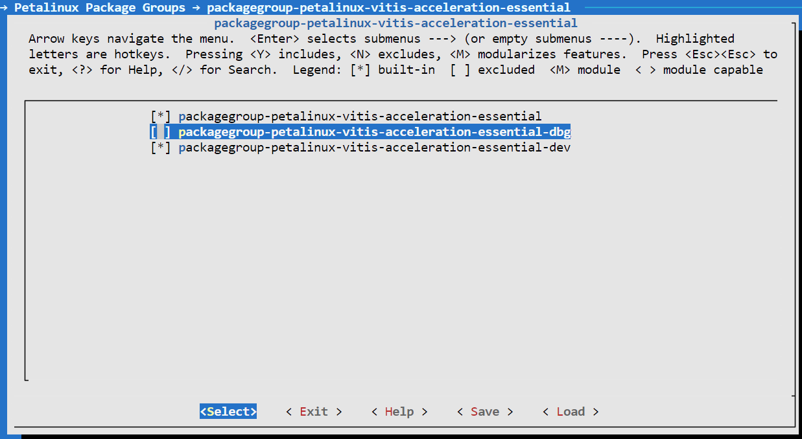

<table class="sphinxhide" width="100%">
 <tr width="100%">
    <td align="center"><h1>Vitis™ Platform Creation Tutorials</h1>
    <a href="https://www.xilinx.com/products/design-tools/vitis.html">See Vitis™ Development Environment on xilinx.com</br></a>
    </td>
 </tr>
</table>


## PetaLinux Building and System Customization

***Version: PetaLinux 2023.1***

This module demonstrates platform software components customization. Use the PetaLinux tools to create the Linux image and sysroot with XRT support, together with some more advanced tweaks. Among all the customizations, the XRT installation and ZOCL device tree setup are mandatory. Other customizations are optional. The customization purposes are explained and you can pick your desired customization.

Yocto or third-party Linux development tools can also be used as long as they produce the same Linux output products as PetaLinux.

As XSA file is the mandatory input for Petalinux project. Users can input  XSA file exported from your Vivado project. This time we will leverage ready-made base platform from [Xilinx website download center](https://www.xilinx.com/support/download.html) and take zcu104 base platform as an example to show how to do system customization. Of course, you can download other platforms from that page according to your requirement. 

### Prepare the base platform

1. Create a workspace

   ```bash
   mkdir workspace
   cd workspace
   ```

2. Download the base platform and place it under `workspace`  folder. Then extract it. If you have already installed the Vitis™ tool, omit this step as AMD Official platforms have already built into the vitis tool installation package.

   ```bash
   unzip xilinx_zcu104_base_202310_1.zip #extract the base platform
   cd xilinx_zcu104_base_202310_1
   tree -L 2
   .
   ├── hw
   │   └── hw.xsa
   ├── hw_emu
   │   └── hw_emu.xsa
   ├── sw
   │   ├── xilinx_zcu104_base_202310_1
   │   └── xilinx_zcu104_base_202310_1.spfm
   ├── version
   └── xilinx_zcu104_base_202310_1.xpfm
   4 directories, 5 files
   ```

### Create a PetaLinux Project

1. Setup PetaLinux environment

   ```bash
   source <petaLinux_tool_install_dir>/settings.sh
   ```

2. Create a PetaLinux project named **zcu104_petalinux** and configure the hw option with the XSA file:

   ```bash
   cd workspace
   petalinux-create --type project --template zynqMP --name zcu104_petalinux
   cd zcu104_petalinux
   petalinux-config --get-hw-description=xilinx_zcu104_base_202310_1/hw/hw.xsa  # After you extract the base platform, you can find hw.xsa or hw_emu.xsa under <xilinx_zcu104_base_202310_1> directory. If you want to do emulation you can choose hw_emu.xsa 
   ```

   > Note: `--template` option specifies the chipset. zcu104 board adopts the ZYNQMP™ series chip. Therefore, we specify this option as `zynqMP`. If your platform is using Versal™ chipset, set this option to `versal`.

   > Note: If the user is customizing Linux image for VCK190 board, ensure the XSA file is exported from a normal project (not a Vitis extensible project) and includes the device image.

   > Note: PetaLinux will use XSA to generate the device tree. Since hardware XSA and hardware emulation XSA have identical peripherals, providing either of them to PetaLinux is acceptable. When simplifying the hardware design for hardware emulation, it is recommended to keep all the peripherals that need device tree and drivers so that the auto-generated device tree can be reused. If the two designs have different addressable peripherals, you will need to create two sets of device trees for hardware running and hardware emulation, separately.


3. A petalinux-config menu is launched. Set it to use ZCU104 device tree in the configuration window.

   - Select **DTG Settings->MACHINE_NAME**
   - Modify it to ```zcu104-revc```. 
   - Select **OK -> Exit -> Exit -> Yes** to close this window.

   Note: 
   
     - If you are using an AMD development board, it is recommended to modify the machine name so that the board configurations would be involved in the DTS auto-generation. You can check the [UG1144 document](https://www.xilinx.com/content/dam/xilinx/support/documentation/sw_manuals/xilinx2021_2/ug1144-petalinux-tools-reference-guide.pdf) for the corresponding machine name.
     - If you are using a custom board, you would need to configure the associated settings (e.g. the PHY information DTS node) in **system-user.dtsi** manually.
     - Device tree is a generic technology in embedded Linux. Search on Google for more information.


### Customize Root File System, Kernel, Device Tree and U-boot

1. Enable selected rootfs packages


   In order to add all Vitis acceleration flow required packages, we create a package group option. If this group option is selected, the following Vitis acceleration flow required package is automatically enabled.

   | Package Group                                       | Package Name                                                                    | Description                                                                                                                 |
   | --------------------------------------------------- | ------------------------------------------------------------------------------- | --------------------------------------------------------------------------------------------------------------------------- |
   | packagegroup-petalinux-vitis-acceleration-essential | xrt                                                                             | xrt is required for Vitis acceleration flow. The dependency packages such as ZOCL driver module will be added automatically |
   | packagegroup-petalinux-vitis-acceleration-essential | dnf                                                                             | dnf is a package management tool                                                                                            |
   | packagegroup-petalinux-vitis-acceleration-essential | e2fsprogs-resize2fs</br>parted</br>resize-part                                  | This set of tool can be used for ext4 partition resize                                                                      |
   | packagegroup-petalinux-vitis-acceleration-essential | opencl-headers</br>packagegroup-petalinux-opencv</br>packagegroup-petalinux-x11 | These three packages are graph display related library                                                                      |
   | packagegroup-petalinux-vitis-acceleration-essential | gdb</br>valgrind                                                                | debug related tools                                                                                                         |

   Follow the steps below to enable the package group for Vitis acceleration flow.

   - Run `petalinux-config -c rootfs` 
   - Go to **Petalinux Package Groups** -> **packagegroup-petalinux-vitis-acceleration-essential** and enable **packagegroup-petalinux-vitis-acceleration-essential**.  Also enable **packagegroup-petalinux-vitis-acceleration-essential-dev** that enables the sysroot support.

   


2. Enable OpenSSH and disable dropbear (optional)
   
   Dropbear is the default SSH tool in Vitis Base Embedded Platform. If OpenSSH is used to replace Dropbear, the system could achieve four times faster data transmission speed over ssh (tested on 1Gbps Ethernet environment). Since Vitis-AI applications may use remote display feature to show machine learning results, using OpenSSH can improve the display experience.

   - In the RootFS configuration window, go to the root directory by selecting  **Exit** once.
   - Go to **Image Features**.
   - Disable **ssh-server-dropbear** and enable **ssh-server-openssh** and click Exit.
   
   

   - Go to **Filesystem Packages-> misc->packagegroup-core-ssh-dropbear** and disable **packagegroup-core-ssh-dropbear**. 
   - Go to **Filesystem Packages** level by clicking **Exit** twice.
   - Go to **console  -> network -> openssh** and enable **openssh**, **openssh-sftp-server**, **openssh-sshd**, **openssh-scp**. 
   - Go to root level by clicking on **Exit** four times.

3. Enable Package Management

   Package management feature can allow the board to install and upgrade software packages on the fly.

   - In rootfs config, go to **Image Features** and enable **package-management** and **debug_tweaks** option. 
   - Click on **OK**, **Exit** twice and select **Yes** to save the changes.

4. Disable CPU IDLE in kernel config (recommended during debugging).

   CPU IDLE can cause processors get into IDLE state (WFI) when the processor is not in use. When JTAG is connected, the hardware server on the host machine talks to the processor regularly. If it talks to a processor in IDLE status, the system will hang because of incomplete AXI transactions. Hence, it is recommended to disable the CPU IDLE feature during project development phase. It can be re-enabled after the design is completed to save power in the final products.

   - Launch kernel config: `petalinux-config -c kernel`
   - Ensure the following items are **TURNED OFF** by entering 'n' in the [ ] menu selection:
     - **CPU Power Management > CPU Idle > CPU idle PM support**
     - **CPU Power Management > CPU Frequency scaling > CPU Frequency scaling**
   - Exit and Save.


### Update the Device tree

Device tree describes the hardware components of the system. AMD device tree generator (DTG) can generate the device tree according to hardware configurations from an XSA file. You needs to add customization settings in system-user.dtsi for PetaLinux to consume. For example, unavailable settings in XSA, any driver nodes that don't have a corresponding hardware, or customising settings if the user needs to override any DTG auto-generated configurations. 

ZOCL driver module has no associated hardware, but it is required by XRT and Vitis acceleration flow. It requires a device tree node to describe the interrupt signal relationship. In previous Vitis and PetaLinux versions, you had to add ZOCL device tree node manually. From 2021.1, PetaLinux can add ZOCL device tree node automatically if the XSA is a Vitis extensible platform project.

Device Tree Generator (DTG) also overrides the interrupt controller (axi_intc_0) input numbers parameter from 0 to 32 because in the platform XSA the interrupt controller inputs have not been connected but they will be connected after v++ links the acceleration kernels.

You can review the PetaLinux generated device tree in **project-spec/components/device-tree/device-tree/pl.dtsi** file.

You can also add your custom device tree modifications to **project-spec/meta-user/recipes-bsp/device-tree/files/system-user.dtsi**. For example this is how you setup sdhci1 to low speed mode.

```
&sdhci1 {
      no-1-8-v;
      disable-wp;
};
```

   - **sdhci1** node decreases SD Card speed for better card compatibility on ZCU104 board. This only relates to ZCU104 and is not a part of Vitis acceleration platform requirements. 

   **Note**: an example file [zcu104/system-user.dtsi](ref_files/zcu104/system-user.dtsi) is provided for zcu104 board and [vck190/system-user.dtsi](ref_files/vck190/system-user.dtsi) for VCK190 board.


### Add EXT4 rootfs support 

It is recommended to use EXT4 for Vitis acceleration designs. PetaLinux uses initramfs format for rootfs by default. It cannot retain the rootfs changes in run time. Initramfs keeps rootfs contents in DDR, which reduces usable DDR memory. To retain the changes in the root file system and to enable maximum usage of available DDR memory, use EXT4 format for rootfs in the second partition while keeping the first partition FAT32 to store the boot files.

Vitis-AI applications installs additional software packages. To run Vitis-AI applications, use EXT4 rootfs. If in any case, initramfs are used, add all Vitis-AI dependencies to initramfs.

1. Let PetaLinux generate EXT4 rootfs

   - Run `petalinux-config`
   - Go to **Image Packaging Configuration**
   - Enter into **Root File System Type**
   - Select Root File System Type as **EXT4**
   - Exit and Save.

   

<!--TODO: CMA change is needed. Other changes are not.-->
2. Let Linux use EXT4 rootfs during boot

   The setting of rootfs to use during boot is controlled by **bootargs**. Change the bootargs settings to allow Linux to boot from EXT4 partition. There are various ways to update bootargs and you can choose either of the methods mentioned below.
   
   Method A: PetaLinux config

   - Run `petalinux-config`
   - Change **DTG settings -> Kernel Bootargs -> generate boot args automatically** to NO and update **User Set Kernel Bootargs** to `earlycon console=ttyPS0,115200 clk_ignore_unused root=/dev/mmcblk0p2 rw rootwait cma=512M`. Click OK, Exit three times and Save.
   
   Method B: device tree

   - Update in  **system-user.dtsi**
   - Add `chosen` node in root in addition to the previous changes to this file.
   ```
   / {
	   chosen {
	   	bootargs = "earlycon console=ttyPS0,115200 clk_ignore_unused root=/dev/mmcblk0p2 rw rootwait cma=512M";
	   };
   };
   ```
  
   Note:
  
   - **root=/dev/mmcblk0p2** means to use second partition of SD card, which is the EXT4 partition.
   - Note that we also set these options in bootargs:
     - **clk_ignore_unused**: Commands Linux kernel to avoid turning off clocks if this clock is not used. Only useful clocks drives PL kernels because PL kernels are not represented in device tree.
     - **cma=512M**: CMA is used to exchange data between PS and PL kernel. The size for CMA is determined by PL kernel requirements. Vitis-AI/DPU needs at least 512MB CMA.

### Build PetaLinux Images

1. From any directory within the PetaLinux project, build the PetaLinux project.

   ```
   petalinux-build
   ```

   The PetaLinux image files are generated in <PetaLinux Project>/images/linux directory.

2. Create a sysroot self-installer for the target Linux system

   ```
   petalinux-build --sdk
   ```

   The generated sysroot package **sdk.sh** is located in <PetaLinux Project>/images/linux directory and you can extract it when you need.


### Fast Track

Scripts are provided to re-create PetaLinux project and generate outputs. 

1. Run build

   ```
   # cd to the step directory, e.g.
   cd ref_files/board/
   make all XSA_PATH=<path/to/base_platform/> # to specify the XSA file path 
   ```

2. To clean the generated files, run the command

   ```bash
   make clean
   ```


<p class="sphinxhide" align="center"><sub>Copyright © 2020–2023 Advanced Micro Devices, Inc</sub></p>

<p class="sphinxhide" align="center"><sup><a href="https://www.amd.com/en/corporate/copyright">Terms and Conditions</a></sup></p>
