<table class="sphinxhide" width="100%">
 <tr width="100%">
   <td align="center"><h1>Vitis™ Platform Creation Tutorials</h1>
   </td>
 </tr>
 <tr>
 <td>
 </td>
 </tr>
</table>

# Vitis Export To Vivado

***Version: Vitis 2023.2***

## Introduction

The Vitis Export to Vivado enables bidirectional hardware hand-offs between the Vitis tools and the Vivado Design Suite to improve developer productivity in vivado. Hardware design development which includes synthesis, implementation, and timing closure can be done in Vivado Design Suite and Vitis tool can be used to do the software development, such as AI Engine (AIE) development, programmable logic (PL) kernels development and host application. This flow supports hardware emulation and testing the design on hardware. Refer UG1393 https://docs.amd.com/r/en-US/ug1393-vitis-application-acceleration/Vitis-Export-to-Vivado-Flow for more details. 

**IMPORTANT:** Before beginning the tutorial, make sure you have installed the Vitis 2023.2 and Vivado 2023.2 software.

### We are creating the custom BDC based platform using the tcl script. The Vitis Export to Vivado flow supports BDC-based platform only. 

## Objectives

After completing this tutorial, you will be able to do the following:

 1. Modify BD platform setup in Vivado to connect RTL-IP stream ports to AIE PLIO.
 2. Export the extensible platform (.xsa) from the hardware design in Vivado.
 3. Create the Vitis-Metadata-Archive (VMA) using the --export_archive option in v++ --link command.
 4. Import the VMA in Vivado using `vitis::import_archive` Tcl API.
 5. Generate `fixed.xsa` from Vivado, and from there, the xclbin file is needed to test the design in hardware or hardware emulation.

##  Recommended design development flow steps:

The recommended steps are as follows: 
1. Develop hardware design in Vivado.
2. Export the extensible platform (.xsa) from Vivado. 
3. Use the Extensible platform (.xsa) in Vitis to develop and compile AI Engine Graph application and PL kernels. 
4. Link the AIE / PL compiled output, connectivity graph, extensible platform to export the VMA (Vitis Metadata Archive) in Vitis.
5. Import the VMA file into Vivado.
6. To run the design in hardware emulation:
   
   6.1: Run simulation scripts
   
   6.2: Generate fixed xsa in Vivado
   
   6.3: Run v++ package target hw_emu to generate xclbin in Vitis
   
   6.4: Run host.exe
   
7. To run the design in hardware:
 
   7.1: Run synthesis and implementation. Close timing in Vivado.
   
   7.2: Generate fixed.xsa in vivado
   
   7.3: Run v++ package target hw to generate xclbin in Vitis
   
   7.4: Take the design to hardware and run host.exe
   
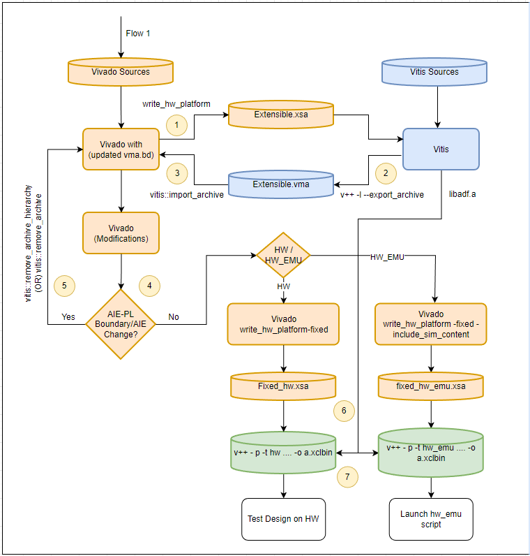

The steps in the above diagram are covered in detail in the below section "Design Flow".

The Vitis export to the Vivado flow introduces a new v++ link option and three new Tcl APIs. This tutorial helps you understand how to use this flow:

The v++ link option introduced in this flow to generate Vitis Metadata is:

```bash
v++ -l --export_archive
```

This option can be used with v++ --l only. Do not use --target with this command, it is not supported. 

The Vivado Tcl APIs are introduced in this flow to import and remove the VMA from Vivado are:

```bash
vitis:: import_archive
vitis:: remove_archive_hierarchy
vitis:: remove_archive
```


## DESIGN FILES

--------------

1. Vivado design tcl scripts are located in `hw\xsa_scripts` folder:

    - [xsa.tcl](./hw/xsa_scripts/xsa.tcl)
    
    - [project.tcl](./hw/xsa_scripts/project.tcl)
    
    - [ext_bdc.tcl](./hw/xsa_scripts/ext_bdc.tcl)

    - [vck190_bd.tcl](./hw/xsa_scripts/vck190_bd.tcl)

    - [pfm_decls.tcl](./hw/xsa_scripts/pfm_decls.tcl)
   
2. Files for AIE graph are in the `aie` folder.

    - [Graph.cpp](./aie/graph.cpp)

    - [Graph.h](./aie/graph.h)

    - [include.h](./aie/include.h)

    - [kernels.h](./aie/kernels.h)

3. Files for Polar_clip HLS kernel are in the `pl_kernels` folder.

    - [polar_clip.cpp](./pl_kernels/polar_clip.cpp)

4. The system configuration file is in the `vitis_impl` folder.

   - [system.cfg](./vitis_impl/system.cfg): Connection details for AIE and HLS Kernel: Polar_clip

## Design Flow

This tutorial covers two use cases as follows: 

Use Case 1: Changes in the hardware design after VMA import not affecting the PLIO interface. In this use case, we are considering no hardware design change in Vivado affects the AIE-PL boundary or AIE/PL kernels. So, developer can do the hardware development in Vivado and generate the fixed xsa. 

Use Case 2: Changes in the hardware design after VMA import affects the PLIO interface or changes in vitis sw files. This use case will be helpful to update the Vivado design for following Vitis development: 
   1. Changes are required in AIE-PL (PLIO) boundary.
   2. Changes done in HLS kernel. 
   3. Changes done in connection and need modifications in Vitis configuration file.  

To incorporate Vitis changes in Vivado, following steps are required:
   1. Remove the imported VMA from vivado. 
   2. Re export the extensible xsa from vivado (if there are any changes done in vivado after the last extensible xsa export). 
   3. Re compile the modified software files with the latest exported extensible xsa.
   4. Re export the VMA with updated software changes.
   5. Import the latest VMA into the design.

Note: Use the make command in the tutorial from the parent folder `03_Vitis_Export_To_Vivado`

#### Step 1 : Create the hardware design in Vivado

Step 1.1 : Create the hardware design in Vivado using the Tcl flow. The Tcl files are shared in directory `hw/xsa_scripts`. 

Use the following make command to generate the Vivado project through Tcl:

`make xsa`

The above make command source the xsa.tcl (top file) file. The tcl file calls below files:

     1. project.tcl : Creates the project my_project in Vivado for the board VCK190 and create the BDC (Block Design Container) as ext_bdc. 

     2. ext_bdc.tcl : Create the block design ext_bdc.tcl. In this BDC, AIE and related PL IPs are placed and connections are done through the tcl. 

     3. vck190_bd.tcl : Create the vck190_prj.bd and configures CIPS, CIPS NoC and Memory controllers for DDR4 and LPDDR4 and make connections. 

     4. pfm_decls.tcl : Set the platform attributes for the ext_bdc design like SP TAGs for AXI Port, clock, interrupt etc. 


Open the Vivado project by opening the project file .xpr from the path:  `./hw/build/my_project folder/my_project.xpr` 

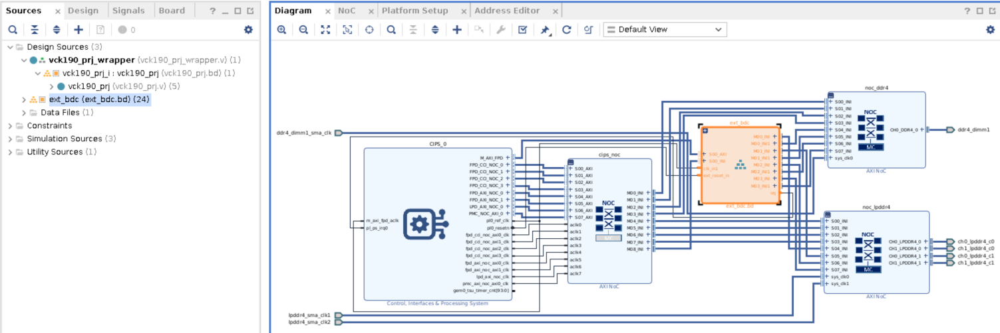

Step 1.2: Add the custom RTL IPs in Vivado. Here, we are using stream_in and stream_out RTL IPs which we are adding in ext_bdc.bd. Stream_out RTL IP is a free running RTL block which generates the stream data indefinitely. Stream_in IP receives the data from AIE and status of the received data can be checked by PS through AXI Lite interface. Below steps demonstrates how to add custom RTL IPs in the bd to export the extensible xsa from the Vivado:

1. Package RTL IPs. (We have placed the packaged RTL IPs in the folder `custom_ip`)

2. Add the RTL path in the IP repository from the project manager settings in the Vivado. After adding the path click ok.

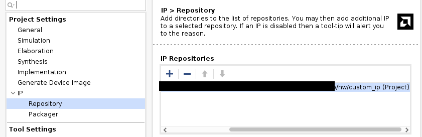

3. Open ext_bd.bd. Source "my_project_changes.tcl" located in hw folder. Source the tcl file to execute following actions:

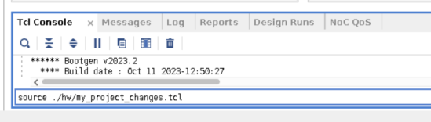


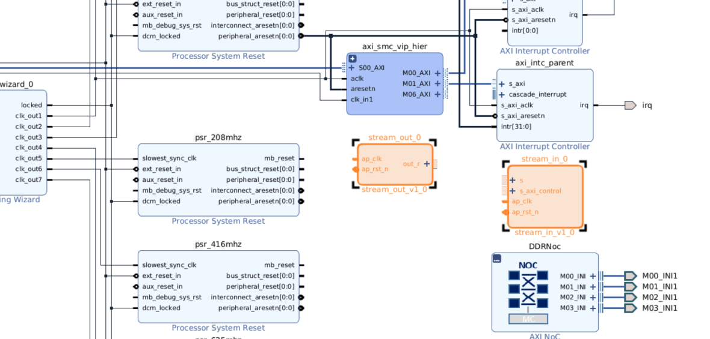

a. Change IP configuration settings for following IPs:

   		a. icn_ctrl: Set the master ports to 7. 
   
   		b. DDRNoC : Set the slave axi ports to 0. 
   
   		c. LPDDRNoC : Set the slave axi ports to 0.

b. Connecting the clock of both RTL-IPs to clock_out1, reset_n to reset generated by clk_out1 and connect stream_in slave AXI port to Master port 7 of icn_ctrl.
 
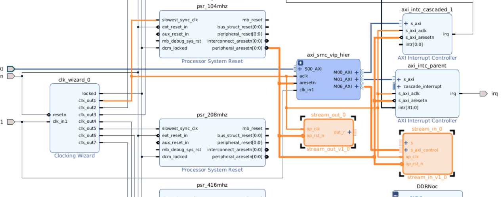

c. Assign the address to the port: /stream_in_/s_axi_ontrol.

4. Go to Platform setup: 
   Select AXI Stream Port: Give the SPTAG name to stream port of stream_out as AIE_IN and stream_in as AIE_OUT. 
   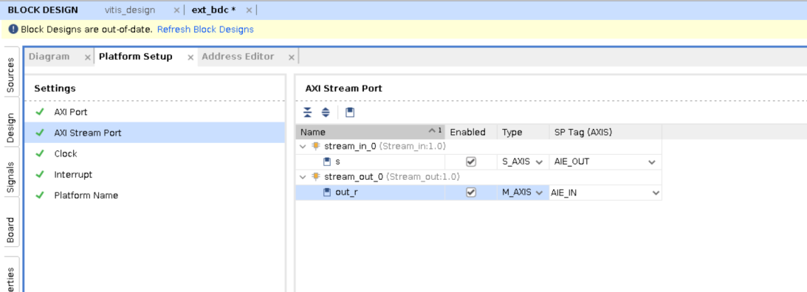


5. Validate and save the bd : ext_bdc. Ignore the warning as we are going to connect the intr port of axi_intc_cascaded_1, stream port of stream_in_0 and stream port out_r of stream_out_0 during the v++ --link in step 2.3
   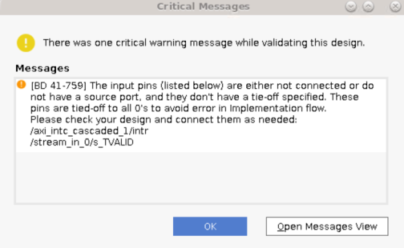

7. Re-generate target for vck190_prj.bd
   

8. Export the extensible platform :
    
    a. Go to Flow Navigator > IP Integrator > Export platform. Click Next
    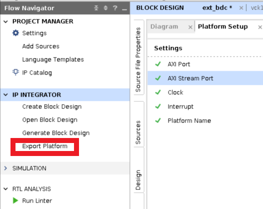
    
    b. Select Platform Type = Hardware. Click Next.
    
    c. Select Platform State = Pre-synthesis. Click Next.
    
    d. Keep the Platform Properties settings as is. Click Next.
    
    e. Give XSA file Name = vck190_prj_ext_hw_ext_hw and Export to = /hw/build/my_project. Click Next and Finish
    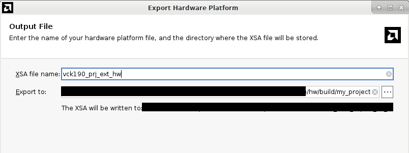

Output: The generated extensible XSA is located at `hw/build/my_project/vck190_prj_ext_hw.xsa`. 

#### Step 2 Create the software components in Vitis

After exporting the XSA, compile AIE and PL kernels to generate `libadf.a` and `.xo ` file respectively.

Step 2.1: Compile the AIE Graph to generate `libadf.a`

Use the `make` command to generate the libadf.a (AIE compiled output).

```bash
make adf
```
The above make command compiles the graph.cpp using the v++ command: v++ -c --mode aie --platform ../hw/build/my_project/vck190_prj_ext_hw.xsa graph.cpp
If you want to run the command directly from the terminal, you can run it from the AIE folder.

The graph has two PLIOs. The first PLIO is connected to interpolator AIE Kernel and the second PLIO is connected to classifier AIE Kernel. 
 
Output: The generated `libadf.a` is located in the directory `aie/libadf.a`.

Step 2.2: Compile PL Kernels to generate the .xo File

We are using one PL kernels: polar clip. In this step, we compile the HLS kernel and generate the .xo file. 

Make command to compile and generate .xo file: 

```bash
make xos
```
The above make command compiles the polar_clip.cpp using the v++ command inside the pl_kernel folder: 

v++ -c -k polar_clip -f ../hw/build/my_project/vck190_prj_ext_hw.xsa -s polar_clip.cpp -o polar_clip.xo

If you want to run the command directly from the terminal, you can run it from the pl_kernel folder.

Output: The generated .xo files are located in the directory `pl_kernels/polar_clip.xo`.

Step 2.3: Integrate the AIE+PL subsystem by linking the extensible platform (vitis_design_ext_hw.xsa), AIE graph (libadf.a), PL kernel (polar_clip.xo)  and the Vitis configuration file (system.cfg). Use the --export_archive linker option to generate a Vitis Metadata Archive (vma) file which can then be imported in Vivado.

Use the `make` command to generate .vma file:

```bash
make vma
```
The above make command runs the the v++ -l command: 

v++ -l --platform ../hw/build/my_project/vck190_prj_ext_hw.xsa  ../pl_kernels/polar_clip.xo ../aie/libadf.a --save-temps --export_archive --config system.cfg -o vitis_design_hw.vma

In the configuration file (system.cfg), provide details about the connectivity between the AIE and PL IPs. Vitis uses the file to make the connectivity during linking:

```bash
[connectivity]
nk=polar_clip:2:polar_clip_1.polar_clip_2
# Connect AIE input of PLIO-1 to RTL-IP port AIE_IN
stream_connect=AIE_IN:ai_engine_0.DataIn1
# Connect AIE output of PLIO-1 to input of HLS kernel: polar_clip_1
stream_connect=ai_engine_0.polar_clip_out:polar_clip_1.in_sample
# Connect output of polar_clip_1 to input of AIE PLIO-2
stream_connect=polar_clip_1.out_sample:ai_engine_0.polar_clip_in
# Connect output of PLIO-2 to RTL-IP port AIE_OUT
stream_connect=ai_engine_0.DataOut1:AIE_OUT
```

Output: The generated .vma file is located in `vitis_impl/vitis_design_hw.vma`.

#### Step 3: Import VMA into Vivado project

After exporting VMA file in step-2, import the VMA file in the Vivado project.

1. Open the Vivado project from the project directory, `./hw/build/my_project/my_project.xpr`.
       
2. From the Tcl console, use the Tcl API to import the VMA: `vitis::import_archive ./vitis_impl/vitis_design_hw.vma`.

    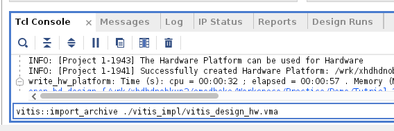

3. After running the Tcl API to import the VMA, a BDC will be created and named as `ext_bdc_vma.bd`

      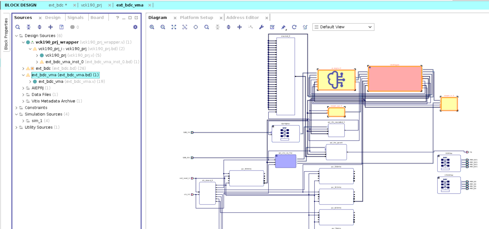

4. Connection between AIE, RTL Ips and HLS Kernel in `ext_bdc_vma.bd` is as follows:

    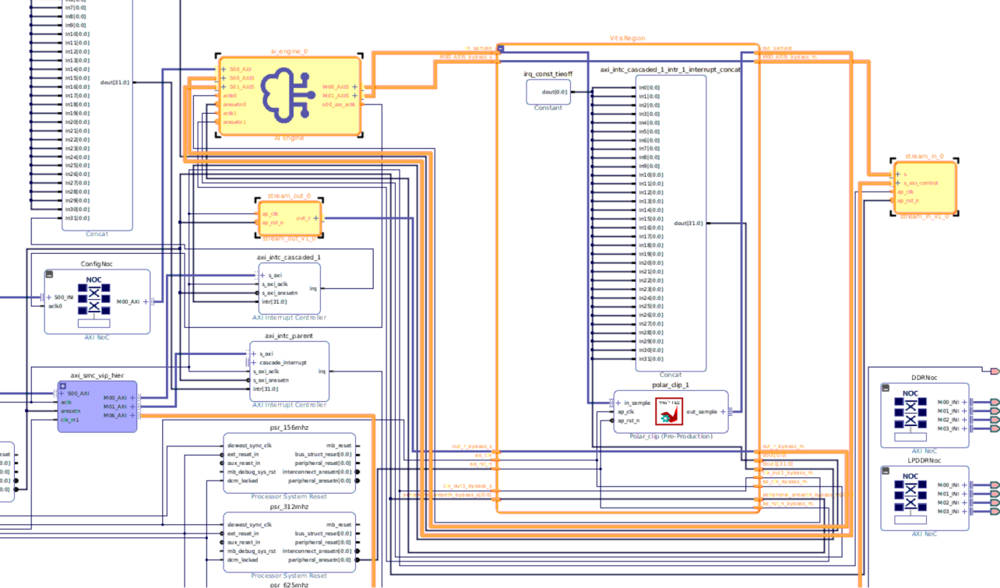
    
Here, it can be seen that the open ports in step 1.2.8 are connected using the v++ --link.

#### Step 4: Changes in the Vivado design after the VMA import

Developer can make the Vivado design changes in the ext_bdc_vma.bd after importing VMA except inside the hierarchy (VitisRegion.v). You can view connnection between HLS kernels to AIE inside the VitisRegion hierarchy. Refer to [UG1393](<https://docs.amd.com/r/en-US/ug1393-vitis-application-acceleration/Vitis-Export-to-Vivado-Flow>) to understand the design guidelines and limitations under the section "Vitis Export Flow Guidelines and Limitations".

 **NOTE:** Any changes related to VitisRegion hierarchy in ext_bdc_vma.bd can only be done through Vitis. It is read-only in Vivado. 
 
Based on the Vivado design changes affecting the PLIO interface or not, we are covering the two use cases as discussed. In step-5, we are covering the use-case 1, where the design changes are not affecting the PLIO interface. To do the Vivado design changes affecting the PLIO interface refer to -[Use Case 2: Vivado design changes affecting the PLIO boundary]

#### Step 5-1: Use Case 1 : Vivado design changes doesn't require any PLIO interface change.

This step is to cover the use-case 1 to make the Vivado design changes not affecting PLIO interface. We are not making any change in the Vivado design and moving to step-6.

#### Step 5-2: Use Case 2: Vivado design changes that require PLIO interface change

This step covers use-case 2 i.e. Vivado design changes affecting the PLIO interface. 
To import the latest VMA from Vitis, you have to remove the existing VMA from the Vivado project. To remove the imported VMA from the Vivado design, you can use one of the following two commands:

1. `vitis::remove_archive_hierarchy` : This command can be used to remove the imported VMA BDC (VitisRegion.bd) only and keep the design modifications done in Vivado are intact. This command keeps internal links of Vitis Metadata which is helpful for the further hardware design interations. 
2. `vitis::remove_archive` : This command can be used to remove imported VMA BDC and all the bd variants generated after the vma import. This command is helpful in the scenarios where developer wants to clean the project with previous vma iterations and start with fresh vma import. It removes all internal links of Vitis Metadata and Vivado design modifications done in child bds.

For design development in iterations, it is recommended to use vitis::remove_archive_hierarchy.

In this tutorial, we are adding one HLS kernel (Polar_clip) in cascade to existing polar_clip kernel to show how to add another HLS kernel and modify the connectivity graph. Since we have already compiled the hls kernel and not done any change in the Vivado design, we need to only update the system.cfg. Updating the connectivity graph helps to establish the connection between polar-clip 1 to polar-clip 2. Following steps would help us to understand the flow:

1. To remove the imported VMA only, using the Tcl API, `vitis::remove_archive_hierarchy` as shared above. 


The updated BD can be seen in the following image, only the VMA is removed and connections gets open for AIE and RTL-IPs.

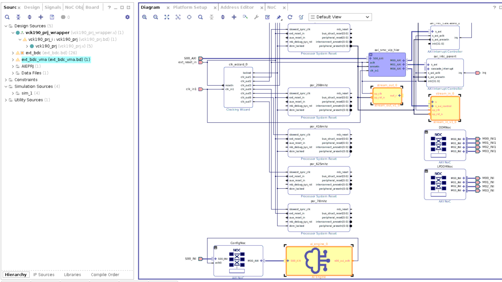

2. Modify the system.cfg to update the connectivity graph changes.
 
```bash
[connectivity]
nk=polar_clip:2:polar_clip_1.polar_clip_2
# Connect AIE input of PLIO-1 to RTL-IP port AIE_IN
stream_connect=AIE_IN:ai_engine_0.DataIn1
# Connect AIE output of PLIO-1 to input of HLS kernel: polar_clip_1
stream_connect=ai_engine_0.polar_clip_out:polar_clip_1.in_sample
# Connect output of polar_clip_1 to input of polar_clip_2
stream_connect=polar_clip_1.out_sample:polar_clip_2.in_sample
# Connect output of polar_clip_2 to input of AIE PLIO-2
stream_connect=polar_clip_2.out_sample:ai_engine_0.polar_clip_in
# Connect output of PLIO-2 to RTL-IP port AIE_OUT
stream_connect=ai_engine_0.DataOut1:AIE_OUT
```

3. Run v++ --link to export .vma with modified system.cfg generated in step 2.

4. Import the updated .vma into the Vivado project

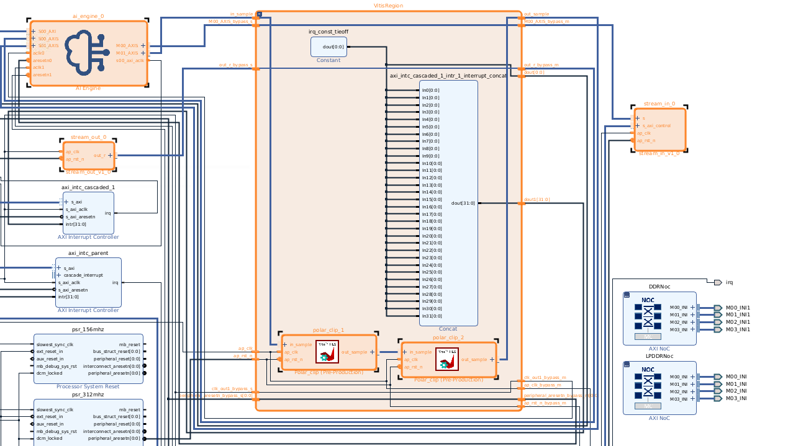

In case if you want to make modifications in the Vivado design, you can do that in the following way: 
1. Make changes in the vck190_prj.bd (changes related to CIPS) or in the latest imported *_vma.bd* (changes related to PLIO interface).
2. Validate and save the bd.
3. Regenerate the target and re export the extensible XSA using the command 'write_hw_platform -force <vck190_prj_ext_hw_1.xsa>'. 
4. This extensible XSA will have the Vivado design changes which are done after importing the previous VMA. 
5. Use the latest exported extensible XSA (vck190_prj_ext_hw_1.xsa) to re generate the VMA using following steps:

   5.1: If the changes are made related to AIE design or AIE-PL boundary, regenerate the libadf.a (remove old libadf.a or revision control it) with the newer extensible xsa.
   
   5.2: If the changes are made in the HLS kernels, re-compile the kernels with the newer extensible xsa to generate updated xos (remove old generated xos or revision control).
   
   5.3: Make the changes in the system.cfg file (as done in this use-case), reexport the VMA with updated libadf.a, xos, system.cfg and extensbile xsa. Repeat "Step-3" to import the modified VMA in the design.
   

#### Step 6: Generate the Fixed XSA

In this step, generate the fixed xsa for hardware (testing design on hardware) flow or hardware emulation flow. Following steps helps to generate the fixed xsa successfully:

Steps to generate fixed xsa for hardware flow:
1. Regenerate the target for ext_bdc_vma.bd. 
2. Run the design synthesis, implementation run and timing closure. 
3. Address timing violations and other implementation issues with the design. 
4. Generate the fixed xsa using the TCL API: `write_hw_platform -fixed ./hw/build/my_project/vck190_prj_fixed_hw.xsa`. 

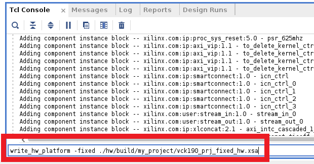

Output: The fixed XSA, `vck190_prj_fixed_hw.xsa`, is located in the folder `hw/build/my_project`.

Steps to generate the fixed xsa for hardware emulation:

1. Regenerate the target for the ext_bdc_vma.bd and vck190_prj.bd
2. Generate the simulation scrips: `launch_simulation -scripts_only
3. Set the variable AIE_WORK_DIR=<absolute_path>/aie/Work from the terminal.
4. Go to the folder:./hw/build/my_project/my_project.sim/sim_1/behav/xsim/ and run compile.sh and elaborate.sh from the terminal.
5. Generate the fixed xsa to run hardware emulation: `write_hw_platform -fixed -include_sim_content ./hw/build/my_porject/vck190_prj_fixed_hw_emu.xsa`

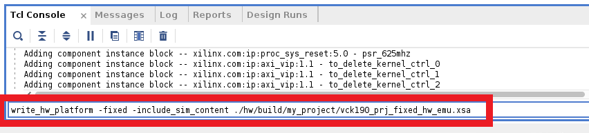

Output: The fixed XSA, `vck190_prj_fixed_hw_emu.xsa`, is located in the folder `hw/build/my_project`.

#### Step 7: Generate the XCLBIN

The ‘common image’ package (https://www.xilinx.com/member/forms/download/xef.html?filename=xilinx-versal-common-v2023.2_10140544.tar.gz) contains a prebuilt Linux kernel and root file system that can be used with the AMD Versal™ board for embedded design development using the Vitis software platform.

Before starting this tutorial, run the following steps:

1. Go to the directory where you have unzipped the Versal Common Image package.
2. In a Bash shell, run the ``/Common Images Dir/xilinx-versal-common-v2023.2/environment-setup-cortexa72-cortexa53-xilinx-linux`` script. This script sets up the SDKTARGETSYSROOT and CXX variables. If the script is not present, you must run the ``/Common Images Dir/xilinx-versal-common-v2023.2/sdk.sh``.
3. Set up your ROOTFS and IMAGE to point to the ``rootfs.ext4`` and Image files located in the ``/Common Images Dir/xilinx-versal-common-v2023.2`` directory.
4. Set up your PLATFORM_REPO_PATHS environment variable to ``$XILINX_VITIS/base_platforms``.

Compile the A72 Host Application: The host code uses XRT (Xilinx Run Time) as an API to talk to the AI Engine and PL kernels. Note that to compile the host code, it is required to use the c++17 package. Ensure your gcc or g++ compiler has the necessary packages installed.

Run the make command to compile the host application to generate host.exe

`make host`

The PS code written in host.cpp located in the folder sw. The make command compile host.cpp to generate host.exe.

After generating host.exe, run v++ --package to generate .xclbin.

Use the make command to generate the xcilbin using the v++  package command for HW flow:

`make package TARGET=hw`

The above make command executes the below command:

```bash
v++ -p -t hw -f ./hw/build/my_project/vck190_prj_fixed_hw.xsa \
--package.sd_dir ../versal/aie ./aie/libadf.a \
--package.out_dir package.hw \
--package.rootfs ../sw/versal/xilinx-versal/rootfs.ext4 \
--package.sd_file ../sw/versal/xilinx-versal/Image \
--package.sd_file emconfig.json \
--package.bl31_elf ../boot/bl31.elf \
--package.boot_mode sd \
--package.uboot ../boot/u-boot.elf \
--package.sd_file ../xrt/image/boot.scr \
--package.sd_file host.exe \
--package.dtb ../boot/system.dtb \
-o vck190_vitis_design_hw.xclbin 
```
To run the design on hardware, refer to the Building and Packaging section in [UG1393](https://docs.amd.com/r/en-US/ug1393-vitis-application-acceleration/Packaging-Images).

Use the make command to generate the xcilbin using the v++  package command for HW Emulation flow:
`make package TARGET=hw_emu`

The above make command executes the below command:

```bash
emconfigutil --platform ./hw/build/my_project/vck190_prj_fixed_hw_emu.xsa --nd 1;\
v++ -p -t hw_emu -f ./hw/build/my_project/vitis_design_fixed_hw_emu.xsa \
--package.sd_dir ../sw/versal/aie ./aie/libadf.a \
--package.out_dir package.hw_emu \
--package.rootfs ../sw/versal/xilinx-versal/rootfs.ext4 \
--package.sd_file ../sw/versal/xilinx-versal/Image \
--package.sd_file emconfig.json \
--package.bl31_elf ../boot/bl31.elf \
--package.boot_mode sd \
--package.uboot ../boot/u-boot.elf \
--package.sd_file ../xrt/image/boot.scr \
--package.sd_file host.exe \
--package.defer_aie_run \
--package.dtb ../boot/system.dtb \
-o vck190_vitis_design_hw_emu.xclbin 
```

To run the hardware emulation, execute the below steps after .xclbin generation:

```bash
make run
```
You can see in the terminal, that data is received well in stream_in IP. Reading the register to check the number of packets received, it is random as we are checking status through PS randomly. Reading the error register to confirm, any error is occurred during transaction. Message: "TEST IS DONE" concludes the hardware emulation flow.

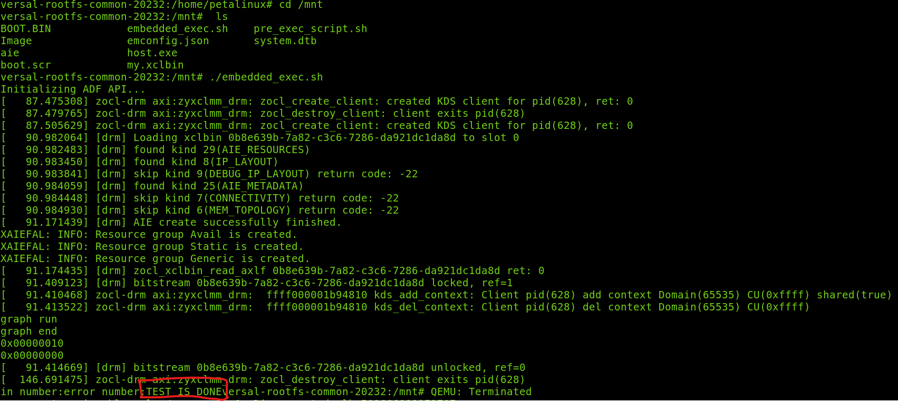

## Summary

In this tutorial, you learned the following after completing the tutorial:

 1. Start the design in the Vivado using the BDC methodology and export `extensible.xsa`.
 2. Compilation of AIE graph and PL kernels xo.
 3. Link the compiled output, `system.cfg`, `extensible.xsa`, and export the VMA.
 4. Import the VMA into the Vivado and progress the platform development in the Vivado.
 5. Generate the `fixed.xsa` file from the Vivado to support hardware and hardware emulation flow.

To read more about the flow, refer to [UG1393](https://docs.amd.com/search/all?query=Vitis+Unified+Software+Platform+Documentation%253A+Application+Acceleration+Development+(UG1393)&content-lang=en-US) (Chapter 19: Managing Vivado Synthesis, Implementation, and Timing Closure).

## Support

GitHub issues will be used for tracking requests and bugs. For questions, go to [support.xilinx.com](support.xilinx.com).

<p class="sphinxhide" align="center"><sub>Copyright © 2020–2023 Advanced Micro Devices, Inc</sub></p>

<p class="sphinxhide" align="center"><sup><a href="https://www.amd.com/en/corporate/copyright">Terms and Conditions</a></sup></p>
