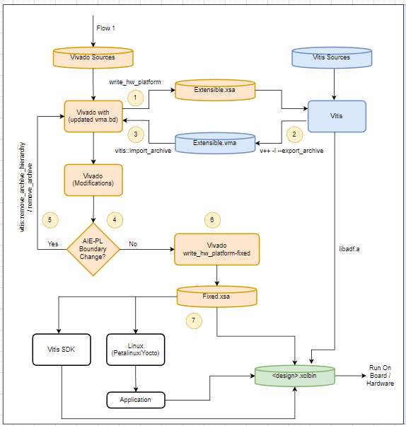
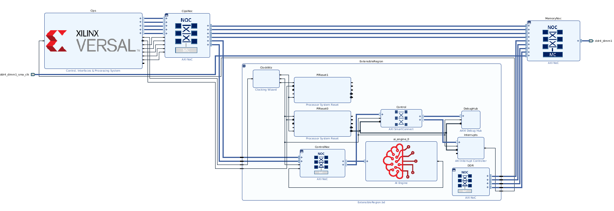
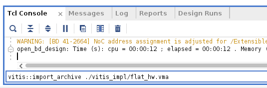
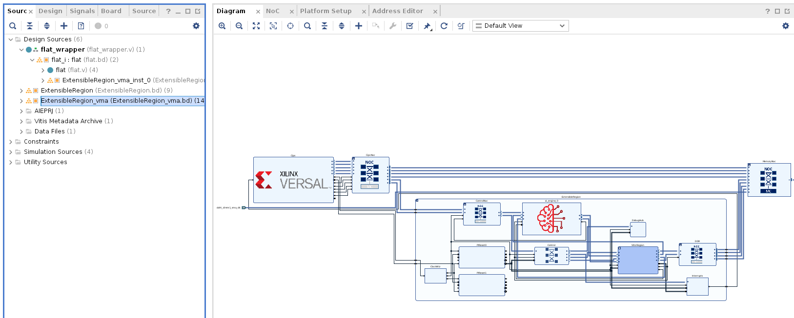
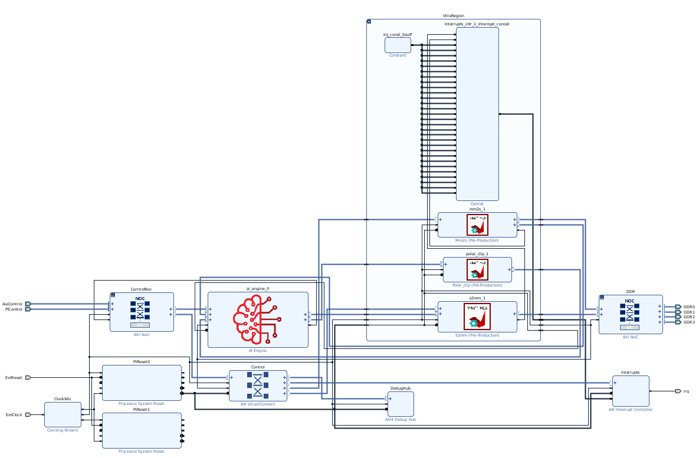
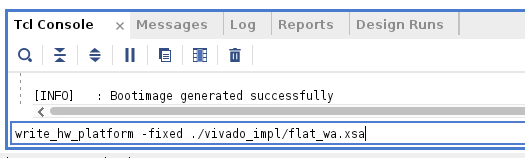
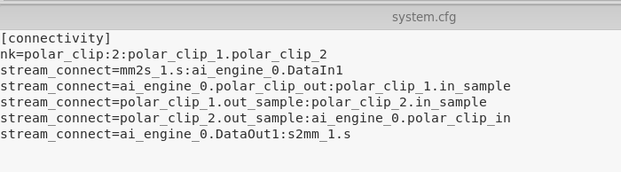
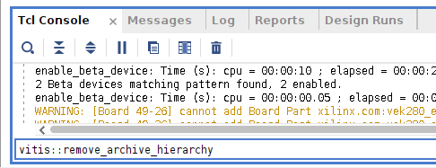

<table class="sphinxhide" width="100%">
 <tr width="100%">
   <td align="center"><h1>Vitis™ Platform Creation Tutorials</h1>
   </td>
 </tr>
 <tr>
 <td>
 </td>
 </tr>
</table>

# Vitis Export To Vivado

***Version: Vitis 2023.1***

## Introduction

The Vitis Export to Vivado is the new feature release in AMD Vivado&trade; 2023.1/Vitis 2023.1 suites which enables bidirectional hardware hand-offs between the Vitis tools and the Vivado Design Suite to improve developer productivity. You can do the hardware design development in the Vivado Design Suite and use the Vitis tool to do the software development, such as, Xilinx Runtime (XRT), AI Engine (AIE) development, and programmable logic (PL) kernels development in the Vitis tool. Prior to this release, for any change in the hardware design, you needed to export the extensible XSA, go to the Vitis environment, and carry out the further development flow in the Vitis tool. This flow provides the flexibility to do the hardware design development in the Vivado design, which includes hardware design development, synthesis, implementation, and timing closure in Vivado and other development tasks like XRT, AIE development, application development, HLS kernel development, etc. in the Vitis tool. In 2023.1, the flow supports hardware development only (i.e., `TARGET=HW`).

The tutorial describes the flow which starts from the Vivado Design Suite. The hardware design to be developed in the Vivado design and export the extensible hardware platform (.xsa) from the Vivado Design Suite that forms the basis of many differentiated Vitis hardware applications. The extensible platform is imported into the Vitis environment to perform the development of the AI Engine Graph application and additional PL kernels for the system design. Compile the AIE graph and PL kernels. Link the compiled output, extensible platform to export the VMA during the v++ linking phase using the new v++ switch. Import the VMA file into Vivado using the new Tcl API and later, design development work can be continued in the Vivado design. Design flow section shared the complete design flow.

To use Vitis export to the Vivado flow, a new v++ switch and three Tcl APIs are introduced. This tutorial helps you understand the following new switch and Tcl APIs in the flow:

The new v++ switch introduced in this flow to export Vitis metadata is:

```bash
1. v++ -l --export_archive
```

New Vivado Tcl APIs introduced in this flow to import and remove the VMA from Vivado are:

```bash
2. vitis:: import_archive
3. vitis:: remove_archive_hierarchy
4. vitis:: remove_archive
```

**IMPORTANT:** Before beginning the tutorial, make sure you have installed the Vitis 2023.1 and Vivado 2023.1 software.

This tutorial demonstrates the hardware design development using Tcl-based flow. You can try any other design methodology which supports Block Design Container (BDC) as the flow supports BDC-based designs only.

## Objectives

After completing the tutorial, you will be able to do the following:

 1. Export the extensible platform (.xsa) from the hardware design developed in the Vivado Design Suite.
 2. PL kernel development and compilation in the Vitis environment.
 3. AIE graph development and compilation in the Vitis environment.
 4. Export the Vitis-Metadata-Archive (VMA) using the new v++ command, `--export_archive`.
 5. Import the VMA in Vivado Design Suite using the new Tcl API.
 6. Generate `fixed.xsa`.

## DESIGN FILES

--------------

1. The following Tcl files used to create the Vivado project are in the `vivado_impl` directory:

    - [Flat.tcl](./vivado_impl/flat.tcl)

    - [create_bdc.tcl](./vivado_impl/create_bdc.tcl)

    - [flat_pre_bdc.tcl](./vivado_impl/flat_pre_bdc.tcl)

2. AIE files for AIE development are in the `aie` folder.

    - [Graph.cpp](./aie/graph.cpp)

    - [Graph.h](./aie/graph.h)

    - [include.h](./aie/include.h)

    - [kernels.h](./aie/kernels.h)

3. PL_KERNELS for PL kernel development are in the `pl_kernels` folder.

    - [mm2s.cpp](./pl_kernels/mm2s.cpp)

    - [polar_clip.cpp](./pl_kernels/polar_clip.cpp)

    - [s2mm.cpp](./pl_kernels/s2mm.cpp)

4. The system configuration file is in the `vitis_impl` folder.

   - [system.cfg](./vitis_impl/system.cfg)

## Design Flow

This tutorial covers the following two use cases. Both use cases are related to the changes done after the VMA import as there is no change in the flow until the AI Engine (AIE) and PL kernels compilation (same as Vitis Integrated flow).

1. Modification(s) in the hardware design after the VMA import (second iteration onwards) is in Vivado only. No changes affecting the AIE-PL boundary.
2. Modification(s) are related to the AIE-PL boundary and Vitis development after the VMA import (second iteration onwards). In this use case, modifications related to Vivado are also supported.

The complete flow (from hardware design creation to export .xclbin) is divided into seven steps as shown in the following figure:



### Use Case 1: Vitis Export to Vivado Flow with Changes Related to Vivado Only After Importing the VMA

#### Step 1

Create the hardware platform using the Tcl flow. The Tcl files are shared in the `vivado_impl` folder.

Use the following command to generate the Vivado project through Tcl and Export XSA.

```bash
vivado -mode batch -source ./vivado_impl/flat.tcl
```

OR use the `make` command to generate the XSA.

```bash
make xsa
```

Output: The generated extensible XSA is located in the director `vivado_impl/flat_wa.xsa` and `flat` folder contains the Vivado project flat.

#### Step 2

After exporting the XSA, you need to compile AIE and PL Kernels, and generate `libadf.a` and `.xo ` file respectively before running the v++ linker (same as the Vitis integrated flow).

##### 2.1: Compile the AIE Graph and Generate `libadf.a`

Use the following command to execute 2.1:

```bash
v++ -c --mode aie --platform ../vivado_impl/flat_wa.xsa ./aie/graph.cpp 
```

OR use the `make` command to generate the AIE-compiled output.

```bash
make adf
```

Output: The generated `libadf.a` is located in the directory `aie\libadf.a`.

##### 2.2: Compile PL Kernels to Generate the .xo File

Command to execute 2.2:

You are using three PL kernels. In this step, generate the XO files for all three kernels.

1. Generate the kernel, `mm2s.xo`.

    ```bash
    v++ -c -k mm2s -f ./vivado_impl/flat_wa.xsa -s -o mm2s.xo ./pl_kernels/mm2s.cpp 
    ```

2. Generate the kernel, `polar_clip.xo`.

    ```bash
    v++ -c -k polar_clip -f ./vivado_impl/flat_wa.xsa -s -o polar_clip.xo ./pl_kernels/polar_clip.cpp
    ```

3. Generate the kernel, `s2mm.xo`.

    ```bash
    v++ -c -k s2mm -f ./vivado_impl/flat_wa.xsa -s -o s2mm.xo ./pl_kernels/s2mm.cpp
    ```

    OR

    All three XOs can be generated using the `make` command:

    ```bash
    make xos
    ```

    Output: The generated .xo files are located in the directory `pl_kernels\mm2s.xo`,  `pl_kernels\polar_clip.xo`, and `pl_kernels\s2mm.xo`.

##### 2.3: Export the `vma` File Using the v++ Linker Using the New Switch `--export_archive` and Linking the `extensible.xsa`, `libadf.a`, XOs, and `system.cfg`

Command to export the VMA:

```bash
v++ -l --platform ../vivado_impl/flat_wa.xsa  ../pl_kernels/*.xo ../aie/libadf.a --save-temps --export_archive --config system.cfg -o vitis_impl/flat_hw.vma
```

Here, *.xo represents all PL `kernel.xo` files and path.

OR use the `make` command to generate the VMA:

```bash
make vma
```

Output: The generated .vma file in `vitis_impl`.

#### Step 3

Import the VMA file in the Vivado project.

1. Open the Vivado project from the project directory, `./vivado_impl/flat/flat.xpr`.

    

2. From the Tcl console, use the Tcl API to import the VMA: `vitis::import_archive ./vitis_imple/flat_wa.xsa`.

    

3. After running the Tcl API to import the VMA, the modified design shall have `ExtensibleRegion_VMA.BDC`:

    

4. `ExtensibleRegion_vma.bd` shall be seen as:

    

#### Step 4: Changes Related to Vivado Design Only

Review of the VMA section can be done here. The BDC shows which kernels are used in the Vitis region and connections. You can review the PL-AIE connection also as per the design requirement.
In this step, you are free to do all design analysis and modification as done before in Vivado. Refer to [UG1393](<https://docs.xilinx.com/r/en-US/ug1393-vitis-application-acceleration/Vitis-Export-to-Vivado-Flow>) to understand the design guidelines and limitations under the section "Vitis Export Flow Guidelines and Limitations".

 **NOTE:** Any changes related to imported VMA BDC can only be done through Vitis. It is read-only. To perform any changes in Vivado, ensure that latest VMA is imported into Vivado.

 *To progress the Vivado changes, you need to ensure that the changes should be done after importing the latest VMA only. If you do the changes in Vivado after the XSA is exported and before importing the VMA, changes will be lost.*

#### Step 5

If there are no changes required in the Vitis environment, this step can be skipped. For more details, refer to Use Case 2.

#### Step 6: Generate the Fixed XSA

In this step, run the design through the implementation run and timing closure. You are free to make all design changes as mentioned in Step 4 and changes in the timing constraint is allowed to meet timing. If you encounter any implementation and timing violation or optimization issues, resolve it in this step and take the design to closure as before. After design closure in Vivado is done, the `fixed.xsa` can be generated by using the Tcl API: `write_hw_platform -fixed ./vivado_impl/flat_fixed.xsa`. Take the design to closure as in the Vitis integrated flow. After, the design closure is done in Vivado.



Output: The fixed XSA, `flat_fixed.xsa`, is in the `vivado_impl` folder.

#### Step 7: Generate the XCLBIN

Like previous flows, `fixed.xsa` can be used for many purposes like application development running on Petalinux/Yocto, XRT, or bare-metal flows. Later, generate the xcilbin using the v++  package command:
`v++ -p -t hw --platform ./vivado_impl/flat_fixed.xsa ./aie/libadf.a -o flat_hw.xclbin`

This step will generate the .xclbin without having any software details like rootfs etc,.
To run the design on hardware, you need to add the software details while packaging. Refer to the Building and Packaging section in [UG1393](https://docs.xilinx.com/r/en-US/ug1393-vitis-application-acceleration/Packaging-Images).

### Use Case 2: Vitis Export to Vivado Flow with Changes Related to Vitis and Vivado After Importing the VMA

This use case covers the scenario when you want to make changes in Vivado and Vitis. For making the changes in Vivado, you can progress as described in Step 4 of Use Case 1. For changes to be done in Vitis, import the latest VMA into Vivado (to ensure that latest `extensible.xsa` and VMA are in sync) as described in Step 5.

#### Step 5: Changes Related to the Vitis Design

This step supports any modification in the Vitis region design which might or might not impact the boundary of the PL-AIE region. Remove the imported VMA from the existing Vivado design. To remove the imported VMA from the Vivado design, use the following two commands:

1. `vitis::remove_archive_hierarchy`
2. `vitis::remove_archive`

In this use case, it is considered that there is/are change(s) in the Vitis design. To execute the change, you need to remove the imported VMA from the Vivado project. Use the following steps to execute:

1. Remove the imported VMA only using the Tcl API, `vitis::remove_archive_hierarchy`. Implement the changes in Vivado, and repeat Step 1 to export the updated XSA file. Repeat Step 2 to use the latest XSA to link the updated AIE-compiled output, PL kernels output, and `system.cfg`. Export the updated VMA. Repeat Step 3 to import the modified VMA in the design.

    In this example, plan to add one more polar clip IP in the Vitis region. Because the .xo file has been already generated in the previous steps (Use Case 1), you can directly modify connections in the `system.cfg` file as follows:

    

    In the `system.cfg`, you have added one more polar_clip kernel. The new polar_clip_2 kernel is concatenated with the formal polar_clip_1 kernel.

    After using the `vitis::remove_archive_hierarchy` command, the updated BD will display as shown in the following image, in which the added PL IPs and connections are intact and only the VMA is removed.

    

    After running the command, the modified VMA region is shown as:

    

2. Remove the imported VMA using the Tcl API, `vitis::remove_archive` to remove the imported VMA with changes done in Vivado after the VMA import. After this command, you need to start from Step 1, export extensible.xsa again with hardware changes, and repeat the steps as described in Use Case 1. The use of this command helps the developer in case there is a need to knock off all the changes or configurations done during the hardware development in Vivado and start from the last VMA import (in case, considering multiple VMA are imported).

    Repeat Step 6 and 7 from use case -1 to generate the `fixed.xsa` and xclbin files.

## Summary

In this tutorial, you learned the following after completing the tutorial:

 1. Start the design in Vivado using the BDC methodology and export `extensible.xsa`.
 2. Compilation of AIE graph and PL kernels xo.
 3. Link the compiled output, `system.cfg`, `extensible.xsa`, and export the VMA.
 4. Import the VMA into Vivado and progress the platform development in Vivado.
 5. Generate the `fixed.xsa` file from Vivado.

To read more about the flow, refer to [UG1393](https://docs.xilinx.com/search/all?query=Vitis+Unified+Software+Platform+Documentation%253A+Application+Acceleration+Development+(UG1393)&content-lang=en-US) (Chapter 19: Managing Vivado Synthesis, Implementation, and Timing Closure).

## Support

GitHub issues will be used for tracking requests and bugs. For questions, go to [support.xilinx.com](support.xilinx.com).

<p class="sphinxhide" align="center"><sub>Copyright © 2020–2023 Advanced Micro Devices, Inc</sub></p>

<p class="sphinxhide" align="center"><sup><a href="https://www.amd.com/en/corporate/copyright">Terms and Conditions</a></sup></p>
