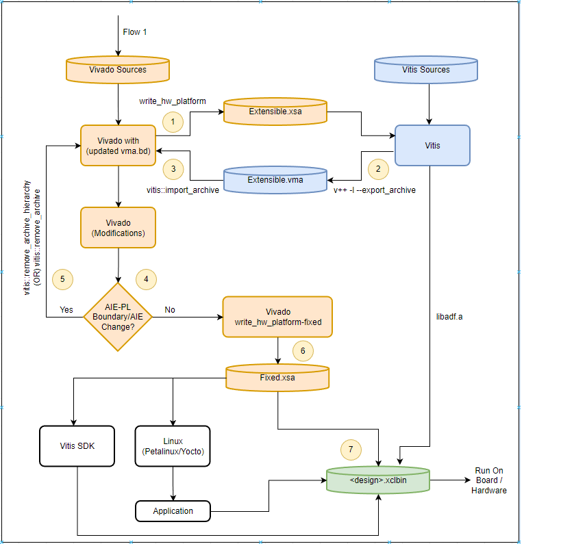
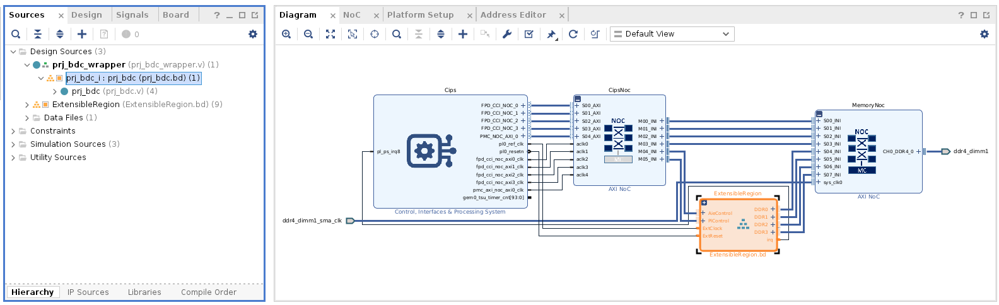
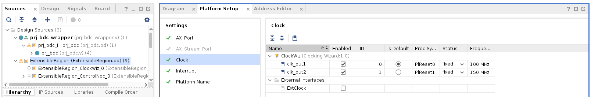
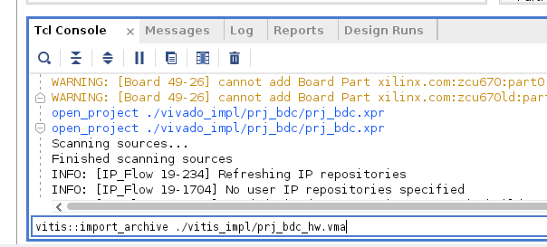
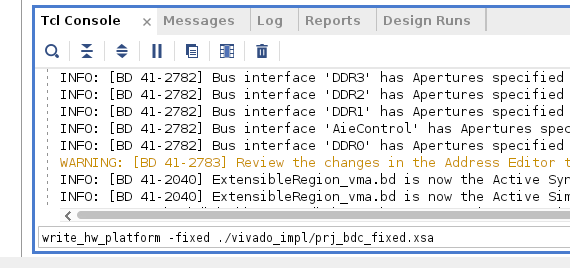
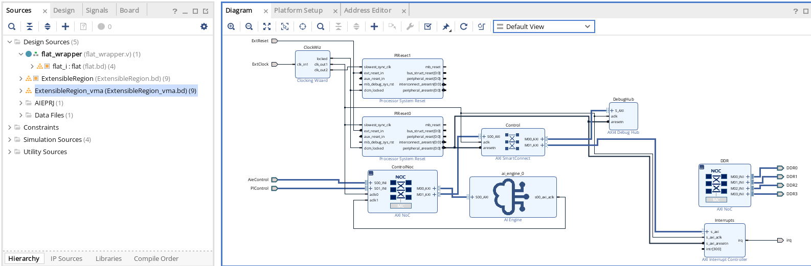
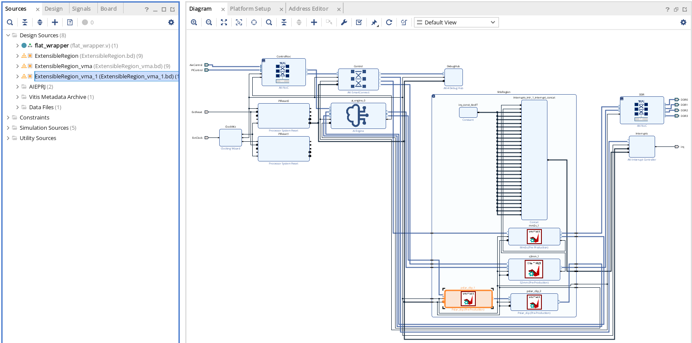

<table class="sphinxhide" width="100%">
 <tr width="100%">
   <td align="center"><h1>Vitis™ Platform Creation Tutorials</h1>
   </td>
 </tr>
 <tr>
 <td>
 </td>
 </tr>
</table>

# Vitis Export To Vivado

***Version: Vitis 2023.1***

## Introduction

The Vitis Export to Vivado is the new feature release in AMD Vivado&trade; 2023.1/Vitis 2023.1 suites which enables bidirectional hardware hand-offs between the Vitis tools and the Vivado Design Suite to improve developer productivity. You can do the hardware design development in the Vivado Design Suite and use the Vitis tool to do the software development, such as, Xilinx Runtime (XRT), AI Engine (AIE) development, and programmable logic (PL) kernels development in the Vitis tool. Prior to this release, for any change in the hardware design, you needed to create new extensible XSA having hardware changes, go to the Vitis environment again, and carry out the further development flow in the Vitis tool. With this proposed new flow, It provides the flexibility to do the hardware design development in the Vivado design, which includes hardware design development, synthesis, implementation, and timing closure in Vivado and other development tasks like XRT, AIE development, application development, HLS kernel development, etc. in the Vitis tool. This flow helps users not to move between Vivado and Vitis tool for any Vivado design related changes which effect AIE-PL boundary. Using the flow, you can test the design on hardware only. The hardware emulation is not supported in this release.

The tutorial describes the flow which starts from the Vivado Design Suite. The hardware design should be developed in the Vivado design and export the extensible hardware platform (.xsa) from the Vivado Design Suite that forms the basis of many differentiated Vitis hardware applications. The extensible platform is imported into the Vitis environment to perform the development of the AI Engine Graph application and additional PL kernels for the system design. Note that the use of PL kernel is optional. If the design does not have PL kernels, the flow will still work. Compile the AIE graph and PL kernels. Link the AIE / PL compiled output, connectivity graph, extensible platform to export the VMA during the v++ linking phase using the new v++ switch. Import the VMA file into Vivado using the new Tcl API and later, design development work can be continued in the Vivado design. Design flow section explains the complete design flow.

To use Vitis export to the Vivado flow, a new v++ switch and three Tcl APIs are introduced. This tutorial helps you understand the following new switch and Tcl APIs in the flow:

The new v++ switch introduced in this flow to export Vitis metadata is:

```bash
1. v++ -l --export_archive
```

New Vivado Tcl APIs introduced in this flow to import and remove the VMA from Vivado are:

```bash
2. vitis:: import_archive
3. vitis:: remove_archive_hierarchy
4. vitis:: remove_archive
```

**IMPORTANT:** Before beginning the tutorial, make sure you have installed the Vitis 2023.1 and Vivado 2023.1 software.

This tutorial demonstrates the hardware design development using Tcl-based flow. You can try other design methodology to create Block Design Container (BDC) based design as the flow supports BDC-based designs only.

## Objectives

After completing this tutorial, you will be able to do the following:

 1. Export the extensible platform (.xsa) from the hardware design developed in the Vivado Design Suite.
 2. PL kernel development and compilation in the Vitis environment.
 3. AIE graph development and compilation in the Vitis environment.
 4. Export the Vitis-Metadata-Archive (VMA) using the new v++ command, `--export_archive`.
 5. Import the VMA in Vivado Design Suite using the new Tcl API.
 6. Generate `fixed.xsa` that can be used to create xclbin which is the final outcome of these flows.
 7. Generate 'fixed.xsa' with switch -include_sim_content to run hardware emulation.

## DESIGN FILES

--------------

1. The following Tcl files used to create the Vivado project are in the `vivado_impl` directory:

    - [prj_bdc.tcl](./vivado_impl/prj_bdc.tcl)

    - [create_bdc.tcl](./vivado_impl/create_bdc.tcl)

    - [pre_create_bdc.tcl](./vivado_impl/pre_create_bdc.tcl)

2. AIE files for AIE development are in the `aie` folder.

    - [Graph.cpp](./aie/graph.cpp)

    - [Graph.h](./aie/graph.h)

    - [include.h](./aie/include.h)

    - [kernels.h](./aie/kernels.h)

3. PL_KERNELS for PL kernel development are in the `pl_kernels` folder.

    - [mm2s.cpp](./pl_kernels/mm2s.cpp)

    - [polar_clip.cpp](./pl_kernels/polar_clip.cpp)

    - [s2mm.cpp](./pl_kernels/s2mm.cpp)

4. The system configuration file is in the `vitis_impl` folder.

   - [system.cfg](./vitis_impl/system.cfg)

## Design Flow

This tutorial covers the following two use cases. Both use cases are related to the changes done after the VMA import. From the design development start from Vivado to the VMA import step, the flow is same as we have been doing earlier (Vitis Integrated flow).

Use Case 1: Modification(s) in the hardware design after the VMA import (second iteration onwards) can be done in Vivado only. No design changes affecting the AIE-PL boundary or AIE/PL kernels.

Use Case 2: Modification(s) are related to the AIE-PL boundary, AIE/PL kernel changes, Vitis configuration file changes and Vitis development after the VMA import (second iteration onwards). To incorporate Vitis changes in Vivado, you need to remove the imported VMA, export the extensible xsa (if there are any vivado design modifications), modify the software files, export the VMA with updated software changes. Import the latest VMA into the design.

The complete flow (from hardware design creation to export .xclbin) is divided into seven steps as shown in the following figure:

 


### Use Case 1: Vitis Export to Vivado Flow with Changes Related to Vivado Only After Importing the VMA

### Working directory path: `Vitis-Tutorials/Vitis_Platform_Creation/Feature_Tutorials/03_Vitis_Export_To_Vivado`

#### Step 1

Create the hardware platform using the Tcl flow. The Tcl files are shared in the `vivado_impl` folder.

Use the following command to generate the Vivado project through Tcl and Export XSA.

use the `make` command to generate the XSA.

```bash
make xsa
```

OR

TCL command to export extinxible xsa from Viviado is: `write_hw_platform -force ./vivado_impl/prj_bdc_ext_hw.sa`

Output: The generated extensible XSA is located at `vivado_impl/prj_bdc_ext_hw.xsa` and `prj_bdc` folder contains the Vivado project (.xpr). 

Open `./prj_bdc/prj_bdc.xpr` in the Vivado:

 

Check in the sources hierarchy tab, there are two block designs:

1. Top bd design: prj_bdc.bd which contains CIPS, NoC, MemoryNoC. Place RTL or custom IPs which needs to be connected to CIPS here.

2. Block Design: ExtensibleRegion.bd. This bd contains the AIE-PL subsystem. You can place RTL or custom IPs in this bd which needs to be connected to AIE.

You need to set platform setup to declare platform attributes like AXI port, AXI stream port, clock and interrupt. For example, to make the connection between AIE and RTL or custom IPs you need to ensure the `platform setup` properties are set correctly and SP tag is defined correctly with slave / master option. If you need to create or modify the AIE-PL subsytem boundary, Open the bd "ExtensibleRegion.bd", and open the tab "Platform Setup". Here, you need to set Clock, Interrupt, AXI Stream port (If you want to connect any RTL / custome IP to AIE have AXI-S port) and AXI Port (to connect AIE to Memory port and Smartconnect). You must use SP tag  in system connectivity graph to make connections through Vitis. Refer UG193 for more details for platform setup: https://docs.xilinx.com/r/en-US/ug1393-vitis-application-acceleration/CED-Example-Usage




#### Step 2

After exporting the XSA, you need to compile AIE (must) and PL kernels(optional), and generate `libadf.a` and `.xo ` file respectively before running the v++ linker.

##### 2.1: Compile the AIE Graph to generate `libadf.a`

Use the `make` command to generate the libadf.a (AIE-compiled output).

```bash
make adf
```

OR

Use the equivalent v++ compile command to compile AIE graph. According to design development and working directory, modify the file path of extensbile xsa and graph. In design development to address the multiple design iterations in AIE, recommend to adopt revision control of libadf.a or remove it. 

`v++ -c --mode aie --platform ./vivado_impl/prj_bdc_ext_hw.xsa ./aie/graph.cpp --include="./aie"`

Output: The generated `libadf.a` is located in the directory `aie/libadf.a`.

##### 2.2: Compile PL Kernels to generate the .xo File

We are using three PL kernels: mm2s, s2mm and polar clip. In this step, we generate the XO file for three kernels. This is an optional step and can be used when design has PL Kernels to be connected in Vivado. According to design development and working directory, modify the file path of extensbile xsa and PL kernels.

1. To generate the kernel `mm2s.xo`.

    ```bash
    v++ -c -k mm2s -f ./vivado_impl/prj_bdc_ext_hw.xsa -s -o ./pl_kernels/mm2s.xo ./pl_kernels/mm2s.cpp 
    ```

2. To generate the kernel `polar_clip.xo`.

    ```bash
    v++ -c -k polar_clip -f ./vivado_impl/prj_bdc_ext_hw.xsa -s -o ./pl_kernels/polar_clip.xo ./pl_kernels/polar_clip.cpp
    ```

3. Generate the kernel `s2mm.xo`.

    ```bash
    v++ -c -k s2mm -f ./vivado_impl/prj_bdc_ext_hw.xsa -s -o ./pl_kernels/s2mm.xo ./pl_kernels/s2mm.cpp
    ```

    OR

    All three XOs can be generated using the `make` command:

    ```bash
    make xos
    ```

    Output: The generated .xo files are located in the directory `pl_kernels/mm2s.xo`,  `pl_kernels/polar_clip.xo`, and `pl_kernels/s2mm.xo`.

##### 2.3: Export the Vitis Metadata Archive `vma` file using the new switch `--export_archive` in v++ linker and link the `extensible.xsa`, `libadf.a`, PL kernel XOs, and Vitis configuration `system.cfg` file

Command to export the VMA:

```bash
v++ -l --platform ./vivado_impl/prj_bdc_ext_hw.xsa  ./pl_kernels/*.xo ./aie/libadf.a --save-temps --export_archive --config ./vitis_impl/system.cfg -o vitis_impl/prj_bdc_hw.vma
```

Here, *.xo is used for all PL kernels .xo files.

OR use the `make` command to generate the VMA:

```bash
make vma
```

Output: The generated .vma file is located in `vitis_impl/prj_bdc_hw.vma`.

#### Step 3

Import the VMA file in the Vivado project.

1. Open the Vivado project from the project directory, `./vivado_impl/prj_bdc/prj_bdc.xpr`.

    

2. From the Tcl console, use the Tcl API to import the VMA: `vitis::import_archive ./vitis_impl/prj_bdc_hw.vma`.

    

3. After running the Tcl API to import the VMA, the new bd with VMA will be created and named as `ExtensibleRegion_VMA.bd`

    

4. `ExtensibleRegion_vma.bd` shall be seen as:

    

#### Step 4: Changes Related to Vivado Design Only

You can make the vivado design changes in this step. Design changes related to VMA (VitisRegion) section is not allowed. You can only view the PL kernels and connections related to these kernels are as per design requirement. In this step, you are free to do all design analysis and modification as you would be doing in native design flows of Vivado. Refer to [UG1393](<https://docs.xilinx.com/r/en-US/ug1393-vitis-application-acceleration/Vitis-Export-to-Vivado-Flow>) to understand the design guidelines and limitations under the section "Vitis Export Flow Guidelines and Limitations".

 **NOTE:** Any changes related to imported VMA BDC (calling here as VitisRegion.bd) can only be done through Vitis. It is read-only. 

 *To progress with the Vivado changes, you need to ensure that the changes should be done after importing the latest VMA only, which should be generated with the latest exported extensible XSA file (to ensure latest hardware changes done in Vivado are considered). If you make the changes in Vivado after exporting extensible XSA from Vivado and before importing the VMA, those vivado changes will not be there in the generated VMA file. So, after importing the VMA, you will loose the Vivado changes. It is must that last exported extensible xsa from vivado and vma from vitis always in sync. *

#### Step 5

If there are no changes required in the Vitis environment, this step can be skipped. For any changes in Vitis environemnt, refer to Use Case 2.

#### Step 6: Generate the Fixed XSA

In this step, run the design through the implementation run and timing closure. You are free to make all Vivado design changes and changes in the timing constraint as mentioned in Step 4. If you encounter any implementation and timing violation issues, resolve it in this step and take the design to closure. After design closure is done in vivado, the `fixed.xsa` can be generated by using the TCL API: `write_hw_platform -fixed ./vivado_impl/prj_bdc_fixed.xsa`.



Output: The fixed XSA, `prj_bdc_fixed.xsa`, is in the `vivado_impl` folder.

#### Step 7: Generate the XCLBIN

Like previous flows, `fixed.xsa` can be used for many purposes like application development running on Petalinux/Yocto, XRT, or bare-metal flows. Later, generate the xcilbin using the v++  package command:
`v++ -p -t hw --platform ./vivado_impl/prj_bdc_fixed.xsa ./aie/libadf.a -o prj_bdc_hw.xclbin`

This step will generate the .xclbin without having any software details like rootfs etc,.
To run the design on hardware, you need to add the software details while packaging. Refer to the Building and Packaging section in [UG1393](https://docs.xilinx.com/r/en-US/ug1393-vitis-application-acceleration/Packaging-Images).

One of the benefit of using the flow is while testing the design on the hardware, if there is any change required in the software development like AIE graph which is not impacting AIE-PL boundary change or no HW design change in the Vivado, you can make the correction in the software code, compile it and re-package with fixed.xsa to generate latest xcilbin. This step saves time of regenerating fixed.xsa for latest software updates.

### Use Case 2: Vitis Export to Vivado Flow with Changes Related to Vitis after Importing the VMA

This use case covers the scenario when you want to make changes in Vivado and Vitis. For making changes in Vivado, you can progress as described in Step 4 of Use Case 1. Make sure the vivado design changes are done in the ExtensibleRegion_vma.bd and it is selected as Active bd variant. For changes to be done in Vitis, import the latest VMA into Vivado (to ensure that latest `extensible.xsa` and VMA are in sync) as described in Step 5.

#### Step 5: Changes Related to the Vitis Design

This step is used when any modification is made in the Vitis region which might or might not impact the boundary of the PL-AIE region. To import the latest VMA from Vitis, you have to remove the existing VMA from the working Vivado design. To remove the imported VMA from the Vivado design, you can use one of the following two commands:

1. `vitis::remove_archive_hierarchy` : This command can be used when you need to delete only the imported VMA BDC (VitisRegion here) and keep the vivado design changes  intact. This command keeps internal links of Vitis Metadata which is helpful for the ongoing HW-SW development.
2. `vitis::remove_archive` : This command can be used when you want to remove imported VMA BDC and Vivado design changes done after the vma import. This step takes you to the initial stage of the design where you imported the first VMA. This command is helpful in the scenarios where you want to do the software development with the base design. It removes all internal links of Vitis Metadata.

In use case-2, we are adding one HLS kernel (Polar_clip) and updating the system.cfg file accordingly to establish the connection between polar-clip 1 to polar-clip 2. To execute the change, you need to remove the imported VMA from the Vivado project. Use the following steps to execute:

1. To remove the imported VMA only, using the Tcl API, `vitis::remove_archive_hierarchy` as shared above. 


The updated BD can be seen in the following image, only the VMA is removed.



2. If you want to make any Vivado design changes, you can make the changes. Validate and save the bd, regenerate the targets and export the new extensible XSA using the command 'write_hw_platform -force <new_prj_bdc_ext_hw.xsa>'. This new extensible XSA will have the vivado design changes which are done after importing the previous VMA. If there is no Vivado design change, no need to re-export the extensible xsa. Same extensible xsa (prj_bdc_ext_hw.xsa) can be used.

3. Use the latest exported extensible XSA (new_prj_bdc_ext_hw.xsa) to generate the new VMA, follow below steps:

   3.1: If the changes are made related to AIE design or AIE-PL boundary, generate the new libadf.a (remove old libadf.a or revision control it) with the new extensible xsa.
   
   3.2: If the changes are made in the HLS kernels, re-compile the kernels with new extensible xsa to generate updated xos (remove old generated xos or revision control).
   
   3.3: If the changes are made only in the system.cfg file (as done in this use-case), export the new VMA with old libadf.a, old xos, updated `system.cfg` and new extensbile xsa. Repeat "Step-3" to import the modified VMA in the design.

    In this example, we are adding one polar clip kernel in the Vitis region. Since, the .xo file has already been generated in the previous steps (Use Case 1), you can directly modify connections in the `system.cfg` file as follows:

    

    In the `system.cfg`, we have added one more polar_clip kernel.     

    After running the command, the modified VMA region is shown as:

    
    

Repeat Step 6 and 7 from use case -1 to generate the `fixed.xsa` and xclbin files.

## Summary

In this tutorial, you learned the following after completing the tutorial:

 1. Start the design in Vivado using the BDC methodology and export `extensible.xsa`.
 2. Compilation of AIE graph and PL kernels xo.
 3. Link the compiled output, `system.cfg`, `extensible.xsa`, and export the VMA.
 4. Import the VMA into Vivado and progress the platform development in Vivado.
 5. Generate the `fixed.xsa` file from Vivado.

To read more about the flow, refer to [UG1393](https://docs.xilinx.com/search/all?query=Vitis+Unified+Software+Platform+Documentation%253A+Application+Acceleration+Development+(UG1393)&content-lang=en-US) (Chapter 19: Managing Vivado Synthesis, Implementation, and Timing Closure).

## Support

GitHub issues will be used for tracking requests and bugs. For questions, go to [support.xilinx.com](support.xilinx.com).

<p class="sphinxhide" align="center"><sub>Copyright © 2020–2023 Advanced Micro Devices, Inc</sub></p>

<p class="sphinxhide" align="center"><sup><a href="https://www.amd.com/en/corporate/copyright">Terms and Conditions</a></sup></p>
