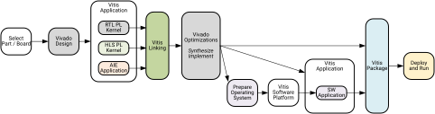

<table class="sphinxhide" style="width:100%;">
  <tr>
    <td align="center">
      <picture>
        <source media="(prefers-color-scheme: dark)" srcset="https://raw.githubusercontent.com/Xilinx/Image-Collateral/main/logo-white-text.png">
        
      </picture>
      <h1>AMD Vitis™ Platform Creation Tutorials</h1>
      <a href="https://www.amd.com/en/products/software/adaptive-socs-and-fpgas/vitis.html">See Vitis™ Development Environment on amd.com</a>
    </td>
  </tr>
</table>

# Vitis Export to Vivado Flow

***Version: Vivado and Vitis 2025.2***

This tutorial has been subject to change for the last couple of releases following the updates and improvements of the tools.

To align the flow and methodology with closely related tutorials, this tutorial is now replaced to be an instruction how to modify the new [02-Versal_Vitis_Subsystem_Flow](../../../Vitis_System_Design/Design_Tutorials/02-Versal_Vitis_Subsystem_Flow) into a pure Vitis Export to Vivado.

The design structure is already prepared for this activity and will be explained in this guide.


## Introduction

The Vitis Export to Vivado flow is intended for users preferring to handle synthesis, implementation and timing closure of the hardware design in Vivado.

More details and comparison between the flows is available in [Vitis Export to Vivado Flow (UG1701)](https://docs.amd.com/r/en-US/ug1701-vitis-accelerated-embedded/Vitis-Export-to-Vivado-Flow)

The purpose for this tutorials is to prepare a design following the steps in this figure:



### Modifications needed on the Vitis subsystem flow

The Vitis subsystem flow tutorial starts by adding AIE, HLS and RTL blocks to a Vitis Subsystem, then uses Vitis export to Vivado flow to put the VSS into a full design context.
In addition the tutorial adds more HLS example blocks to the extensible platform using Vitis linking and then exports the contribution, including VSS and AIE to a VMA which Vivado can import.


All the steps from creating a Vivado extensible platform onwards can be resued given that the blocks from the VSS are moved into the `vitis/ip` folder and the linker configuration script is updated according to the new locations.

### Moving blocks from VSS to Vitis

Start with a clone of Vitis-Tutorials and change directory to `Vitis_System_Design/Design_Tutorials/02-Versal_Vitis_Subsystem_Flow`.

**Note:** To keep track of the changes, it's recommended to use Git commands when moving files. By committing the changes it is easy to revert and redo changes if needed. This also avoids moving generated output files if the design has already been built.

In this tutorial, there are no conflicting IP names used, so the move can be done directly. The Makefiles in both IP folders are designed to pick up blocks based on folder names and each block folder have their own Makefiles.

Move instructions:

```
git move vss/ip/aie vitis/ip/aie
git move vss/ip/axis1to2 vitis/ip/axis1to2
git move vss/ip/counter vitis/ip/counter
git move vss/ip/vadd_s vitis/ip/vadd_s
```

### Modifying the linker configuration

Start with inspecting the VSS and Vitis linker configurations.

| VSS configuration | Vitis configuration
| -------- | ----------
| [vss/src/vss_conn.cfg](../../../Vitis_System_Design/Design_Tutorials/02-Versal_Vitis_Subsystem_Flow/vss/src/vss_conn.cfg) | [vitis/src/system.cfg](../../../Vitis_System_Design/Design_Tutorials/02-Versal_Vitis_Subsystem_Flow/vitis/src/system.cfg)

Then edit the `vitis/src/system.cfg` and do the following changes:

1. Add all statements from `vss_conn.cfg`, *except* the line with `vss=` declaration.
2. Cut any `vss_top_` from concatenate names.
3. Remove any redundant statements, such as `freqhz` for `counter_0`.

The result should look like this:

```
#
# Copyright (C) 2023-2025, Advanced Micro Devices, Inc. All rights reserved.
# SPDX-License-Identifier: X11
#

# From VSS
# Reduntant -- Remove this line --> freqhz=500000000:counter_0
freqhz=250000000:axis1to2_0,vadd_s_0
# From Vitis
freqhz=500000000:subtractor_0.aclk,counter_0
freqhz=250000000:mm2s_1,s2mm_1,subtractor_0.s00_axi_aclk

[connectivity]
# Added from VSS:
nk=counter:1:counter_0
nk=vadd_s:1:vadd_s_0
nk=axis1to2:1:axis1to2_0

# From Vitis
nk=subtractor:1:subtractor_0
nk=mm2s:1
nk=s2mm:1

# Added from VSS:
# Not needed -- Remove this line --> vss=amd.com:my_vsslib:vss_top:1.0:counter_0,vadd_s_0,axis1to2_0,ai_engine_0
sc=counter_0.m01_axis:ai_engine_0.dm_in0
# to add fifo, add :<fifo_depth> to connection
#sc=counter_0.m02_axis:ai_engine_0.dm_in1:16
sc=counter_0.m02_axis:ai_engine_0.dm_in1
sc=counter_0.m03_axis:ai_engine_0.dm_in2
sc=counter_0.m04_axis:ai_engine_0.dm_in3
sc=axis1to2_0.out0:ai_engine_0.fir_sig_in0
sc=axis1to2_0.out1:ai_engine_0.fir_sig_in1
sc=ai_engine_0.fir_sig_out0:vadd_s_0.in0
sc=ai_engine_0.fir_sig_out1:vadd_s_0.in1

# From Vitis
# Connect counter output channels to subtractor, routing two of them through AIE data mover kernels
sc=counter_0.m00_axis:subtractor_0.s00_axis
sc=ai_engine_0.dm_out0:subtractor_0.s01_axis
sc=ai_engine_0.dm_out1:subtractor_0.s02_axis
sc=ai_engine_0.dm_out2:subtractor_0.s03_axis
sc=ai_engine_0.dm_out3:subtractor_0.s04_axis

# Connect mm2s to feed an axis 1 to 2 stream duplicator to feed the AIE FIR filters
sc=mm2s_1.s:axis1to2_0.in0
# Connect the vadd_s from vss_top to s2mm so the output data can be analyzed with PS
sc=vadd_s_0.out0:s2mm_1.s

sp=mm2s_1.mem:DDR
sp=s2mm_1.mem:DDR

[clock]
#id=0 -> clk_out1_o1 -> 500.00MHz
#id=0:subtractor_0,counter_0

#id=1 -> clk_out1_o2 -> 250.00MHz
#id=1:vadd_mm_1

#id=2 -> clk_out1_o3 -> 125.00MHz

#id=3 -> clk_out1_o4 -> 62.50MHz

#id=4 -> clk_out2 -> 333.33MHz
#id=4:vadd_s_1,mm2s_vadd_s_1,mm2s_vadd_s_2,s2mm_vadd_s_1

[advanced]
#param=hw_emu.enableProfiling=false
#param=compiler.addOutputTypes=hw_export

[vivado]
param=project.enableUnifiedAIEFlow=true
```

A cleaned up example for the Vitis linker configuration is provided here: [vitis/src/system.cfg](vitis/src/system.cfg).

## Modifying build recipe
With the vss folder no longer in use, a few references to old locations need to be updated in the build makefiles.
The following files require modification

| Modified example | Original file from VSS tutorial
| -------- | ----------
| [./Makefile](./Makefile) | [../../../Vitis_System_Design/Design_Tutorials/02-Versal_Vitis_Subsystem_Flow/Makefile](../../../Vitis_System_Design/Design_Tutorials/02-Versal_Vitis_Subsystem_Flow/Makefile)
| [./vitis/Makefile](./vitis/Makefile) | [../../../Vitis_System_Design/Design_Tutorials/02-Versal_Vitis_Subsystem_Flow/vitis/Makefile](../../../Vitis_System_Design/Design_Tutorials/02-Versal_Vitis_Subsystem_Flow/vitis/Makefile)
| [./ps_apps/linux/aie_dly_test/Makefile](./ps_apps/linux/aie_dly_test/Makefile) | [../../../Vitis_System_Design/Design_Tutorials/02-Versal_Vitis_Subsystem_Flow/ps_apps/linux/aie_dly_test/Makefile](../../../Vitis_System_Design/Design_Tutorials/02-Versal_Vitis_Subsystem_Flow/ps_apps/linux/aie_dly_test/Makefile)


## Building the modified design

### Prerequisites
Setup the Vitis tool
```
source <Vitis_Installation_Path>/settings64.sh
```

Setup the SDKTARGETSYSROOT to point to the install path of prebuilt Linux platforms if used.
Below is an example:
```
export SDKTARGETSYSROOT=<install_path>
```

### Build instructions

Modify or replace the makefiles according to examples and run `make all` from the top folder.

Alternatively run step by step, by choosing from the following:
```
make vivado_platform vitis_ip vma_export vivado_fixed linux vitis_platform ps_apps package
```

## Testing the design on a board

Since the only modification done was to dissolve the VSS component and move the IPs into Vitis folder, follow the instructions in [02-Versal_Vitis_Subsystem_Flow](../../../Vitis_System_Design/Design_Tutorials/02-Versal_Vitis_Subsystem_Flow).

## Additional notes

### Vitis Functional Simulation

The VSS tutorial also cover Vitis Functional Simulation in MATLAB and Python. Both these are setup to use relative path location to the design blocks.<br>
To reuse them in the modified design, simply move them to the `vitis` folder:

```
git move vss/matlab vitis/matlab
git move vss/python vitis/python
```

### Migrating to other hardware devices or boards

**Note:** This require understanding how to create and manage Vivado projects and block designs using Vivado example design as template.

The tutorial is prepared to quickly retarget to other boards and devices. This can be achieved by adding more alternatives in the Vivado folder.
If the corresponding board exist [Board Store](https://github.com/Xilinx/XilinxBoardStore), then copy either the [vck190](../../../Vitis_System_Design/Design_Tutorial/02-Versal_Vitis_Subsystem_Flow/vivado/vck190) or [vek280](../../../Vitis_System_Design/Design_Tutorial/02-Versal_Vitis_Subsystem_Flow/vivado/vek280) to a new folder matching the board name.
Then use Vivado example design (Picking an extensible platform) for the specific board and once generated write a new `dr.bd.tcl` file.

The `Makefiles` in the top folder and in `vivado` folder will require modifying the `BOARD_NAME` alternatives so the called scripts get parameter arguments matching the selected board.

**Note:** For devices without AIE, then remove the `vitis/ip/aie` folder and check `vitis/Makefile` for AI Engine related files to be omitted.

These modifications may require some trial and error to get good understanding of the Makefile structure using the new board or device.

## References
The following documents provide supplemental information for this tutorial.

### [Vitis Unified Software Documentation Landing Page](https://docs.amd.com/v/u/en-US/ug1416-vitis-documentation)

- [Vitis Unified Software Platform Documentation: Embedded Software Development (UG1400)](https://docs.amd.com/r/en-US/ug1400-vitis-embedded/Getting-Started-with-Vitis)
- [Vitis Accelerated Embedded User Guide (UG1701)](https://docs.amd.com/r/en-US/ug1701-vitis-accelerated-embedded/Getting-Started-with-Vitis)
- [Vitis Reference Guide (UG1702)](https://docs.amd.com/r/en-US/ug1702-vitis-accelerated-reference/Navigating-Content-by-Design-Process)
- [Vitis High-Level Synthesis User Guide (UG1399)](https://docs.amd.com/r/en-US/ug1399-vitis-hls/Introduction)

### AI Engine Documentation
- [AI Engine Tools and Flows User Guide (UG1076)](https://docs.xilinx.com/r/en-US/ug1076-ai-engine-environment)
- [AI Engine Kernel and Graph Programming Guide (UG1079)](https://docs.amd.com/r/en-US/ug1079-ai-engine-kernel-coding)

### [Xilinx® Runtime (XRT) Architecture](https://xilinx.github.io/XRT/master/html/index.html)

- [XRT Documentation](https://xilinx.github.io/XRT/master/html/index.html): Explains general XRT API calls used in the PS Host Application.
- [XRT Github Repo](https://github.com/Xilinx/XRT): Contains the XRT source code.
- [XRT AIE API](https://github.com/Xilinx/XRT/blob/master/src/runtime_src/core/include/experimental/xrt_aie.h): Documents the AI Engine XRT API calls


<p class="sphinxhide" align="center"><sub>Copyright © 2020–2022 Xilinx, Inc</sub></p>
<p class="sphinxhide" align="center"><sub>Copyright © 2022–2025 Advanced Micro Devices, Inc</sub></p>

<p class="sphinxhide" align="center"><sup><a href="https://www.amd.com/en/corporate/copyright">Terms and Conditions</a></sup></p>

