<table class="sphinxhide" width="100%">
 <tr width="100%">
    <td align="center"><h1>Vitis Platform Creation Tutorials</h1>
    <a href="https://www.xilinx.com/products/design-tools/vitis.html">See AMD Vitis™ Development Environment on xilinx.com</br></a>
    </td>
 </tr>
</table>

# Vitis Export To Vivado

***Version: Vitis 2025.1***

## Introduction

The Vitis Export to Vivado enables bidirectional hardware hand-offs between the Vitis tools and the Vivado Design Suite to improve developer productivity in vivado. Hardware design development which includes synthesis, implementation, and timing closure can be done in Vivado Design Suite and Vitis tool can be used to do the software development, such as AI Engine (AIE) development, programmable logic (PL) kernels development and host application. This flow supports hardware emulation and testing the design on hardware. The flow is supported for project-mode only. Refer [UG1701](https://docs.amd.com/r/en-US/ug1701-vitis-accelerated-embedded/Vitis-Export-to-Vivado-Flow) for more details. 

**IMPORTANT:** Before beginning the tutorial, make sure you have installed the Vitis 2025.1, XRT 2025.1 and Vivado 2025.1 software. Follow the steps to set up the Vitis and XRT environment as documented in [Vitis environment setup](https://docs.amd.com/r/en-US/ug1742-vitis-release-notes/Setting-Up-the-Environment-to-Run-the-Vitis-Software-Platform) .

## Objectives

After completing this tutorial, you will be able to do the following:

 1. Modify BD platform setup in Vivado to connect RTL-IP stream ports to AIE PLIO.
 2. Export the extensible platform (.xsa) from the hardware design in Vivado.
 3. Create the Vitis-Metadata-Archive (VMA) using the --export_archive option in v++ --link command.
 4. Import the VMA in Vivado using `vitis::import_archive` and removing VMA using `vitis::remove_archive` Tcl API.
 5. Hardware Emulation of the design with changes in AIE-PL interface.
 6. Generate `fixed.xsa` from Vivado, and from there, the xclbin file is needed to test the design in hardware.

## Recommended design development flow steps

The recommended steps are as follows: 

1. Create the hardware design in Vivado

    1.1 Creating a hardware design in Vivado using the Tcl flow

2. Create the software components in Vitis

    2.1 Compile the AIE Graph to generate libadf.a

    2.2 Compile PL Kernels to generate the .xo File

    2.3 Integrate the AIE+PL subsystem by linking the extensible platform

3. Import VMA into Vivado project

4. Changes in the Vivado design after the VMA import

     4.1 Remove VMA from the design
     
     4.2 Add the custom RTL IPs in Vivado
     
     4.3 Generate Extensible XSA 

5. Run hardware emulation

6. Vivado design changes that require AIE+PL interface change
    
     6.1 Generate libadf.a for graph changes
     
     6.2 Generate fixed XSA for new changes in AIE+PL interface
     
     6.3 Run hardware emulation
 
7. Generate the xclbin for hardware and run it on board

   
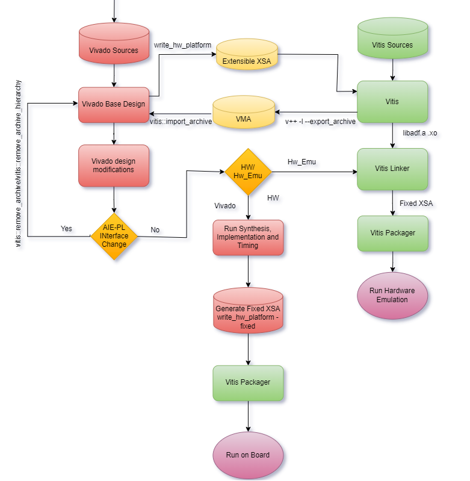


The Vitis export to the Vivado flow introduces a new v++ link option and three new Tcl APIs. This tutorial helps you understand how to use this flow:

The v++ link option introduced in this flow to generate Vitis Metadata is:

```bash
v++ -l --export_archive
```

**Note:** This option can be used with v++ --l only. Do not use --target with this command, it is not supported. 

The Vivado Tcl APIs are introduced in this flow to import and remove the VMA from Vivado are:

```bash
vitis:: import_archive
vitis:: remove_archive_hierarchy
vitis:: remove_archive
```


## DESIGN FILES

1. Vivado design tcl scripts are located in `hw\xsa_scripts` folder:

    - [xsa.tcl](./hw/xsa_scripts/xsa.tcl)
    
    - [project.tcl](./hw/xsa_scripts/project.tcl)
   
2. Files for AIE graph are in the `aie` folder.

    - [Graph.cpp](./aie/graph.cpp)

    - [Graph.h](./aie/graph.h)
    
    - [Multi_Graph.cpp](./aie/multi_graph.cpp)

    - [Multi_Graph.h](./aie/multi_graph.h)

    - [include.h](./aie/include.h)

    - [kernels.h](./aie/kernels.h)

3. Files for HLS kernel are in the `pl_kernels` folder.

    - [polar_clip.cpp](./pl_kernels/polar_clip.cpp)
    
    - [aie_stream_in.cpp](./pl_kernels/aie_stream_in.cpp)
    
    - [stream_in.cpp](./pl_kernels/stream_in.cpp)
   

4. The system configuration files are

   - [system.cfg](./vitis_impl/system.cfg)
   
   - [system_custom_ip.cfg](./vitis_impl/system_custom_ip.cfg)
   
   - [system_new.cfg](./vitis_impl/system_new.cfg)
   

5. Vivado design changes files are

   - [viv_changes.tcl](./viv_changes.tcl)
   
   - [import_base.tcl](./import_base.tcl)


## Design Flow

This tutorial covers two use cases as follows: 

**Use Case 1:** Changes in the hardware design after VMA import not affecting the PLIO interface. In this use case, we are considering hardware design change in Vivado which does not affect the AIE-PL boundary or AIE/PL kernels. So, developer can do the hardware development in Vivado and generate the extesible/fixed xsa.
   1. Generate extensible XSA for changes in vivado design.
   2. Re export the VMA with updated software changes.
   3. Import the updated VMA into vivado design for target hardware.
   4. link and package the design for hardware emulation.
   

**Use Case 2:** Changes in the hardware design after VMA import affects the PLIO interface or changes in vitis sw files. This use case will be helpful to update the Vivado design for following Vitis development: 
   1. Changes are required in AIE-PL (PLIO) boundary.
   2. Changes done in HLS kernel. 
   3. Changes done in connection and need modifications in Vitis configuration file.  

To incorporate Vitis changes in Vivado, following steps are required:
   1. Remove the imported VMA from vivado. 
   2. Re export the extensible xsa from vivado (if there are any changes done in vivado after the last extensible xsa export). 
   3. Re compile the modified software files with the latest exported extensible xsa.
   4. Re export the VMA with updated software changes.
   5. Import the latest VMA into the design.

Note: Use the make command in the tutorial from the parent folder `03_Vitis_Export_To_Vivado`

#### Step 1 : Create the hardware design in Vivado

##### Step 1.1 : Creating a hardware design in Vivado using the Tcl flow 

The Tcl files are shared in directory `hw/xsa_scripts`.

Below steps help you to go through the flow step by step:

Use the following make command to generate the Vivado project through Tcl:

`make TARGET=hw_emu xsa`

The above make command source the xsa.tcl (top file) file. The tcl file calls below files:

     1. project.tcl : Creates the project my_project in Vivado for the board VCK190. 

     2. bd.tcl : Create the block design vitis_design.bd. 

This step generates extensible xsa hw_emu.xsa in the path `hw/build/hw_emu`

Open the Vivado project by opening the project file from the path:  `./hw/build/my_project/my_project.xpr` 

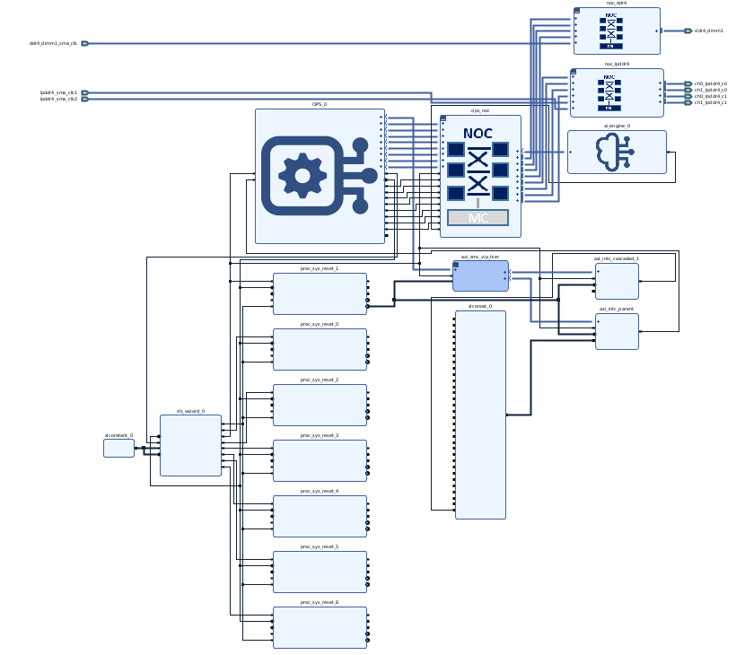


#### Step 2 Create the software components in Vitis

After exporting the XSA, compile AIE and PL kernels to generate `libadf.a` and `.xo ` file respectively.

##### Step 2.1: Compile the AIE Graph to generate `libadf.a`

Use the `make` command to generate the libadf.a (AIE compiled output).

```bash
make TARGET=hw_emu XSA=hw/build/hw_emu/hw_emu.xsa graph
```
The graph has two PLIOs. The first PLIO is connected to interpolator AIE Kernel and the second PLIO is connected to classifier AIE Kernel. 
 
**Output:** The generated `libadf.a` is located in the top level directory.

##### Step 2.2: Compile HLS PL Kernels to generate the .xo File

We are using 3 HLS PL kernels: stream_out,polar_clip and stream_in.
  - Stream_out Kernel would send data of DDR4 to AIE.
  - polar_clip kernel would receive stream data from AIE classifier kernel and process it and send it back to AIE interpolator kernel.
  - stream_in Kernel receives the stream data from AIE and stores it in Memory DDR4.

In this step, we compile the HLS kernel and generate the .xo file. Make command to compile and generate .xo file: 

```bash
make TARGET=hw_emu XSA=hw/build/hw_emu/hw_emu.xsa kernels
```
The above make command compiles the polar_clip.cpp, stream_out.cpp and stream_in.cpp using the v++ command inside the pl_kernel folder: 

**Output:** The generated .xo files are located in the top directory `polar_clip.xo stream_out.xo stream_in.xo`.

##### Step 2.3: Integrate the AIE+PL subsystem by linking the extensible platform
V++ link command should be run with inputs hw/build/hw_emu/hw_emu.xsa, AIE graph (libadf.a), PL kernels (polar_clip.xo,stream_out.xo,stream_in.xo)  and the Vitis configuration file (system.cfg). Use the --export_archive linker option to generate a Vitis Metadata Archive (vma) file which can then be imported in Vivado.

Use the `make` command to generate design.vma file:

```bash
make TARGET=hw_emu XSA=hw/build/hw_emu/hw_emu.xsa export
```
The above make command runs the the v++ -l command: 

`v++ -l --save-temps --platform hw/build/hw_emu/hw_emu.xsa --temp_dir ./_x.hw_emu stream_out.xo stream_in.xo polar_clip.xo libadf.a --config vitis/system.cfg --export_archive --advanced.param compiler.exportArchiveHierName=vmaHier -o design.vma`

In the configuration file (system.cfg), provide details about the connectivity between the AIE and PL IPs. Vitis uses the file to make the connectivity during linking:

```bash
freqhz=200MHz:stream_in.ap_clk

[connectivity]
nk=stream_out:1:stream_out
nk=stream_in:1:stream_in
nk=polar_clip:1:polar_clip
sc=stream_out.s:ai_engine_0.DataIn1
sc=ai_engine_0.clip_in:polar_clip.in_sample
sc=polar_clip.out_sample:ai_engine_0.clip_out
sc=ai_engine_0.DataOut1:stream_in.s
[clock]
freqHz=100000000:polar_clip.ap_clk
```

#### Step 3: Import VMA into Vivado project

After exporting VMA file in step-2, import the VMA file in the Vivado project.

1. Copy the project from hw/build/my_project to the current directory 

2. Open the Vivado project from the project directory, `./hw/build/my_project/my_project.xpr`.
       
3. From the Tcl console, use the Tcl API to import the VMA: `vitis::import_archive ./design.vma`.

    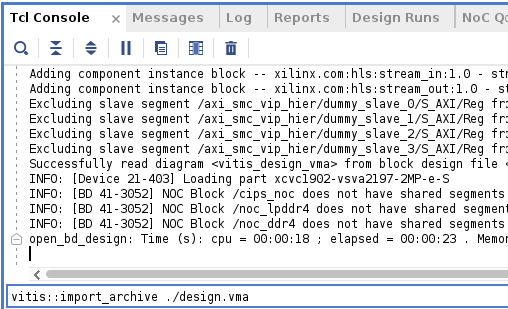

3. After running the Tcl API to import the VMA, a hierarchy will be created and named as `vmaHier`

      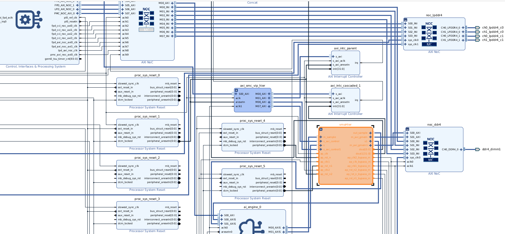

4. Connection between AIE, RTL Ips and HLS Kernel in `vmaHier` is as follows:

    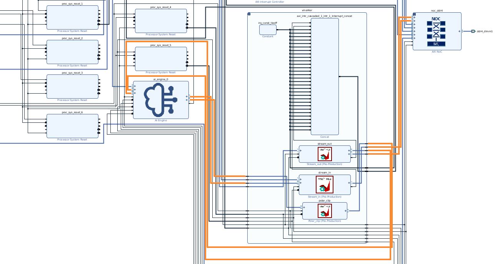
    
Here, it can be seen that the open ports in step 1.2 are connected using the v++ --link.

#### Step 4: Changes in the Vivado design after the VMA import

This section shows steps to be followed,if the Vivado design has changes after importing vma. You can view connnection between HLS kernels to AIE inside the VitisRegion hierarchy `vmaHier`. Refer to [UG1701](<[https://docs.amd.com/r/en-US/ug1701-vitis-accelerated-embedded/Vitis-Export-to-Vivado-Flow](https://docs.amd.com/r/en-US/ug1701-vitis-accelerated-embedded/Vitis-Export-Flow-Guidelines-and-Limitations)>) to understand the design guidelines and limitations under the section "Vitis Export Flow Guidelines and Limitations".

 #### step 4.1 : Remove VMA from the design
 
 Open the bd `vitis_design_vma.bd`. Remove the VMA from project by using Vivado TCL API `vitis::remove_hierarchy` in the Tcl Console.
   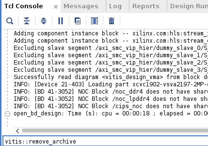
   
 Set the `vitis_design_wrapper` as top using the in TCL console using `set_property top vitis_design_wrapper [current_fileset]`
   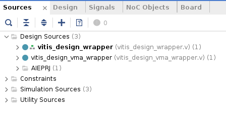

 #### step 4.2 : Add the custom RTL IPs in Vivado
 
 Here, we are using stream_out RTL IP which we are adding in platform. Stream_out RTL IP is a free running RTL block which generates the stream data indefinitely.  Below steps demonstrates how to add custom RTL IPs in the bd to export the extensible xsa from the Vivado. This step can also be done by sourcing `viv_changes.tcl` located in hw folder or by using the make command `make viv_changes`. 

This includes the following steps in Vivado

1. Package RTL IPs. (We have placed the packaged RTL IPs in the folder `custom_ip`)

2. Add the RTL path in the IP repository from the project manager settings in the Vivado. After adding the path click ok.

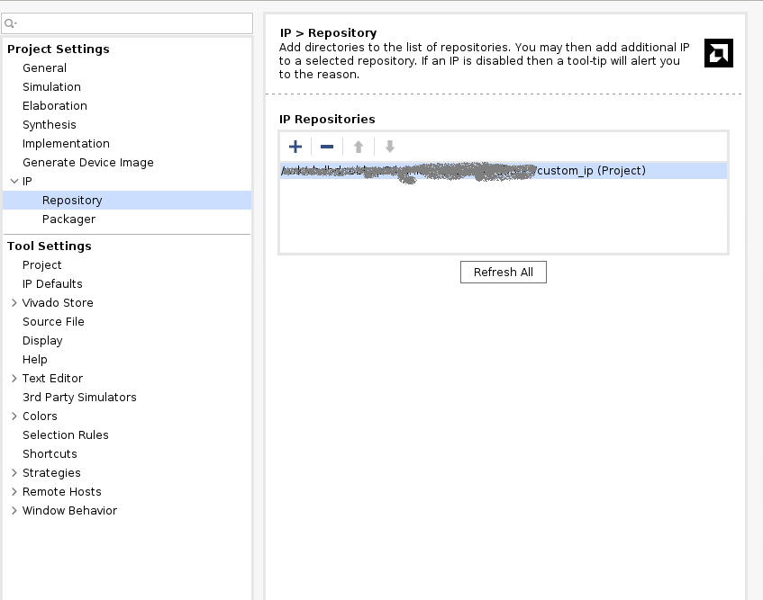

3. Open vitis_design.bd. 

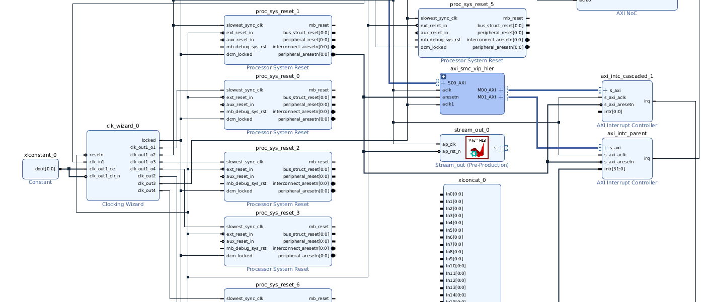

 Change IP configuration settings for following IPs:

   		a. icn_ctrl: Set the master ports to 7. 
   
   		b. DDRNoC : Set the slave axi ports to 1. 

4. Go to Platform setup: 
   Select AXI Stream Port: Give the SPTAG name to stream port of stream_out as AIE_IN. 
   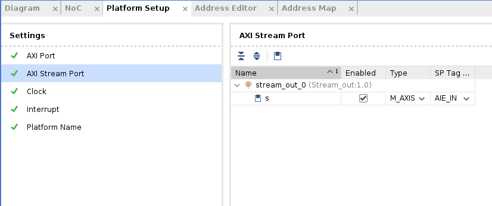

5. Validate and save the bd. Ignore the warnings if any.

6. Re-generate target for vitis_design.bd.

 #### step 4.3 : Generate Extensible XSA
 
    a. Go to Flow Navigator > IP Integrator > Export platform. Click Next
       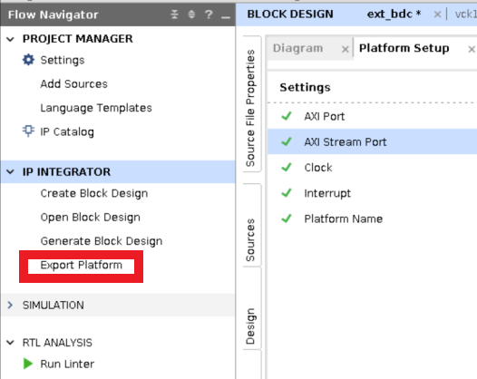
    
    b. Select Platform Type = Hardware Emulation. Click Next.
      
    c. Keep the Platform Properties settings as is. Click Next.
    
    d. Give XSA file Name = hw_emu and Export to = . Click Next and Finish
    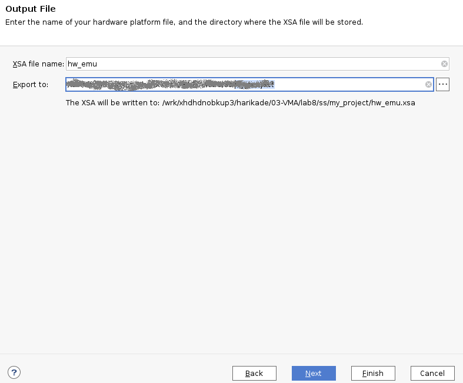

Output: The generated extensible XSA is located at `hw/build/hw_emu.xsa`.

All the above steps from 4.1 - 4.3 can be performed through make command : `make TARGET=hw_emu viv_changes`

#### Step 5 : Run hardware emulation

Inorder to run the hardware emulation, design must be taken through  Vitis 
  a. Linking the design to generate fixed XSA : `make TARGET=hw_emu XSA=hw_emu.xsa link`
     Pass the system cfg file system_custom_ip.cfg to the linker by replacing #16 with #17 and #11 with #12 for kernels selection.
     This generates hw_emu_fixed.xsa file , which will be an input to package step.
  b. Generate host executable : `make TARGET=hw_emu host`
     This generates host executabl `host.exe`
  c. Generate xclbin through package step : `make TARGET=hw_emu package`
     This generates .xclbin to run emulation
  d. Run Emulation : `make TARGET=hw_emu run_emu`

#### Step 6 : Vivado design changes that require AIE+PL interface change
Based on the Vivado design changes affecting the PLIO interface, covering the following use case. Now the multi graph instance is considered where 2 instances of the same graph are present in the design. So, 1 additional stream_in PL IP to receive stream data from AIE Master ports and 1 aie_stream_in IP to drive data to additional slave ports of AIE will be added in the design through linking.

#### Step 6.1: Generate libadf.a for graph changes
 
For the graph changes present in `aie/multi_graph.cpp` and `aie/multi_graph.h`, libadf.a should be generated.
Copy the multi_graph.cpp as graph.cpp and multi_graph.h as graph.h
Remove the existing libadf.a and generate libadf.a using the make command :
`make TARGET=hw_emu XSA=hw_emu.xsa graph`

#### Step 6.2 : Generate fixed XSA for new changes in AIE+PL interface
we are adding 
    a. one HLS kernel stream_in on Master ports end of AIE
    b. one aie_stream_in HLS kernel on slave ports end of AIE 
    c. one additional polar_clip for another instance of graph, to show how to add another HLS kernel and modify the connectivity graph. 
    d. Update the Kernels list by selecting #13 in Makefile. 
    
    Since we have not done any change in the Vivado design, we need to only update the system.cfg. Updating the connectivity graph helps to establish the connection between among multi graph instances with additional HLS IPs. Following steps would help us to understand the flow:

1. Generate .xo files for HLS Kernel `aie_stream_in` using makefile command : `make TARGET=hw_emu XSA=hw_emu.xsa kernels`
2. Modify the system.cfg to update the connectivity graph changes. or enable line #18 for variable `CONFIG`
 
```bash
freqhz=200MHz:stream_in1.ap_clk
freqhz=200MHz:stream_in2.ap_clk

[connectivity]
nk=aie_stream_in:1:aie_stream_in
nk=stream_in:2:stream_in1.stream_in2
nk=polar_clip:2:polar_clip1.polar_clip2
sc=AIE_IN:ai_engine_0.DataIn_1
sc=ai_engine_0.clip_in_1:polar_clip1.in_sample
sc=polar_clip1.out_sample:ai_engine_0.clip_out_1
sc=ai_engine_0.DataOut_1:stream_in1.s

sc=aie_stream_in.s:ai_engine_0.DataIn_2
sc=ai_engine_0.clip_in_2:polar_clip2.in_sample
sc=polar_clip2.out_sample:ai_engine_0.clip_out_2
sc=ai_engine_0.DataOut_2:stream_in2.s
[clock]
freqHz=100000000:polar_clip1.ap_clk
freqHz=100000000:polar_clip2.ap_clk
```

3. Run v++ --link to export .vma with modified system.cfg generated in step 2.

4. Import the updated .vma into the Vivado project

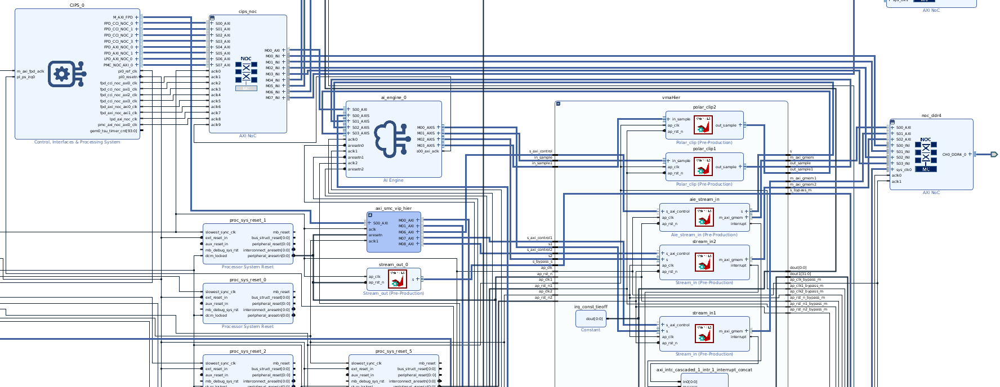

In case if you want to make modifications in the Vivado design, you can do that in the following way: 
1. Make changes in the vitis_design.bd  or in the latest imported *_vma.bd* (changes related to PLIO interface).
2. Validate and save the bd.
3. Regenerate the target and re export the extensible XSA using the command 'write_hw_platform -force <hw_emu.xsa>'. 
4. This extensible XSA will have the Vivado design changes which are done after importing the previous VMA. 
5. Use the latest exported extensible XSA (hw_emu.xsa) to re generate the VMA using following steps:

   5.1: If the changes are made related to AIE design or AIE-PL boundary, regenerate the libadf.a (remove old libadf.a or revision control it) with the newer extensible xsa.
   
   5.2: If the changes are made in the HLS kernels, re-compile the kernels with the newer extensible xsa to generate updated xos (remove old generated xos or revision control).
   
   5.3: Make the changes in the system.cfg file (as done in this use-case), re-export the VMA with updated libadf.a, xos, system.cfg and extensbile xsa. Repeat "Step-3" to import the modified VMA in the design.

6. Generate the fixed XSA using linker , `make TARGET=hw_emu XSA=hw_emu.xsa link`
   
#### Step 6.3 : Run hardware emulation
 Inorder to run the hardware emulation, design must be taken through  Vitis 
  a. Copy the multi_graph_host.cpp to host.cpp. Generate host executable : `make TARGET=hw_emu host`
     This generates host executabl `host.exe`
  b. Generate xclbin through package step : `make TARGET=hw_emu package`
     This generates .xclbin to run emulation
  c. Run Emulation : `make TARGET=hw_emu run_emu`
 
 ** Note ** :  host has self checking to 7display whether test passed or not.
 
#### Step 7: Generate the xclbin for hardware and run it on board

In this step, generate the fixed xsa for hardware (testing design on hardware) flow. 

The ‘common image’ package (https://account.amd.com/en/forms/downloads/xef.html?filename=xilinx-versal-common-v2024.2_11110212.tar.gz) contains a prebuilt Linux kernel and root file system that can be used with the AMD Versal™ board for embedded design development using the Vitis software platform.

Before starting this tutorial, run the following steps:

1. Go to the directory where you have unzipped the Versal Common Image package.
2. In a Bash shell, run the ``/Common Images Dir/xilinx-versal-common-v2025.1/environment-setup-cortexa72-cortexa53-amd-linux`` script. This script sets up the SDKTARGETSYSROOT and CXX variables. If the script is not present, you must run the ``/Common Images Dir/xilinx-versal-common-v2025.1/sdk.sh``.
3. Set up your ROOTFS and IMAGE to point to the ``rootfs.ext4`` and Image files located in the ``/Common Images Dir/xilinx-versal-common-v2025.1`` directory.
4. Set up your PLATFORM_REPO_PATHS environment variable to ``$XILINX_VITIS/base_platforms``.

Following steps helps to generate the fixed xsa successfully:

Steps to generate fixed xsa for hardware flow:
1. Generate the extensible XSA `hw.xsa` for the target harware. 
    a. Open the design my_project/my_project.xpr in Vivado.
    b. In Tcl Console Remove the VMA by TCl API `vitis::remove_archive`
    c. Set the vitis_design_wrapper as top by `set_property top vitis_design_wrapper [current_fileset]`
    d. Export the platform for hardware by File -> Export -> Export Platform -> hardware -> pre-synthesis, provide the settings of the platform and mention the name of the XSA `hw`.
2. Generate libadf.a with hw.xsa file using make command : make TARGET=hw XSA=hw.xsa graph
3. Generate .xo files with hw.xsa file using make command : make TARGET=hw XSA=hw.xsa kernels
4. Generate new VMA using make command : make TARGET=hw XSA=hw.xsa export
5. Import the VMA into the platform 
6. Run the design synthesis, implementation run and timing closure. 
7. Address timing violations and other implementation issues with the design. 
8. Generate the fixed xsa using the TCL API: `write_hw_platform -fixed ./hw_fixed.xsa`. 

All the steps 6-8 can be done by make command : `make TARGET=hw import`

9. Generate xclbin for the target hw using make command : `make TARGET=hw package`


When running the VCK190 board, make sure you have the right onboard switches flipped for booting from the SD card.
  1. Insert the SD card and turn ON the board.
  2. Wait for the Linux command prompt to be available on an attached monitor and keyboard.
  3. To run your application enter the command: ./host.exe krnl_lab8.xclbin.
  4. You should see a **TEST PASSED** which means that the application ran successfully!

**IMPORTANT:** To re-run the application, you must power cycle the board.


## Summary

In this tutorial, you learned the following after completing the tutorial:

 1. Start the design in the Vivado and export `xsa`.
 2. Compilation of AIE graph and PL kernels xo.
 3. Link the compiled output, `system.cfg`, extensible `.xsa`, and export the VMA.
 4. Import the VMA into the Vivado and progress the platform development in the Vivado.
 5. Generate the `fixed.xsa` file from the Vivado to support hardware flow.
 6. Generate the fixed XSA file using Vitis linker command to support hardware emulation flow.

To read more about the flow, refer to [UG1701](https://docs.amd.com/r/en-US/ug1701-vitis-accelerated-embedded/Managing-Vivado-Synthesis-Implementation-and-Timing-Closure) (Chapter 19: Managing Vivado Synthesis, Implementation, and Timing Closure).

## Support

GitHub issues will be used for tracking requests and bugs. For questions, go to [support.xilinx.com](support.xilinx.com).


<p class="sphinxhide" align="center"><sub>Copyright © 2020–2023 Advanced Micro Devices, Inc.</sub></p>

<p class="sphinxhide" align="center"><sup><a href="https://www.amd.com/en/corporate/copyright">Terms and Conditions</a></sup></p>
