<table class="sphinxhide" width="100%">
 <tr width="100%">
   <td align="center"><h1>Vitis™ Platform Creation Tutorials</h1>
   </td>
 </tr>
 <tr>
 <td>
 </td>
 </tr>
</table>

# Vitis Export To Vivado

***Version: Vitis 2024.1***

## Objective

Demonstrate how to convert flat (non-BDC) based HW design to BDC based design. After converting your existing non-BDC design to BDC, you will be able to use Vitis 
export to Vivado flow.

## Flow steps to convert non-BDC design to BDC design

To demonstrate the conversion steps, we are using vck190_base design `xilinx_vck190_base_202410_1` from https://www.xilinx.com/support/download/index.html/content/xilinx/en/downloadNav/embedded-platforms.html

Step 1: Download the design, run the make command to build the vck190 base design: `make xsa`

Step 2: Open the design (/hw/build/my_project/my_project.xpr) in Vivado and open the block design (vitis_design.bd): 
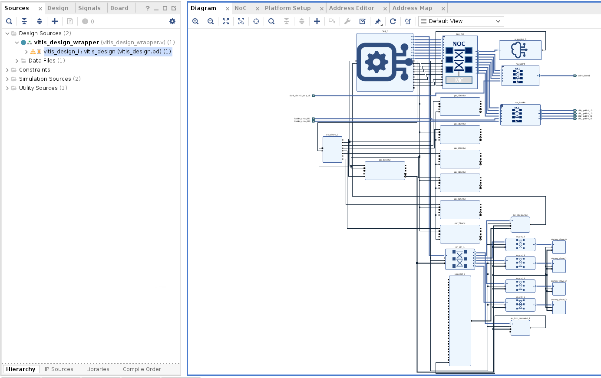

Step 3: Enable "Display hardened connections" from block diagram settings as shown below. Hardened connections represents the hardened physical connection on FPGA and can not cross boundary of the block design.

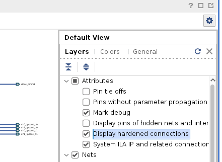

Step 4: Analyze the hardened connection in block diagram:

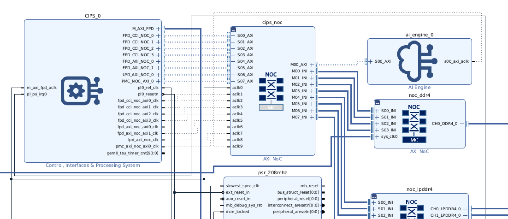

Step 5: We are creating BDC to have AI Engine-PL system implemented. To create the BDC, we must move AI Engine IP inside the BDC, the hardened connection of AI Engine needs to be changed. 

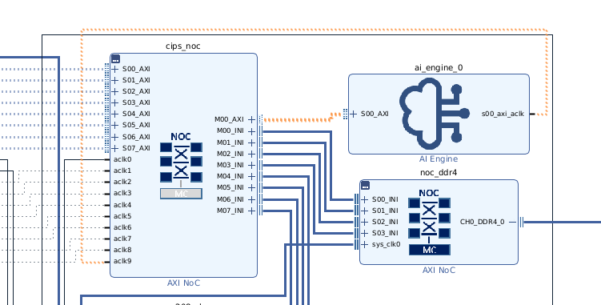

Step 6: Re-configure AXI NOC IP:

6.1: Add an `AXI NoC` from IP Catalog.

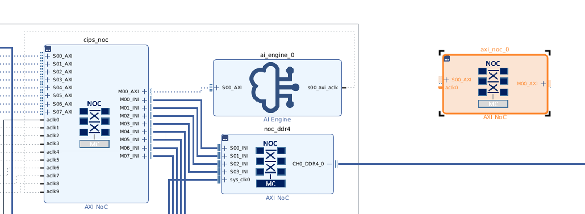

6.2: Change the following connection in the block diagram:

Remove bd connection: ai_engine_0:S00_AXI and ai_engine_0:s00_axi_aclk

Connect bd connection: axi_noc_0:M00_AXI to ai_engine_0:S00_AXI and axi_noc_0:aclk0 to ai_engine_0:s00axi_aclk to axi_noc_0:aclk0

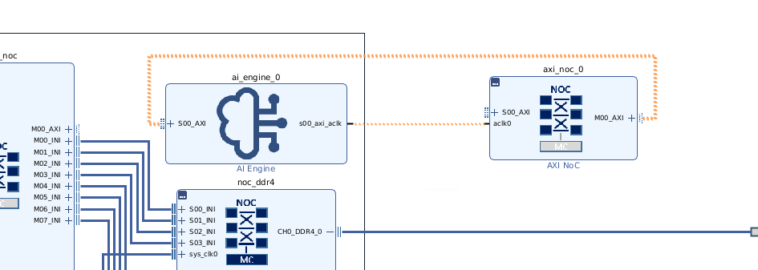

6.3: Change axi_noc_0 configuration:

6.3.1: Goto `General` section: 

Set Number of AXI Slave Interface to 0

Set Number of Inter-NoC Slave Interfaces to 1

6.3.2: Go to `Inputs` section:

Set Inter-NoC inputs: S00 INI to Load

6.3.3: Go to `Outputs` Section:

Set M00_AXI connected to AIE 

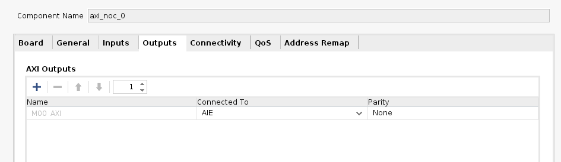

6.3.4: Go to `Connectivity` Section:

Check the connectivity box to connect 

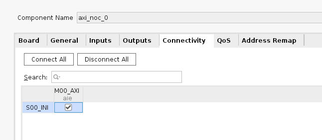

Step 7: Change the configuration of cips_noc IP:

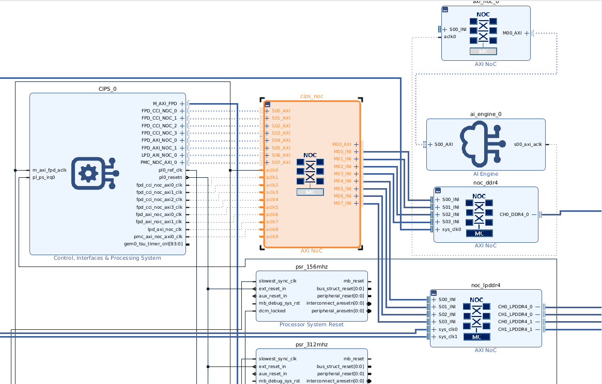

7.1: Go to `General` section

Set Number of AXI Master Interfaces to 0

Set Number of AXI clocks to 9

Set Number of Inter-NOC Master Interfaces to 9

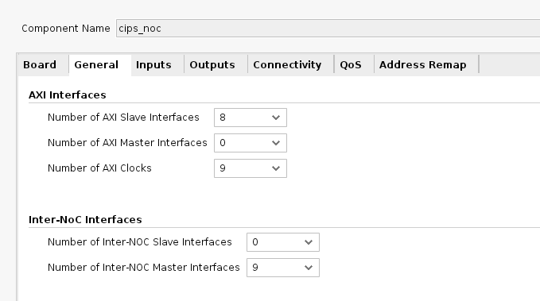

7.2: Go to `Connectivity` section

Check the connection tab M08_INI for S00_AXI, S01_AXI, S02_AXI, S03_AXI and S07_AXI 

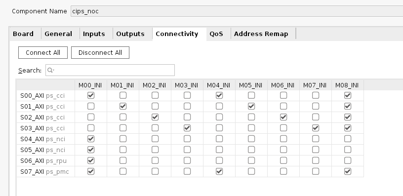

Step 8: Connect bd connection cips_noc:M08_INI to axi_noc_0:S00_INI

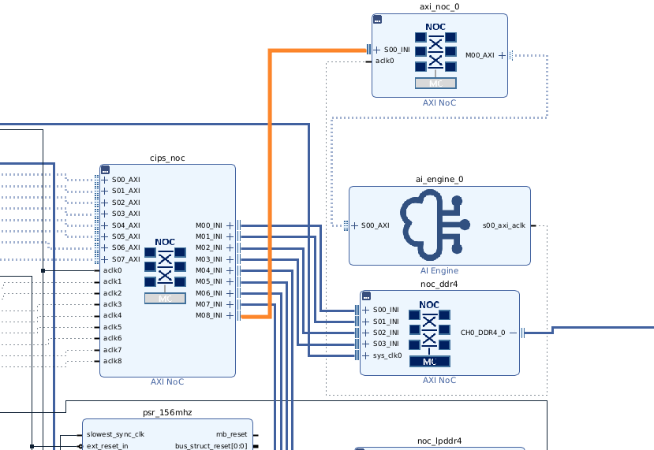

Step 9: To create hierarchy for AIE-PL Subsystem, we must include IPs in the AIE-PL subsystem for which the IP connections are driven from Vitis linker.
1. AI Engine (ai_engine_0)
2. AXI NoC (axi_noc_0)
3. Clocking Wizard (clk_wizard_0)
4. Processor System Reset (psr_104mhz, psr_208mhz, psr_312mhz,psr_156mhz, psr_416mhz, psr_625mhz, psr_78mhz)
5. AXI Smart Connect (icn_ctrl_1, icn_ctrl_2, icn_ctrl_3, icn_ctrl_4, icn_ctrl_5)
6. AXI Interrupt Controller (axi_intc_parent, axi_intc_cascaded_1)
7. AXI Verification IPs (dummy_slave_0, dummy_slave_1, dummy_slave_2, dummy_slave_3)
8. Concat (xlconcat_0)

Right click to select `Create Hierarchy`:

Name the hierarchy and click ok generate hierarchy.

Step 10: Right click in the block design area (or press "F6") and select `Validate Design` to validate the block design.

Step 11: Give the platform name to the new BDC created in the platform setup. Remove the platform name for the top BD before exporting the extensible XSA.

## Note: Export the extensible XSA of the BDC to import the VMA from Vitis. Extensible XSA generated from the top BD is not supported to import VMA from Vitis.

Step 11: Right click on the hierarchy and select `Block Design Container` to creat BDC.

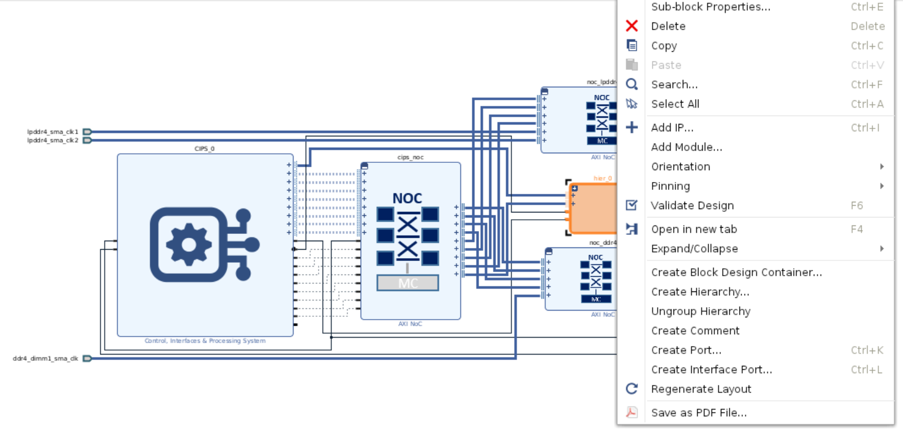

