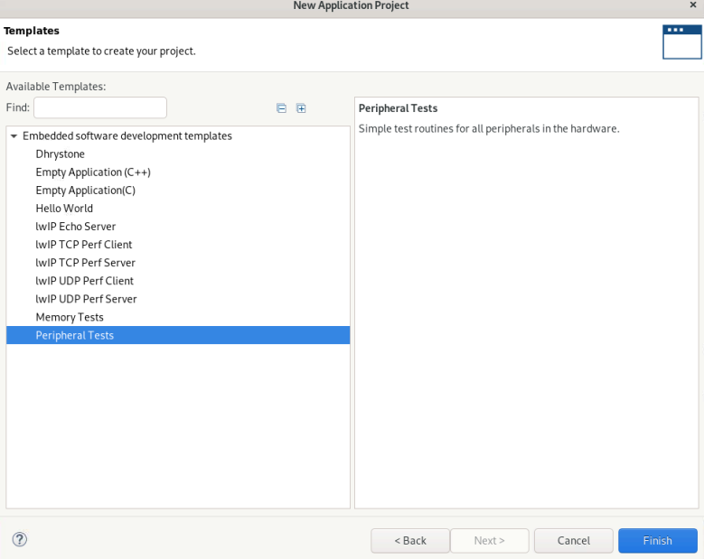

<table class="sphinxhide" width="100%">
 <tr width="100%">
    <td align="center"><h1>Vitis™ Platform Creation Tutorials</h1>
    <a href="https://www.xilinx.com/products/design-tools/vitis.html">See Vitis™ Development Environment on xilinx.com</br></a>
    </td>
 </tr>
</table>

# Versal Extensible Hardware Design Validation

***Version: Vitis 2023.1***

In this tutorial, you will learn how to validate a Versal® ACAP extensible platform. This tutorial is an 'add-on' to the basic [Versal platform creation tutorial](../../Design_Tutorials/03_Edge_VCK190/). So for each step, there will be a pointer to the corresponding part of that tutorial, as required.

This tutorial targets the Versal board or Versal parts. 

## Overview
The tutorial is structured as follows:
- [Versal Platform Validation](#versal-platform-validation)
  - [Overview](#overview)
  - [Extensible platform validation general outline](#extensible-platform-validation-general-outline)
  - [Platform hardware validation](#platform-hardware-validation)
    - [Stage I](#stage-i-base-bootable-design-verification)
      - [Step 1: Prepare a hardware design](#step-1-prepare-a-hardware-design)
      - [Step 2: Validate the hardware design](#step-2-validate-the-hardware-design)
        - [Test1: Go through implementation](#test1-go-through-implementation)
        - [Test2: Validate PDI on Hardware](#test2-validate-pdi-on-hardware)
        - [Test3: Peripheral bare-metal test](#test3-peripheral-bare-metal-test)
    - [Stage II Extensible platform interface verification](#stage-ii-extensible-platform-interface-verification)
      - [Step 1: Prepare a Hardware Platform](#step-1-prepare-a-hardware-platform)
      - [Step 2: Utilize the V++ linker to link a kernel and generate fixed XSA file](#step-2-utilize-the-v-linker-to-link-a-kernel-and-generate-fixed-xsa-file)
      - [Step 3: Create a platform with standalone domain](#step-3-create-a-platform-with-standalone-domain)
      - [Step 4: Create application base on the platform](#step-4-create-application-base-on-the-platform)
      - [Extensible platform validation Demonstration](#extensible-platform-validation-Demonstration)
         - [Test example 1: Interrupt connection check](#test-example-1-interrupt-connection-check)
         - [Test example 2: Test Example 2: AIE test](#test-example-2-aie-test)
   - [Support](#support)
   

## Extensible platform validation general outline

No matter user use Vitis flow or Vitis export to Vivado flow to develop their acceleration application, the extensible hardware platform (XSA) which provides the hardware environment for application kernels is the development start point.
Thereby, hardware platform validation is necessary before going to next stage.

>Note: For Vitis export to Vivado flow, please refer to [Vitis Export To Vivado](03_Vitis_Export_To_Vivado).

Hardware platform validation can be divided into two stage. The first stage is to validate the peripherals to ensure a bootable design.

The second stage is to validate the platform interface exported to kernel. Extensible hardware platform provides the interface like: AXI master interface, AXI slave interface, AXI streaming interface and interrupt interface for kernels. These interface guarantee the kernel control, memory access, large data moving and interrupt control. Validating the platform, that is to validate the interfaces provided to kernels. 


The interfaces exported for extensible XSA is linked by V++ linker to connect PL or AIE kernels. V++ linker supports to take XSA or XPFM as input. Linking a kernel with the hardware XSA and testing from kernel side would be the easiest way for validation. 

The validation can include following tests:

   1. access all memory region from kernel side to verify the AXI slave memory interface; 
   2. generate interrupt signal to PS side from kernel side to verify the interrupt connection; 

**Note**: This method can be applied to all the custom platform.

In this module we will explain how to verify a platform and go through the two stages.

## Platform hardware validation

## Stage I Base bootable design verification


### Step 1: Prepare a hardware design

Please follow the instructions in [Versal platform creation tutorial-Step1](../../Design_Tutorials/03_Edge_VCK190/step1.md) to prepare a custom hardware platform. You can skip the optional steps. Or you can export the XSA file from your Vivado project.

>Note: If you created a platform project like the above steps, you need to change it to a normal project to complete bootable design verifications.

### Step 2: Validate the hardware design

#### Test1: Go through implementation

   As the hardware platform is created from part support example design or from scratch, it's recommended to run through implementation and device image generation to find errors in early stage for the base bootable design. The platform doesn't need the implementation results, the implementation is used for design validation only. 

<details>
  <summary><b>Show Detailed Steps of Implementation</b></summary>


1. Validate the Block Design

   - Click ***Validate Design (F6)*** button in block diagram toolbar.

2. Create HDL Wrapper

   - In Sources tab, right click system.bd and select ***Create HDL Wrapper***. In the pop-up window, select ***Let Vivado Manage***.

3. Select ***Run implementation*** from Flow Navigator, Click **OK** in **Launch Runs** setup dialog. 

4. Generate Device Image (For Method2)

   - Click ***Generate Device Image*** in Flow Navigator

   - Click ***Yes*** if it pops up a message to say *No Implementation Results Available*.

   

   - Click ***OK*** for default options for Launch Runs dialogue.

   It takes a while to generate block diagram and run through implementation.

   PDI is generated in `custom_hardware_platform.runs/impl_1/`

5. Export fixed XSA file (For Test3)

   a) Click Menu ***File -> Export -> Export Hardware***. Click Next.

   b) Select Output to ***Include Device Image***. Click Next.

   c) Set output XSA file name as `xsa_fixed` and the directory. Click Next.

   d) Click Finish
</details>

#### Test2: Validate PDI on Hardware

As the hardware platform is created from part support example design, it's recommended to test the device image (PDI) on hardware to make sure the device initialization configuration is set correctly as well. This is not a required step for platform creation, but it can reduce issues you find in the last platform validation stage.

<details>
<summary><b>Show Detailed Steps of how to download the PDI file</b></summary>

- Connect hardware server in XSCT

   ```tcl
   # If JTAG cable is connected locally
   connect

   # If JTAG cable is connected on another server, launch hw_server on that server then connect to that remote hardware server
   connect -url TCP:<SERVER NAME or IP>:3121
   ```

- Download PDI in XSCT

   ```tcl
   device program <PDI file>
   ```

PDI program should download without errors. If any error occurs in XSCT console, please check block design settings.

Here's the sample prints on UART console of VCK190 board


<!--TODO: update for 2021.2 log -->
<details>
<summary><b>Show Log</b></summary>

   ```
   [8.716546]****************************************
   [10.387178]Xilinx Versal Platform Loader and Manager
   [15.181959]Release 2020.2   Nov 30 2020  -  07:20:11
   [19.889662]Platform Version: v1.0 PMC: v1.0, PS: v1.0
   [24.684093]BOOTMODE: 0, MULTIBOOT: 0x0
   [28.172159]****************************************
   [32.817343] 28.506881 ms for PrtnNum: 1, Size: 2224 Bytes
   [37.939565]-------Loading Prtn No: 0x2
   [41.975581] 0.531603 ms for PrtnNum: 2, Size: 48 Bytes
   [46.307975]-------Loading Prtn No: 0x3
   [153.848428] 104.031565 ms for PrtnNum: 3, Size: 57168 Bytes
   [156.392071]-------Loading Prtn No: 0x4
   [159.994956] 0.012506 ms for PrtnNum: 4, Size: 2512 Bytes
   [165.110546]-------Loading Prtn No: 0x5
   [168.715028] 0.014362 ms for PrtnNum: 5, Size: 3424 Bytes
   [173.831756]-------Loading Prtn No: 0x6
   [177.430206] 0.007693 ms for PrtnNum: 6, Size: 80 Bytes
   [182.427400]+++++++Loading Image No: 0x2, Name: pl_cfi, Id: 0x18700000
   [188.652918]-------Loading Prtn No: 0x7
   [1564.072421] 1371.823162 ms for PrtnNum: 7, Size: 707472 Bytes
   [1566.876806]-------Loading Prtn No: 0x8
   [1956.351062] 385.792100 ms for PrtnNum: 8, Size: 365712 Bytes
   [1959.102465]+++++++Loading Image No: 0x3, Name: fpd, Id: 0x0420C003
   [1965.172668]-------Loading Prtn No: 0x9
   [1969.287834] 0.436437 ms for PrtnNum: 9, Size: 992 Bytes
   [1974.032078]***********Boot PDI Load: Done*************
   [1979.057962]55080.597596 ms: ROM Time
   [1982.528018]Total PLM Boot Time
   ```
</details>

If the PDI can't load successfully, please check the CIPS configuration. 

</details>

#### Test3: Peripheral bare-metal test

   Please refer to [Embedded Design Tutorial](https://github.com/Xilinx/Embedded-Design-Tutorials/blob/master/docs/Introduction/Versal-EDT/docs/2-cips-noc-ip-config.rst#creating-a-hello-world-application-for-the-arm-cortex-a72-on-ocm) to create a bare-metal application based on the fixed XSA file and run on board test the peripherals.
   
   Application templates can choose the Peripheral or memory test:

   

## Stage II Extensible platform interface verification
General steps are as following:

### Step 1: Prepare a Hardware Platform

Please follow the instructions in [Versal platform creation tutorial-Step1](../../Design_Tutorials/03_Edge_VCK190/step1.md) to prepare a custom hardware platform. You can skip the optional steps. Or you can export the XSA file from your Vivado project.


### Step 2: Utilize the V++ linker to link a kernel and generate fixed XSA file

V++ usage is like the following:

  ```bash
  v++ -l <kernel> --platform <extensible xsa> -s -g  -t <target> -o fixed.xsa
  ```
  The options is explained like the following:

   -  `-l`: run a link mode and specify the kernel 
   -  `--platform`: specify the extensible XSA file
   -  `-s`: do not delete the intermedia file
   -  `-g`: generate code for debugging
   -  `-t`: specify the target, HW or HW emulation
   -  `-o`: specify the output file name

Linking XSA file directly can provide fast track for hardware developers to iterate hardware designs​.

### Step 3: Create a platform with standalone domain

In this step, you will package the hardware XSA with software components in the Vitis IDE. Follow the instructions in [Versal platform creation tutorial-Step2](../../Design_Tutorials/03_Edge_VCK190/step2.md). Please set operating system to **standalone**.


### Step 4: Create application base on the platform

Please refer to [Versal platform creation tutorial-Step3](../../Design_Tutorials/03_Edge_VCK190/step3.md) to create an application based on the platform created in step3. In this application we should do the following:

   1. Access the kernel registers from PS side to determine whether the kernel is accessible, and thus indirectly determine whether AXI mater interface is working or not.
   2. Kernel accesses the memory to determine whether the memory is accessible or not from kernel side, and thus indirectly determine whether AXI slave interface for memory is working or not.
   3. Kernel triggers interrupt to PS and PS try to capture the interrupt to determine whether the interrupt connection is correct or not, and thus indirectly determine whether the interrupt is working or not. 

   One reference design [examples](ref_files/) is provided under ref_file directory for your reference. Next we will demonstrate how to use the examples provided in ref_files directory to do validation.

### Extensible platform validation demonstration

#### Test example 1: Interrupt connection check

   In this test we will make a incorrect design manually and see whether it can report this error or not.

   1. Please follow the instructions in [Versal platform creation tutorial-Step1](../../Design_Tutorials/03_Edge_VCK190/step1.md) to create a custom hardware platform. You can skip the optional steps. Before going through `Generate block design` step, delete the connection between `axi_intc_0.irq` and `pl_ps_irq0` like the following. Then export the platform according to the steps.


   

   2. Go to [ref_files](ref_files/) directory.

   ```bash
   cd ref_files/pl_validation
   make all EXTENSIBLE_XSA=/Vitis-Tutorials/Vitis_Platform_Creation/Design_Tutorials/03_Edge_VCK190/ref_files/step1_vivado/build/vivado/custom_hardware_platform_hw.xsa  TARGET=hw #the XSA is exported from last step
   ```
   Please refer to [Versal platform creation tutorial-Step3](../../Design_Tutorials/03_Edge_VCK190/step3.md) to burn the image and connect your board.

   <details>
   <summary><strong>Expected log on board is as following:</strong></summary>
   
   ```bash
   #Beginning test
   #Beginning PS to Memory test
        INFO::PS to memory access check: PASS!
   #Beginning PS to Kernel (register) test
        INFO::Try to wite MM2S kernel offset is 10, Value is a
        INFO::kernel register  is accessible
        INFO::Kernel register access check: PASS!
   #Beginning PL Kernel to Memory test
        INFO::PL kernels are initialized
        INFO::Comparing the data S2MM write memory with the data MM2S read from memory
        INFO::All the data MM2S read from memory equal to the data S2MM write to memory
        INFO::Kernel to memory access check: PASS!
   #Beginning to do interrupt check
        INFO::We are trying to move data in interrupt mode
        INFO::GIC and INC are initialized
        INFO::Interrupt is enabled
        ERROR::Interrupt is not detected in PS side
        ERROR::Please check whether the interrupt is exported in your platform and the interrupt connection in Vivado block design!
   #End
   ```

   </details>  

   This is what we expected log. It report the interrupt connection error as expected. You can try with other extensible hardware platforms.


#### Test Example 2: AIE test

   In this test we will focus on the AI engine side. We will test whether the AI engine is working correctly or not.

   1. Please follow the instructions in [Versal platform creation tutorial-Step1](../../Design_Tutorials/03_Edge_VCK190/step1.md) to create a custom hardware platform. You can skip the optional steps.

   2. Go to [ref_files](ref_files/) directory.

   ```bash
   cd ref_files/aie_validation
   make all EXTENSIBLE_XSA=/Vitis-Tutorials/Vitis_Platform_Creation/Design_Tutorials/03_Edge_VCK190/ref_files/step1_vivado/build/vivado/custom_hardware_platform_hw.xsa  TARGET=hw #the XSA is exported from last step
   ```
   Please refer to [Versal platform creation tutorial-Step3](../../Design_Tutorials/03_Edge_VCK190/step3.md) to burn the image and connect your board.

   <details>
   <summary><strong>Expected log on board is as following:</strong></summary>

   ```bash
   [0.119]Platform Version: v2.0 PMC: v2.0, PS: v2.0
   [0.160]BOOTMODE: 0x0, MULTIBOOT: 0x0
   [0.190]****************************************
   [0.404]Non Secure Boot
   [3.302]PLM Initialization Time
   [3.330]***********Boot PDI Load: Started***********
   [3.370]Loading PDI from SBI
   [3.396]Monolithic/Master Device
   [4.152]0.779 ms: PDI initialization time
   [4.188]+++Loading Image#: 0x1, Name: lpd, Id: 0x04210002
   [4.234]---Loading Partition#: 0x1, Id: 0xC
   [55.542] 51.264 ms for Partition#: 0x1, Size: 2848 Bytes
   [60.423]---Loading Partition#: 0x2, Id: 0xB
   [106.357] 42.084 ms for Partition#: 0x2, Size: 64112 Bytes
   [108.847]+++Loading Image#: 0x2, Name: pl_cfi, Id: 0x18700000
   [114.048]---Loading Partition#: 0x3, Id: 0x3
   [755.449] 637.465 ms for Partition#: 0x3, Size: 931216 Bytes
   [757.931]---Loading Partition#: 0x4, Id: 0x5
   [1685.747] 923.879 ms for Partition#: 0x4, Size: 1327872 Bytes
   [1688.411]+++Loading Image#: 0x3, Name: aie_subsys, Id: 0x0421C005
   [1694.210]---Loading Partition#: 0x5, Id: 0x7
   [1701.060] 2.828 ms for Partition#: 0x5, Size: 688 Bytes
   [1703.210]+++Loading Image#: 0x4, Name: fpd, Id: 0x0420C003
   [1708.413]---Loading Partition#: 0x6, Id: 0x8
   [1712.841] 0.409 ms for Partition#: 0x6, Size: 1568 Bytes
   [1717.766]+++Loading Image#: 0x5, Name: aie_image, Id: 0x1C000000
   [1723.195]---Loading Partition#: 0x7, Id: 0x0
   [1750.271] 23.054 ms for Partition#: 0x7, Size: 37088 Bytes
   [1752.679]+++Loading Image#: 0x6, Name: default_subsys, Id: 0x1C000000
   [1758.821]---Loading Partition#: 0x8, Id: 0x0
   [3091.042] 1328.197 ms for Partition#: 0x8, Size: 1917136 Bytes
   [3093.835]***********Boot PDI Load: Doze*********i*
   [3098.320]7liz6n218 ms:PROM TimA
   F3101.N14]Total rLe Boot Time
   is created.
   XAIEFAL: INFO: Resource group Static is created.
   XAIEFAL: INFO: Resource group Generic is created.
   -
   #Beginning AIE BareMetal Test
   -
   #Beginning PS2AIE Register Access Test
   ############################################################################
   INFO:: Starting AIE Array's Register Access Test
   ############################################################################
   INFO:: AIE PLL (Clock) Status is Stable and Locked...
   INFO:: AIE Data Memory access successful...

   -
   #Beginning AIE2DDR Memory Access Test
   ############################################################################
   INFO:: Starting AIE Kernel(GMIO) <-> Memory(DDR) access test
   ############################################################################
   INFO:: AIE Graph Run with 1 - iterations
   Set iterations for the core(s) of graph gm_graph
   Enabling core(s) of graph gm_graph
   Updating RTP value to port gm_graph.loop0.in[1]
   INFO:: AIE Graph RTP value updated successfully
   INFO:: Running AIE-GMIO Test
   INFO:: Waiting for GMIO OUT DMA completion...
   INFO:: Comparing AIE-GMIO read data
   GMIO read sample-1 = 1 matches with Golden data = 1
   GMIO read sample-2 = 2 matches with Golden data = 2
   GMIO read sample-3 = 3 matches with Golden data = 3
   GMIO read sample-4 = 4 matches with Golden data = 4
   GMIO read sample-5 = 5 matches with Golden data = 5
   GMIO read sample-6 = 6 matches with Golden data = 6
   GMIO read sample-7 = 7 matches with Golden data = 7
   GMIO read sample-8 = 8 matches with Golden data = 8
   GMIO read sample-9 = 9 matches with Golden data = 9
   GMIO read sample-10 = 10 matches with Golden data = 10
   GMIO read sample-11 = 11 matches with Golden data = 11
   GMIO read sample-12 = 12 matches with Golden data = 12
   GMIO read sample-13 = 13 matches with Golden data = 13
   GMIO read sample-14 = 14 matches with Golden data = 14
   GMIO read sample-15 = 15 matches with Golden data = 15
   GMIO read sample-16 = 16 matches with Golden data = 16
   GMIO read sample-17 = 17 matches with Golden data = 17
   GMIO read sample-18 = 18 matches with Golden data = 18
   GMIO read sample-19 = 19 matches with Golden data = 19
   GMIO read sample-20 = 20 matches with Golden data = 20
   GMIO read sample-21 = 21 matches with Golden data = 21
   GMIO read sample-22 = 22 matches with Golden data = 22
   GMIO read sample-23 = 23 matches with Golden data = 23
   GMIO read sample-24 = 24 matches with Golden data = 24
   GMIO read sample-25 = 25 matches with Golden data = 25
   GMIO read sample-26 = 26 matches with Golden data = 26
   GMIO read sample-27 = 27 matches with Golden data = 27
   GMIO read sample-28 = 28 matches with Golden data = 28
   GMIO read sample-29 = 29 matches with Golden data = 29
   GMIO read sample-30 = 30 matches with Golden data = 30
   GMIO read sample-31 = 31 matches with Golden data = 31
   GMIO read sample-32 = 32 matches with Golden data = 32
   INFO:: AIE GMIO Test Passed!
   INFO:: Waiting for AIE Graph End...
   Waiting for core(s) of graph gm_graph to finish execution ...
   core(s) are done executing
   INFO:: AIE Graph END complete...

   -
   #Beginning AIE2PL2DDR Access Test
   ############################################################################
   INFO:: Starting AIE Example (AIE+PL) test
   ############################################################################
   INFO:: AIE Graph Run with 1 - iterations
   Set iterations for the core(s) of graph pl_graph
   Enabling core(s) of graph pl_graph
   Updating RTP value to port pl_graph.loop0.in[1]
   INFO:: AIE Graph RTP value updated successfully
   INFO:: Running AIE-PLIO Test
   INFO::PL kernels are initialized
   INFO::S2MM CTRL register is 1
   INFO::S2MM CTRL register is 6
   INFO::Comparing the data S2MM write memory with the data MM2S read from memory
   INFO::the data 1 S2MM write to memory =1 the data 1 MM2s read from memory
   INFO::the data 2 S2MM write to memory =2 the data 2 MM2s read from memory
   INFO::the data 3 S2MM write to memory =3 the data 3 MM2s read from memory
   INFO::the data 4 S2MM write to memory =4 the data 4 MM2s read from memory
   INFO::the data 5 S2MM write to memory =5 the data 5 MM2s read from memory
   INFO::the data 6 S2MM write to memory =6 the data 6 MM2s read from memory
   INFO::the data 7 S2MM write to memory =7 the data 7 MM2s read from memory
   INFO::the data 8 S2MM write to memory =8 the data 8 MM2s read from memory
   INFO::the data 9 S2MM write to memory =9 the data 9 MM2s read from memory
   INFO::the data 10 S2MM write to memory =10 the data 10 MM2s read from memory
   INFO::the data 11 S2MM write to memory =11 the data 11 MM2s read from memory
   INFO::the data 12 S2MM write to memory =12 the data 12 MM2s read from memory
   INFO::the data 13 S2MM write to memory =13 the data 13 MM2s read from memory
   INFO::the data 14 S2MM write to memory =14 the data 14 MM2s read from memory
   INFO::the data 15 S2MM write to memory =15 the data 15 MM2s read from memory
   INFO::the data 16 S2MM write to memory =16 the data 16 MM2s read from memory
   INFO::the data 17 S2MM write to memory =17 the data 17 MM2s read from memory
   INFO::the data 18 S2MM write to memory =18 the data 18 MM2s read from memory
   INFO::the data 19 S2MM write to memory =19 the data 19 MM2s read from memory
   INFO::the data 20 S2MM write to memory =20 the data 20 MM2s read from memory
   INFO::the data 21 S2MM write to memory =21 the data 21 MM2s read from memory
   INFO::the data 22 S2MM write to memory =22 the data 22 MM2s read from memory
   INFO::the data 23 S2MM write to memory =23 the data 23 MM2s read from memory
   INFO::the data 24 S2MM write to memory =24 the data 24 MM2s read from memory
   INFO::the data 25 S2MM write to memory =25 the data 25 MM2s read from memory
   INFO::the data 26 S2MM write to memory =26 the data 26 MM2s read from memory
   INFO::the data 27 S2MM write to memory =27 the data 27 MM2s read from memory
   INFO::the data 28 S2MM write to memory =28 the data 28 MM2s read from memory
   INFO::the data 29 S2MM write to memory =29 the data 29 MM2s read from memory
   INFO::the data 30 S2MM write to memory =30 the data 30 MM2s read from memory
   INFO::the data 31 S2MM write to memory =31 the data 31 MM2s read from memory
   INFO::the data 32 S2MM write to memory =32 the data 32 MM2s read from memory
   INFO::AIE2PL Access check: PASS!
   INFO:: Waiting for AIE Graph End...
   Waiting for core(s) of graph pl_graph to finish execution ...
   core(s) are done executing
   INFO:: AIE Graph END
   -
   INFO:: AIE Platform Validation Test Passed.
   Exiting AIE Baremetal Test...
   ```

   </details> 


### Support

GitHub issues will be used for tracking requests and bugs. For questions go to [forums.xilinx.com](https://support.xilinx.com).


<p class="sphinxhide" align="center"><sub>Copyright © 2020–2023 Advanced Micro Devices, Inc</sub></p>

<p class="sphinxhide" align="center"><sup><a href="https://www.amd.com/en/corporate/copyright">Terms and Conditions</a></sup></p>
