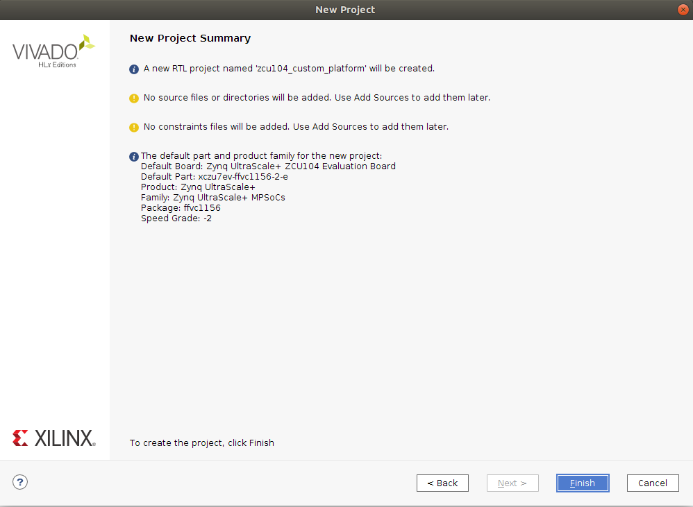
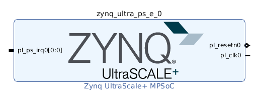
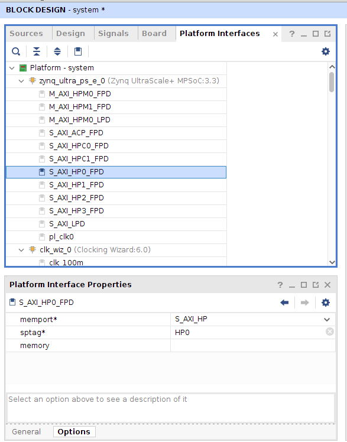

## Step 1: Create the Vivado Hardware Design and Generate XSA

### Create Base Vivado Project from Preset

1. Source <Vitis_Install_Directory>/settings64.sh, and call Vivado out by typing "vivado" in the console.<br />

2. Create a Vivado project named zcu104_custom_platform.

   a) Select ***File->Project->New***.<br />
   b) Click ***Next***.<br />
   c) In Project Name dialog set Project name to ```zcu104_custom_platform```.<br />
   d) Click ***Next***.<br />
   e) Leaving all the setting to default until you goto the Default Part dialog.<br />
   f) Select ***Boards*** tab and then select ***Zynq UltraScale+ ZCU104 Evaluation Board***<br />
   g) Click ***Next***, and your project summary should like below:<br />
   <br />
   h) Then click ***Finish***<br />

3. Create a block design named system.

   a) In ***Project Manager***, under ***IP INTEGRATOR***, select ***Create Block Design***.<br />
   b) Change the design name to ```system```.<br />
   c) Click ***OK***.<br />

4. Add MPSoC IP and run block automation to configure it.

   a) Right click Diagram view and select ***Add IP***.<br />
   b) Search for ```zynq``` and then double-click the ***Zynq UltraScale+ MPSoC*** from the IP search results.<br />
   c) Click the ***Run Block Automation*** link to apply the board presets.<br />
      In the Run Block Automation dialog, ensure the following is check marked:<br />

      - All Automation
      - Zynq_ultra_ps_e_0
      - Apply Board Presets

   d) Click ***OK***. You should get MPSoC block configured like below:<br />
   <br />

***Note: At this stage, the Vivado block automation has added a Zynq UltraScale+ MPSoC block and applied all board presets for the ZCU104. For a custom board, please double click MPSoC block and setup parameters according to the board hardware. Next we'll add the IP blocks and metadata to create a base hardware design that supports acceleration kernels.***

### Customize System Design for Clock and Reset

1. Re-Customizing the Processor IP Block

   a) Double-click the Zynq UltraScale+ MPSoC block in the IP integrator diagram.<br />
   b) Select ***Page Navigator > PS-PL Configuration***.<br />
   c) Expand ***PS-PL Configuration > PS-PL Interfaces*** by clicking the ***>*** symbol.<br />
   d) Expand ***Master Interface***.<br />
   e) Uncheck the ***AXI HPM0 FPD*** and ***AXI HPM1 FPD*** interfaces.<br />
   f) Click OK.<br />
   g) Confirm that the IP block interfaces were removed from the Zynq UltraScale+ MPSoC symbol in your block design.<br />
   <br />

***Note: This is a little different from traditional Vivado design flow. In order to make AXI interfaces available in Vitis platform, you should disable these interfaces at Vivado IPI platform and enable them at platform interface properties. We will show you how to do that later***

2. Add clock block:

   a) Right click Diagram view and select ***Add IP***.<br />
   b) Search for and add a ***Clocking Wizard*** from the IP Search dialog.<br />
   c) Double-click the ***clk_wiz_0*** IP block to open the Re-Customize IP dialog box.<br />
   d) Click the ***Output Clocks*** tab.<br />
   e) Enable clk_out1 through clk_out3 in the Output Clock column, rename them as ```clk_100m```, ```clk_200m```, ```clk_400m``` in the Port Name column, and set the Requested Output Freq as follows:<br />

      - ***clk_100m*** to ***100*** MHz.
      - ***clk_200m*** to ***200*** MHz.
      - ***clk_400m*** to ***400*** MHz.

   f) At the bottom of the dialog box set the ***Reset Type*** to ***Active Low***.<br />
   g) Click ***OK*** to close the dialog.<br />
    The settings should like below:<br />
    <br />
   ***Note: So now we have set up the clock system for our design. This clock wizard uses the pl_clk as input clock and generates clocks needed for the whole logic design. In this simple design, we would use 100MHz clock as the axi_lite control bus clock. 200MHz and 400MHz clocks are reserved for DPU AXI interface clock and DPU core clock during design linking phase. You are free to modify the clock quantities and frequency to fit your target design. We'll setup the clock export in future steps. Before that, we need to create reset signals for each clock because they are needed in clock export setup.***

3. Add the Processor System Reset blocks:

   a) Right click Diagram view and select ***Add IP***.<br />
   b) Search for and add a ***Processor System Reset*** from the IP Search dialog<br />
   c) Add 2 more ***Processor System Reset*** blocks, using the previous steps; or select the ***proc_sys_reset_0*** block and Copy (Ctrl-C) and Paste (Ctrl-V) it twice in the block diagram<br />
   d) Rename them as ```proc_sys_reset_100m```, ```proc_sys_reset_200m```, ```proc_sys_reset_400m``` by selecting the block and update ***Name*** in ***Block Properties*** window.

4. Connect Clocks and Resets:

   a) Click ***Run Connection Automation***, which will open a dialog that will help connect the proc_sys_reset blocks to the clocking wizard clock outputs.<br />
   b) Enable All Automation on the left side of the Run Connection Automation dialog box.<br />
   c) Select ***clk_in1*** on clk_wiz_0, and set the Clock Source to ***/zynq_ultra_ps_e_0/pl_clk0***.<br />
   d) For each ***proc_sys_reset*** instance, select the ***slowest_sync_clk***, and set the Clock Source as follows:<br />

      - ***proc_sys_reset_100m*** with ***/clk_wiz_0/clk_100m***<br />
      - ***proc_sys_reset_200m*** with ***/clk_wiz_0/clk_200m***<br />
      - ***proc_sys_reset_400m*** with ***/clk_wiz_0/clk_400m***<br />

   e) On each proc_sys_reset instance, select the ***ext_reset_in***, set ***Board Part Interface*** to ***Custom*** and set the ***Select Manual Source*** to ***/zynq_ultra_ps_e_0/pl_resetn0***.<br />
   f) Make sure all checkboxes are enabled, and click ***OK*** to close the dialog and create the connections.<br />
   g) Connect all the ***dcm_locked*** signals on each proc_sys_reset instance to the locked signal on ***clk_wiz_0***.<br />
   Then the connection should like below:<br />
   

5. Click ***Window->Platform interfaces***, and then click ***Enable platform interfaces*** link to open the ***Platform Interfaces*** Window.

6. Setup properties for clock outputs of clk_wiz_0.

   a) Select each clock under clk_wiz_0 in the Platform Interface Properties<br />
   b) In the General tab, enable it<br />
   c) In the Options tab, set the ***id***'s of clk_{100,200,400}m to {2,0,1}, and enable ***is_default*** for ***clk_200m*** only<br />
   

   The clock ID needs to start from 0. The order of ID doesn't have to be matched with clock frequency. There can be one and only one default clock. V++ linker will use the default clock to link the acceleration kernels. Application developers can specify the clocks for the kernels by clock ID or by clock frequency. 

   ***Now we have added clock and reset IPs and enabled them for kernels to use***


### Add Interrupt Support

V++ linker can automatically link the interrupt signals between kernel and platform, as long as interrupt signals are exported by ***PFM.IRQ*** property in the platform. For simple designs, interrupt signals can be sourced by processor's ***pl_ps_irq***. We'll use AXI Interrupt Controller here because it can provide phase aligned clocks for DPU. We'll enable ***AXI HPM0 LPD*** to control AXI Interrupt Controller, add AXI Interrupt Controller and enable interrupt signals for ***PFM.IRQ***. Here are the detailed steps.

1. In the block diagram, double-click the ***Zynq UltraScale+ MPSoC*** block.

2. Select ***PS-PL Configuration > PS-PL interfaces > Master interface***.

3. Select the ***AXI HPM0 LPD*** check box, keep the ***AXI HPM0 LPD Data width*** settings as default ***32***.

   ***We use AXI HPM0 LPD mainly for controlling purpose. It only needs to read write 32 bit control registers.***

4. Click ***OK*** to finish the configuration.

5. Connect ***maxihpm0_lpd_aclk*** to ***/clk_wiz_0/clk_100m***.

6. Right click Diagram view and select ***Add IP***, search and add ***AXI Interrupt Controller*** IP.

7. Double click the AXI Interrupt Controller block, make sure ***Interrupts type*** is set to ```Level Interrupt```, and ***Level type*** is set to ```Active High```. Click ***OK***.</br>
   

8. Click the AXI Interrupt Controller block and go to ***Block Properties -> Properties***, configure or make sure the parameters are set as following:
   ***C_ASYNC_INTR***: ```0xFFFFFFFF```.

   

   ***When interrupts generated from kernels are clocked by different clock domains, this option is useful to capture the interrupt signals properly. For the platform that has only one clock domain, this step can be skipped.***

9. Click ***Run Connection Automation***

10. Use the default values for Master interface and Bridge IP.

   - Master interface default is ***/zynq_ultra_ps_e_0/M_AXI_HPM0_LPD***.
   - Bridge IP default is New AXI interconnect.
   - Click ***OK***.

11. Expand output interface Interrupt of ***axi_intc_0*** to show the port irq, connect this irq port to ***zynq_ultra_ps_e_0.pl_ps_irq0[0:0]***
12. Setup **PFM_IRQ** property by typing following command in Vivado console:<br />
    ```set_property PFM.IRQ {intr {id 0 range 32}} [get_bd_cells /axi_intc_0]```

    ***The IPI design connection would like below:***
    


### Configuring Platform Interface Properties

1. Click ***Window->Platform interfaces***, and then click ***Enable platform interfaces*** link to open the ***Platform Interfaces*** Window.

2. Select ***Platform-system->zynq_ultra_ps_e_0->S_AXI_HP0_FPD***, in ***Platform interface Properties*** tab enable the ***Enabled*** option like below:<br />
   

3. Select ***Options*** tab, set ***memport*** to ```S_AXI_HP``` and set ***sptag*** to ```HP0``` like below:
   </br>
   ***Note***: changing sptag requires you to hit ENTER or move to another line in order for it to be saved.

4. Do the same operations for ***S_AXI_HP1_FPD, S_AXI_HP2_FPD, S_AXI_HP3_FPD, S_AXI_HPC0_FPD, S_AXI_HPC1_FPD*** and set ***sptag*** to ```HP1```, ```HP2```, ```HP3```, ```HPC0```, ```HPC1```. And be noticed that for HPC0/HPC1 ports the ***memport*** is set to ```S_AXI_HPC``` in default, but actually we would use these ports without data coherency function enabled to get a high performance. So please modify it into ```S_AXI_HP``` manually.<br />
   <br />

5. Enable the M01_AXI ~ M08_AXI ports of ps8_0_axi_periph IP(The AXI Interconnect between M_AXI_HPM0_LPD and axi_intc_0), and set these ports with the same ***sptag*** name to ```HPM0_LPD``` and ***memport*** type to ```M_AXI_GP```

6. Enable the ***M_AXI_HPM0_FPD*** and ***M_AXI_HPM1_FPD*** ports, set ***sptag*** name to ```HPM0_FPD```, ```HPM1_FPD``` and ***memport*** to ```M_AXI_GP```.

7. Save the design with ***Ctrl+S***.

***Now we have enabled AXI master/slave interfaces that can be used for Vitis tools on the platform***

### Emulation Setup (Optional)

This step is only needed when creating an emulation-capable platform.

When a component comes with multiple types of simulation models, selecting SystemC TLM (Transaction-level Modeling) model would run much faster than RTL model. For Processing System component, it's mandatory to use TLM for Hardware Emulation.

In Vivado GUI, select the PS instance, check the ***Block Properties*** window. In ***Properties*** tab, it shows `ALLOWED_SIM_MODELS=tlm,rtl`. It means this component supports two types of simulation models.

Set `SELECTED_SIM_MODEL` property to `tlm` to use TLM as target simulation model.

The equvalent Tcl command is:

```tcl
set_property SELECTED_SIM_MODEL tlm [get_bd_cells /zynq_ultra_ps_e_0]
```


### Export Hardware XSA

1. Validate the block design by clicking ***Validate Design*** button

   ***Note***: During validation, Vivado reports a critical warning that ***/axi_intc_0/intr*** is not connected. This warning can be safely ignored because v++ linker will link kernel interrupt signals to this floating intr signal.

   ```
   CRITICAL WARNING: [BD 41-759] The input pins (listed below) are either not connected or do not have a source port, and they don't have a tie-off specified. These pins are tied-off to all 0's to avoid error in Implementation flow.
   Please check your design and connect them as needed: 
   /axi_intc_0/intr
   ```

2. In ***Source*** tab, right click ***system.bd***, select ***Create HDL Wrapper...***
3. Select ***Let Vivado manage wrapper and auto-update***. Click OK to generate wrapper for block design.
4. Select ***Generate Block Design*** from Flow Navigator
5. Select ***Synthesis Options*** to ***Global*** and click ***Generate***. This will skip IP synthesis.
6. Click menu ***File -> Export -> Export Hardware*** to Export Platform from Vitis GUI
7. Select Platform Type: ***Expandable***, click Next
8. Select Platform Stage: ***Pre-synthesis***, click Next
9. Input Platform Properties and click ***Next***. For example,
   - Name: zcu104_custom_platform
   - Vendor: xilinx
   - Board: zcu104
   - Version: 0.0
   - Description: This platform provides high PS DDR bandwidth and three clocks: 100MHz, 200MHz and 400MHz.
10. Fill in XSA file name: ***zcu104_custom_platform***, export directory: ***<your_vivado_design_dir>***
11. Click ***Finish***. zcu104_custom_platform.xsa will be generated. You can exit Vivado now. 

Alternatively, the above export can be done in Tcl scripts

```tcl
# Setting platform properties
set_property platform.default_output_type "sd_card" [current_project]
set_property platform.design_intent.embedded "true" [current_project]
set_property platform.design_intent.server_managed "false" [current_project]
set_property platform.design_intent.external_host "false" [current_project]
set_property platform.design_intent.datacenter "false" [current_project]
# Write pre-synthesis expandable XSA
write_hw_platform -force -file ./zcu104_custom_platform.xsa
# Or uncomment command below to write post-implementation expandable XSA
# write_hw_platform -unified -include_bit ./zcu104_custom_platform.xsa
```

***Now we finish the Hardware platform creation flow, then we should go to the [Step2: Software platform creation](./step2.md)***

### Fast Track

Scripts are provided to re-create projects and generate outputs. To use these scripts, please run the following steps.

1. Run build

   ```
   # cd to the step directory, e.g.
   cd step1_vivado
   make
   ```
   
2. To clean the generated files, please run
   
   ```bash
   make clean
   ```

<p align="center"><sup>Copyright&copy; 2020 Xilinx</sup></p>
