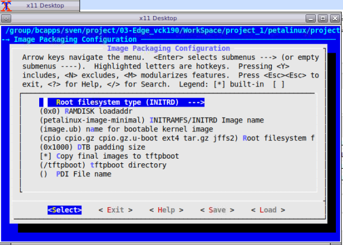

<!--
# Copyright 2020 Xilinx Inc.
#
# Licensed under the Apache License, Version 2.0 (the "License");
# you may not use this file except in compliance with the License.
# You may obtain a copy of the License at
#
#     http://www.apache.org/licenses/LICENSE-2.0
#
# Unless required by applicable law or agreed to in writing, software
# distributed under the License is distributed on an "AS IS" BASIS,
# WITHOUT WARRANTIES OR CONDITIONS OF ANY KIND, either express or implied.
# See the License for the specific language governing permissions and
# limitations under the License.
-->

## Step 2: Create the Software Components with PetaLinux

A Vitis platform requires software components. Xilinx provides common software images for quick evaluation. Here since we'd like to demonstrate more software environment customization, we'll use the PetaLinux tools to create the Linux image and sysroot with XRT support, together with some more advanced tweaks. Among all the customizations, the XRT installation and ZOCL device tree setup are mandatory. Other customizations are optional. The customization purposes are explained. Please feel free to pick your desired customization.

Yocto or third-party Linux development tools can also be used as long as they produce the same Linux output products as PetaLinux.

### Create a PetaLinux Project

1. Setup PetaLinux environment

   ```bash
   source <petaLinux_tool_install_dir>/settings.sh
   ```

2. Create a PetaLinux project named **zcu104_custom_plnx** and configure the hw with the XSA file we created before:

   ```bash
   petalinux-create --type project --template zynqMP --name zcu104_custom_plnx
   cd zcu104_custom_plnx
   petalinux-config --get-hw-description=<vivado_design_dir>  # The directory where your *.xsa file locates. if you do as step1 says strictly here, the <vivado_design_dir> is the path of <zcu104_custom_platform>
   ```

   > Note: PetaLinux will use XSA to generate the device tree. Since our hardware XSA and hardware emulation XSA have identical peripherals, giving either of them to PetaLinux makes no difference. When simplifying the hardware design for hardware emulation, it's recommended to keep all the peripherals that need device tree and drivers so that the auto-generated device tree can be reused. If the two design has different address-able peripherals, you will need to create two sets of device trees for hardware running and hardware emulation seperatedly.

   After this step, your directory hierarchy looks like this.

   ```
   - zcu104_custom_platform # Vivado Project Directory
   - zcu104_custom_plnx     # PetaLinux Project Directory
   ```

3. A petalinux-config menu would be launched, Set to use ZCU104 device tree in this configuration window.

   - Select **DTG Settings->MACHINE_NAME**
   - Modify it to ```zcu104-revc```. 
   - Select **OK -> Exit -> Exit -> Yes** to close this window.

   Note: 
   
   - If you are using a Xilinx development board it is recommended to modify the machine name so that the board configurations would be involved in the DTS auto-generation. 
   - If you're using a custom board, you would need to configure the associated settings (e.g. the PHY information DTS node) in **system-user.dtsi** manually.
   - Device tree is a generic technology in embedded Linux. Please search Google for more information.


### Customize Root File System, Kernel, Device Tree and U-boot

1. Add user packages 

   - Append the CONFIG_x lines below to the **<your_petalinux_project_dir>/project-spec/meta-user/conf/user-rootfsconfig** file.

   **Note: This step is not a must but it makes it easier to find and select all required packages in next step. If this step is skipped, please enable the required packages one by one in next step.**

   Packages for base XRT support:

    ```
   CONFIG_xrt
    ```
    - xrt is required for Vitis acceleration flow. The dependency packages such as ZOCL driver module will be added automatically.

   Recommended Packages for easy system management

    ```
   CONFIG_dnf
   CONFIG_e2fsprogs-resize2fs
   CONFIG_parted
   CONFIG_resize-part
    ```
    - dnf is for package management
    - parted, e2fsprogs-resize2fs and resize-part can be used for ext4 partition resize. We will use it to expand the ext4 partition to make full use of SD card size when running Vitis-AI test case in [Step 4](./step4.md).

    *Packages for Vitis-AI dependencies support:*

    ```
   CONFIG_packagegroup-petalinux-vitisai
    ```

   *Optional Packages for natively building Vitis AI applications on target board:*

    ```
   CONFIG_packagegroup-petalinux-self-hosted
   CONFIG_cmake
   CONFIG_packagegroup-petalinux-vitisai-dev
   CONFIG_xrt-dev
   CONFIG_opencl-clhpp-dev
   CONFIG_opencl-headers-dev
   CONFIG_packagegroup-petalinux-opencv
   CONFIG_packagegroup-petalinux-opencv-dev
    ```

    *Optional Packages for running Vitis-AI demo applications with GUI*

    ```
    CONFIG_mesa-megadriver
    CONFIG_packagegroup-petalinux-x11
    CONFIG_packagegroup-petalinux-v4lutils
    CONFIG_packagegroup-petalinux-matchbox
    ```

2. Enable selected rootfs packages

   - Run `petalinux-config -c rootfs` 
   - Select **User Packages**
   - select name of rootfs all the libraries listed above.

   

   Note: If step 1 is skipped, please find the corresponding package and enable them.

3. Enable OpenSSH and disable dropbear (optional)
   
   Dropbear is the default SSH tool in Vitis Base Embedded Platform. If OpenSSH is used to replace Dropbear, the system could achieve 4x times faster data transmission speed over ssh (tested on 1Gbps Ethernet environment). Since Vitis-AI applications may use remote display feature to show machine learning results, using OpenSSH can improve the display experience.*

   - Still in the RootFS configuration window, go to root directory by select **Exit** once.
   - Go to **Image Features**.
   - Disable **ssh-server-dropbear** and enable **ssh-server-openssh** and click Exit.
   
   

   - Go to **Filesystem Packages-> misc->packagegroup-core-ssh-dropbear** and disable **packagegroup-core-ssh-dropbear**. 
   - Go to **Filesystem Packages** level by Exit twice.
   - Go to **console  -> network -> openssh** and enable **openssh**, **openssh-sftp-server**, **openssh-sshd**, **openssh-scp**. 
   - Go to root level by **Exit** four times.

4. Enable Package Management

   Package management feature can allow the board to install and upgrade software packages on the fly.

   - In rootfs config go to **Image Features** and enable **package-management** and **debug_tweaks** option 
   - Click **OK**, **Exit** twice and select **Yes** to save the changes.

5. Disable CPU IDLE in kernel config (Recommended during debugging).

   CPU IDLE would cause processors get into IDLE state (WFI) when the processor is not in use. When JTAG is connected, the hardware server on host machine talks to the processor regularly. If it talks to a processor in IDLE status, the system will hang because of incomplete AXI transactions. So it is recommended to disable the CPU IDLE feature during project development phase. It can be re-enabled after the design has completed to save power in final products.

   - Launch kernel config: `petalinux-config -c kernel`
   - Ensure the following items are **TURNED OFF** by entering 'n' in the [ ] menu selection:
     - **CPU Power Management > CPU Idle > CPU idle PM support**
     - **CPU Power Management > CPU Frequency scaling > CPU Frequency scaling**
   - Exit and Save.


### Update the Device tree

Device tree describes the hardware components of the system. Xilinx device tree generator (DTG) can generate the device tree according to hardware configurations from XSA file. User needs to add customization settings in system-user.dtsi for PetaLinux to consume if there are any settings not available in XSA, for example, any driver nodes that don't have a corresponding hardware, or if user need to override any DTG auto-generated configurations. 

ZOCL driver module has no associated hardware, but it's required by XRT and Vitis acceleration flow. It requires a device tree node to describe the interrupt signal relationship. In previous Vitis and PetaLinux versions, users need to add ZOCL device tree node manually. From 2021.1, PetaLinux can add ZOCL device tree node automatically if the XSA is a Vitis extensible platform project.

Device Tree Generator (DTG) also overrides the interrupt controller (axi_intc_0) input numbers parameter from 0 to 32 because in the platform XSA the interrupt controller inputs have not been connected but they will be connected after v++ links the acceleration kernels.

You can review the PetaLinux generated device tree in **project-spec/components/device-tree/device-tree/pl.dtsi** file.

You can also add your custom device tree modifications to **project-spec/meta-user/recipes-bsp/device-tree/files/system-user.dtsi**. In this example, we setup sdhci1 to low speed mode.

```
&sdhci1 {
      no-1-8-v;
      disable-wp;
};
```

   - **sdhci1** node decreases SD Card speed for better card compatibility on ZCU104 board. This only relates to ZCU104. It's not a part of Vitis acceleration platform requirements.

   **Note**: an example file is provided in [ref_files/step2_petalinux/system-user.dtsi](ref_files/step2_petalinux/system-user.dtsi).


### Add EXT4 rootfs support 

It's recommended to use EXT4 for Vitis acceleration designs. PetaLinux uses initramfs format for rootfs by default. It can't retain the rootfs changes in run time. Initramfs keeps rootfs contents in DDR, which makes user useable DDR memory reduced. To make the root file system retain changes and to enable maximum usage of available DDR memory, we'll use EXT4 format for rootfs in second partition while keep the first partition FAT32 to store the boot files.

Vitis-AI applications will install additional software packages. If user would like to run Vitis-AI applications, please use EXT4 rootfs. If in any case initramfs would be used, please add all Vitis-AI dependencies to initramfs.

1. Let PetaLinux generate EXT4 rootfs

   - Run `petalinux-config`
   - Go to **Image Packaging Configuration**
   - Enter into **Root File System Type** 
   - Select Root File System Type as **EXT4**
   - Exit and Save.

   

<!--TODO: CMA change is needed. Other changes are not.-->
2. Let Linux use EXT4 rootfs during boot

   The setting of which rootfs to use during boot is controlled by **bootargs**. We would change bootargs settings to allow Linux to boot from EXT4 partition. There are various ways to update bootargs. Please take either way below.
   
   Method A: PetaLinux config

   - Run `petalinux-config`
   - Change **DTG settings -> Kernel Bootargs -> generate boot args automatically** to NO and update **User Set Kernel Bootargs** to `earlycon console=ttyPS0,115200 clk_ignore_unused root=/dev/mmcblk0p2 rw rootwait cma=512M`. Click OK, Exit thrice and Save.
   
   Method B: device tree

   - Update in  **system-user.dtsi**
   - Add `chosen` node in root in addition to the previous changes to this file.
   ```
   /include/ "system-conf.dtsi"
   / {
	   chosen {
	   	bootargs = "earlycon console=ttyPS0,115200 clk_ignore_unused root=/dev/mmcblk0p2 rw rootwait cma=512M";
	   };
   };
   ```
  
   Note:
  
   - **root=/dev/mmcblk0p2** means to use second partition of SD card, which is the EXT4 partition.
   - Please note that we also set these options in bootargs:
     - **clk_ignore_unused**: it tells Linux kernel don't turn off clocks if this clock is not used. It's useful clocks that only drives PL kernels because PL kernels are not represented in device tree.
     - **cma=512M**: CMA is used to exchange data between PS and PL kernel. The size for CMA is determined by PL kernel requirements. Vitis-AI/DPU needs at least 512MB CMA.

### Build PetaLinux Images

1. From any directory within the PetaLinux project, build the PetaLinux project.

   ```
   petalinux-build
   ```

   The PetaLinux image files will be generated in <PetaLinux Project>/images/linux directory.

2. Create a sysroot self-installer for the target Linux system

   ```
   petalinux-build --sdk
   ```

   The generated sysroot package **sdk.sh** will be located in <PetaLinux Project>/images/linux directory. We'll extract it in next step.


### Fast Track

Scripts are provided to re-create PetaLinux project and generate outputs. To use these scripts, please run the following steps.

1. Run build

   ```
   # cd to the step directory, e.g.
   cd step2_petalinux
   make all
   ```

2. To clean the generated files, please run

   ```bash
   make clean
   ```

Note: The Fast Track scripts extracts the sysroot to <PetaLinux Project>/images/linux directory. It's different than the step-by-step instructions for the convenience of scripting.

### Next Step

Note: Now HW platform and SW platform are all generated. Next we would [package the Vitis Platform](step3.md).

<p align="center"><sup>Copyright&copy; 2021 Xilinx</sup></p>
