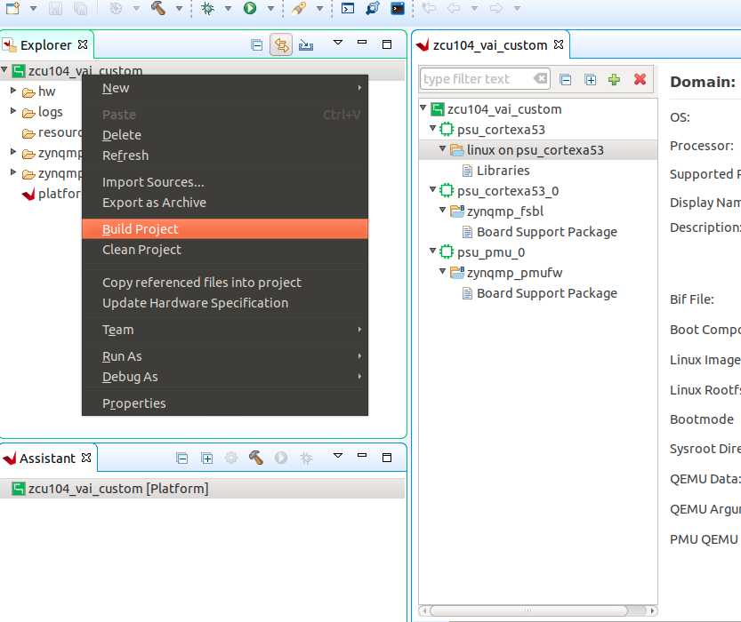
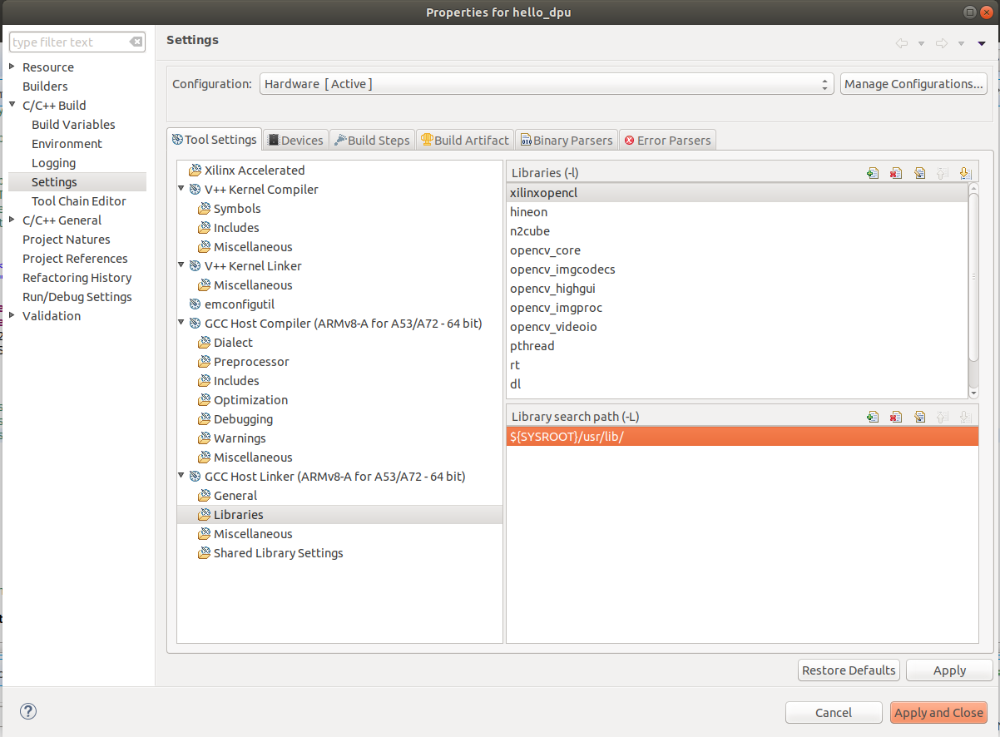
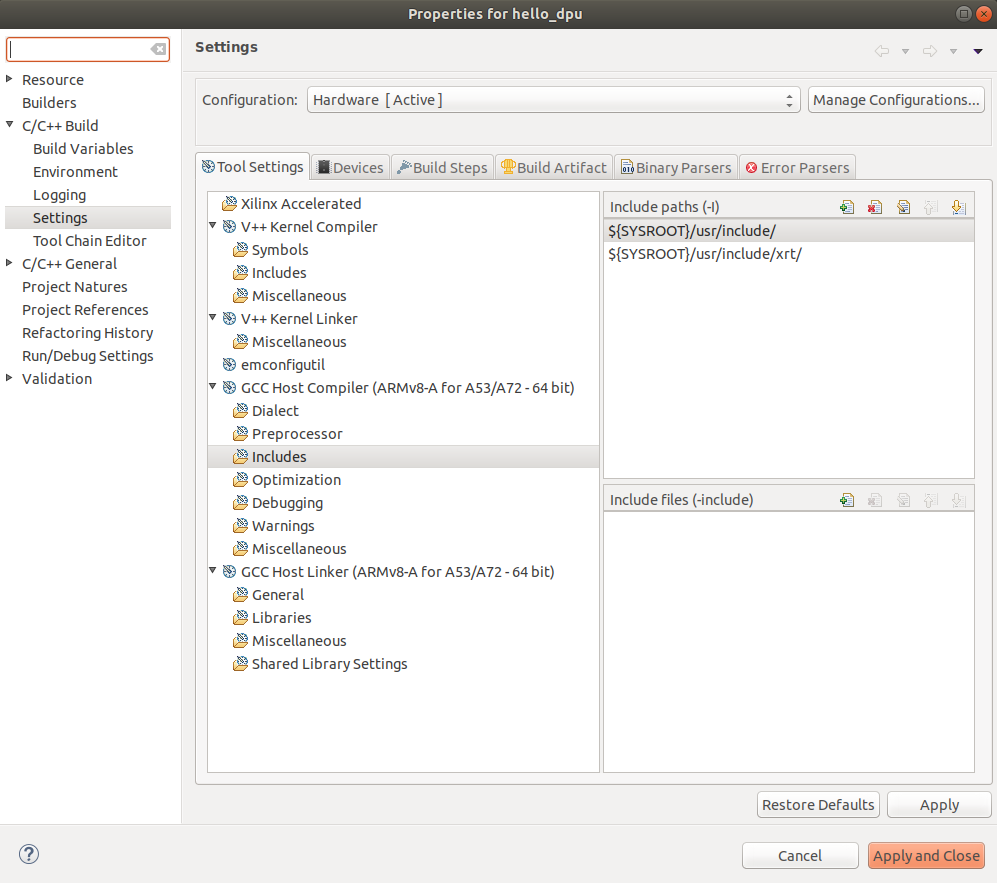

## Step 4: Test the Platform

### Test 1: Read Platform Info

With Vitis environment setup, platforminfo tool can report XPFM platform information.

```
# in zcu104_custom_pkg directory
platforminfo ./zcu104_custom/export/zcu104_custom/zcu104_custom.xpfm
==========================
Basic Platform Information
==========================
Platform:           zcu104_custom
File:               /scratch/rickys/work/idt_platform/zcu104_custom_pkg/zcu104_custom/export/zcu104_custom/zcu104_custom.xpfm
Description:
zcu104_custom


=====================================
Hardware Platform (Shell) Information
=====================================
Vendor:                           xilinx
Board:                            zcu104_custom_platform
Name:                             zcu104_custom_platform
Version:                          0.0
Generated Version:                2020.1
Software Emulation:               1
Hardware Emulation:               0
FPGA Family:                      zynquplus
FPGA Device:                      xczu7ev
Board Vendor:                     xilinx.com
Board Name:                       xilinx.com:zcu104:1.1
Board Part:                       xczu7ev-ffvc1156-2-e
Maximum Number of Compute Units:  60

=================
Clock Information
=================
  Default Clock Index: 0
  Clock Index:         2
    Frequency:         100.000000
  Clock Index:         0
    Frequency:         200.000000
  Clock Index:         1
    Frequency:         400.000000

==================
Memory Information
==================
  Bus SP Tag: HP0
  Bus SP Tag: HP1
  Bus SP Tag: HP2
  Bus SP Tag: HP3
  Bus SP Tag: HPC0
  Bus SP Tag: HPC1
=======================
Feature ROM Information
=======================
=============================
Software Platform Information
=============================
Number of Runtimes:            1
Default System Configuration:  zcu104_custom
System Configurations:
  System Config Name:                      zcu104_custom
  System Config Description:               zcu104_custom
  System Config Default Processor Group:   linux_domain
  System Config Default Boot Image:        standard
  System Config Is QEMU Supported:         0
  System Config Processor Groups:
    Processor Group Name:      linux on psu_cortexa53
    Processor Group CPU Type:  cortex-a53
    Processor Group OS Name:   linux
  System Config Boot Images:
    Boot Image Name:           standard
    Boot Image Type:
    Boot Image BIF:            zcu104_custom/boot/linux.bif
    Boot Image Data:           zcu104_custom/linux_domain/image
    Boot Image Boot Mode:      sd
    Boot Image RootFileSystem:
    Boot Image Mount Path:     /mnt
    Boot Image Read Me:        zcu104_custom/boot/generic.readme
    Boot Image QEMU Args:
    Boot Image QEMU Boot:
    Boot Image QEMU Dev Tree:
Supported Runtimes:
  Runtime: OpenCL
```

We can verify clock information and memory information are set as expected.


### Test 2: Run Vector Addition Application

Vector addition is the simplest acceleration PL kernel. Vitis can create this application automatically. Running this test can check the AXI control bus, memory interface and interrupt setting in platform are working properly.

#### Creating Vector Addition Application

1. Open Vitis workspace you were using before.<br />
2. Select ***File -> New -> Application Project***.<br />
3. Click ***next***<br />
4. Select ***zcu104_custom*** as platform, click ***next***.<br />
5. Name the project ***vadd***, click ***next***.<br />
6. Set Domain to ***linux on psu_cortexa53***, set ***Sys_root path*** to ```<full_pathname_to_zcu104_custom_pkg>/pfm/sysroots/aarch64-xilinx-linux```(as you created by running ***sdk.sh***). Set the ***Root FS*** to rootfs.ext4 and ***Kernel Image*** to Image. These files are generated in Step 2. click ***next***.<br />
7. Select ***System Optimization Examples -> Vector Addition*** and click ***finish*** to generate the application.<br />
8. In the Explorer window double click the ***vadd.prj*** file to open it, change the ***Active Build configuration*** from ***Emulation-SW*** to ***Hardware***.<br />
9. Select ***vadd_system*** in Explorer window and Click ***Build*** icon in toolbar.

***Note***: If you cannot see the ***zcu104_custom*** platform we created, we can add it to platform list of New Project Wizard by selecting the add button and point to ***zcu104_custom_pkg/zcu104_custom*** directory.

***Note***: If you'd like to test this application in emulation mode, plese change  ***Active Build configuration*** from ***Emulation-SW*** to ***Emulation-HW*** on Step 8.

#### Running Vector Addition Application on the Board

1. Copy ***zcu104_custom_pkg/vadd_system/Hardware/package/sd_card.img*** to local if Vitis is running on a remote server.

2. Write ***sd_card.img*** into SD Card with SD Card image writer applications like Etcher on Windows or dd on Linux.

3. Boot ZCU104 board with the SD card in SD boot mode.

4. Login with username ***root*** and password ***root***.

5. Go to auto mounted FAT32 partition

   ```bash
   cd /mnt/sd-mmcblk0p1
   ```

6. Initialize XRT running environment

   ```bash
   source ./init.sh
   ```

7. Run vadd appliation

   ```bash
   ./vadd vadd.xclbin
   ```

8. It should show program prints and XRT debug info.

   ```
   TEST PASSED
   ```

### Test Vector Addition Application in Emulation Mode

***Note***: If you're on Ubuntu, set environment variable LIBRARY_PATH to /usr/lib to workaround a known issue on Vitis 2020.1. It's fixed in 2020.2.

```
export LIBRARY_PATH=/usr/lib
```

1. Use ***Vitis menu -> Xilinx -> Start/Stop Emulator*** to launch QEMU. Project is vadd, configuration is Emulation-HW. Click Start. Wait for Linux to boot. Log in with root/root.
2. Righ click ***vadd*** project (not the vadd_system system project), select ***Run as -> Launch on Emulator***

The result will show on Console tab.

```
Loading: './binary_container_1.xclbin'
TEST PASSED
```


### Test 3: Run a DNNDK Demo

This test will run a simple DNNDK test application to test DPU function.

#### Prepare for the DPU Kernel

1. Download Vitis AI by calling command ```git clone https://github.com/Xilinx/Vitis-AI.git```.<br />
2. Navigate to the repository:```cd Vitis-AI```, set the tag to proper tag(here we use **v1.2**) by typing: ```git checkout v1.2```.<br />
3. If you don't want to destroy the TRD reference design. Copy ***DPU-TRD*** folder into another directory. For example I would copy that into my ***zcu104_custom_pkg*** folder: ```cp -r DPU-TRD ./zcu104_custom_pkg/```<br />
4. Source Vitis tools setting sh file: ```source <vitis install path>/Vitis/2020.1/settings64.sh```.<br />
5. Source XRT sh file:```source opt/xilinx/xrt/setup.sh```.<br />
6. Export ***PLATFORM_REPO_PATHS*** with the directory of the custom platform xpfm file which you created before so that it can be found by Vitis. Here in my project it would be: ```export PLATFORM_REPO_PATHS=<path_to/zcu104_custom_pkg/zcu104_custom/export/zcu104_custom>```. Remember now this custom platform name is ***zcu104_custom***.<br />
7. Navigate to the copy of the ***DPU-TRD*** folder, then go to the ***./prj/Vitis*** folder.<br />
   There are 2 files can be used to modify the DPU settings: The ***config_file/prj_config*** file is for DPU connection in Vitis project and the ***dpu_conf.vh*** is for other DPU configurations. Here we would modify the ***prj_config*** so that 2 DPU cores are enabled. And then we modify ***dpu_conf.vh*** as [DPU-TRD readme](https://github.com/Xilinx/Vitis-AI/blob/v1.2/DPU-TRD/README.md) suggested.<br />
8. Modify the ***config_file/prj_config*** like below:<br />

```
[clock]

id=0:DPUCZDX8G_1.aclk
id=1:DPUCZDX8G_1.ap_clk_2
id=0:DPUCZDX8G_2.aclk
id=1:DPUCZDX8G_2.ap_clk_2

[connectivity]

sp=DPUCZDX8G_1.M_AXI_GP0:HPC0
sp=DPUCZDX8G_1.M_AXI_HP0:HP0
sp=DPUCZDX8G_1.M_AXI_HP2:HP1
sp=DPUCZDX8G_2.M_AXI_GP0:HPC1
sp=DPUCZDX8G_2.M_AXI_HP0:HP2
sp=DPUCZDX8G_2.M_AXI_HP2:HP3

[advanced]
misc=:solution_name=link
#param=compiler.addOutputTypes=sd_card

#param=compiler.skipTimingCheckAndFrequencyScaling=1

[vivado]
prop=run.impl_1.strategy=Performance_Explore
#param=place.runPartPlacer=0

```

​	Here clock ID 0 is 200MHz, clock ID 1 is 400MHz.

​	This file describes the link connections between DPU and the platform. It will be used by Vitis application in next step.

​	***Note***: an example of prj_config file is provided in ***ref_files/step4_test3/app_src***.

9. Modify ***dpu_conf.vh*** to enable URAM because ZU7EV device on ZCU104 board has URAM resources. Change from:<br />

```
`define URAM_DISABLE
```

to<br />

```
`define URAM_ENABLE
```

10. Generate the XO file by typing: ```make binary_container_1/dpu.xo DEVICE=zcu104_custom```.<br />
11. Verify if the XO file is generated here: ***<zcu104_custom_pkg directory>/DPU-TRD/prj/Vitis/binary_container_1/dpu.xo***.<br />

#### Create and Build a Vitis Application

1. Open Vitis workspace you were using before.<br />
2. Select ***File -> New -> Application Project***.<br />
3. Click ***next***<br />
4. Select ***zcu104_custom*** as platform, click ***next***.<br />
5. Name the project ```hello_dpu```, click ***next***.<br />
6. Set Domain to ***linux on psu_cortexa53***
7. Set ***Sys_root path*** to ```<full_pathname_to_zcu104_custom_pkg>/pfm/sysroots/aarch64-xilinx-linux```(as you created by running ***sdk.sh***)
8. Set the ***Kernel Image*** to ***zcu104_custom_plnx/images/linux/Image***
9. Set Root Filesystem to ***zcu104_custom_plnx/images/linux/rootfs.ext4*** and click ***next***.<br />
10. Select ***System Optimization Examples -> Empty application*** and click ***finish*** to generate the application.<br />
11. Right click on the ***src*** folder under your ***hello_dpu*** application  in the Explorer window, and select "Import Sources"
      <br /><br />
12. Choose from directory ***<zcu104_custom_pkg directory>/DPU-TRD/prj/Vitis/binary_container_1/*** as the target location, and import the ***dpu.xo*** file that we just created.<br />
13. Import sources again, and add all files from ***ref_files/step4_test3/app_src*** folder provided by this Git repository, including prj_config.
14. In the Explorer window double click the hello_dpu.prj file to open it, change the ***Active Build configuration*** from ***Emulation-SW*** to ***Hardware***.<br />
15. Under Hardware Functions, click the lightning bolt logo to ***Add Hardware Function***.<br />
    <br /><br />
16. Select the "DPUCZDX8G" included as part of the dpu.xo file that we included earlier.<br />
17. Click on binary_container_1 to change the name to dpu.<br />
18. Click on ***DPUCZDX8G*** and change the ***Compute Units*** from ```1``` to ```2``` because we have 2 dpu cores involved.<br />
19. Right click on "dpu", select ***Edit V++ Options***, add ```--config ../src/prj_config -s``` as ***V++ Options***, then click ***OK***.<br />
20. Go back to the ***Explorer*** window, right click on the ***hello_dpu*** project folder select ***C/C++ Building Settings***.<br />
21. In ***Properties for hello_dpu*** dialog box, select ***C/C++ Build->Settings->Tool Settings->GCC Host Linker->Libraries***
    , click the green "+" to add the following libraries:

```
opencv_core
opencv_imgcodecs
opencv_highgui
opencv_imgproc
opencv_videoio
n2cube
hineon
```

18. In the same page, Check the ***Library search path*** to makesure the ```${SYSROOT}/usr/lib/``` is added, click ***Apply***<br />
    <br /><br />
19. Then go to ***C/C++ Build->Settings->Tool Settings->GCC Host Compiler->Includes***, remove the HLS include directory and add ```${SYSROOT}/usr/include/``` like below, then click ***Apply and Close*** to save the changes.<br />
    These steps are used to make sure your application can call libs in rootfs directly on Vitis application build***
20. Right click the ***hello_dpu*** project folder and select ***Build Project***<br />

#### Prepare the Network Deployment File

1. Find HWH file from your Vitis application folder ***hello_dpu/Hardware/dpu.build/link/vivado/vpl/prj/prj.srcs/sources_1/bd/system/hw_handoff/system.hwh***<br />
   Or go to your Vitis application folder use command ```find -name *.hwh``` to search for the file.<br />
2. Copy the ***ref_files/step4_test3/Tool-Example*** folder provided by this Github repository to your Vitis AI download directory.<br />
3. Copy this HWH file into ***<Vitis-AI-download_directory>/Tool-Example*** folder.<br />
4. Go to ***<Vitis-AI-download_directory>*** folder and launch the docker.

```
./docker_run.sh xilinx/vitis-ai:latest
```

5. Use following command to activate TensorFlow tool conda environment:<br />

```
conda activate vitis-ai-tensorflow
```

6. Go to ***/workspace/Tool-Example*** folder and run ```dlet -f ./system.hwh```.<br />
   You should get the running log like below:

```
$ dlet -f ./system.hwh
[DLet]Generate DPU DCF file dpu-06-18-2020-12-00.dcf successfully.<br />
```

7. Open the ***arch.json*** file and make sure the ***"dcf"*** parameter is set with the name you got on the previous step:<br />
   ```"dcf"      : "./dpu-06-18-2020-12-00.dcf",```<br />
8. Run command ```sh download_model.sh``` to download the Xilinx Model Zoo files for resnet-50.<br />
9. Run command ```sh custom_platform_compile.sh```, you'll get the result at ***tf_resnetv1_50_imagenet_224_224_6.97G/vai_c_output_ZCU104/dpu_resnet50_0.elf*** .<br />
10. Copy that file to the ***src*** folder of Vitis application ***hello_dpu***<br />
11. Right click on the ***hello_dpu*** project folder in Vitis select ***C/C++ Building Settings**.<br />
12. In ***Properties for Hello_DPU*** dialog box, select ***C/C++ Build->Settings->Tool Settings->GCC Host Linker->Miscellaneous->Other objects***, add a new object: ```${workspace_loc:/${ProjName}/src/dpu_resnet50_0.elf}```, click ***Apply and Close***.<br />
13. Right click the ***hello_dpu*** project folder and select ***Build Project***<br />
    ***Now you should get an updated hello_dpu with a size of about 20MB(the ConvNet model is involved).***

#### Run Application on Board

1. If you have run Test 2 vadd application, copy all the files from ***sd_card folder*** inside your Vitis application like ***<hello_dpu_application_directory>/Hardware/sd_card/*** to SD card FAT32 partition. It's not necessary to write sd_card.img again because the EXT4 partition is the same.

   If you haven't run Test 2 vadd application, please copy ./hello_dpu_system/Hardware/package/sd_card.img to local and write it to SD card with tools like Etcher on Windows or dd on Linux.

2. Download dnndk installer [vitis-ai_v1.2_dnndk.tar.gz](https://www.xilinx.com/bin/public/openDownload?filename=vitis-ai_v1.2_dnndk.tar.gz) , dnndk sample image package [vitis-ai_v1.2_dnndk_sample_img.tar.gz](https://www.xilinx.com/bin/public/openDownload?filename=vitis-ai_v1.2_dnndk_sample_img.tar.gz)  and [DPU specific board optimization scripts](https://github.com/Xilinx/Vitis-AI/raw/b3773aa2f21ca9afaa9656ce7ec3f74242eb74f1/DPU-TRD/app/dpu_sw_optimize.tar.gz
   cp ) to host and copy them to FAT32 partition on SD card. For more information about these packages, please refer to  [DNNDK example readme file](https://github.com/Xilinx/Vitis-AI/blob/v1.2/mpsoc/README.md)

3. Set ZCU104 to SD boot mode and boot up the board, connect the board with serial port.<br />

4. Connect SSH:<br />
   a) Connect Ethernet cable.

   b) Run ```ifconfig``` on ZCU104 board to get the IP address, here we take ```172.16.75.189``` as example.<br />c) Using SSH terminal to connect ZCU104 with SSH: ```ssh -x root@172.16.75.189```, or use MobaXterm in Windows.<br />

5. Go to auto-mounted SD card partition /mnt/sd-mmcblk0p1 folder and copy these files to home directory

   ```
   cd /mnt/sd-mmcblk0p1
   cp dpu_sw_optimize.tar.gz vitis-ai_v1.2_dnndk.tar.gz vitis-ai_v1.2_dnndk_sample_img.tar.gz ~
   ```

6. Run DPU Software Optimization

   ```bash
   cd ~
   tar -xzf dpu_sw_optimize.tar.gz
   cd dpu_sw_optimize/zynqmp/
   ./zynqmp_dpu_optimize.sh
   ```

   It will show the optimization results

   ```
   Auto resize ext4 partition ...[✔]
   Start QoS config ...[✔]
   Config PMIC irps5401 ...Successful[✔]
   ```

   - Auto resize scripts expands the EXT4 partition to rest of the SD card so that we can store more contents.

   - QoS config makes AXI interface for DPU has higher priority.

   - PMIC config makes ZCU104 can use more power when running Vitis-AI applications.

7. Install DNNDK package like below:<br />

   ```
   tar -zxvf vitis-ai_v1.2_dnndk.tar.gz
   cd vitis-ai_v1.2_dnndk/
   ./install.sh
   ```

   ***install.sh*** copies ***dpu.xclbin*** from FAT32 partition to /usr/lib because DNNDK requires xclbin to be placed in this location.

   ***Note: Vitis-AI Library has the similar installation method. Please refer to Vitis-AI user guide for more info.***

8. Extract vitis_ai_dnndk_samples and put hello_dpu into it:

   ```
   cd ~
   tar -zxvf vitis-ai_v1.2_dnndk_sample_img.tar.gz
   cd vitis_ai_dnndk_samples
   mkdir test
   cd test
   cp /mnt/sd-mmcblk0p1/hello_dpu ./
   ./hello_dpu
   ```

   ***We store the hello_dpu to vitis_ai_dnndk_samples/test folder to suit the relative path in my code, you can do that according to your code context. The hello_dpu is generated in Vitis application build and was copied to sd card from previous operation.***<br />

9. You should see the result like below:<br />
   

<p align="center"><sup>Copyright&copy; 2020 Xilinx</sup></p>
