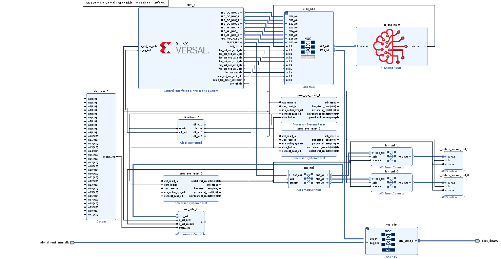

<!-- 
# Copyright 2020 Xilinx Inc.
# 
# Licensed under the Apache License, Version 2.0 (the "License");
# you may not use this file except in compliance with the License.
# You may obtain a copy of the License at
#
#     http://www.apache.org/licenses/LICENSE-2.0
#
# Unless required by applicable law or agreed to in writing, software
# distributed under the License is distributed on an "AS IS" BASIS,
# WITHOUT WARRANTIES OR CONDITIONS OF ANY KIND, either express or implied.
# See the License for the specific language governing permissions and
# limitations under the License.
-->


<table width="100%">
 <tr width="100%">
    <td align="center"><h1>Versal Custom Platform Creation Tutorial</h1>
    </td>
 </tr>
</table>

## Step 0: Create a Base Bootable Design for VCK190

The purpose of step 0 is to provide a good baseline for platform creation.

There are various ways to create a starting point for Versal design. In this tutorial, we'll configure the CIPS and NOC block with Vivado Customizable Example Design. Since the example design has been validated by Xilinx, We will skip testing the base bootable design. For custom board or custom designs, please create a normal Vivado project (not Vitis Platform Project) and validate the design with instructions in [Custom Board Additional Steps](#custom-board-additional-steps)


### VCK190 ES1 Setup

**Note**: If you're using production VCK190 board, please skip this step.

<details>
  <summary><b>Show VCK190 ES1 Setup Steps</b></summary>


#### VCK190 ES1 Setup: Enable Versal ES Devices


Edit your `<Vivado_Installation_Path>/scripts/Vivado_init.tcl` and `<Vivado_Installation_Path>/scripts/hls_init.tcl` to add the following line:

```
enable_beta_device xcvc*
```

#### VCK190 ES1 Setup: Download VCK190 ES1 board file

**Note**: If you're using production VCK190 board, please skip this step.

1. Launch Vivado

   - Run `source <Vitis_Install_Directory>/settings64.sh` to setup Vivado running environment
   - Run Vivado by typing `vivado` in the console.

2. Download VCK190 ES1 board file

   - Click **Tools -> XHUB Store**
   - Click **OK** to agree with the information.
   - Go to **Board** tab
   - Expand **Evaluation Boards**
   - Select **Versal VCK190 ES1 Evaluation Platform**
   - Click **Install** button
   - Click **Close** to close the window 

</details>


### Create Versal Extensible Embedded Platform Example Design

1. Launch Vivado if you haven't

   - Run `source <Vitis_Install_Directory>/settings64.sh` to setup Vivado running environment
   - Run Vivado by typing `vivado` in the console.

2. Download Versal Extensible Embedded Platform Example

   - Click menu **Tools -> Vivado Store..**
   - Click **OK** to agree to download open source examples from web
   - Select **Platform -> Versal Extensible Embedded Platform** and click the download button on the tool bar
   - Click **Close** after installation complete.

   

3. Create the Versal Extensible Embedded Platform Example project

   - Click **File -> Project -> Open Example**
   - Select **Versal Extensible Embedded Platform** in Select Project Template window.
   - Input **project name** and **project location**. Keep **Create project subdirectory** checked. Click **Next**.
   - Select target board in Default Part window. In this example, we use **Versal VCK190 Evaluation Platform** or **Versal VCK190 ES1 Evaluation Platform**. Click **Next**.

   

   - Configure Clocks Settings. You can enable more clocks, update output frequency and define default clock in this view. In this example, we can keep the default settings.
   - Configure Interrupt Settings. You can choose how many interrupt should this platform support. 63 interrupts mode will use two AXI_INTC in cascade mode. In this example, we can keep the default setting.
   - Configure Memory Settings. By default the example design will only enable DDR4. If you enable LPDDR4, it will enable both DDR4 and LPDDR4. In this example, we can keep the default setting.
   - Click **Next**.
   - Review the new project summary and click **Finish**.
   - After a while, you will see the design example has been generated.

   The generated design instantiated AI Engine, enabled DDR4 controller and connected them to CIPS. It also provides one interrupt controller, three clocks and the associated synchronous reset signals.

   

   

At this stage, the Vivado block automation has added a Control, Interface & Processing System (shorten with CIPS in the future) block, AXI NOC block, AI Engine, and all supporting logic blocks to the diagram, and applied all board presets for the VCK190. Since it's a validated design, you can go to [step1:Hardware Settings for Vitis Platform](step1.md) to review or update platform settings and skip the validation below.

***For a custom board, platform developers need to configure CIPS and NOC for processor settings and DDR settings. Please complete the following testings before going to next step.***

### Custom Board Additional Steps

When designing platforms on custom boards, we need to verify the base bootable design on board before going forward. It can help to isolate the root cause if the following platform creation steps generates any errors - whether it's bring by kernel, platform creation, or by the base design configuration.

#### Custom Board Considerations

When designing platform for a custom board, user needs to setup these parameters by themselves.

On Vivado project side, please

- Create a design based on your silicon model rather than board type. You can start from scratch, or update device after creating a design fromm Versal Extensible Platform Example.
- Make sure clock input parameters match hardware setup.
- Configure PS Peripherals: UART, SD Card, QSPI, etc.
- Write pinout location in XDC file, including clock, reset, DDR, etc.

For PetaLinux design, please

- Use default ***MACHINE_NAME***
- Update device tree in ***system_user.dtsi*** for your custom peripherals on the board, like Ethernet, EEPROM, etc.


#### (Optional) Go through Implementation and Device Image Generation

If the custom platform is created from scratch, it's recommended to run through implementation and device image generation to find errors in early stage for the base bootable design. The platform doesn't need the implementation results, the implementation is used for design validation only.

<details>
  <summary><b>Show Detailed Steps of Implementation and Device Image Generation</b></summary>

1. To run this step, please make sure the project is a normal project. **This project is a Vitis Platform project** should **NOT**  be selected during Vivado project creation. Go to **Flow Navigator -> Project Manager -> Settings**. Uncheck **This project is a Vitis Platform project** if it's enabled.

   

2. Validate the Block Design

   - Click ***Validate Design (F6)*** button in block diagram toolbar.

3. Create HDL Wrapper

   - In Sources tab, right click system.bd and select ***Create HDL Wrapper***. In the pop-up window, select ***Let Vivado Manage***.

4. Generate Device Image

   - Click ***Generate Device Image*** in Flow Navigator

   - Click ***Yes*** if it pops up a message to say *No Implementation Results Available*.

   

   - Click ***OK*** for default options for Launch Runs dialouge.

   It takes a while to generate block diagram and run through implementation.

   PDI is generated in `vck190_custom_platform.runs/impl_1/`

5. Export fixed XSA for PetaLinux project Creation

   a) Click Menu ***File -> Export -> Export Hardware***. Click Next.

   b) Select Output to ***Include Device Image***. Click Next.

   c) Set output XSA file name and directory. Click Next.

   d) Click Finish

</details>

#### (Optional) Validate PDI on Hardware

If the custom platform is created from scratch, it's recommended to test the device image (PDI) on hardware to make sure the device initialization configuration is set correctly. This is not a step required for platform creation, but it can reduce issues you find in the last platform validation stage.

To run this step, please make sure **This project is a Vitis Platform project** is **NOT** selected during platform creation.

<details>
  <summary><b>Show Detailed Steps</b></summary>

1. Connect hardware server in XSCT

   ```tcl
   # If JTAG cable is connected locally
   connect
   
   # If JTAG cable is connected on another server, launch hw_server on that server then connect to that remote hardware server
   connect -url TCP:<SERVER NAME or IP>:3121
   ```
   
   

2. Download PDI in XSCT

   ```tcl
   device program <PDI file>
   ```

   PDI program should download without errors. If any error occurs in XSCT console, please check block design settings.

   Here's the sample prints on UART console of VCK190 board

<!--TODO: update for 2021.2 log -->
<details>
  <summary><b>Show Log</b></summary>

   ```
   [8.716546]****************************************
   [10.387178]Xilinx Versal Platform Loader and Manager
   [15.181959]Release 2020.2   Nov 30 2020  -  07:20:11
   [19.889662]Platform Version: v1.0 PMC: v1.0, PS: v1.0
   [24.684093]BOOTMODE: 0, MULTIBOOT: 0x0
   [28.172159]****************************************
   [32.817343] 28.506881 ms for PrtnNum: 1, Size: 2224 Bytes
   [37.939565]-------Loading Prtn No: 0x2
   [41.975581] 0.531603 ms for PrtnNum: 2, Size: 48 Bytes
   [46.307975]-------Loading Prtn No: 0x3
   [153.848428] 104.031565 ms for PrtnNum: 3, Size: 57168 Bytes
   [156.392071]-------Loading Prtn No: 0x4
   [159.994956] 0.012506 ms for PrtnNum: 4, Size: 2512 Bytes
   [165.110546]-------Loading Prtn No: 0x5
   [168.715028] 0.014362 ms for PrtnNum: 5, Size: 3424 Bytes
   [173.831756]-------Loading Prtn No: 0x6
   [177.430206] 0.007693 ms for PrtnNum: 6, Size: 80 Bytes
   [182.427400]+++++++Loading Image No: 0x2, Name: pl_cfi, Id: 0x18700000
   [188.652918]-------Loading Prtn No: 0x7
   [1564.072421] 1371.823162 ms for PrtnNum: 7, Size: 707472 Bytes
   [1566.876806]-------Loading Prtn No: 0x8
   [1956.351062] 385.792100 ms for PrtnNum: 8, Size: 365712 Bytes
   [1959.102465]+++++++Loading Image No: 0x3, Name: fpd, Id: 0x0420C003
   [1965.172668]-------Loading Prtn No: 0x9
   [1969.287834] 0.436437 ms for PrtnNum: 9, Size: 992 Bytes
   [1974.032078]***********Boot PDI Load: Done*************
   [1979.057962]55080.597596 ms: ROM Time
   [1982.528018]Total PLM Boot Time
   ```
</details>

If the PDI can't load successfully, please check the CIPS configuration. 

</details>


#### (Optional) Create PetaLinux Project

If the custom platform is created from scratch, it's recommended to test building the PetaLinux image and run on hardware before turning this project into a platform project. This is not a step required for platform creation, but it can reduce issues you find in the step 2 - software preparation.

To run this step, please make sure **This project is a Vitis Platform project** is **NOT** selected during platform creation.

<details>
  <summary><b>Show Detailed Steps</b></summary>

For a quick demonstration in this step, we'll use VCK190 pre-built device tree. It helps to setup peripheral properties, such as Ethernet MAC phy address, etc. These settings are specific to each board. It needs BSP engineers to develop during board bring up phase for custom boards.

1. Create PetaLinux Project with XSA

   ```bash
   petalinux-create -t project --template versal --force -n petalinux
   cd petalinux
   petalinux-config --get-hw-description=<path to xsa directory> --silentconfig
   ```

   - The created PetaLinux project name is ***petalinux***. Please feel free to change the PetaLinux project name with ***petalinux-create -n*** option.
   - The XSA used for PetaLinux needs to be a post implementation XSA.

2. Apply VCK190 device tree

   - Run `petalinux-config`
   - Go to ***DTG Settings***
   - Enter ***versal-vck190-reva-x-ebm-02-reva*** for ***MACHINE_NAME*** option (CONFIG_SUBSYSTEM_MACHINE_NAME)
   
   Note: This preset device setting will add ethernet PHY info to device tree. The [device tree source code][1] will be applied to the PetaLinux project.

[1]: https://github.com/Xilinx/u-boot-xlnx/blob/master/arch/arm/dts/versal-vck190-revA-x-ebm-02-revA.dts

3. Build PetaLinux Image

   ```bash
   petalinux-build
   petalinux-package --boot --u-boot
   ```

   Output ***BOOT.BIN***, ***boot.scr*** and ***image.ub*** are located in ***images/linux*** directory.


4. Validate PetaLinux image on Board

   - Copy ***BOOT.BIN***, ***image.ub*** and ***boot.scr*** from **build/petalinux/images/linux** directory to SD card (fat32 partition).
   - Insert SD card to VCK190, set boot mode to SD boot (0001) and boot the board.
   - Make sure Linux boot successfully. Login with username: root, password: root

</details>
<!--For Create PetaLinux Project-->


### Fast Track

Scripts are provided to re-create projects and generate outputs in each step. To use these scripts, please run the following steps.

1. Run build

   ```bash
   # cd to the step directory, e.g.
   cd step0_bootable_design
   make all
   ```
   
2. To clean the generated files, please run

   ```bash
   make clean
   ```
This script downloads the VCK190 ES1 board support and the Versal Extensible Design example to local repository and creates the example design, generate block diagram and export XSA.

   

A top level all in one build script is also provided. To build everything (step 0 to step 4) with one command, please go to ***ref_files*** directory and run

```bash
make all
```

To clean all the generated files, please run

```bash
make clean
```

#### Change the Vivado design to Vitis Platform Design

From next step, we will begin to setup the platform properties. It needs the Vivado design to be a Vitis Platform design. 

- Go to **Flow Navigator** window
- Click **Settings** in **Project Manager**
- Go to **Project Settings -> General**, enable **Project is an extensible Vitis platform**

### Next Step

Now we have a base bootable design. Next we'll go to [step 1 to update the Vivado design for hardware platform requirements](./step1.md).


## References

https://github.com/Xilinx/XilinxBoardStore/wiki/Accessing-the-Board-Store-Repository

<p align="center"><sup>Copyright&copy; 2021 Xilinx</sup></p>
