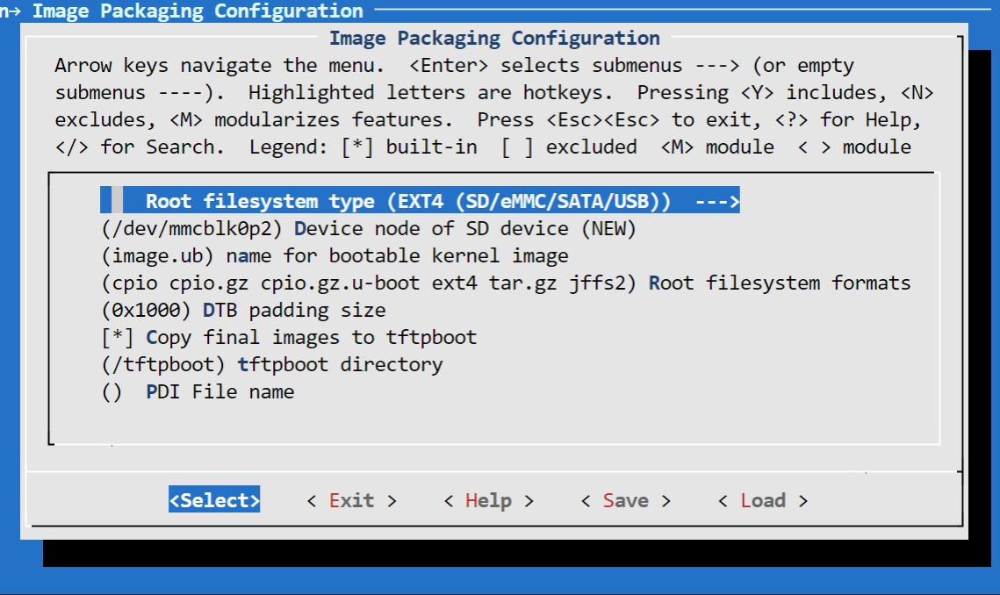

<!-- 
# Copyright 2021 Xilinx Inc.
# 
# Licensed under the Apache License, Version 2.0 (the "License");
# you may not use this file except in compliance with the License.
# You may obtain a copy of the License at
#
#     http://www.apache.org/licenses/LICENSE-2.0
#
# Unless required by applicable law or agreed to in writing, software
# distributed under the License is distributed on an "AS IS" BASIS,
# WITHOUT WARRANTIES OR CONDITIONS OF ANY KIND, either express or implied.
# See the License for the specific language governing permissions and
# limitations under the License.
-->


<table width="100%">
 <tr width="100%">
    <td align="center"><h1>Versal Custom Platform Creation Tutorial</h1>
    </td>
 </tr>
</table>

## Step 2: Create the Software Components with PetaLinux

In this step, we'll create a PetaLinux project that includes Vitis Platform required components.

### Create the PetaLinux Project

1. Setup PetaLinux environment: `source <petaLinux_tool_install_dir>/settings.sh`

2. Create PetaLinux Project with XSA we created in previous step

   ```bash
   petalinux-create -t project --template versal --force -n petalinux
   cd petalinux
   cp <hw xsa> .
   petalinux-config --get-hw-description=. --silentconfig
   ```

   Note:

   - The created PetaLinux project name is **petalinux**. Please feel free to change the PetaLinux project name with **petalinux-create -n** option.
   - `petalinux-config --get-hw-description` requires a directory with only one XSA inside. So we copy one Vivado exported XSA to local directory and update hardware description for the PetaLinux project. This XSA will be used to generate device tree files. Usually we use hardware XSA. But hardware emulation XSA would also work. Please decide which XSA to use depends on your running target. If you need to run both hardware and hardware emulation, and XSA for them are different, you need to generate device tree for them seperatedly. Next release of PetaLinux would support hardware and hardware emulation XSA simultanoulsly.
   - PetaLinux 2021.2 requires GCC version >= 6.0. If your GCC version doesn't meet this requirement, please enable **Enable buildtools extended** from **petalinux-config → Yocto settings**, which uses the pre-compiled gcc binaries from the PetaLinux tool. For more information, please refer to UG1144.


### Customize Root File System, Kernel, Device Tree and U-boot

1. Add XRT to rootfs packages
   
   - Run `petalinux-config -c rootfs`. 
   - In the configuration window, use `/` key to open search function. 
   - Type in `xrt` and press Enter. 
   - In the search result page, press the number of `Symbol: xrt` result, for example **1**. 
   - In the page of XRT configuration page, go to the line of `xrt` and press space to enable it.
   - Select Exit twice to return to the main configuration page.

   

2. In rootfs config, go to **Image Features** and enable **package-management**, **debug_tweaks** and **auto-login** option, store the change and exit rootfs configuration.

   The package-management feature allows you to install packages during run time. It's optional but recommended.

   The debug_tweaks package removes security requirements. It makes debugging easier. You should remove this package when you release your design for production.

   - Exit from **user packages** to root configuration window by select **Exit** and press **Enter**.
   - Select **Image Features** and enter. 
   - Enable **package-management** and **debug_tweaks** by pressing space key. Sub items of package-management is not needed.
   - Exit
   - Exit
   - Save

3. Use EXT4 as rootfs format for SD card boot (Recommended)

   PetaLinux uses **initrd** format for rootfs by default. This format extracts rootfs in DDR memory, which means it reduces the usable DDR memory for runtime and can't retain the rootfs changes after reboot. To enable the root file system to retain changes, we'll use EXT4 format for rootfs as the second partition on SD card while keep the first partition FAT32 to store other boot files.

   - Run `petalinux-config`
   - Go to **Image Packaging Configuration**, enter into **Root File System Type** and select root file system type as **EXT4**.

   

   - Exit and Save.


### Customize Device-tree   

1. Apply VCK190 device tree

   - Run `petalinux-config`
   - Go to **DTG Settings**
   - Enter **versal-vck190-reva-x-ebm-02-reva** for **MACHINE_NAME** option (Config option name is CONFIG_SUBSYSTEM_MACHINE_NAME)
   
   Note: This preset device setting adds ethernet PHY info to device tree for VCK190 board. The [device tree source code][1] will be applied to the PetaLinux project. If your VCK190 board version is different, please check the device tree source code directory whether it has a corresponding device tree version for your board and apply it in the PetaLinux project. You can clone the git repository, or use find file feature in github.

   

[1]: https://github.com/Xilinx/u-boot-xlnx/blob/master/arch/arm/dts/versal-vck190-revA-x-ebm-02-revA.dts

2. (Optional) Update the system-user device tree.

   If you have any custom peripherals on board that needs special settings, please update it in system-user.dtsi.

**Note**: From 2021.1, PetaLinux will detect XSA type and generate ZOCL node in device tree automatically and update interrupt input number according to your hardware settings in XSA if the XSA is an extensible XSA. User doesn't need to make device tree modification for Vitis acceletaion manually.


### Build PetaLinux Image

1. From any directory within the PetaLinux project, build the PetaLinux project.

   ```
   petalinux-build
   ```

   The PetaLinux build will make use of multiple CPU cores on your machine and do parallel compiling to increase the build speed. The build time can vary from 30 minutes to more than one hour depends on your build machine hardware setup.

   The generated u-boot and Linux images will be located in **images/linux** directory.


2. Build sysroot

   ```
   petalinux-build --sdk
   ```

   Sysroot **sdk.sh** will be generated in **images/linux** directory. We will extract it in next step.

### Next Step

Now we have generated platform hardware and software. Next we would go to [step 3](./step3.md) to package the Vitis Platform.

### Fast Track

Scripts are provided to re-create PetaLinux project and generate outputs. To use these scripts, please run the following steps.

1. Run build

   ```
   # cd to the step directory, e.g.
   cd step2_petalinux
   make
   ```

2. To clean the generated files, please run

   ```bash
   make clean
   ```


<p align="center"><sup>Copyright&copy; 2021 Xilinx</sup></p>
