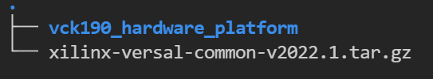
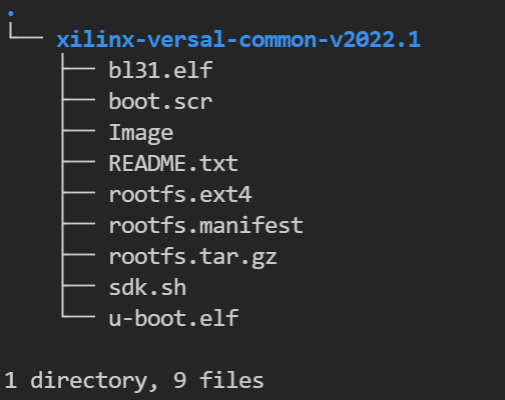

<!-- 
# Copyright 2020 Xilinx Inc.
# 
# Licensed under the Apache License, Version 2.0 (the "License");
# you may not use this file except in compliance with the License.
# You may obtain a copy of the License at
#
#     http://www.apache.org/licenses/LICENSE-2.0
#
# Unless required by applicable law or agreed to in writing, software
# distributed under the License is distributed on an "AS IS" BASIS,
# WITHOUT WARRANTIES OR CONDITIONS OF ANY KIND, either express or implied.
# See the License for the specific language governing permissions and
# limitations under the License.
-->


<table width="100%">
 <tr width="100%">
    <td align="center"><h1>Versal Custom Platform Creation Tutorial</h1>
    </td>
 </tr>
</table>

## Step 2: Create the Vitis Platform

This time we will create a Vitis platform running Linux operation system. This Vitis platform requires several software components. We need prepare these components for the platform first. Since Xilinx provides common software images for quick evaluation. We assume you are using Xilinx evaluation boards and will utilize the common images. Certainly if you are using your own designed board which needs to customize the system like kernel or rootfs you can refer the [PetaLinux customization page](./petalinux_build.md) for customization. Besides for device tree file we need to create it by ourselves because PL side peripherals are defined by ourselves. Below are the software components we need for our platform and its provenance.

| Component                                     | Conventional Path or Filename                                                              | Description                                                                                                                                                                               | Provenance                                                                                                                                                                       |
| --------------------------------------------- | ------------------------------------------------------------------------------------------ | ----------------------------------------------------------------------------------------------------------------------------------------------------------------------------------------- | -------------------------------------------------------------------------------------------------------------------------------------------------------------------------------- |
| Boot components in BOOT.BIN                   | boot/bl31.elf</br>boot/u-boot.elf</br>boot/system.dtb | #ARM trusted firmware/ secure monitor</br>#Second stage boot loader</br>#Device tree blob file</br> | #Extracted from common image</br>#Extracted from common image</br>#Generated from "createdts" command |
| Boot components in FAT32 partition of SD card | sd_dir/boot.scr                                                                            | #U-boot configuration file to store in FAT32 partition of SD card                                                                                                                         | #Extracted from common image                                                                                                                                                     |
| Linux Software Components                     | sw_comp/Image</br>sw_comp/rootfs.ext4                                                      | #Linux kernel  Image </br>#Linux file system                                                                                                                                              | #Extracted from common image</br>#Extracted from common image                                                                                                                    |
| Linux SDK                                     | sysroots                                                                                   | #Cross compile and libraries of compilation                                                                                                                                       | #Extracted from common image                                                                                                                                                     |

As most of the components are extracted from common image package we will prepare the common image first.

### Prepare the common images
 
1. Download common image from [Xilinx website download page.](https://www.xilinx.com/support/download.html)  go to the `WorkSpace` folder we created in step1 and Place the image package in `WorkSpace` folder like below: 
   
   ```bash
   cd WorkSpace
   tree -L 1     # to see the directory hierarchy
   ```

   

2. Extract the common image.
    
    We will create one folder named `zcu104_software_platform` to store the work content for our step2. Then the coming operations and products will be stored in this folder.

   ```bash
   mkdir vck190_software_platform
   cd vck190_software_platform
   tar xvf ../xilinx-zynqmp-common-v2022.1.tar.gz .
   ```

   you can see `xilinx-versal-common-v2022.1` folder which contains some components in `vck190_software_platform` folder like below.
   
   

From above picture we can see we have boot file, kernel image, rootfs and SDK tool. We still do not have DTB. So next we will prepare the DTB file.

### Create the device tree file

Utilize XSCT tool to execute one command to generate device tree files:

   ```bash
   cd vck190_software_platform
   xsct 
   ```
   Then execute ` createdts ` command in XSCT console like below:

   ```bash
   createdts -hw ../vck190_hardware_platform/ext_platform_wrapper.xsa -out . -zocl  -platform-name mydevice  -git-branch xlnx_rel_v2021.2 -board  versal-vck190-reva-x-ebm-02-reva -compile
   ```
   The `createdts` command needs the following input values:

   -  `-name`: Platform name
   -  `-hw`: Hardware XSA file with path
   -  `-out`: Specify the output directory
   -  `-git-branch`: device tree branch
   -  `-board`: board name of the device. You can check the board name at <DTG Repo>/device_tree/data/kernel_dtsi.
   -  `-zocl`: enable the zocl driver support
   -  `-compile`: specify the option to compile the device tree

   Notice below information would show in XSCT console.Please ignore the warning and that means you succeed to get system.dtb file which is located in <mydevice/psv_cortexa72_0/device_tree_domain/bsp/>.

   ```bash
   pl.dtsi:9.21-46.4: Warning (unit_address_vs_reg): /amba_pl@0: node has a unit name, but no reg property
   pl.dtsi:41.26-45.5: Warning (simple_bus_reg): /amba_pl@0/misc_clk_0: missing or empty reg/ranges property
   ```

   > Note: Createdts is a command executing in XSCT console to generate device files. This command needs several inputs to generate the device tree files. Regarding the meaning of every option you can execute help command to check the details. Besides XSCT is a Console tool of Vitis. You can start it by typing `xsct` in Linux terminal to start it like above operation. Also you can also select menu **Xilinx > XSCT Console ** to start the XSCT tool after you launching Vitis.

   Execute below command to exit XSCT console.

   ```bash
   exit
   ```

   After this step, we get all the must components we need. The next we will attach all the components to our platform and build it.

### Create Vitis Platform

1. First We will create three directories: **pfm, boot, sd_dir** to store the components and copy files to the directories.

   ```bash
   cd WorkSpace/zcu104_software_platform
   mkdir pfm 
   mkdir pfm/boot
   mkdir pfm/sd_dir
   mkdir pfm/sw_comp 
   cp xilinx-versal-common-v2022.1/bl31.elf pfm/boot/
   cp xilinx-versal-common-v2022.1/u-boot.elf pfm/boot/
   cp mydevice/psv_cortexa72_0/device_tree_domain/bsp/system.dtb  pfm/boot/
   cp xilinx-versal-common-v2022.1/boot.scr pfm/sd_dir/
   cp mydevice/psv_cortexa72_0/device_tree_domain/bsp/system.dtb  pfm/sd_dir/
   cp xilinx-versal-common-v2022.1/rootfs.ext4 pfm/sw_comp
   cp xilinx-versal-common-v2022.1/Image pfm/sw_comp
   ```

2. Install the sysroot 

   - Go to common image extracted directory `WorkSpace/vck190_software_platform/xilinx-versal-common-v2022.1/`
   - Type ./sdk.sh -d <Install Target Dir> to install PetaLinux SDK. use the `-d` option to provide a full pathname to the output directory ** . ** (This is an example. < . > means current Dir ) and confirm.
   - Note: The environment variable **LD_LIBRARY_PATH** must not be set when running this command

Finally your prepared directory structure looks like this :

```bash
|-- device-tree-xlnx
|-- mydevice
|   |-- export
|   |   `-- mydevice
|   |-- hw
|   |   |-- ext_platform_wrapper_presynth.pdi
|   |   `-- ext_platform_wrapper.xsa
|   |-- logs
|   |   `-- platform.log
|   |-- platform.spr
|   `-- psv_cortexa72_0
|       `-- device_tree_domain
|-- pfm
|   |-- boot
|   |   |-- bl31.elf
|   |   |-- system.dtb
|   |   `-- u-boot.elf
|   |-- sd_dir
|   |   `-- system.dtb
|   `-- sw_comp
|       |-- Image
|       `-- rootfs.ext4
|-- sysroots
|   |-- cortexa72-cortexa53-xilinx-linux
|   `-- x86_64-petalinux-linux
-- version-cortexa72-cortexa53-xilinx-linux
`-- xilinx-versal-common-v2022.1
    |-- bl31.elf
    |-- boot.scr
    |-- Image
    |-- README.txt
    |-- rootfs.ext4
    |-- rootfs.manifest
    |-- rootfs.tar.gz
    |-- sdk.sh
    `-- u-boot.elf
```

> Note: If you run the fast track script, the boot directory only has linux.bif file because the platform creation script xsct_create_pfm.tcl uses <xilinx-versal-common-v2022.1> directory as boot directory for components of the BIF file. To make the GUI flow easier, we copy these components to boot directory for preparation.


3.Create Vitis platform

We can create a Vitis platform with Vitis IDE or with XSCT command line. Vitis IDE can create the platform if your design only contains one XSA. If your design has two XSA (hw and hw-emu), please use XSCT to create the platform
So to support packaging two XSA files into the platform, this example uses XSCT flow primarily. If you don't need hardware emulation, you can choose to use the Vitis IDE flow.

> Note: Vitis IDE support for creating Vitis platforms with two XSA will be added in the future.

<details>

<summary><strong>Click here to expand the detailed steps using XSCT to create a Vitis platform</strong></summary>  

Create a tcl file with XSCT commands. 

```Tcl
# Create a platform project
platform create -name vck190_custom \
    -desc "A custom platform VCK190 platform" \
    -hw <Hardware>.xsa \
    -hw_emu <Hardware_Emulation>.xsa \
    -out <Output_Directory> \
    -no-boot-bsp 

# If you don't need to support hardware emulation, you can omit the option -hw_emu and its value.

# AIE domain
domain create -name aiengine -os aie_runtime -proc ai_engine

# Add Linux domain
domain create -name xrt -proc psv_cortexa72 -os linux -arch {64-bit} -runtime {ocl} -sd-dir {./sd_dir}  -bootmode {sd}
domain config -boot {./boot}
domain config -generate-bif
domain config -qemu-data ./boot

platform write
platform generate
```

> Note: Please replace the file name and directory name in the script with your project file location.

> Note: If you don't need to support hardware emulation, you can omit the option `-hw_emu` and its value for the command `platform create`.

The `platform create` command needs the following input values:

- `-name`: Platform name
- `-hw`: Hardware XSA file location
- `-hw_emu`: Hardware emulation XSA file location
- `-out`: platform output path
- `-sd-dir`: the directory that contains the files to be included in the FAT32 partition of the SD card image.

The `domain` command will setup one AI Engine domain and one Linux domain. The Linux domain has SD boot mode. It will use files in `./sd_dir` to form the FAT32 partition of the SD card image and files in `./boot` directory to genreate boot.bin. We have stored required files in these directories in [Prepare for Platform Packaging](#prepare-for-platform-packaging) step.

You can pass the values to the script directly by replacing the variable with the actual value, or define them in the header of the tcl script, or pass the value to XSCT when calling this script. 

Here's an example of calling XSCT if you hard code all contents in xsct_create_pfm.tcl.

```bash
xsct xsct_create_pfm.tcl
```

To support better generalization, the example [Makefile](./ref_files/step3_pfm/Makefile) and [xsct_create_pfm.tcl](./ref_files/step3_pfm/xsct_create_pfm.tcl) in ref_files directory use variables to represent the file names and directory location. Please refer to them if you would like to get more programability in your scripts.

</details>

<details>

<summary><strong>Click here to expand the detailed steps using Vitis IDE to create a Vitis platform</strong></summary> 

First we create a **Vitis platform project** with the **XSA file** generated by Vivado

1. Launch Vitis.

   ```bash
   # You are still in step3_pfm directory
   # Setup Vitis environment
   source <Vitis_Install_Directory>/settings64.sh
   # Launch Vitis, using ./platform_repo directory as workspace
   vitis -workspace ./platform_repo &
   ```

2. Create a platform project

   - In the Vitis IDE, select **File > New > Platform Project** to create a platform project.
   - Enter the project name. For this example, type `vck190_custom`, click **Next**.
   - In the Platform page, click **Browse** button, select the XSA file generated by the Vivado. In this case, it is located in `<Your Vivado Project Directory>/vck190_custom.xsa`. Click **Next**.
   - Set the **operating system** to **linux**.
   - Set the processor to **psv_cortexa72**.
   - Click **Finish**.

   

3. Setup Linux domain settings in Platform Settings view.

   - Click the **linux on psv_cortexa72** domain
   - Update the **Display Name** to `xrt` by clicking the edit button on the right of this line and input the name. We'd like to indicate this is a Linux domain has XRT installed and is capable of running acceleration applications.
   - Set **Bif file**: Click the drop down button and select **Generate BIF**. The generated BIF file is generated bin resource directory.
   - **Boot Components Directory**: Browse to **step3_pfm/boot/** and click OK. Bootgen will look for boot components referred by BIF in this directory to generate BOOT.BIN
   - **FAT32 Partition Directory**: Browse to **step3_pfm/sd_dir** and click OK. Files in this directory will be copied to FAT32 partition of SD card.

   >Note: **FAT32 Partition Directory** option name was called Linux Image Directory in previous releases. It was defined when initramfs is used to boot Linux. In that case, the Linux kernel image, or image.ub with kernel image, rootfs and device tree are all placed in the FAT32 partition of the SD Card. Now with EXT4 rootfs, only boot.scr needs to be placed in the FAT32 partition. The option name is updated to reflect this change.

   >Note: **Linux Rootfs** and **Sysroot Directory** are optional for Linux domain. They can be provided in either platform or application. We will add them in application creation phase because it would be easy to reuse these components among multiple platforms. 


4. (Optional) Update Linux domain emulation settings

   - Vitis IDE or XSCT sets QEMU Arguments and PMC QEMU Arguments to the default files in Vitis installation directory. These default settings should be able to boot Linux in QEMU properly. If you need to update the arguments, you can copy them to local, update and setup the new path in the Linux domain configuration.
   - Set QEMU Data to **step3_pfm/boot** directory because QEMU may use some boot components.

5. Add AI Engine domain

   - Click Add domain icon

   

   - Set Name to **aiengine**
   - Change OS to **aie_runtime**. 
   - Keep other settings to default and click **OK**.

   

   Note: Vitis IDE and XSCT will add QEMU arguments for AI Engine domain automatically.

6.  Click **vck190_custom** project in the Vitis Explorer view, click the **Build** button to generate the platform.

   


**Note: The generated platform is placed in the export directory. BSP and source files are also provided for re-building the FSBL and PMU if desired and are associated with the platform. The platform is ready to be used for application development.**

   

</details>

### Next Step

Next let's move to [step 4 to try to build some applications on this platform and test them.](./step4.md)

### Fast Track

Scripts are provided to package the Vitis platform.

To use these scripts, please run the following steps.

1. Run build

   ```
   # cd to the step directory, e.g.
   cd step3_pfm
   make
   ```

2. To clean the generated files, please run

   ```bash
   make clean
   ```

<p align="center"><sup>Copyright&copy; 2021 Xilinx</sup></p>
