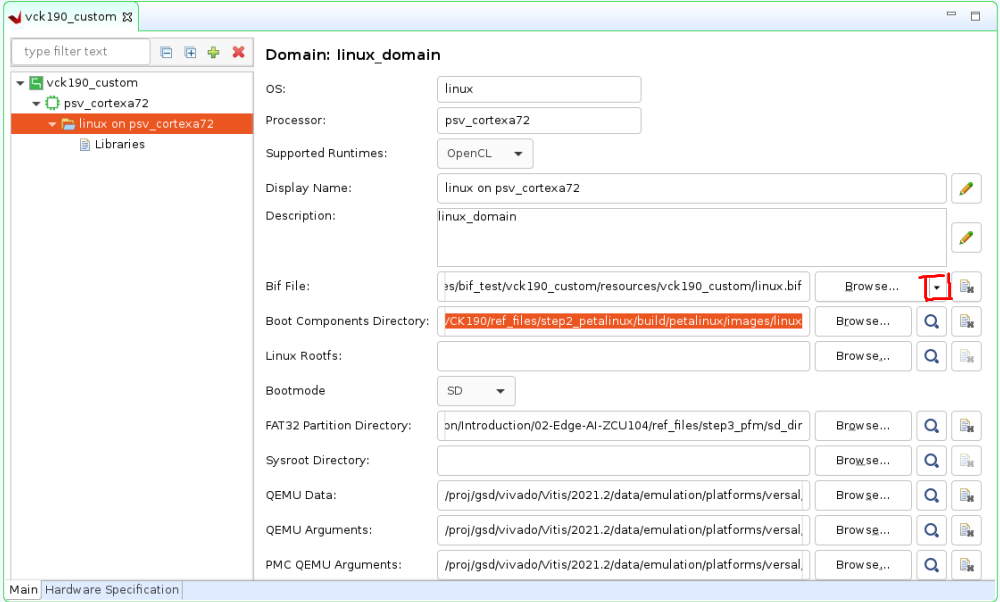

<!-- 
# Copyright 2020 Xilinx Inc.
# 
# Licensed under the Apache License, Version 2.0 (the "License");
# you may not use this file except in compliance with the License.
# You may obtain a copy of the License at
#
#     http://www.apache.org/licenses/LICENSE-2.0
#
# Unless required by applicable law or agreed to in writing, software
# distributed under the License is distributed on an "AS IS" BASIS,
# WITHOUT WARRANTIES OR CONDITIONS OF ANY KIND, either express or implied.
# See the License for the specific language governing permissions and
# limitations under the License.
-->


<table width="100%">
 <tr width="100%">
    <td align="center"><h1>Versal Custom Platform Creation Tutorial</h1>
    </td>
 </tr>
</table>

## Step 3: Create the Vitis Platform

Vitis Platform can be created with Vitis GUI or XSCT command line. Vitis IDE can create platforms with single XSA. XSCT can create platforms with either single XSA or two XSA files. We will introduct both flows below.

### Prepare for Platform Packaging

We would store all the necessary files in one directory for Vitis platform creation flow. 

Required platform creation source files

| Component                                     | Conventional Path or Filename                         | Description                                                   |
| --------------------------------------------- | ----------------------------------------------------- | ------------------------------------------------------------- |
| Boot components in BOOT.BIN                   | boot/bl31.elf</br>boot/u-boot.elf</br>boot/system.dtb | All components referred in linux.bif should be in this folder |
| Boot components in FAT32 partition of SD Card | sd_dir/boot.scr                                        | U-boot configuration file to store in FAT32 partition of SD card                                    |


Optional platform creation source files

| Component                         | Conventional Path or Filename                              | Description                                                                                                                                                           |
| --------------------------------- | ---------------------------------------------------------- | --------------------------------------------------------------------------------------------------------------------------------------------------------------------- |
| BOOT Image Description file (BIF) | boot/linux.bif                                             | BIF describes the layout of BOOT.BIN. Vitis can generate a default BIF for general purpose usage. <br\>User can provide customized BIF when needed.                    |
| Linux Software Components         | sw_comp/Image</br>sw_comp/rootfs.ext4</br>sw_comp/sysroots | Linux components for application creation and Linux booting. They can be packaged into platform or stay standalone and be linked during application creation process. |

Linux software components can be reused in most cases when platform hardware design changes. So we will not package them into the platform. Here we prepare them for application creation in the next step.

We would store all the necessary files for Vitis platform creation flow. Here we call it **step3_pfm** directory. 


1. Prepare the boot components and store them in the same directory. They are generated by PetaLinux and originally located in **<your_petalinux_dir>/images/linux** directory. You can copy them into **step3_pfm/boot** for easy understanding. Here we keep them in **<your_petalinux_dir>/images/linux** directory because in case we need to update PetaLinux settings and rebuilt PetaLinux, we just need to clean platform and rebuilt them in Vitis to generate a new platform. We won't need to copy them manually every time. These files are the source of creating final BOOT.BIN during application packaging. When creating the platform, these files will be copied to the platform output directory. 

   - bl31.elf
   - u-boot.elf
   - system.dtb

2. Prepare **step3_pfm/sd_dir** directory. Contents in this directory will be packaged to FAT32 partition of SD card image by v++ package tool.

   - Copy **boot.scr** from **<your_petalinux_dir>/images/linux directory** to the **step3_pfm/sd_dir** directory. It's a script for u-boot initialization. U-boot will read it from fat32 partition during boot process.

3. Prepare Linux software components for application creation. Platform packaging can add them or exclude them. Due to the software component size, they are usually kept outside of platforms so that these components can be reused among multiple platforms with the same architecture. On the other side, keeping Linux software components in the platform can prevent mix and match different combinations when delivering the platform from one team to another. Here we keep the Linux software components standalone.

   ```bash
   # Create sw_comp directory
   cd step3_pfm
   mkdir sw_comp
   cd sw_comp
   # Copy Linux kernel image
   cp <your_petalinux_dir>/images/linux/Image .
   # Copy EXT4 Root Filesystem
   cp <your_petalinux_dir>/images/linux/rootfs.ext4 .
   # Install sysroot to this directory
   <your_petalinux_dir>/images/linux/sdk.sh -d ./ -y
   ```

Finally, your prepared directory structure looks like this.

```
tree -L 3 --charset ascii
.
|-- boot
|   |-- bl31.elf
|   |-- system.dtb
|   `-- u-boot.elf
|-- sd_dir
|   `-- boot.scr
|-- sw_comp
|   |-- environment-setup-cortexa72-cortexa53-xilinx-linux
|   |-- Image
|   |-- rootfs.ext4
|   |-- site-config-cortexa72-cortexa53-xilinx-linux
|   |-- sysroots
|   |   |-- cortexa72-cortexa53-xilinx-linux
|   |   `-- x86_64-petalinux-linux
|   `-- version-cortexa72-cortexa53-xilinx-linux
```

> Note: If you run the fast track script, the boot directory only has linux.bif file because the platform creation script xsct_create_pfm.tcl uses <petalinux_project>/images/linux directory as boot directory for components of the BIF file. To make the GUI flow easier, we copy these components to boot directory for preparation.


### Platform Packaging

To support packaging two XSA files into the platform, this example uses XSCT flow primarily. If you don't need hardware emulation, you can choose to use the Vitis IDE flow.

> Note: Vitis IDE support for creating Vitis platforms with two XSA will be added in the future.

First we will create a folder as our workspace and store the platform.

```bash
mkdir platform_repo
```

<details>

<summary><strong>Click here to expand the detailed steps using XSCT to create a Vitis platform</strong></summary>  

Create a tcl file with XSCT commands. 

```Tcl
# Create a platform project
platform create -name vck190_custom \
    -desc "A custom platform VCK190 platform" \
    -hw <Hardware>.xsa \
    -hw_emu <Hardware_Emulation>.xsa \
    -out <Output_Directory> \
    -no-boot-bsp 

# If you don't need to support hardware emulation, you can omit the option -hw_emu and its value.

# AIE domain
domain create -name aiengine -os aie_runtime -proc ai_engine

# Add Linux domain
domain create -name xrt -proc psv_cortexa72 -os linux -arch {64-bit} -runtime {ocl} -sd-dir {./sd_dir}  -bootmode {sd}
domain config -boot {./boot}
domain config -generate-bif
domain config -qemu-data ./boot

platform write
platform generate
```

> Note: Please replace the file name and directory name in the script with your project file location.

> Note: If you don't need to support hardware emulation, you can omit the option `-hw_emu` and its value for the command `platform create`.

The `platform create` command needs the following input values:

- `-name`: Platform name
- `-hw`: Hardware XSA file location
- `-hw_emu`: Hardware emulation XSA file location
- `-out`: platform output path,this time we set <platform_repo> as the output directory. 
- `-sd-dir`: the directory that contains the files to be included in the FAT32 partition of the SD card image.

The `domain` command will setup one AI Engine domain and one Linux domain. The Linux domain has SD boot mode. It will use files in `./sd_dir` to form the FAT32 partition of the SD card image and files in `./boot` directory to genreate boot.bin. We have stored required files in these directories in [Prepare for Platform Packaging](#prepare-for-platform-packaging) step.

You can pass the values to the script directly by replacing the variable with the actual value, or define them in the header of the tcl script, or pass the value to XSCT when calling this script. 

Here's an example of calling XSCT if you hard code all contents in xsct_create_pfm.tcl.

```bash
xsct xsct_create_pfm.tcl
```

To support better generalization, the example [Makefile](./ref_files/step3_pfm/Makefile) and [xsct_create_pfm.tcl](./ref_files/step3_pfm/xsct_create_pfm.tcl) in ref_files directory use variables to represent the file names and directory location. Please refer to them if you would like to get more programability in your scripts.

</details>

<details>

<summary><strong>Click here to expand the detailed steps using Vitis IDE to create a Vitis platform</strong></summary> 

First we create a **Vitis platform project** with the **XSA file** generated by Vivado

1. Launch Vitis.

   ```bash
   # You are still in step3_pfm directory
   # Setup Vitis environment
   source <Vitis_Install_Directory>/settings64.sh
   # Launch Vitis, using ./platform_repo directory as workspace to store our platform
   vitis -workspace ./platform_repo & 
   ```

2. Create a platform project

   - In the Vitis IDE, select **File > New > Platform Project** to create a platform project.
   - Enter the project name. For this example, type `vck190_custom`, click **Next**.
   - In the Platform page, click **Browse** button, select the XSA file generated by the Vivado. In this case, it is located in `<Your Vivado Project Directory>/vck190_custom.xsa`. Click **Next**.
   - Set the **operating system** to **linux**.
   - Set the processor to **psv_cortexa72**.
   - Click **Finish**.

   

3. Setup Linux domain settings in Platform Settings view.

   - Click the **linux on psv_cortexa72** domain
   - Update the **Display Name** to `xrt` by clicking the edit button on the right of this line and input the name. We'd like to indicate this is a Linux domain has XRT installed and is capable of running acceleration applications.
   - Set **Bif file**: Click the drop down button and select **Generate BIF**. The generated BIF file is generated in resource directory.

   
   
   - **Boot Components Directory**: Browse to **step3_pfm/boot/** and click OK. Bootgen will look for boot components referred by BIF in this directory to generate BOOT.BIN
   - **FAT32 Partition Directory**: Browse to **step3_pfm/sd_dir** and click OK. Files in this directory will be copied to FAT32 partition of SD card.
 
   - **QEMU Data**: Browse to **step3_pfm/boot/** and click OK. Emulator will use boot components from this directory.

   >Note: **FAT32 Partition Directory** option name was called Linux Image Directory in previous releases. It was defined when initramfs is used to boot Linux. In that case, the Linux kernel image, or image.ub with kernel image, rootfs and device tree are all placed in the FAT32 partition of the SD Card. Now with EXT4 rootfs, only boot.scr needs to be placed in the FAT32 partition. The option name is updated to reflect this change.

   >Note: **Linux Rootfs** and **Sysroot Directory** are optional for Linux domain. They can be provided in either platform or application. We will add them in application creation phase because it would be easy to reuse these components among multiple platforms. 

   >Note: Setting QEMU DATA to boot components directory would help emulator to find the boot components during Linux boot when doing emulation. 

   >Note: If there are additional QEMU settings, please update qemu_args.txt accordingly.

4. (Optional) Update Linux domain emulation settings

   - Vitis IDE or XSCT sets QEMU Arguments and PMC QEMU Arguments to the default files in Vitis installation directory. These default settings should be able to boot Linux in QEMU properly. If you need to update the arguments, you can copy them to local, update and setup the new path in the Linux domain configuration.
   - Set QEMU Data to **step3_pfm/boot** directory because QEMU may use some boot components.

5. Add AI Engine domain

   - Click Add domain icon

   

   - Set Name to **aiengine**
   - Change OS to **aie_runtime**. 
   - Keep other settings to default and click **OK**.

   

   Note: Vitis IDE and XSCT will add QEMU arguments for AI Engine domain automatically.

6.  Click **vck190_custom** project in the Vitis Explorer view, click the **Build** button to generate the platform.

   


**Note: The generated platform is placed in the export directory. BSP and source files are also provided for re-building the FSBL and PMU if desired and are associated with the platform. The platform is ready to be used for application development.**

   

</details>

### Next Step

Next let's move to [step 4 to try to build some applications on this platform and test them.](./step4.md)

### Fast Track

Scripts are provided to package the Vitis platform.

To use these scripts, please run the following steps.

1. Run build

   ```
   # cd to the step directory, e.g.
   cd step3_pfm
   make
   ```

2. To clean the generated files, please run

   ```bash
   make clean
   ```

<p align="center"><sup>Copyright&copy; 2021 Xilinx</sup></p>
