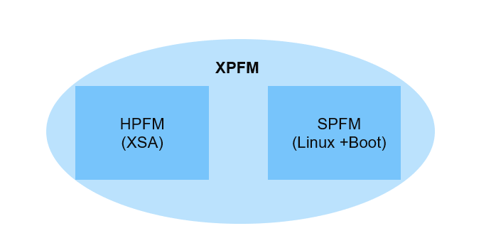

##############################################################################
AMD Vitis Platform Creation Tutorials
##############################################################################

******************************************
What is a Platform?
******************************************

Briefly speaking, a platform is a package that contains the HPFM (``.xsa``) file and SPFM (software components). When you input the ``.xsa`` file and software components, the AMD Vitis™ IDE tool will package them together and generate a platform ``.xpfm`` file, while the ``.xsa`` file is designed and exported from the AMD Vivado™ tool. Software components are prepared by AMD and ready to use for evaluation. Software components customization is also supported with Petalinux, if needed.

Platform Creation Example Quick Access
==================================================================================

* For a first experience of platforms, refer to `Vitis Platform Quick Start <https://docs.amd.com/r/en-US/Vitis-Tutorials-Getting-Started/Vitis-Platform>`_
* For **ZYNQMP** device family, refer to :doc:`ZCU104 platform tutorial <./docs/Design_Tutorials/02-Edge-AI-ZCU104/README>`
* For **Versal** device family, refer to :doc:`VCK190 platform tutorial <./docs/Design_Tutorials/03_Edge_VCK190/README>`
* For **:term:`DFX`** platform, refer to :doc:`DFX platform tutorial <./docs/Design_Tutorials/04_Edge_VCK190_DFX/README>`
* For **SOM** series, refer to :doc:`KV260 platform tutorial <./docs/Design_Tutorials/01-Edge-KV260/README>`
* For **PetaLinux** customization, refer to :doc:`PetaLinux Customization <./docs/Feature_Tutorials/02_petalinux_customization/README>`

******************************************
Platform Creation Tutorials
******************************************

The tutorials under the Vitis Platform Creation category help you learn how to develop an extensible platform for your own board, or customize the Vitis platform on Xilinx demo boards.

* The :doc:`Design Tutorials <./docs/Design_Tutorials/Design_Tutorials>` showcase end-to-end workflow for creating the Vitis extensible platforms from scratch for different device families and boards.
* The :doc:`Feature Tutorials <./docs/Feature_Tutorials/Feature_Tutorials>` highlight specific features and flows that help develop the platform.

******************************************
Design Tutorials
******************************************

.. toctree::
   :maxdepth: 3
   :caption: Design Tutorials
   :hidden:

   Design Tutorials <./docs/Design_Tutorials/Design_Tutorials>

.. list-table:: 
   :widths: 21 8 8 6 12 45
   :header-rows: 1
   
   * - Tutorial
     - Device Family
     - Board
     - Platform Type
     - IDE Flow
     - Design Target
	 
   * - `Vitis Platform Quick Start <https://docs.amd.com/r/en-US/Vitis-Tutorials-Getting-Started/Vitis-Platform>`_
     - Versal AI Core
     - VCK190
     - Flat
     - 

       - Vivado
       - Vitis Unified IDE
  
     - **Highlights**: Simplest Vitis Platform creation and usage flow.

       - **Hardware design**: Using Vivado Customizable Example Design template to quick start.  
       - **Software design**: Using ``createdts`` and Common Image to quick start. 
       - **Verification**: Vector Addition.

       .. note:: 

          This design flow is applicable to most AMD demo boards. 

   * - :doc:`Create a Vitis Platform for Custom Versal Boards <./docs/Design_Tutorials/03_Edge_VCK190/README>`
     - Versal AI Core
     - VCK190
     - Flat
     - 

       - Vivado
       - Vitis IDE
  
     - **Highlights**: Platform design flow for custom boards.

       - **Hardware design**: Using Vivado Customizable Example Design (device part based) to create the hardware and do further customizations.  
       - **Software design**: Using ``createdts`` and Common Image to quick start. 
       - **Verification**: Vector Addition.

       .. note:: 

          This tutorial uses VCK190 board as a custom board. The design does not use any of its presets. 

   * - :doc:`Versal DFX Platform Creation Tutorial <./docs/Design_Tutorials/04_Edge_VCK190_DFX/README>`
     - Versal AI Core
     - VCK190
     - :term:`DFX`
     - 

       - Vivado
       - Vitis IDE
  
     - **Highlights**: Design flow for Vitis DFX (Dynamic Function eXchange) Platform.

       - **Hardware design**: Using Vivado Customizable Example Design template to quick start.  
       - **Software design**: Using ``createdts`` and Common Image to quick start. 
       - **Verification**: Vector Addition.

   * - :doc:`Create Vitis Platforms for Zynq UltraScale+ MPSoC <./docs/Design_Tutorials/02-Edge-AI-ZCU104/README>`
     - Zynq UltraScale+ MPSoC
     - ZCU104
     - Flat
     - 

       - Vivado
       - Vitis IDE
  
     - **Highlights**: Creating a Vitis platform for Zynq UltraScale+ MPSoC from scratch.

       - **Hardware design**: Creating the hardware design from scratch without any help from Vivado example design templates.  
       - **Software design**: Using ``createdts`` and Common Image to quick start. 
       - **Verification**: Vector Addition and Vitis-AI.

   * - :doc:`Custom Kria SOM Platform Creation Example <./docs/Design_Tutorials/01-Edge-KV260/README>`
     - Zynq UltraScale+ MPSoC
     - KV260
     - Flat
     - 

       - Vivado
       - Vitis IDE
  
     - **Highlights**: Kria :term:`SOM` Platform creation and usage flow.

       - **Hardware design**: Creating from scratch.
       - **Software design**: Using Common Image and showing device tree binary overlay (:term:`DTBO`) creation flow.
       - **Verification**: Vector Addition and Kria :term:`SOM` application loading procedure.

******************************************
Feature Tutorials
******************************************

.. toctree::
   :maxdepth: 3
   :caption: Feature Tutorials
   :hidden:

   Feature Tutorials <./docs/Feature_Tutorials/Feature_Tutorials>

.. list-table:: 
   :widths: 21 8 8 6 12 45
   :header-rows: 1
   
   * - Tutorial
     - Device Family
     - Board
     - Platform Type
     - IDE Flow
     - Design Target
	 
   * - :doc:`Incorporating Stream Interfaces <./docs/Feature_Tutorials/01_platform_creation_streaming_ip/README>`
     - Generic, but using Versal AI Core as example
     - VCK190
     - Flat
     - 

       - Vivado
       - Vitis IDE
  
     - **Highlights**:

       - Adding custom IP into the platform hardware.
       - Using AXI Stream IP in platform and kernel.

   * - :doc:`PetaLinux Building and System Customization <./docs/Feature_Tutorials/02_petalinux_customization/README>`
     - Zynq UltraScale+ MPSoC and Versal AI Core
     - ZCU104 and VCK190
     - Flat
     - 

       - Vivado
       - Vitis IDE
  
     - **Highlights**: Customize the software components with PetaLinux.

   * - :doc:`Hardware Design Fast Iteration with Vitis Export to Vivado <./docs/Feature_Tutorials/03_Vitis_Export_To_Vivado/README>`
     - Versal AI Core
     - VCK190
     - Block Design Container
     - 

       - Vivado
       - Vitis IDE
  
     - **Highlights**:

       - Skip creating the platform before v++ linking.
       - Using Vivado to do design implementation and timing closure.
       - Fast iteration for hardware design.

   * - :doc:`Hardware Design Validation <./docs/Feature_Tutorials/04_platform_validation/README>`
     - Versal AI Core
     - VCK190
     - Flat & Block Design Container
     - 

       - Vivado
       - Vitis IDE
  
     - **Highlights**:

       - Link kernel with :term:`XSA` directly.
       - Validation against hardware platform interfaces.
       - Validate the hardware design with bare-metal application.

.. glossary::

    XSA
      Vivado exported archive file that contains hardware information required for Vitis and PetaLinux

    DFX
      Dynamic Function eXchange

    SOM
      System-on-Modules

    DTB
      Device Tree Binary

    DTBO
      Device Tree Binary Overlay

.. sidebar:: More Information

    See Vitis Development Environment on `xilinx.com <https://www.xilinx.com/products/design-tools/vitis.html>`_.

