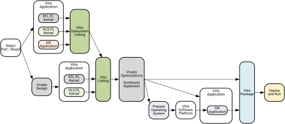

<table class="sphinxhide" width="100%">
 <tr width="100%">
    <td align="center"><h1>Vitis™ In-Depth Tutorials</h1>
    </td>
 </tr>
</table>


# Versal Custom Platform Integration using Vitis Subsystem

***Version: Vivado and Vitis 2025.1***

This tutorial demonstrates key features in AMD 2025.1 tools for designing and verifying AI Engine and HLS based DSP subsystem and deploy it on a custom platform.

To show the design, verification and integration activities, the tutorial use simple building blocks to make it easy to track the design results and processing data with visual inspection.
The example blocks are verified with basic test benches to demonstrate using the verification features, and it's adviced that user complement with more advanced tests to reach acceptable coverage.

***Note:*** Please use the Github Issue reporting tool to provide feedback and report issues.

### Vitis subsystem flow
The tutorial follow the Vitis subsystem flow to completely build to hardware. Though some of the steps can be performed concurrently, the tutorial goes through the steps in sequence.




[Skip directly to the getting started](#getting-started)

### Features demonstrated in this tutorial

#### DSP development - AI Engine and Vitis Subsystem development

| Feature                        | Example in this tutorial   | User guide reference
| ---------------------------------|--------|-------------------------------------------------
| AIE Kernel programming using AIE API     | [Datamover examples and 16 tap FIR filter with sliding mul ops](./vss/ip/aie/README.md)     | [AI Engine Kernel and Graph Programming Guide (UG1079)](https://docs.amd.com/r/en-US/ug1079-ai-engine-kernel-coding/Multiple-Lanes-Multiplication-sliding_mul)
| Optimizing loops for AIE Kernel     | [AIE Optimizations](./vss/ip/aie/README_AIE_OPTIMIZATIONS.md)     | [AI Engine Kernel and Graph Programming Guide (UG1079)](https://docs.amd.com/r/en-US/ug1079-ai-engine-kernel-coding/Multiple-Lanes-Multiplication-sliding_mul)
| AIE Graph programming with subgraphs     | [Graph with subgraphs](./vss/ip/aie/src/graphs/mygraph2.h)        | [AI Engine Kernel and Graph Programming Guide (UG1079)](https://docs.amd.com/r/en-US/ug1079-ai-engine-kernel-coding/Introduction-to-Graph-Programming)
| Vitis Functional Simulation in Matlab     | [Simulate AIE graph in Matlab](./vss/matlab/README.md)     | [Functional Simulation and Verification in Vitis (UG1701)](https://docs.amd.com/r/en-US/ug1701-vitis-accelerated-embedded/Functional-Simulation-and-Verification-in-Vitis)
| Vitis Functional Simulation in Python     | [Simulate HLS kernel in Python](./vss/python/README.md)     | [Functional Simulation and Verification in Vitis (UG1701)](https://docs.amd.com/r/en-US/ug1701-vitis-accelerated-embedded/Functional-Simulation-and-Verification-in-Vitis)
| AIE Kernel performance with Vitis Analyzer  | [Checking datamovers with AIE simulation](./vss/ip/aie/README_AIESIM.md)     |  [Vitis Reference Guide (UG1702)](https://docs.amd.com/r/en-US/ug1702-vitis-accelerated-reference/Working-with-the-Analysis-View-Vitis-Analyzer)
| Creating a Vitis Subsystem      | [Design and compile a VSS component](./vss/README.md)     | [Linking a VSS component with Vitis (UG1701)](https://docs.amd.com/r/en-US/ug1701-vitis-accelerated-embedded/Linking-a-VSS-Component)
| Vitis Subsystem Simulation     | [Simulate AIE+PL in XSIM with RTL testbench](./vss/cosim/README.md)     | Early Access Feature, may be subject to change. Contact your AMD FAE for details.
| VSS performance with Vitis Analyzer  | [Checking AIE FIR filter after VSS simulation](./vss/cosim/README_VCD.md)     |  [Vitis Reference Guide (UG1702)](https://docs.amd.com/r/en-US/ug1702-vitis-accelerated-reference/Working-with-the-Analysis-View-Vitis-Analyzer)

#### Hardware development - Creating, linking, and implementing the hardware platform

| Feature                        | Example in this tutorial   | User guide reference
| ---------------------------------|--------|-------------------------------------------------
| Creating a custom extensible platform | [Vivado extensible platform](./vivado/README.md)     |  [Extensible hardware platforms (UG1701)](https://docs.amd.com/r/en-US/ug1701-vitis-accelerated-embedded/Extensible-Hardware-Platforms)
| Linking the subsystem to extensible platform  | [Vitis Linking](./vitis/README.md)     |  [Linking the VSS component to the platform (UG1701)](https://docs.amd.com/r/en-US/ug1701-vitis-accelerated-embedded/Linking-the-VSS-Component-to-the-Platform)
| Importing VMA and implementing the hardware platform | [Implement design Vivado](./vivado/Finalize_Vivado.md)     |  [Vitis export to Vivado flow detailed example (UG1701)](https://docs.amd.com/r/en-US/ug1701-vitis-accelerated-embedded/Vitis-Export-to-Vivado-Flow-Detailed-Example)

#### Embedded development - Adding custom Linux, devicetree overlays, and cross-compile host application

| Feature                        | Example in this tutorial   | User guide reference
| ---------------------------------|--------|-------------------------------------------------
| Prepare and build custom Linux with Petalinux | [Preparing a custom Linux environment](./linux/README.md)     |  [PetaLinux reference guide (UG1144)](https://docs.amd.com/r/en-US/ug1144-petalinux-tools-reference-guide)
| Create Vitis platform component including devicetree overlay  | [Vitis platform component](./vitis/README.md)     |  [Create a platform component from XSA](https://docs.amd.com/r/en-US/ug1400-vitis-embedded/Creating-a-Platform-Component-from-XSA)
| Create host application | [Create and crosscompile host applications](./ps_apps/README.md)     |  [Host application development overview (UG1701)](https://docs.amd.com/r/en-US/ug1701-vitis-accelerated-embedded/Host-Application-Development)
| Integrate the system and package to SD card | [Package the design with Vitis](./vitis/Package.md)     |  [Integrating the System (UG1701)](https://docs.amd.com/r/en-US/ug1701-vitis-accelerated-embedded/Integrating-the-System)


## Detailed design description

The use case for the lab is a custom extensible Vivado Block Design platform with RTL Modules combined with a Vitis Metadata Archive (VMA) containing a simple AI Engine and HLS design integrated following Vitis Export to Vivado Flow.
To headstart the signal processing algorithm development, we introduce the Vitis Subsystem (VSS) component that by targeting a device part number instead of a platform enables working independently of the platform.
Once the VSS is ready for integration, it can be added to an extensible platform, similar to linking AIE graphs and PL kernels, using v++ linker config.
To complete the design, we follow the Vitis Export to Vivado Flow, which enables the user to finalize the design in Vivado with full control of the synthesis and implementation steps before writing the fixed XSA.

The example design will go through the steps of creating a small AMD Versal™ VCK190 System Example Design consisting of:
 - Preparing a VSS Component
   - Adding AIE, HLS and RTL components
     - Showcase AIE functional verification with Matlab VFS
     - Showcase AIE functional verification with Python VFS
 - Preparing a Custom Vivado Platform (flat non-BDC platform), and export an extensible XSA
 - Integrate the VSS Component and additional HLS Kernels using Vitis Linker
 - Exporting an AIE/PL VMA Subsystem
   - Showcase Vitis IDE.
   - Vitis clocking enhancements (for HLS).
 - Import AIE/PL VMA Subsystem to Vivado
   - Run synthesis and implementation.
   - Generate a fixed XSA.
 - Configure and build embedded Linux sysroot, image and boot artifacts
   - Use Petalinux to generate custom Linux. (Optional: Use Yocto to generate Linux).
 - Prepare Vitis Software platform
   - Use Vitis Python CLI for automation.
   - Apply devicetree overlays.
   - Configure Baremetal BSP and low level driver. (Preparation for future updates).
 - Create host applications
   - Crosscompile and link Linux userspace application executable.
 - Package to a SD Card
   - Adds boot files, image, root filesystem, and user apps to a bootable SD card.

## Conceptual description of the design and workflow arrangement used in the tutorial
To demonstrate how a system of RTL, HLS and AIE kernels can be arranged and integrated using Vitis, the tutorial use a few easy to understand building blocks. To highlight the differences between Vitis Subsystem component and Vitis kernels, the system have intentionally been decomposed for this.
The design structure and build scripts are prepared to allow for modifications, like moving, adding or removing various blocks across the Vitis Region, VSS component and Vivado block design.

***Note:*** *The AI Engine graph should reside inside the VSS component if VSS is used.* This is to enable AIE simulation in RTL testbench with the VSS simulation.

### Functional description of the hardware design

As the tutorial provide several AI Engine kernel examples demonstrating various techniques, the actual configuration can deviate depending on the [my_dm_graph](./vss/ip/aie/src/graphs/dm_graph.h) setup.<br>
The user is encouraged to experiment with choosing different datamover examples by replacing the kernels in the datamover graph.

This figure illustrate a functional description of the design. It also marks which blocks are placed in the VSS component and its relation to the Vitis region.


### Design arrangement from a build flow perspective
This figure describe the order of which the hardware design components are arranged and compiled.


## Getting Started
Makefiles are provided to build everything from the lab top folder. It will automatically compile all required RTL, AIE and HLS components as required by VSS during linking.

From top folder, run:
```
make all
```
Alternatively run step by step, by choosing from the following:
```
make vss vivado_platform vitis_ip vma_export vivado_fixed linux vitis_platform ps_apps package
```


### Prerequisites
Setup the Vitis 2025.1 tools
```
source <Vitis_Installation_Path>/settings64.sh
```

Setup the SDKTARGETSYSROOT to point to the install path of prebuilt Linux platforms if used.
Below is an example:
```
export SDKTARGETSYSROOT=<install_path>
```

### Steps
The example is composed in 4 major steps as show in the figure below. All steps are supported with scripts and pre-built sources to give user time to inspect the results and explore the results.
The user is encouraged to modify/change/replace parts after first running through these steps once.
 - [1. Create a Vitis Subsystem component](./vss/README.md)
 - [2. Develop a custom Vivado extensible platform](./vivado/Vivado.md)
 - [3. Compile additional Vitis blocks (Non VSS)](./vitis/README.md)
 - [4. Importing and integrating VSS and Vitis blocks to extensible platform](./vitis/README.md)
 - [5. Import VMA and finalize the design in Vivado](./vivado/Finalize_Vivado.md)
 - [6. Configure and build Linux](./linux/README.md)
 - [7. Update system device tree with Vitis platform component](./vitis/Platform.md)
 - [8. Compile and build Linux host applications](./ps_apps/README.md)
 - [9. Package design to SD card](./vitis/Package.md)
 - [10. Run the design on hardware](#run-on-hardware)


**optional** All steps can be built using Makefile and command line tools:
```
make vss vivado_platform vitis_ip vma_export vivado_fixed linux vitis_platform ps_apps package
```

## Testing the design on a board

### Run on hardware
  1. Prerequisite: Build was executed with `export TARGET := hw`
  2. Copy over the `[project-root]/package_linux_hw/sd_card/*` to an SD-card (**Note**: Only when `export LINUX_PRE_BUILDS := false`), or put the `[project-root]/package_linux_hw/sd_card.img` on an SD-card.
  3. Put the SD-card in the board's Versal SD-card slot (board's top SD-card slot closest to the bracket).
  4. Connect the included USB-cable between the board (Middle bottom of the bracket) and a computer:
     - Usually you will see 3 serial ports in your device manager:
       - One for the ZU04 system controller device.
       - Two for Versal; however only one of the Versal serial ports are in use.
       - To see the serial ports, the board does not need to be powered-ON, the physical USB connection should be enough!
     - Connect to the serial port(s) by using a terminal emulator like Putty (Windows) with the following settings:
       - 115200 baud
       - 8 data bits
       - 1 stop bit
       - Parity none
       - Flow control XON/XOFF
     - Maybe for the first time open all 3 serial ports to see which one is the correct Versal serial port where you can follow the Versal-boot and interact later on.
  5. Power-UP:
     - It will first boot-up up the ZU04, next it will start the Versal boot. 
     - Only one of the Versal serial ports will give you the Linux login prompt after booting.
  6. Continue to "Execution & Results".

### Execution & Results
You will need to login with user `petalinux` and setup a new password (it is then also the `sudo` password):

```
vck190-versal login: petalinux
You are required to change your password immediately (administrator enforced).
New password: 
Retype new password: 
vck190-versal:~$ sudo su

We trust you have received the usual lecture from the local System
Administrator. It usually boils down to these three things:

    #1) Respect the privacy of others.
    #2) Think before you type.
    #3) With great power comes great responsibility.

Password: 
vck190-versal:/home/petalinux#
vck190-versal:/home/petalinux# cd /run/media/BOOT-mmcblk0p1/
vck190-versal:/run/media/BOOT-mmcblk0p1#
```
 
Execute the following after you went though the previous explained login-step so you reached the `/run/media/BOOT-mmcblk0p1` directory:
  - In the logging below you find all results/responses that you should get after every Linux command line input you should give.
  
```
vck190-versal:/run/media/BOOT-mmcblk0p1# ./aie_dly_test.exe a.xclbin 

***To be updated!***

vck190-versal:/run/media/BOOT-mmcblk0p1# 
```


## Notes

## References
The following documents provide supplemental information for this tutorial.

### [Vitis Unified Software Documentation Landing Page](https://docs.amd.com/v/u/en-US/ug1416-vitis-documentation)

- [Vitis Unified Software Platform Documentation: Embedded Software Development (UG1400)](https://docs.amd.com/r/en-US/ug1400-vitis-embedded/Getting-Started-with-Vitis)
- [Vitis Accelerated Embedded User Guide (UG1701)](https://docs.amd.com/r/en-US/ug1701-vitis-accelerated-embedded/Getting-Started-with-Vitis)
- [Vitis Reference Guide (UG1702)](https://docs.amd.com/r/en-US/ug1702-vitis-accelerated-reference/Navigating-Content-by-Design-Process)
- [Vitis High-Level Synthesis User Guide (UG1399)](https://docs.amd.com/r/en-US/ug1399-vitis-hls/Introduction)

### AI Engine Documentation
- [AI Engine Tools and Flows User Guide (UG1076)](https://docs.xilinx.com/r/en-US/ug1076-ai-engine-environment)
- [AI Engine Kernel and Graph Programming Guide (UG1079)](https://docs.amd.com/r/en-US/ug1079-ai-engine-kernel-coding)

### [Xilinx® Runtime (XRT) Architecture](https://xilinx.github.io/XRT/master/html/index.html)

- [XRT Documentation](https://xilinx.github.io/XRT/master/html/index.html): Explains general XRT API calls used in the PS Host Application.
- [XRT Github Repo](https://github.com/Xilinx/XRT): Contains the XRT source code.
- [XRT AIE API](https://github.com/Xilinx/XRT/blob/master/src/runtime_src/core/include/experimental/xrt_aie.h): Documents the AI Engine XRT API calls


<p class="sphinxhide" align="center"><sub>Copyright © 2020–2022 Xilinx, Inc</sub></p>
<p class="sphinxhide" align="center"><sub>Copyright © 2022–2025 Advanced Micro Devices, Inc</sub></p>

<p class="sphinxhide" align="center"><sup><a href="https://www.amd.com/en/corporate/copyright">Terms and Conditions</a></sup></p>
