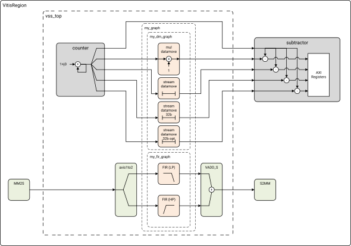
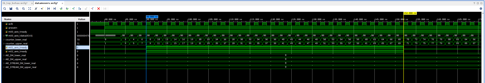
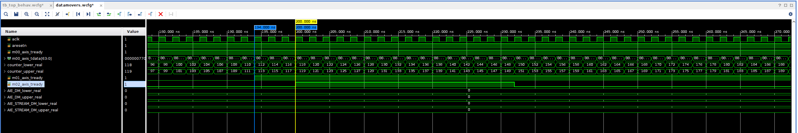
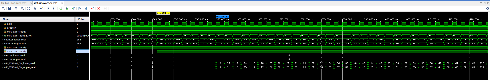
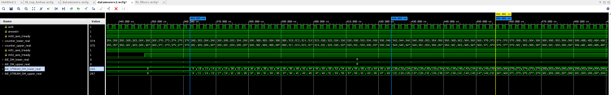
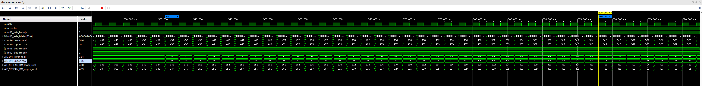
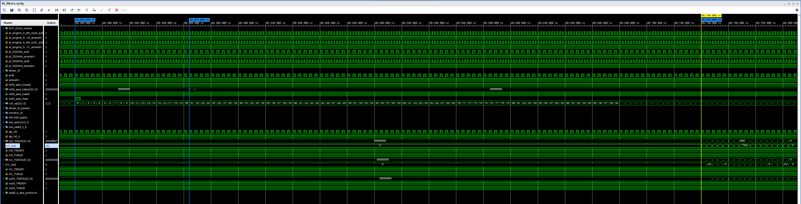
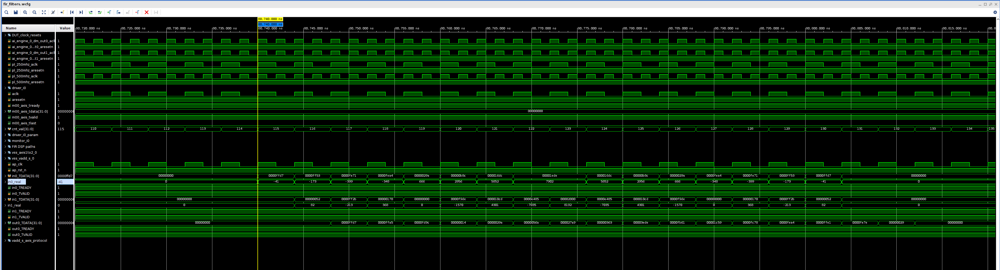
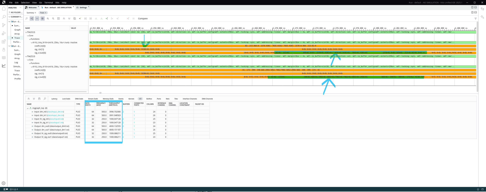

<table class="sphinxhide" width="100%">
 <tr width="100%">
    <td align="center"><h1>Vitis™ In-Depth Tutorials</h1>
    </td>
 </tr>
</table>


# Verifying the VSS using simulation in Xsim

***Attention!*** This feature is Early Access and may be subject to change. It is provided as is with the purpose of collecting user feedback.
Please report feedback or issues using the GitHub Issue reporting tool.<br>

This part demonstrate how to cosimulate AI Engine and PL components integrated as a Vitis Subsystem.

The simulation is enabled by first preparing the AI Engine simulator to load the AIE Graph and activate simulation to a given RTL simulator.
Currently only Xsim is supported.

The second step is to create a RTL simulation environment by using a Vivado simulation project where we can import the VSS.
This action create a dummy BD that is used to generate a RTL wrapper that in turn can be instantiated in the RTL simulation testbench.

With the simulation project, we can control and run the design under test and use waveforms to inspect and check the results.


In addition to the simulation testbench, this example adds basic AXI Stream driver and monitor to exercise data through the design under test.


Advanced testbench design and automatic checkers is up to the user to adapt to be used with this feature.

### Support files used for the VSS simulation:

| Component                        | Type   | Description
| ---------------------------------|--------|-------------------------------------------------
| [cosim_proj.tcl](./src/cosim_proj.tcl)        |  TCL    | Vivado simulation project script
| [testbench.sv](./src/testbench.sv)            |  RTL    | Testbench
| [driver_axis.sv](./src/driver_axis.sv)        |  RTL    | Simple driver for AXI Stream testbench stimuli, creates an impulse respone
| [monitor_axis.sv](./src/monitor_axis.sv)      |  RTL    | Simple monitor terminating AXI Stream traffic
| [tb_top_behav.wcfg](./src/tb_top_behav.wcfg)  |  Config | Xsim waveform configuration
| [aiesim.txt](./src/aiesim.txt)  |  Config | Enable VCD dump from connected AIE Simulator.


**Note:** To let the RTL simulator testbench connect to the AIE Sim and VCD dump, these additional environment variables are set by the makefile:
```
export AIE_WORK_DIR = <path to AIE work folder>
export ENABLE_AIE_DBG_TRACE=true
export AIESIM_OPTIONS=<path to aiesim.txt>
```


## Compiling C_RTS to load and enable the AIE graph in AIE simulator
When compiling the AIE, relevant makefile recipe are also generated to enable C_RTS for each RTL simulator type.
Locate the AIE work folder, and the corresponding makefile.
```
cd <AIE_WORK_DIR>/ps/c_rts/systemC
make -f Makefile.xsim
```

The makefile used in this lab will automatically take care of locating and compiling this as a prerequisite.


## VSS testbench description
The testbench and the supportive driver and monitor modules does not provide a full testing coverage, but showcase typical verification components to inspire setting up a proper verification environment.
For now, we only cover using Xsim.

Makefiles are provided to build everything from the lab top folder. It will automatically compile all required RTL, AIE and HLS components as required.

To launch the VSS simulator run the following command from top folder:
```
make vss_cosim -C vss
```


Revisiting the lab figure, the testbench instantiate the VSS as Design Under Test using the generated RTL wrapper and replace the traffic from MM2S and S2MM with the simple driver and monitor RTL modules.




The Vivado simulation project script then configure the simulation, opens a waveform window example and launch the simulation.
As the AIE datamover graphs get AXI Stream data from the counter, you can follow the data propagating through the design by inspecting the waveform at various locations.

For the AIE FIR filters, an impulse response is injected, allowing for identifying the filter coefficients used by the filter.

When VSS simulation has stopped, the waveforms will show `80µs` simulation time before the AI Engine graphs starts to execute. This is caused by the loading time of the AIE simulator thread.<br>
If the simulation is restarted consecutive times, the AIE simulator is already running and will start responding in roughly `100ns`.<br>
**Note:** The RTL counter values indicate time from reset up to ***2<sup>15</sup>-1*** clock cycles before wrapping around to ***-2<sup>15</sup>***.

### Check simulation results in XSIM waveform


#### Analyzing datamover signals

The RTL counter used in this tutorial will start unconditional counting as soon as the reset signal is released.<br>
The output data is represented by `cint16` values packed on a 64-bit interface, providing two values per clock cycle. This is to match the AIE PLIO native bitwidth of 64-bits.

At the start of the datamover processing, the receiving kernels signal when they can accept data using `TREADY` flags.<br>
**Note:** The counter values will be sampled by the datamover only when `TREADY` is high.<br>

To highlight the startup effects, the screenshots below is ***after restarting*** the simulation.
Notice there are two stall events occuring for the vector multiplication datamover and three stalls for the stream based datamover.







The startup effects is also show at the output of the datamovers:





#### Analyzing FIR filter response

As the testbench is injecting an impulse response to the FIR filters, the output response will reveal the filter tap values.
By checking the waveform input and output signals to the filters, the result is confirmed.<br>
**Note:** As revealed by the timeline, the screenshots are taken from the simulation as launched a first time.

The impulse is injected after 20 clock cycles of each frame. The frame start is indicated by the driver asserting `TLAST`.


Notice the filter coefficient values in the output data for the filters:



### Check AI Engine VCD dump using Vitis Analyzer
When the simulation is finished, Vitis Analyzer can reveal signal propagating throught the AIE array.<br>
Launch Vitis Analyzer using:
```
vitis_analyzer ./vss/cosim/build/vss_top_cosim/vss_top.sim/sim_1/behav/xsim/default.aierun_summary
```

With the Trace view, the signal values is observable with the figure below showing the two FIR filters:



### Modifying the FIR filter coefficients
To change the filter coefficients, the AIE top graph testbench needs to be modified and recompiled.
This is because we use a simplified approach to start the AIE graph using the C_RTS method, so we need to rebuild the AIE testbench and regenerate a new C_RTS.

For now, rebuild the AIE with:
```
make clean -C vss/ip/aie
make clean -C vss/cosim
make vss -C vss
make vss_cosim -C vss
```

**Important:** This only changes the AIE graphs and kernels, not the PL-AIE interfaces nor the VSS component export.
Changing interfaces require updating the VSS connectivity and testbench.<br>
To rebuild the VSS completely, run:
```
make clean -C vss
make clean -C vss/cosim
make vss -C vss
make vss_cosim -C vss
```

When finished with simulation, return to [VSS component creation](../README.md) and continue steps.

### Navigation helper

- [VSS component creation](../README.md)<br>
- [AIE Simulation](../ip/aie/README.md)<br>
- [VFS with Python](../python/README.md)<br>
- [VFS with MATLAB](../matlab/README.md)<br>
- [Return to top](../../README.md)<br>


<p class="sphinxhide" align="center"><sub>Copyright © 2020–2025 Advanced Micro Devices, Inc</sub></p>

<p class="sphinxhide" align="center"><sup><a href="https://www.amd.com/en/corporate/copyright">Terms and Conditions</a></sup></p>

