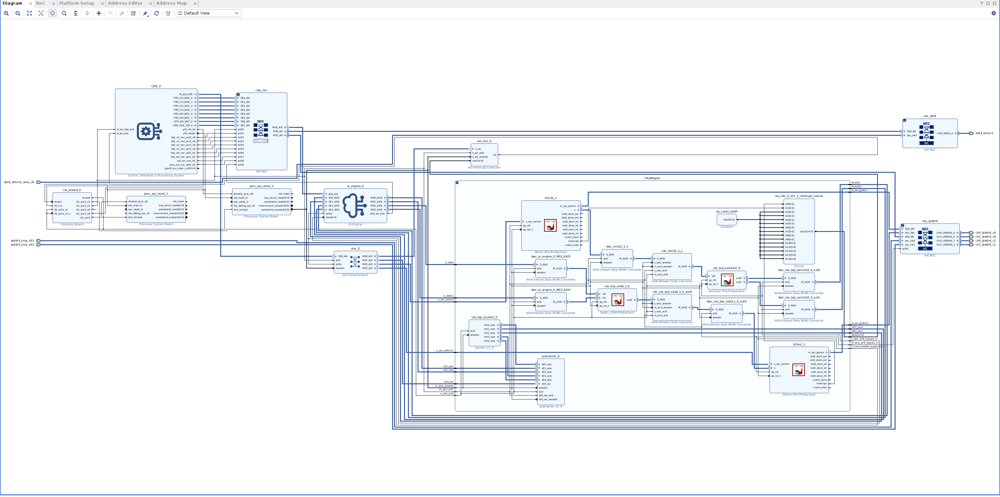

<table class="sphinxhide" style="width:100%;">
  <tr>
    <td align="center">
      <picture>
        <source media="(prefers-color-scheme: dark)" srcset="https://raw.githubusercontent.com/Xilinx/Image-Collateral/main/logo-white-text.png">
        
      </picture>
      <h1>AMD Vitis™ System Design Tutorials</h1>
      <a href="https://www.amd.com/en/products/software/adaptive-socs-and-fpgas/vitis.html">See Vitis™ Development Environment on amd.com</a>
    </td>
  </tr>
</table>


# Part 4. Import VMA and finalize the design in Vivado

### Background for finalizing the design in Vivado
Import the VMA file into the Vivado project and continue the further development in Vivado to finalize the design in Vivado and export fixed XSA from Vivado. If you come across any synthesis or implementation violation, you can resolve that in Vivado. This flow is very helpful to continue the hardware development in Vivado. Earlier, for any change in the Vivado design you have to export the extensible XSA and sometimes it was challenging to investigate and resolve the sysnthesis or implementation failures during v++ linking stage.

### Overview
This section focus on importing the VMC Subsystem into the Vivado Extensible Platform.
Key steps are
- Importing a VMA
- Review results and optionally edit the BD
- Synthesize and Implement the Final Design
- Build and export fixed XSA as handoff to SW applications and packaging

## Instructions

The guide demo how to do the steps manually through Vivado. It can also be completed using makefile commands.
```
make vivado_fixed
```
This calls [vck190/finalize_design.tcl](vck190/finalize_design.tcl) that completes the mandatory steps to write the fixed xsa handoff for embedded application and packaging steps.

#### 1. Open the Vivado Platform project
  **Note** Launch Vivado in the vivado folder as all instructions later on is relative to this location.
```
vivado build/vck190_thin_vivado/vck190_thin.xpr
```
#### 2. Open the top block design `vck190_thin` in IP Integrator.

#### 3. Import the VMA from Vitis using Tcl console.
  **Note** The insertion point for VMA is identified automatically in the BD.
```
::vitis::import_archive ../vitis/build_hw/vck190_thin.vma
```
#### 4. Inspect the design by opening the `vck190_thin_vma` block design and expand the `VitisRegion` block.
  This figure show the expected result after VMA import. To emphasize the connections added by Vitis, these have been highlighted using light coloring for inputs to AI Engine and darker coloring for outputs AI Engine. **Note** the green path connected via the HLS_passthrough_0 HLS IP.


  
  - **Important!** If you need to change interfaces or update the VMA it first need to be removed from the project.
  - This is done with
```
::vitis::remove_archive_hierarchy
```
  - Once the VMA is updated using [Part 3 steps](../vitis/README.md#step-3-build-the-system-project-and-generate-vma) repeat importing VMA described in previous step.
  - **Important!** If your modifications require new SPTAG, i.e. for new RTL IPs, It's required to re-export the platform as when [adding RTL Source code to BD](Vivado.md##Vivado.md#refining-the-example-extensible-platform-and-adding-rtl-modules)

#### 5. **Optional** Modify the BD.
 - Add a AXI4-Stream Register Slice into BD. Configure Register Pipeline type to `fully registered`.
 - Disconnect any of the highlighted AXIS wire **outside** of VitisRegion and rewire it via the added AXIS Register Slice `S_AXIS` port and `M_AXIS` port.
 - Connect `aclk` and `areset` to same clock and reset respectively used by `counter_0`.

#### 6. Generate a new wrapper for `vck190_thin_vma` BD.
A flat design use a single BD, so the new BD with VMA imported needs to be prepared with a new wrapper.
 - Select vck190_thin_vma BD from the design sources. Rightclick and choose `Create HLD Wrapper...`
 - Check that the new wrapper is added to the design sources. Rightclick and choose `Set as Top`

The source files should now look like this:

 - **Important!** If the wrong wrapper is used or wrong top is set, the next steps will fail!

#### 7. Run Synthesis and Implementation
```
## ===================================================================================
## Full Synthesis and implementation
## ===================================================================================
launch_runs -jobs 8 synth_1
wait_on_run synth_1
puts "Synthesis done!"

launch_runs -jobs 8 impl_1 -to_step write_device_image
wait_on_run impl_1
puts "Implementation done!"
```

#### 8. Write and validate fixed XSA
```
  open_run impl_1
  write_hw_platform -fixed -force build/xsa_platform/vck190_fixed.xsa
  validate_hw_platform build/xsa_platform/vck190_fixed.xsa
```

<p class="sphinxhide" align="center"><sub>Copyright © 2020–2025 Advanced Micro Devices, Inc</sub></p>

<p class="sphinxhide" align="center"><sup><a href="https://www.amd.com/en/legal/copyright.html">Terms and Conditions</a></sup></p>
