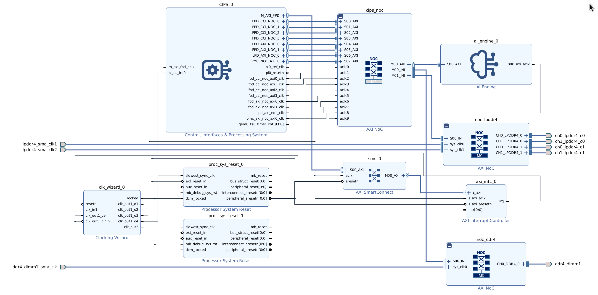
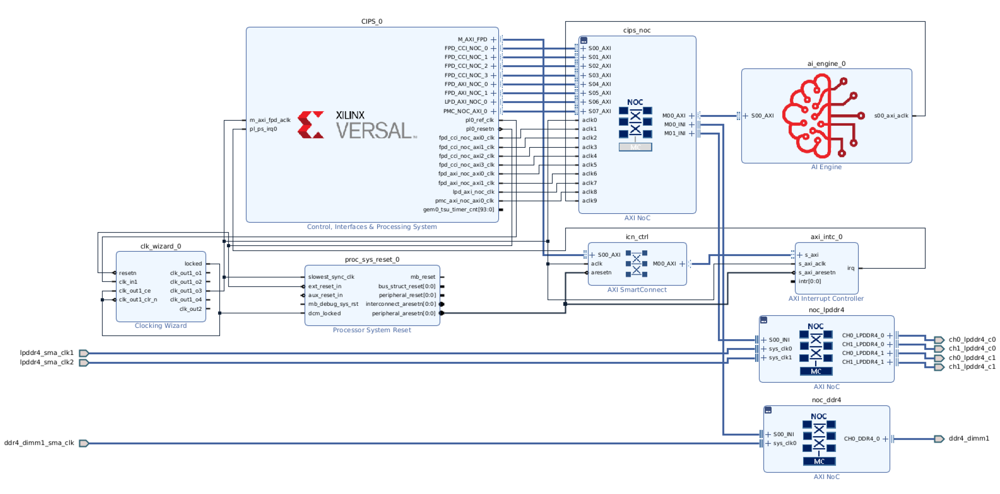
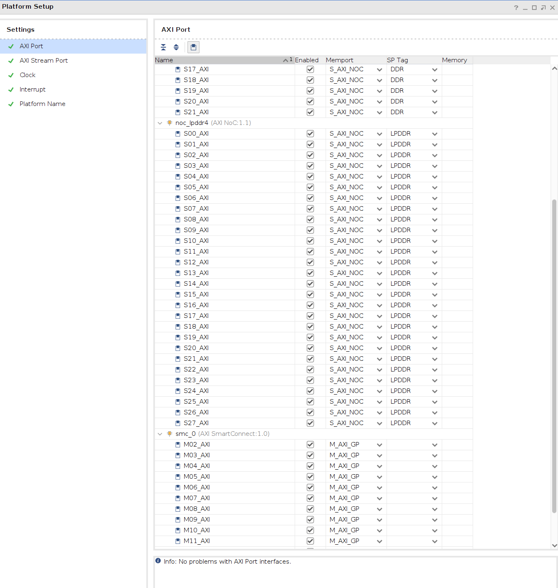
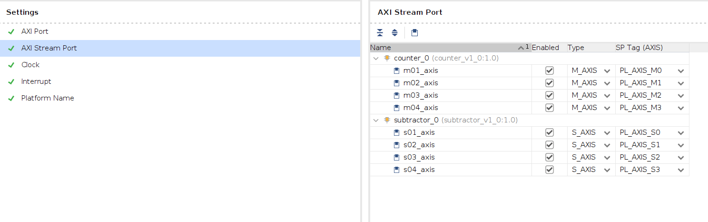
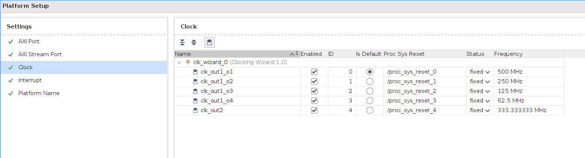
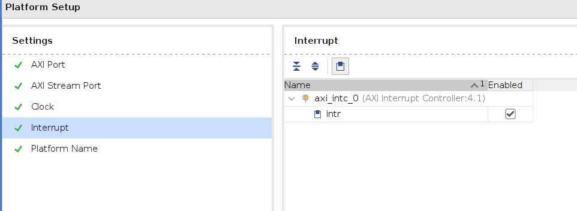
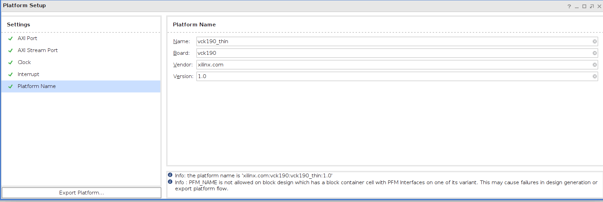

<table class="sphinxhide" style="width:100%;">
  <tr>
    <td align="center">
      <picture>
        <source media="(prefers-color-scheme: dark)" srcset="https://raw.githubusercontent.com/Xilinx/Image-Collateral/main/logo-white-text.png">
        
      </picture>
      <h1>AMD Vitis™ System Design Tutorials</h1>
      <a href="https://www.amd.com/en/products/software/adaptive-socs-and-fpgas/vitis.html">See Vitis™ Development Environment on amd.com</a>
    </td>
  </tr>
</table>


# Develop Custom Vivado Extensible Platform

This section focus on the creation process of a Vivado Extensible Platform.
The target is a AMD Versal™ VCK190 board, but the principles can be applied to any Versal AI Edge or Core board.
Focus areas for this part of the example is to
- Use a custom Block Design (Flat) based platform
- Add RTL Modules to BD
- Setup Platform properties
- Build and export platform to Vitis Unified IDE


## Background notes on Extensible Platforms

In Vivado there are several Configurable example design that can be used as starting point and modified for custom purpose.
The common features they have to make them Extensible by Vitis is the Block Design contains:

- CIPS
- AI Engine
- NoC (Typically split in logical instance for AXI and DDR Memory Controllers)
- Clock Wizard for MMCM/PLL clock tree
- Processor System Reset for each clock domain
- AXI SmartConnect for the Full Power Domain from CIPS
- AXI Interrupt Controller connected to the AXI SmartConnect

  Example of a flat Extensible Vivado platform
  

### Refining the example Extensible Platform and adding RTL modules

Observing the example platform, the associated resets for each clock was only paritally added. Vitis is capable of inferring missing clocks and resets, but in this case we ensure clocks and reset are properly setup before exporting the platform to Vitis. After this, two RTL modules are imported and the platform properties setup.
When Vitis extends a design, it will require access to AIE, NoC, Clock/Resets and AXI SmartConnect/Interrupt Controller.

## Instructions

To give more time to interact with analyzing the Vivado Platform, the provided scripts will generate the Vivado, add RTL Modules, and setup the platform properties.

### 1 Build the Vivado Platform

If this was done with the prebuild instruction, skip to Inspecting the Vivado Platform design.
The user is encouraged to modify/change/replace parts after first running through these steps once.

```
make vivado_platform
```

#### File structure related to the Vivado project

[vivado](.) Directory/file structure:

| Directory/File                                             | Description                                                                                  |
|------------------------------------------------------------|----------------------------------------------------------------------------------------------|
| [Makefile](Makefile)                                       | Vivado platform Makefile.                                                                    |
| [vck190/xsa_platform_classic.tcl](vck190/xsa_platform_classic.tcl) | Vivado project script to set up the design and export the XSA for Vitis.                     |
| [vck190/dr.bd.tcl](vck190/dr.bd.tcl)                       | Script to prepare a flat block design for the VCK190 platform.                               |
| [vck190/finalize_design.tcl](vck190/finalize_design.tcl)   | Script that converts the flat design to a BDC and adds RTL modules.                          |


  When running the build, a Vivado project will be created under `vivado/build` folder.
  This helps housekeeping files when cleaning and rebuilding the project.
  The XSA for Vitis will be created here: `vivado/build/xsa_platform/vck190_thin.xsa`

  Running the scripts will build the Vivado design in the following steps.

### Create a Vivado Project and configure device and board parts

See details in [xsa_platform_classic.tcl (Line: 26-42)](vck190/xsa_platform_classic.tcl#L26)

####  (Optional) Add source code for RTL blocks

Before connecting RTL modules, the source file should be added to the Vivado project.

### 3. Create a flat block design

Calling `dr.bd.tcl` and add mandatory IPI blocks and optional instances and RTL modules. [`xsa_platform_classic.tcl` (line 62)](vck190/xsa_platform_classic.tcl#L62)
 - It's recommended to start with a configurable example design and modify it for custom requirements. This helps making a bootable design already from start.
 - Another benefit of editing in Vivado IPI, is you can check the design with `Validate` before saving.

Custom platform example used for VCK190.


   **Note** For easy editing of the flat design, add a `break` tcl command to [`xsa_platform_classic.tcl` (line 61)](vck190/xsa_platform_classic.tcl#L61) and launch the build with interactive mode.
   Once completed, write a new `dr.bd.tcl` with:
```
write_bd_tcl -exclude_pfm new_dr.bd.tcl
```

#### 3.1 Setup Platform Properties [(Line: 843-862)](vck190/dr.bd.tcl#L843)

##### Setup of AXI Ports

This figure show how the platform ports are listed in Vivado IPI blockdesign.



##### Setup of AXI Stream Ports

  ***This tutorial currently does not use any RTL in the extensible platform.***<br>
  ***The figure below show how it would be setup if the RTL counter and subtractor is put in the extensible BD.***<br>
  **Important** Note the Corresponding names for **SPTAG. These will be used when connecting the RTL with Vitis Subsystem!**
  

##### Setup of Clocks

  **Note** the default is set to 500 MHz clock domain.
  

##### Setup of Interrupt Controller

  **Note** Don't forget this or you will get a critical warning when validating the design.
  
  
##### Setup of Platform Name

  **Important** The choice here will be reflected when you import the XSA to Vitis.
  

### 4. Build Vivado Platform for use with Vitis and Model Composer

  Continuing `xsa_platform_classic.tcl` (Line: 65-)

#### 4.1. Create and set a wrapper for top BD. [(Line: 65-69)](vck190/xsa_platform_classic.tcl#L65)

 **Note** It's important that the correct RTL Top is selected when writing the platform.

#### 4.2. Set project properties. [(Line: 95-104)](vck190/xsa_platform_classic.tcl#L95)

  Sets platform to extensible, default output and design intent.

#### 4.3. Wrap up project and generate target [(Line: 116-150)](vck190/xsa_platform_classic.tcl#L116)

  Ensure all files are added, addresses assigned and generate support blocks for the design.

#### 4.5. Write/Export XSA and validate results. [(Line: 155-157)](vck190/xsa_platform_classic.tcl#L155)
 

### 5. Inspect the Vivado Platform

Open the generated project in Vivado.

```
cd vivado
vivado build/vck190_thin_vivado/vck190_thin.xpr
```

**Note** Launch Vivado in the vivado folder as all instructions later on is relative to this location.
 
Open the `vck190_thin` (top level).
Check the Platform Setup on top BD with the detailed instructions.

Once done proceed with next part of the tutorial.

## Navigation helper

- [Next step - Import and integrate VSS and Vitis blocks to extensible platform](../vitis/README.md)
- [Previous step - Create a Vitis Subsystem component](../vss/README.md)
- [Return to top](../README.md)


<p class="sphinxhide" align="center"><sub>Copyright © 2020–2025 Advanced Micro Devices, Inc</sub></p>

<p class="sphinxhide" align="center"><sup><a href="https://www.amd.com/en/legal/copyright.html">Terms and Conditions</a></sup></p>
