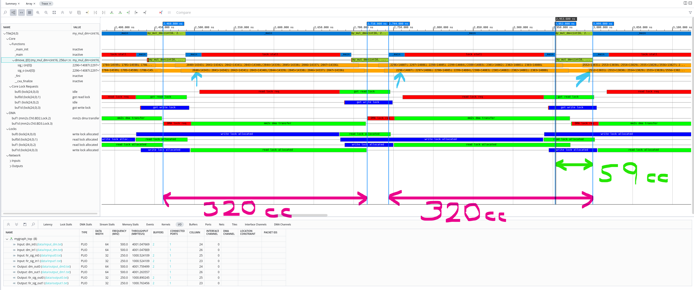
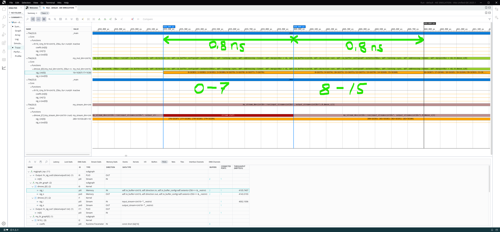
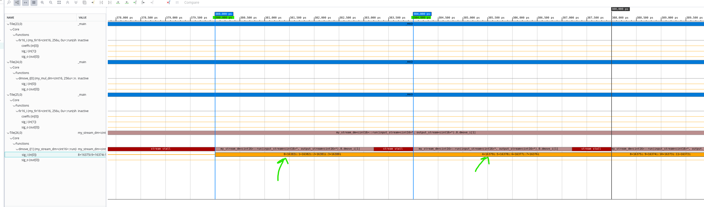
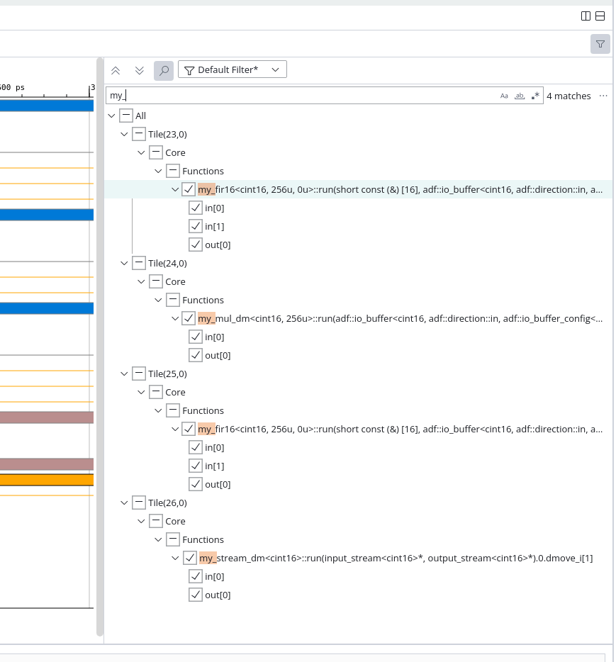

<table class="sphinxhide" style="width:100%;">
  <tr>
    <td align="center">
      <picture>
        <source media="(prefers-color-scheme: dark)" srcset="https://raw.githubusercontent.com/Xilinx/Image-Collateral/main/logo-white-text.png">
        
      </picture>
      <h1>AMD Vitis™ System Design Tutorials</h1>
      <a href="https://www.amd.com/en/products/software/adaptive-socs-and-fpgas/vitis.html">See Vitis™ Development Environment on amd.com</a>
    </td>
  </tr>
</table>

# Simulating and analyzing AI Engine graphs and kernels

This part describe how to use AI Engine simulator in cycle approximate mode and analyze the output with Vitis Analyzer.<br>
The simulator use the `main` function in the top aie graph as testbench. It will take input stimuli from the [data folder](./data/) as specified with the PLIO statements in [src/graph/my_graph2.h](src/graph/my_graph2.h).

### Files relevant to this part

| Component                        | Type   | Description
| ---------------------------------|--------|-------------------------------------------------
| [datamove_app.cpp](./src/datamove_app.cpp)| Top graph    | Top graph and testbench for AIE sim
| [tb_fir.cpp](./src/tb_fir.cpp)| Top graph    | Top graph dummy for testing the FIR subgraph. Used for VFS, but can be used by adding override[^1].
| [input_dm.txt](./data/input_dm.txt)| Stimuli data    | Input signal for datamover. Common for all datamovers.
| [input0.txt](./data/input0.txt)| Stimuli data    | Input signal for FIR instance #0.
| [input1.txt](./data/input1.txt)| Stimuli data    | Input signal for FIR instance #1.

#### Compile and build AIE design
For detailed compile description return to previous step: [AI Engine graphs and kernels](./README.md).

[^1]: Recompile and simulate using `make all sim_analyze -C vss/ip/aie MY_APP=tb_fir` to override default value.

**Note:** If [VSS simulation](../../cosim/README.md) has been run after creating the VSS component, the `.so` files may have been modified and will require recompiling the top graph testbench.

## Simulating with cycle approximate AIE simulator

Simulating the kernel is done from the ip/aie directory. For convenience this command can be issued from root dir:
```
  make sim_analyzer -C vss/ip/aie
```
Open the AI Engine Simulation summary with Vitis Analyzer
```
  vitis_analyzer vss/ip/aie/datamove_app_ws/aiesimulator_output/default.aierun_summary
```

## Analysis of the datamover kernels


### Datamover using buffer API and vector multiply by one


The figure below show the DMA accessing the ping/pong buffers and the kernel iteration time. The interval for which DMA locks a buffer reveal that this kernel is limited by data acquisition time from the PLIO.<br>

***t<sub>dma</sub> = 2716.8 - 2460.8 = 256 ns***. Translated into clock cycles: ***cc = 256/0.8 = 320***.

The kernel executes on the 256 samples much faster than the DMA can get new data, hence the long stall after each kernel invocation.<br>
Looking at the `sig_o` line, the counter values used as input data indicate each iteration is indeed consuming 256 samples.




#### Inspecting vector datamover on cycle level

The closeup figure below show that each clock cycle, a vector of 8 values are read from the buffer.<br>
The period time of `0.8ns` indicate the ***f<sub>aie_clk</sub> = 1250 MHz***.<br>



Further datamover analysis is done with the RTL counter feeding the AIE graph in [VSS simulation](../../cosim/README.md)<br>


### Datamover using AXI Stream API


The AXI stream inside the AIE array is 32-bit wide and clocked at ***f<sub>aie_clk</sub> = 1250 MHz***.
In the tutorial, the PLIO is set to ***500 MHz***, which will be the limiting factor of this datamover.<br>
Using the markers in the figure below the delta time between samples is `4ns`, but looking carefully at the values, it's transferring a vector of 4 samples.
This means the average throughput of the stream based datamover is `1 Gsps`.



***Note:*** The observant reader notice the stream kernel completes in 4 clock cycles, filling the gap with a single clock cycle `stall`.<br>


### AI Engine FIR filter simulation
FIR filters and other DSP related designs requires convenient approach to generate input data stimuli. Best practice is to generate the stimuli using Python[^2] or MATLAB[^3] and save it to the stimuli data folder.<br>
As the tutorial is complemented with both VFS and VSS simulation[^4] examples for generating test patterns, the signals used here is simple ramp input data.<br>
User is encouraged to experiment with replacing the input stimuli.

### Vitis Analyzer tips

#### Trace view
The trace is good for graphically analyzing AIE events in a waveform window. The navigation and marker buttons are similar to what is found in Vivado XSIM.

  - Selecting a row and right click on the name to export the associated events to a text file.
  - With a selected row, use the jump to next/previous event and add markers to get precise time stamps.
  - Input and output values to a kernel is presented as vector or sample data and get a horizontal line when a value changes.
  - To make it easier to sort relevant waveforms, use the filter as shown in this figure.<br>
Deselect everything, then active the items that is of interest.<br>
**Tip:** Use the looking glass search button and type `my_` to show only the kernel functions.




### Navigation helper
Return to [AI Engine graphs and kernels](./README.md)<br>
[^2]: [VFS with Python](../../python/README.md)<br>
[^3]: [VFS with MATLAB](../../matlab/README.md)<br>
[^4]: [VSS simulation](../../cosim/README.md)<br>

<p class="sphinxhide" align="center"><sub>Copyright © 2020–2025 Advanced Micro Devices, Inc</sub></p>

<p class="sphinxhide" align="center"><sup><a href="https://www.amd.com/en/corporate/copyright">Terms and Conditions</a></sup></p>
