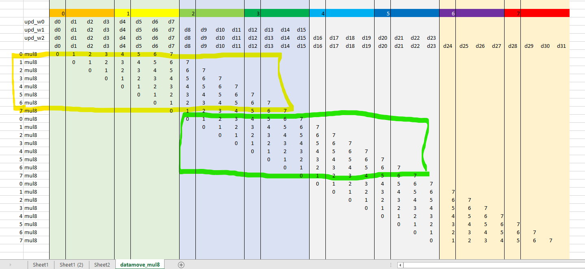
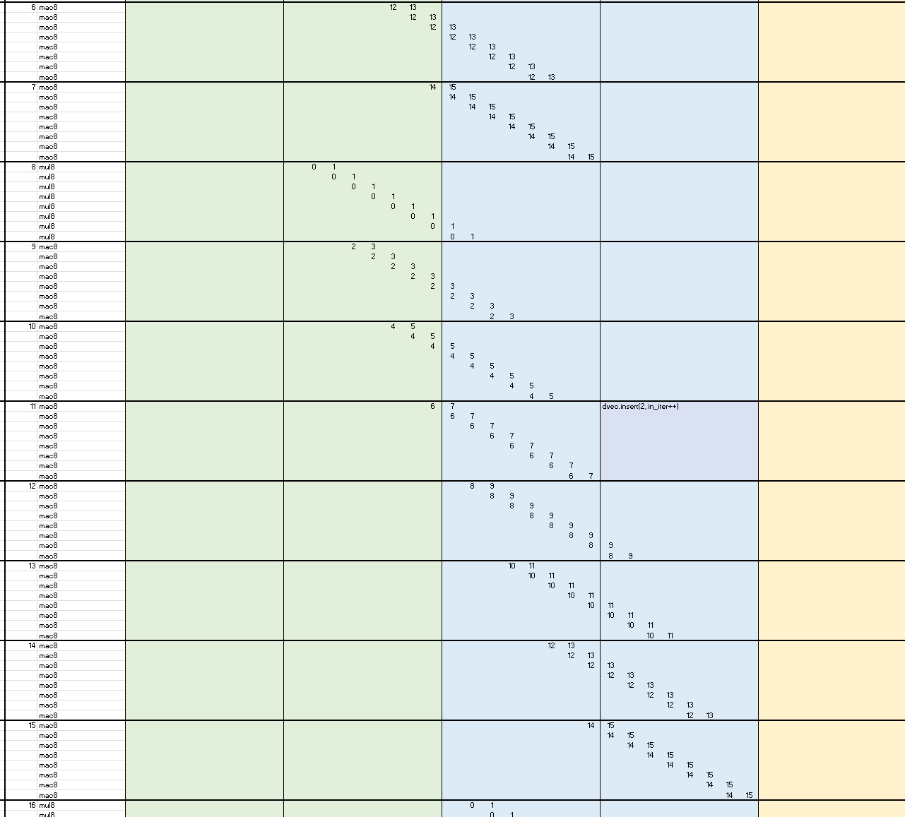
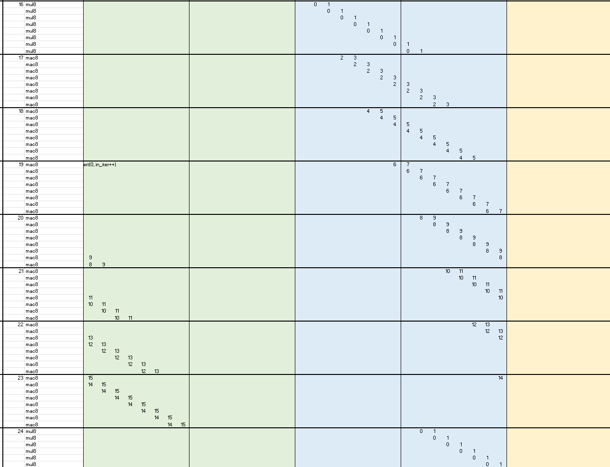
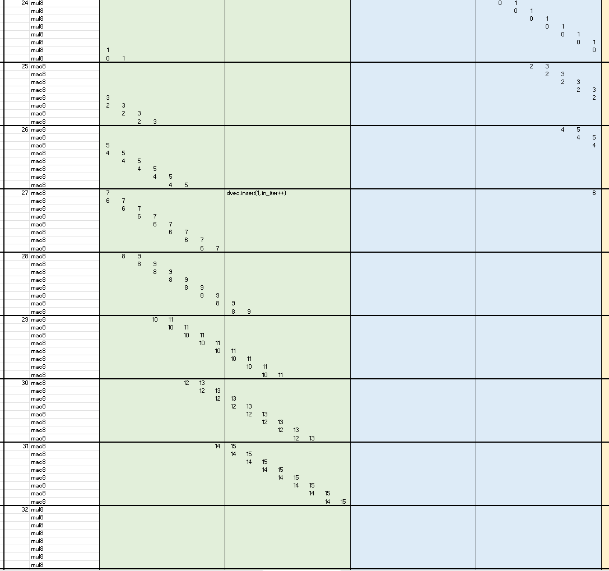

<table class="sphinxhide" style="width:100%;">
  <tr>
    <td align="center">
      <picture>
        <source media="(prefers-color-scheme: dark)" srcset="https://raw.githubusercontent.com/Xilinx/Image-Collateral/main/logo-white-text.png">
        
      </picture>
      <h1>AMD Vitis™ System Design Tutorials</h1>
      <a href="https://www.amd.com/en/products/software/adaptive-socs-and-fpgas/vitis.html">See Vitis™ Development Environment on amd.com</a>
    </td>
  </tr>
</table>

# AI Engine optimizations

### Datamover optimizations
To make efficient use of vector read and write operations, MUL/MAC operations,  and scalar commands some considerations are needed.
The AI Engine core has the capability of processing two 256-bit reads, one 256-bit write, one DSP MUL/MAC operation, and a scalar
instruction in one clock cycle using Very Long Instruction Word.  
The core also has dedicated registers to manage the counter for
the inner loop as a Zero Overhead Loop.
For this to be scheduled properly, first consider the inner loop in terms of data flow. As this case is bound by the 256-bit writes
only 256-bit vector of input data needs refresh. To give room for the input data to be stored on the vector register,
it will have to use a 256-bit vector ahead of the output 256-bit vector. This also avoids read and write access on the same
address of the vector register.

#### Special note on preparing the loop
The inner loop is where the main work takes place with VLIW keeping the AI Engine busy with processing.
Upon entering the loop, the first operation must have valid data to process. For the vector reg datamover,
the first 256-bit vector of data is preloaded before entering the loop. A similar argument for the vector multiplication
data mover, but in this case, two 256-bit vectors of data is required.
This is because 8 lanes of data is processed each clock cycle and the permutation for each lane offsets the data in the vector 
register according to the figure below.

To complete the full circle, the inner loop is unrolled manually so the for loop always starts in the same position.
This is possible due to that the vector register will automatically wrap around according to its type declaration.

[Return to AI Engine README](./README.md)

### FIR Filter loop unrolling

Following the same principle as for the datamover, the ***software unrolling*** focus on creating recurring patterns of refreshing the data in the vector register.  
In this case the preamble part loads filter coefficients using a single load, followed by preloading the vector register with two sets input data.
This ensures the loop body can directly start the vector sliding mul op.

The following figures represent the mapping of input data loaded in the vector registers and which filter coefficients is used per clock cycle.
The first objective is to ensure all filter coefficients are used to calculate one vector of results.
Conveniently, this is done by mixing MUL and MAC, where MUL is used to start a new set, followed by a number of MAC.

Once a portion of the vector register has been used by the sliding mul ops, it can be refreshed with next set of data.
The second object of the unrolling is to try to make this refresh of data repeat in a recurring pattern, so we can set the loop define this recurrence.

##### First unrolling, showing clock cycle 0-10:

***Note*** Check the start of second unrolling at cycle 8.

##### Second unrolling, showing clock cycle 6-15:

##### Third unrolling, showing clock cycle 16-23:

##### Fourth unrolling, showing clock cycle 24-31:

[Return to AI Engine README](./README.md)

Copyright © 2020–2025 Advanced Micro Devices, Inc

<a href="https://www.amd.com/en/corporate/copyright">Terms and Conditions</a>

