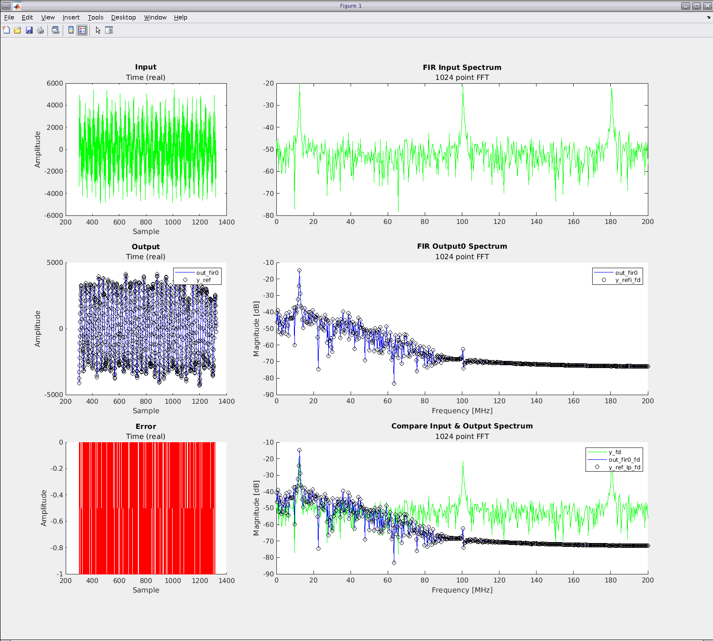
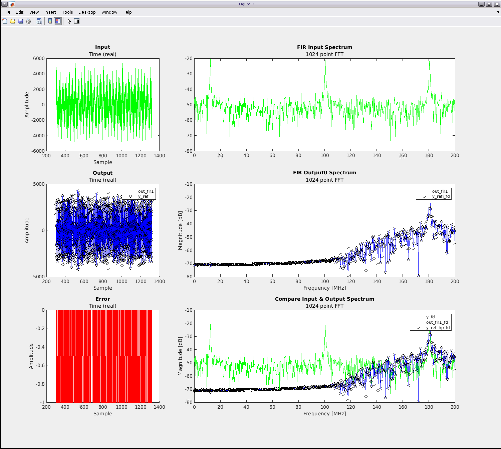
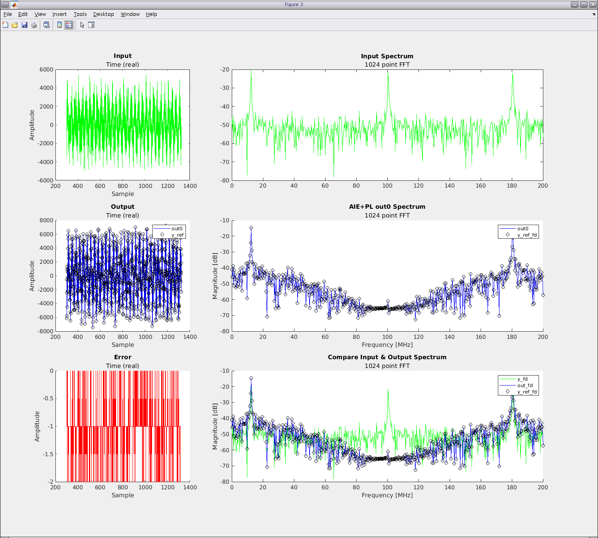

<table class="sphinxhide" style="width:100%;">
  <tr>
    <td align="center">
      <picture>
        <source media="(prefers-color-scheme: dark)" srcset="https://raw.githubusercontent.com/Xilinx/Image-Collateral/main/logo-white-text.png">
        
      </picture>
      <h1>AMD Vitis™ System Design Tutorials</h1>
      <a href="https://www.amd.com/en/products/software/adaptive-socs-and-fpgas/vitis.html">See Vitis™ Development Environment on amd.com</a>
    </td>
  </tr>
</table>

# Using Matlab to develop AIE Subsystem

In this example, we will show how to functionally verify AIE Subsystem using the new Matlab x86sim features. 

In the early stages of the development cycle, it is critical to verify 
the functional behavior of the AI Engine kernels and graph before integrating them with Vivado or Vitis PL IPs. Many DSP designers use Matlab to model their system and with it toolboxes or plain Matlab modelling is an ideal choice for testing and equivalence testing a AI Engine design.
The functional simulation speed of design iteration and the high level of data creation and visualization 
provides the designer valuable tools of the trade.


## Starting Matlab

Plese install and setup the Matlab R2023b.

Launch tool from the matlab folder with:
```
matlab
```
From Matlab prompt, setup paths to VFS install folder so the VFS commands can be identified:
```
init_matlab
```


## OPTIONAL - Compiling the AIE testbench graphs for x86sim using make/command line

Start a second `bash` shell and setup Vitis tools with `ts` as with previous instruction.

 - This shell will be used to recompile the testbench graphs using the makefile from the `lab1` folder.
 - It has been prepared to easy change between the full graph as testbench or a subgraph for testing the FIR filter only.
 - The build options have separated work directories so they can both be run before analyzing the graph in Matlab.
 - When compiling for x86sim, a `<MY_APP>_ws/Work/matlab` folder will be created and populated with the files Matlab will use to interact with the graph simulation.

For compiling the FIR testbench use this command on the bash shell:
```
make all -C vss/ip/aie TARGET=x86sim MY_APP=tb_fir
```

 **Note** The work folder when compiling with command line shares folder with the [3. Integrating Vitis Subsystem to Vitis Unified IDE](../README.md) step.
 Before proceeding with that step, ensure to rebuild with `TARGET=hw` otherwise the Vitis Subsystem integration will fail.

## Compiling the AIE testbench graphs for x86sim using Matlab

This option is usable when the Vivado extensible platform xsa have not yet been built or if the user want to quickly test graph/kernel updates without having to leave the Matlab environment.
When creating a VFS component, a temporary workspace for the component is created for running the verification.
VFS Matlab keeps track of source file changes and reuses existing builds for faster turnaround times when the graph doesn't require recompilation.


## Preparing testbench stimuli and running the simulation

Two example Matlab files have been prepared to simplify experimenting with the feature.

[matlab](.) Directory/file structure:
| Directory/file                         | Description
| ---------------------------------------|-------------------------------------------------
| [init_matlab.m](./init_matlab.m)   | Setup the paths for VFS (uses XILINX_VITIS environment variable)
| [verify_fir.m](./verify_fir.m)   | Verification example for FIR filter
| [verify_fir_vadd.m](./verify_fir_vadd.m)   | Verification example for a small subsystem with two AIE FIR kernels and one HLS VADD kernel

Open both verification examples in Matlab editor.
Each section can be executed step by step by pressing `ctrl+shift+enter` to walk through the Matlab script.
Alternatively run through the whole script using the run button in Matlab.

Both files have a section preparing basic setup and creating an input stimuli consisting of three sine waves and noise.
This helps visualize the filter supressing one of the sine waves and the noise floor outside the bands of the lowpass and high pass filters.
By adding the output vectors together, the combined result will suppress the middle sine wave. This represents the VSS FIR+HLS example design.
The data movers have been omitted from simulation as the lab only simulates the tb_fir graph.

The filter coefficients are conveniently created using Matlab Filter Design commands.

After running `verify_fir.m`, the input and output results from both the AIE design and Matlab reference model is plotted like this:



Running the AIE and HLS functional simulation  with `verify_fir_vadd.m` the result will look like:



Once done proceed with next part of the lab.

## Navigation helper

 - [VSS Component](../README.md)
 - [VFS Python](../python/README.md)
 - [Inspect AIE design](../ip/aie/README.md)
 - [Inspect HLS VADD](../ip/vadd_s/README.md)
 - [Return to top](../../README.md)


<p class="sphinxhide" align="center"><sub>Copyright © 2022–2025 Advanced Micro Devices, Inc</sub></p>

<p class="sphinxhide" align="center"><sup><a href="https://www.amd.com/en/corporate/copyright">Terms and Conditions</a></sup></p>

